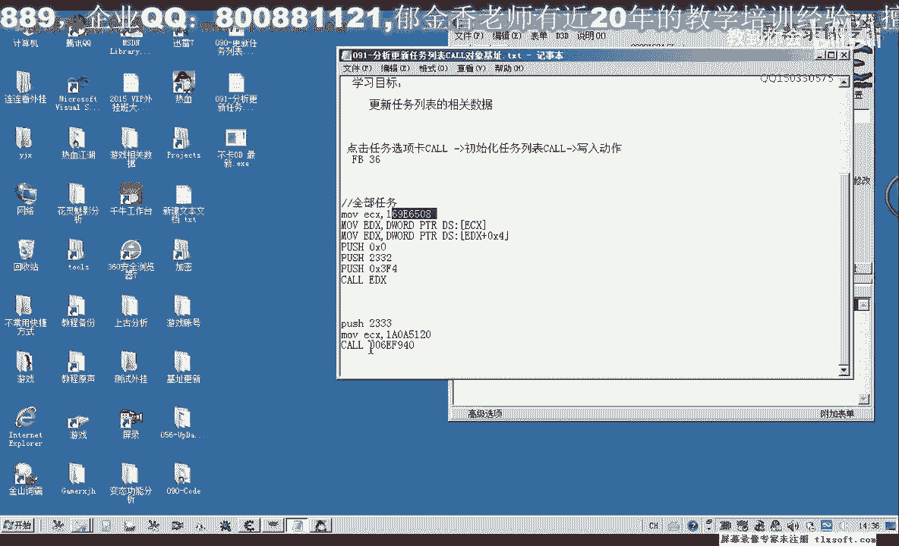
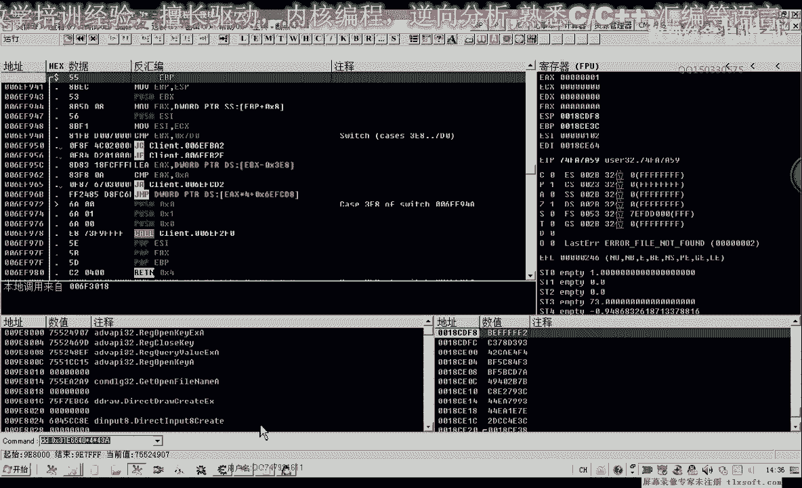
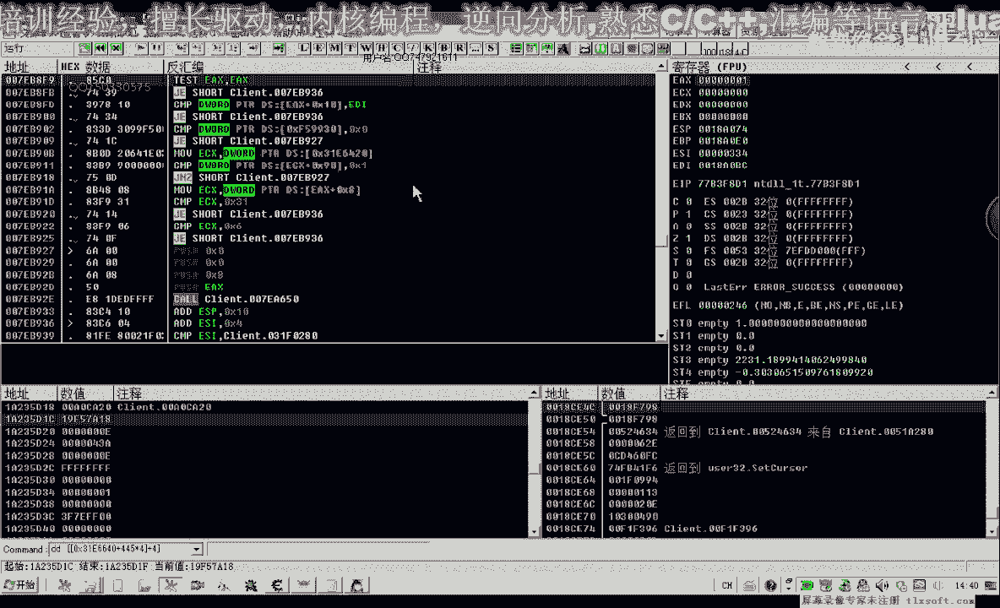
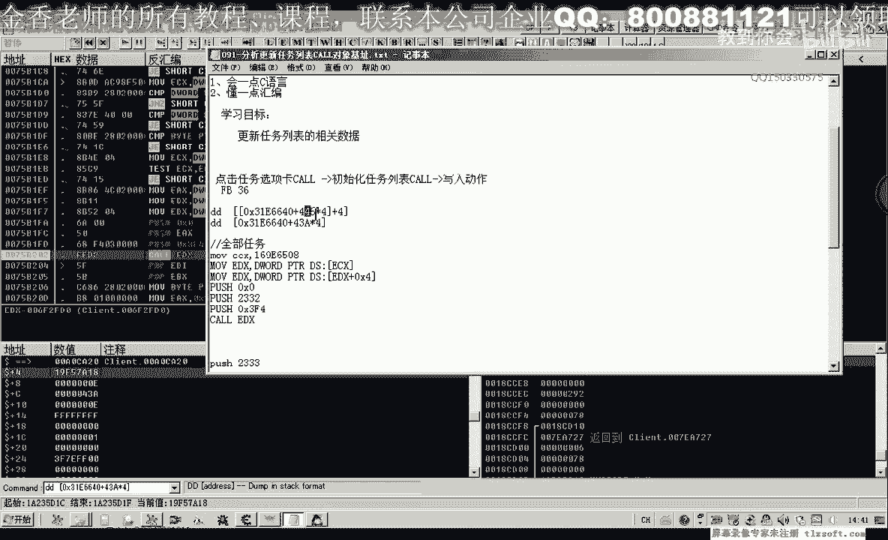
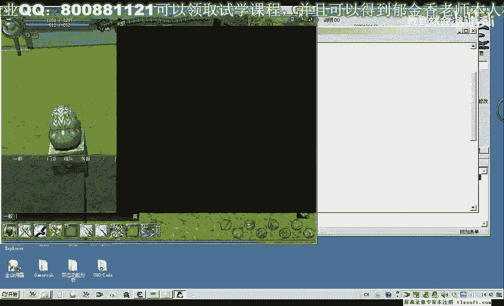
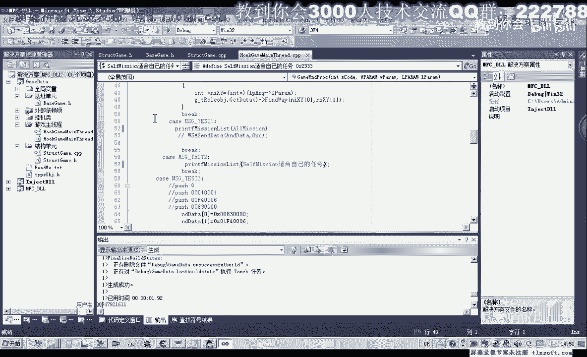
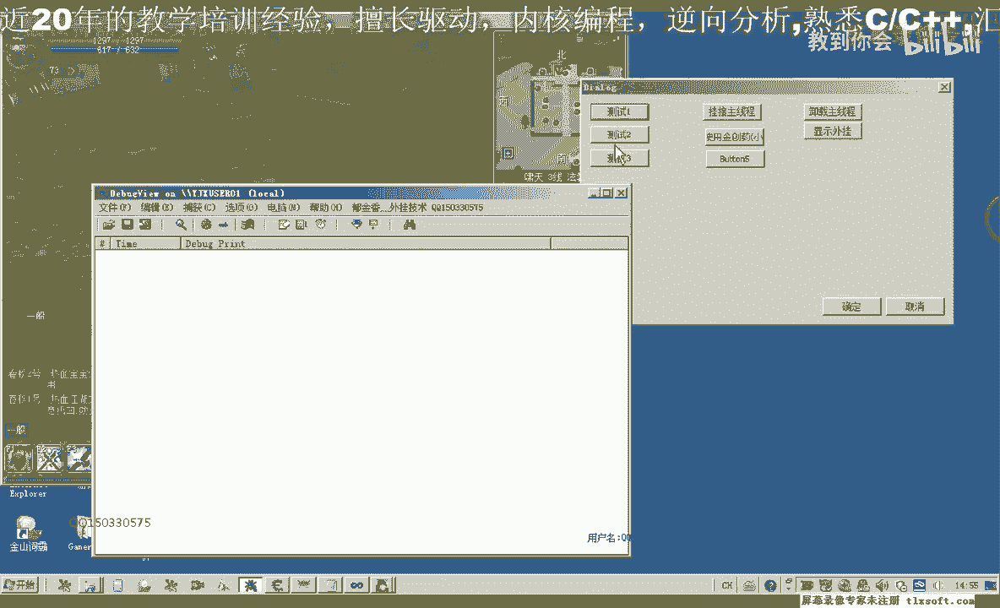
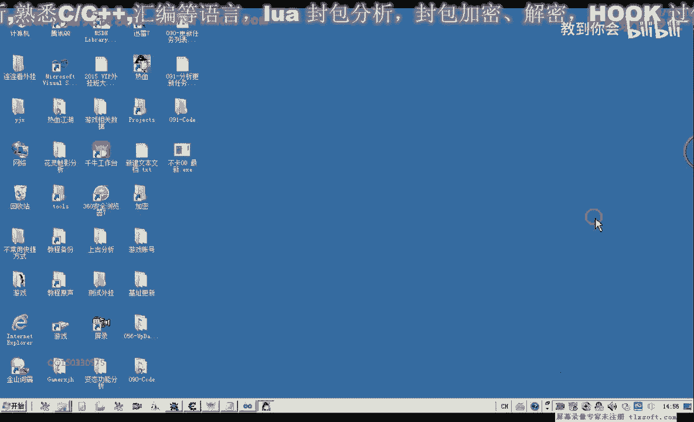

# 郁金香老师C／C++纯干货 - P80：091-分析任务对象基址及封装任务更新函数 - 教到你会 - BV1DS4y1n7qF

大家好，我是郁金香老师，那么这节课呢我们来分析一下啊，更新任务列表的这个ecx参数，它的一个来源啊，看一下能不能找到他的一个机制，那么首先呢我们转到这个扩的这个地址去。

然后呢我们先下一个断点。

把任务列表打开啊，我们点一下啊，任务选项卡，这个时候它会断下来，断下来之后呢，我们先返回到三个f4 这里啊，我们把这里的特征码也复制一下，转换自己，那么断下来之后呢。

我们要找的是ec x这个数据的一个来源，那么这里呢有一个e4 x呢是来源于e s i加四啊，那么另外一个呢这个e4 x呢是来源于这个地方，那么我们在这个地方呢，分别在这两个地方进行。

下段可以尝试找一下点所有任务e4 x的数据，数据呢取出来450，但是在这个地方呢我们改变了啊，如果要继续找的话，我们可以直接找e si的一个来源，那么我们先把呃这个es si的这个数据来啊复制下来。

加四，那么这就是我们e4 x的一个来源，那么接下来我们找一下，这个4420的数据我们用，需要附加到游戏里边，那么这个时候呢我们发现嗯会有一个绿色的一个机制啊。

但是我们来验证一下这个机子是否可用，我们对这个机子来进行一个哈呃访问的一个断点，然后呢我们会在这个地方断下来，他最终呢是转到了这个3116640所有对象的这个数组里面去了。

然后我们看一下他1a x的一个数据呢，等于我们的445，那么我们可以从这个45里边呢把这个数据取出来，关键是我们看一下是不是这个445它会不会在游戏重新启动之后呢，会不会改变，你这样对，八，嘟嘟。

好那么我们重新让它跑起来，然后我们再次让他断下来，按减号退回。

看一下我们的现在的e4 x呢应该是d18 ，那么我们找一下啊，呃这里呢就是我们的d18 ，123718，那么我们来看一下它里面的一个属性啊，这里呢是43a，那么这个也是我们的所有对象数组里面的啊。

实际上我们可以通过两个公司呢都能够得到它，那么关键我们就是要看它的一个下标呢会不会改变，那么另外一个公司呢可能还要简单点，我们直接进入银色的这个数组的一个下标就是43a，当然这个市场未来也要审审以四。

那么这个这两个公式呢实际上是等价的，那么关键我们就是要重新启动之后呢，看一下这两个下标它有没有改变。

那么我们重新来把这个游戏哈进入一下，关掉再重新进入。

然后我们再用o d来附加，嗯嗯那么这个时候我们发现了1a225 d18 这个数值，那么我们再转到这个call这个地方来看一下e4 x的这个数值。

打开任务列表，然后呢再次让他断一下14x1222 无底118啊，那么从现在的一个测试情况来看呢，应该说这个43a这个价格呢是可以用的啊，是可以直接加上这后面这个偏移呢能够得到这个对象。

当然如果是不能够得到的话，我们也可以通过偏离这个列表，然后通过它后边这些啊属性呢来比较判断啊，也可以把它偏离出来，或者是通过它的一个呃这个函数的一个成员列表，也能够把它偏离出来，好了。

那么一cx的这个来源解解决了之后呢，我们就可以编写代码来进行这个相关的测试，那么打开我们90课的代码，那么我们直接到主线程里边来进行测试，这里呢有打印一个我们的一个任务列表里面的数据呃。

但是呢我们还需要呢，现在呢要跟它加上一些啊参数啊，这个扩展我们需要，那么这个参参数呢我们就以这个选项卡为这个参数啊，比如说我们可执行可执行任务的啊，当中的适合自己的任务，我全部任务呢我们就是两个参数。

那么这里呢呃我们先拦截它的一个参数下段，然后我们点适合自己的任务，那么这个时候我们看一下它的数据呢是2333，四火自己的任务，那么我们再点击这个全部任务是2332，好的，我们就用这个作为一个例子。

这里是呢全部装备，那么首先呢我们把这段代码复制出来，那么也就是我们这一段啊的一个测试，那么首先呢e4 x我们要跟他进行一个初始化，可以通过前边的这个公式，那么转到我们的基础单元啊，所有对象的列表。

所有对象数组成，哒哒哒哒哒，那么这里呢它的一个偏移呢就是四三倍乘四，直接这样我们就能够取得他的一个对象，然后调用一个相应的扣就可以了，那么在这之前呢，我们就需要更新这个相关的任务列表。

那么先嵌入我们的后边，那么这个呢我们可以用一个参数来给它传递进来啊，在这里呢我们加上一个参数，不过，那么在之前呢我们定义两个红，啊所有任务等，2332，那么还有一个是适合自己的一个任务，嗯，2333啊。

那么我们进入两个红，当然也可以取中文的一个名字啊，这里要加上16进制的一个前缀，这里加上一个函数的说明，再重新编译，好的，那么我们再次来编译，然后进行相关的测试。

那么测试的时候呢，我们先把og啊先退一下，在退出og之前呢，我们需要把所有的断点呢要取消掉啊，不然的话速度的话也会出错。

那么这里呢有一个int 3啊，我们需要把它还原才可以嗯不然的话执行到这个地方的话肯定会出错，那么我们看一下啊，不是出来的特征码是多少。

3f4 的后边，那么这里呢应该是f f d2 啊，那么这两个字节呢我们要把它重新改过啊，改为f f，好的，然后呢我们再次退出啊，这个时候才可以。

看一下这里的调试目录啊，有没有设置正确，然后设置一下相关的公众目录啊，然后呢再重新编辑注入一下，那么这个时候呢我们测试的时候应当是出现了相应的一个问题嗯，关掉游戏，然后我们重新再做测试。

在做测试的时候呢，在这里呢我们打印出相关的一些调试信息，好这个时候呢我们重新进入游戏之后呢，啊再次进行测试，那么刚才可能是我们忘了挂机这个主线层，也可能是，那么我们先挂机主线层嗯。

然后我们看一下调试调试信息啊，测试一，那么这是我们所有的一个任务啊，应当是正确的，任务等级啊，从一级到73级的都有，那么如果我们选选一下啊。

适合自己的任务，啊那么这个时候呢也是正确的，好的，那么我们这个函数呢就分分钟到这里啊，那么我们这节课就到这里，那么下一节课呢我们再见。

那么这里大家下去之后呢，我们再把这个函数呢再把它整理一下，写规范一些啊。