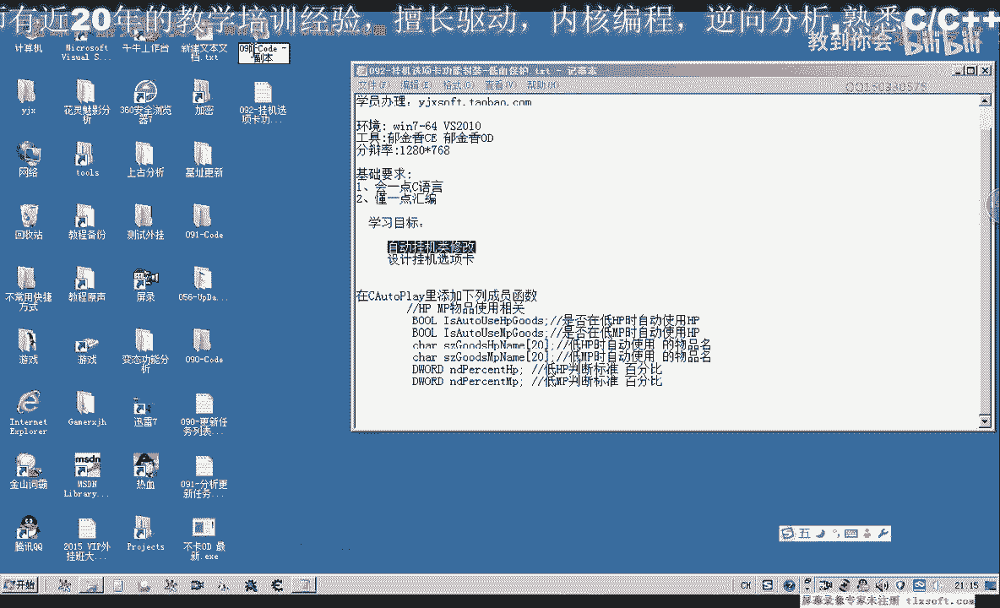
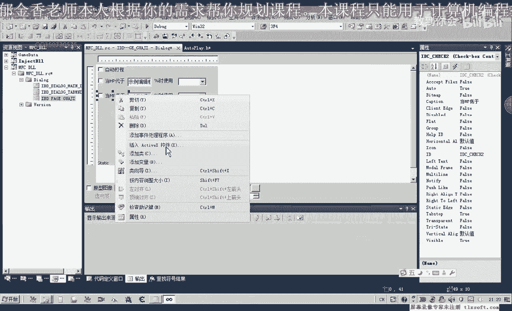
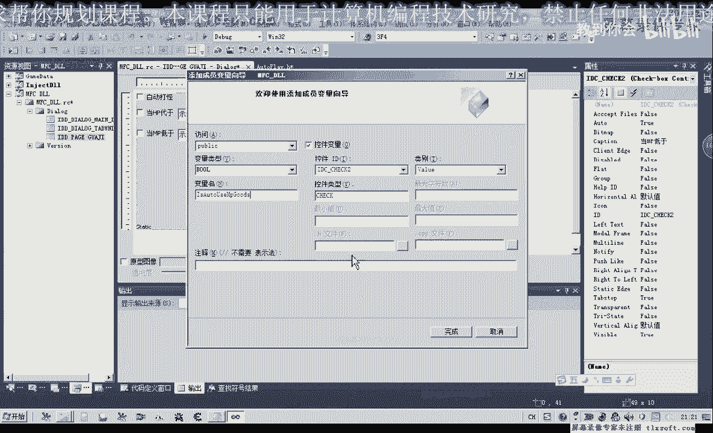
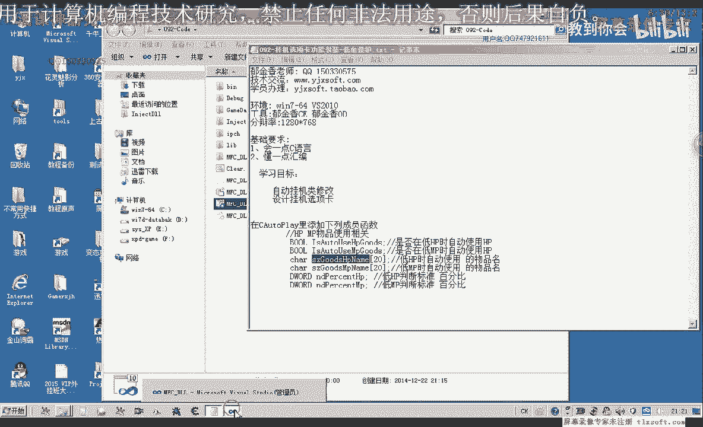
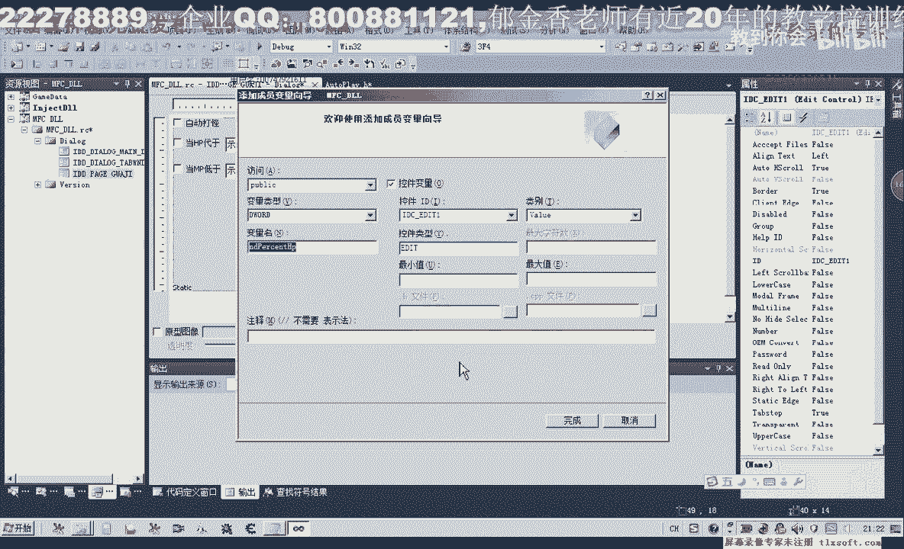
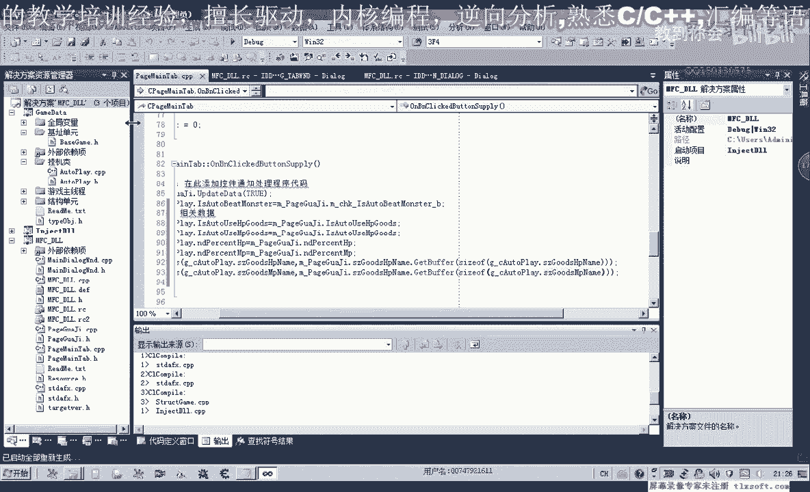
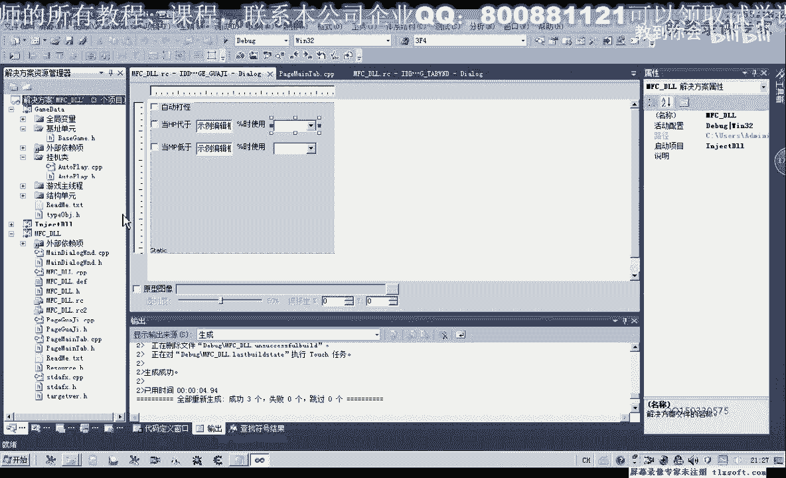
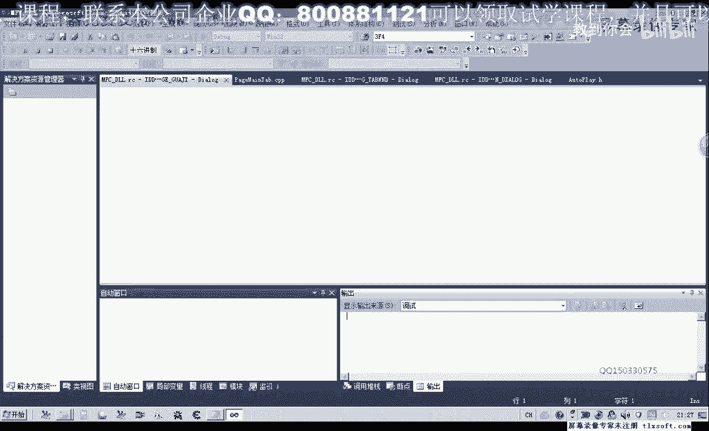

# P81：092-挂机选项卡功能封装-低血保护 - 教到你会 - BV1DS4y1n7qF

大家好，我是郁金香老师，那么在最近这几个我们一起来设计一下，低血保护的功能，那么主要就是在某些条件达成的时候，我们可以自动的去使用某些物品，那么第一个我们需要来修改一下挂机率，打开第91颗的代码。

然后我们转到挂机率的头文件。

那么添加以下几个成员变量，那么第一个是用来控制是否自动使用，HP的物品，当我们的HP低于某个百分比的时候，那么第二个是当我们的MP的值低于某个，百分比的时候，我们使用相应的MP的物品。

当然这里设计的时候可以是一个百分比，那么百分比的话应该是来说的话比较好用，一些，当然也可以设置为低于某个数值的时候，当然这个看你自己怎么设计相应的一个，功能，那么还有当我们HP低于某个数值的时候。

要使用的物品的名字，那么当我们的MP低于某个百分比的时候，使用的某个物品的一个名字，那么好的，我们添加这几个成员变量，那么这些成员变量的参数，我们需要通过窗口界面把它传送进来。

那么所以说我们在这里也要在我们的挂机窗口，上添加相应的空间，那么转到我们的挂机页面，那么首先我们要添加两个复选框，那么这两个复选框，一个就是我们MP的，一个是HP的，低缺的。

就是说当这个数值低于某个百分比的时候，那么我们在这里可以进行一个开关的控制，那么低于到某个值，在后边我们是可以是一个，可以是一个combo的空间，也可以是一个EDIT的空间。

只要能够接受我们的整数就可以了，它的数值是1~100，那么在这里我们选择来用EDIT的空间，那么低于好，那么后边是一个百分比，在这里我们用另外一个空间，静态文本的空间，使用我们的购物品。

那么在这里我们可以按下控制键，然后鼠标移动它，这样我们也可以快速的复制一个空间，那么后面要使用的名字，我们就用列表主播框，或者是列表框来实现，在这里我们用combo box，比较方便一些。

这里也按下我们的控制键复制一个，那么这六个空间就是对应的我们这六个数值，那么我们最终我们空间界面上的这六个参数，就要传到这六个相应的成员变量里面，那么在这里我们也能来关联相应的变量。

同时我们可以把它对齐，那么然后我们再为它关联相应的变量，那么这些变量可以与我们这里的变量来同名，那么这样我们在应用的时候，方便把我们的数据来更新到我们的内成员变量里面，那么第一个就是我们的复选框。

添加相应的变量，那么我们现在就来看一下我们的复选框，我们先把这个复选框，我们先把这个复选框，我们先把这个复选框，我们先把这个复选框，我们先把这个复选框，我们先把这个复选框。

我们先把这个复选框，我们先把这个复选框，我们先把这个复选框。

我们先把这个复选框，我们先把这个复选框。

我们先把这个复选框，我们先把这个复选框，我们先把这个复选框，我们先把这个复选框，我们先把这个复选框。

我们先把这个复选框，我们先把这个复选框，我们先把这个复选框，我们先把这个复选框，我们先把这个复选框，我们先把这个复选框，我们先把这个复选框，我们先把这个复选框，我们先把这个复选框，我们先把这个复选框。

我们先把这个复选框，我们先把这个复选框，我们先把这个复选框，我们先把这个复选框，我们先把这个复选框，我们先把这个复选框，我们先把这个复选框，我们先把这个复选框，我们先把这个复选框，我们先把这个复选框。

我们先把这个复选框，我们先把这个复选框，我们先把这个复选框，我们先把这个复选框，我们先把这个复选框，我们先把这个复选框，我们先把这个复选框，我们先把这个复选框，我们先把这个复选框，我们先把这个复选框。

我们先把这个复选框，我们先把这个复选框，我们先把这个复选框，我们先把这个复选框，我们先把这个复选框，我们先把这个复选框，我们先把这个复选框，我们先把这个复选框，我们先把这个复选框，我们先把这个复选框。

我们先把这个复选框，我们先把这个复选框，我们先把这个复选框，我们先把这个复选框，我们先把这个复选框，我们先把这个复选框，我们先把这个复选框，我们先把这个复选框。

我们先把这个复选框，我们先把这个复选框，我们先把这个复选框，我们先把这个复选框，我们先把这个复选框，我们先把这个复选框，我们先把这个复选框，我们先把这个复选框，我们先把这个复选框，我们先把这个复选框。

我们先把这个复选框，我们先把这个复选框，我们先把这个复选框，我们先把这个复选框，我们先把这个复选框，我们先把这个复选框，我们先把这个复选框，我们先把这个复选框，我们先把这个复选框，我们先把这个复选框。

我们先把这个复选框，我们先把这个复选框，我们先把这个复选框，我们先把这个复选框，我们先把这个复选框，我们先把这个复选框，我们先把这个复选框，我们先把这个复选框，我们先把这个复选框，我们先把这个复选框。

我们先把这个复选框，我们先把这个复选框，我们先把这个复选框，我们先把这个复选框，我们先把这个复选框，我们先把这个复选框，我们先把这个复选框，我们先把这个复选框，我们先把这个复选框，我们先把这个复选框。

我们先把这个复选框，我们先把这个复选框，我们先把这个复选框，我们先把这个复选框，我们先把这个复选框，我们先把这个复选框，我们先把这个复选框，我们先把这个复选框，我们先把这个复选框，我们先把这个复选框。

我们先把这个复选框，我们先把这个复选框，我们先把这个复选框，我们先把这个复选框，我们先把这个复选框，我们先把这个复选框，我们先把这个复选框，我们先把这个复选框，我们先把这个复选框，我们先把这个复选框。

我们先把这个复选框，我们先把这个复选框，我们先把这个复选框，我们先把这个复选框，我们先把这个复选框，我们先把这个复选框，我们先把这个复选框，我们先把这个复选框，我们先把这个复选框，我们先把这个复选框。

我们先把这个复选框，我们先把这个复选框，我们先把这个复选框，我们先把这个复选框，我们先把这个复选框，我们先把这个复选框，我们先把这个复选框，我们先把这个复选框，我们先把这个复选框，我们先把这个复选框。

我们先把这个复选框，我们先把这个复选框，我们先把这个复选框，我们先把这个复选框，我们先把这个复选框，我们先把这个复选框，我们先把这个复选框，我们先把这个复选框，我们先把这个复选框，我们先把这个复选框。

我们先把这个复选框，我们先把这个复选框，我们先把这个复选框，我们先把这个复选框，我们先把这个复选框，我们先把这个复选框，我们先把这个复选框，我们先把这个复选框，我们先把这个复选框，我们先把这个复选框。

我们先把这个复选框，我们先把这个复选框。

我们先把这个复选框，我们先把这个复选框，我们先把这个复选框，我们先把这个复选框，我们先把这个复选框，我们先把这个复选框，我们先把这个复选框，我们先把这个复选框，我们先把这个复选框，我们先把这个复选框。

我们先把这个复选框，我们先把这个复选框，我们先把这个复选框。

我们先把这个复选框，我们先把这个复选框，我们先把这个复选框，我们先把这个复选框，我们先把这个复选框，我们先把这个复选框，我们先把这个复选框，我们先把这个复选框，我们先把这个复选框，我们先把这个复选框。

我们先把这个复选框，我们先把这个复选框，我们先把这个复选框，我们先把这个复选框，我们先把这个复选框，我们先把这个复选框，我们先把这个复选框，我们先把这个复选框，我们先把这个复选框，我们先把这个复选框。

我们先把这个复选框，我们先把这个复选框，我们先把这个复选框，我们先把这个复选框，我们先把这个复选框，我们先把这个复选框，我们先把这个复选框，我们先把这个复选框，我们先把这个复选框，我们先把这个复选框。

我们先把这个复选框，我们先把这个复选框。

我们先把这个复选框。