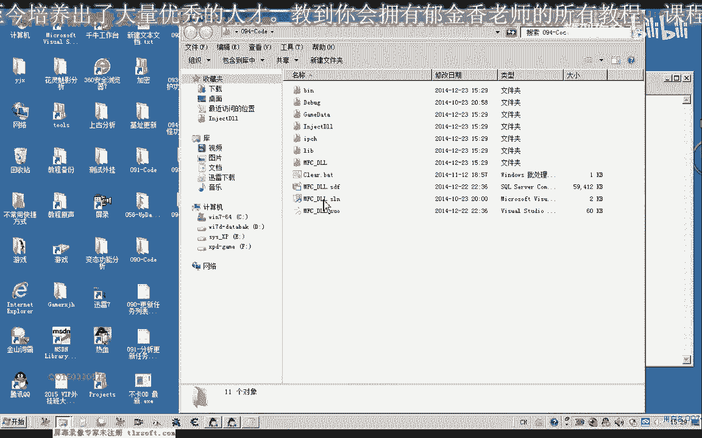
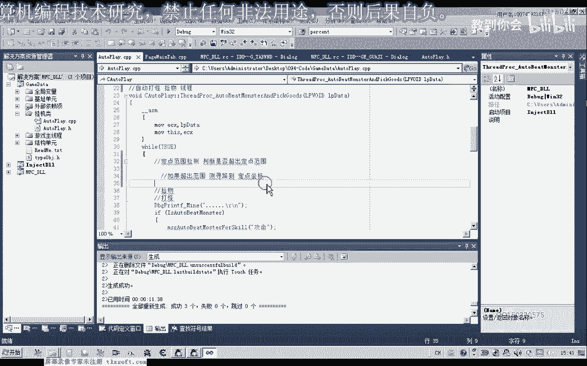

# 郁金香老师C／C++纯干货 - P83：094-定点打怪功能封装 - 教到你会 - BV1DS4y1n7qF

大家好，我是郁金香老师，那么最近两天呢我们将实现定点打怪的这个功能，那么很多时候呢就用我们的这个人物角色的死亡呃，或者是其他的原因，那么他可能会偏离原有的这个打怪的地点啊。

那么这个时候呢我们需要来编写一个定点打怪的功能，当死亡他回城之后啊，回到城里边之后，它会自动的啊跑到我们的挂机的这个地点，好的，那么我们要编写这个自动啊定点打怪的功能的话。

我们需要呢在挂机类里边呢添加几个啊相关的成员变量，那么第一个呢就是用来在界面啊上接受这个选择框的话，也就是说是否打开近点打怪的这个功能，那么第二个参数呢是定点打怪的一个半径，距离当前当前地点的一个半径。

一个范围，那么第三个参数来是定点坐标x，这是b点坐标y，那么一共需要四个参数，那么我们先把93克的代码打开。

那么首先我们在挂机录里面呢，添加这四个成员变量。

那么这四个成员变量啊添加之后呢，我们再切换到资源视图啊，挂机窗口调整一下窗口的大小，那么在这里呢我们也要啊添加至少四个控件用来接收相应的参数，那么首先呢我们选择这个复选框啊，近点打快功能。

那么这个定点打打印功能呢，我们呃打怪功能呢我们与这个成员变量来进行关联，选择类型啊，这里边选择啊数字类型，那么成员变量呢我们一般都会加上一个前缀啊，m的前缀啊，之前的我没有添加嗯。

当然一般来说我们添加一个前缀来用来表示它是一个绿的，一个成员变量，然后我们第二个参数定点打怪的半径啊，这个是d2 的六星的，这里呢我们要添加一个，文本框，那么在前面呢添加一个静态的文本，写写明是半径。

然后后面呢我们跟上x坐标和y坐标，好那么后边呢我们也跟它关联相应的变量，添加变量，然后再内边里面呢选数值类型，这里选d word类型，这是定点半径，然后是坐标x。

添加变量，那么这个坐标呢我们用硬盘来表示，因为它是带符号的，变量类型选硬盘，好点完成，那么最后呢我们再切换到我们的这个主窗口啊，然后应用设置这里呢我们把窗口界界面的相关数据呢更新到变量里面。

更新窗口出去到我们的化学位置嗯，那么第一个呢我们就是是否定点打怪，那么接着更呢是打怪的一个范围，嗯，第三个是我们近点的x坐标，二，然后再是定点的y坐标，那么这样的话我们就能够把相关的参数呢。

呃传递到我们的这个相应的内里边，那么传到内里边之后的话，我们呢再根据这些参数呢来限定我们的打怪的一个半径，最终实现一个定点的打怪，那么这个最终的实现呢，我们需要到这个回调函数里面来实现啊。

需要到这个自动打怪节目这里，嗯，那么首先呢我们要做一个哈呃范围的一个检测哈，判断是否超出这个定点范围元素，那么如果超出了这个定点的范围的话，那，么这寻路到啊，近点的坐标，当然如果没有超出范围的话啊。

那么这里呢那就跳过跳过，那么大概的逻辑，我们是这样来实现的，但是这里的话我们呢需要写两个函数，一个是我们寻路到这个定点的一个坐标，还有一个是用来判断它是否超出这个范围的呃，相关的一个函数。

那么这个具体的设计的话啊，我们可以留到下一节课啊，一起来设计，那么这节课呢我们先把界面做好了，就暂时到这里重新编译一下，好的，那么下一节课再见啊，这节课呢也给大家留一个作业，好的好。

那么编写一个啊范围检测的一个函数啊，当然这个是一个我们说的一个自动孵化器录音里面的一个成员函数，那么它通过了这个判断，一个当前坐标与传传入的这个坐标之间的一个距离啊。

那么来判断呢是否嗯超出了一个指定的一个范围，当然也就是通过下边的这两个坐标啊，实际上，那么这个呢它也可以不带参数，它的这个参数的话，就是这个挂机类里面的这几个成员，实际上就是它的一个参数。

当然如果是带参数的话也可以啊，呃用于判断当前的一个xy坐标啊，取出来与我们的这两个坐标来进行计算啊，计算出它的一个距离，那么这个距离呢在于我们的这个定点半径的一个距离呢，呃做一个比较啊。

最终呢我们返回相应的一个数字，那么是否来超出范围哈，那么如果这个函数是在限定的这个范围内，是在这个半径内，那么返回一个增值啊，那么我在半径队呢啊，有一个甲子，嗯，好的，那么我们这节课呢我们暂时到这里。

那么下一节课呢我们再一起来讨论这个函数。

