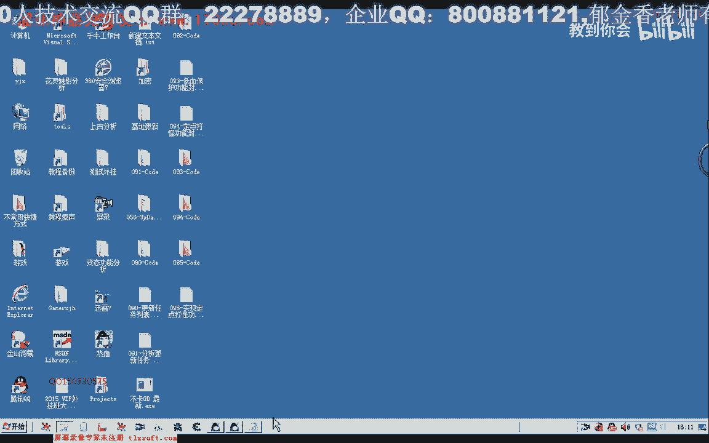
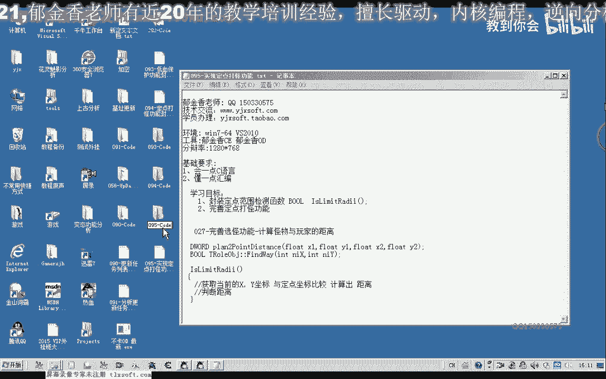
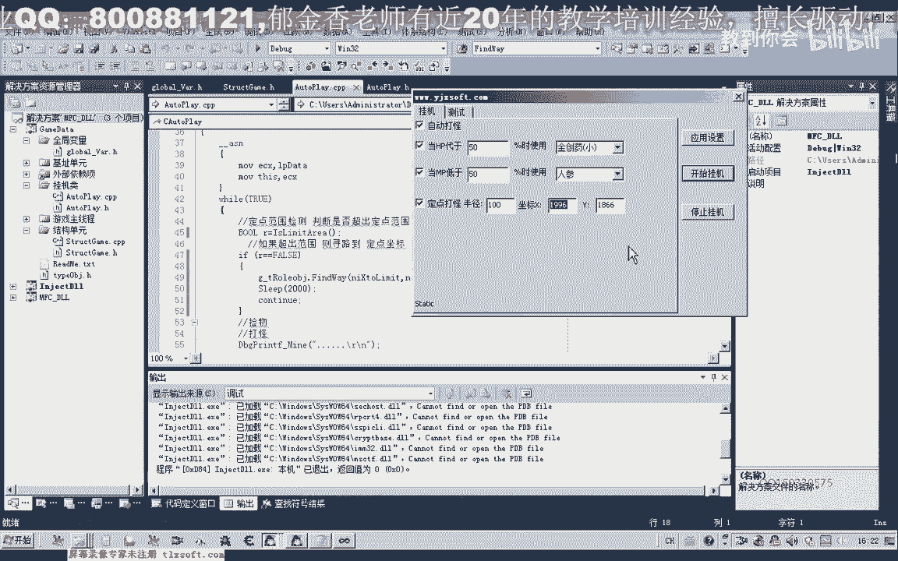

# 郁金香老师C／C++纯干货 - P84：095-实现定点打怪功能 - 教到你会 - BV1DS4y1n7qF

大家好，我是郁金香老师，那么这节课呢我们一起来完善定点打怪的功能。

那么首先我们打开第94课的代码，嗯嗯。

那么首先呢我们转到我们的挂机类里面添加一个呃，用于判断我们范围的一个成员函数，看是否超出了，用来检测我们是否超出了这个定点的这个范围半径，嗯，那么首先呢我们需要取得，哈哈哈哈哈。

这个玩家当前的x坐标y坐标，呼，那么当前x坐标呢我们可以通过全局变量里面的人物角色来获取，当然这个是佛点类型的，它会自动的转换，那么这里呢我们也可以用火点就行，那么这个坐标我们取得了之后呢。

呃在与我们限定的这个坐标之间呢，我们进行比较，那么这个我们需要借助27克里面的一个函数啊，我们查找一下这个函数，好像就在这个头文件里边，结构单元的头文件啊，这里边有一个相应的这个函数。

那么这个时候呢我们把当前的坐标来传进去，这个是坐标y坐标，那么第二个坐标呢也就是我们定点的这个坐标啊，先计算它们两个之间的一个距离，当然这个坐标的话，它本身呢是我们是整形的，它在传入的时候呢。

它自动的会转化成一个火点类型，那么最后呢它会返回一个距离，然后这个取得计算出来的距离呢，在于我们参数里面的距离进行一个比较，那么如果这个距离呢它大于了我们的这个相应的一个距离。

这里呢我们需要另外取一个名字，把它区分开，吧啦吧啦吧啦吧啦吧啦，好那么如果大于这个距离的话，我们就返回fs啊，就是说超出了我们的这个限定的一个范围，那么如果它是小于的话。

我们在这里呢返回处理表示了它在我们这个定点的这个范围半径之内，好好的，我们先编译生成一下，然后我们转到我们的这个呃自动打怪的这个线程里边，那么在这里呢我们进行范围的一个检测啊，我这。

那么检测之后如果这个值他是为真的话，那么我们就继续执行后面的代码，那么如果如果是为假的话，那么这个值呢做一个判断，那么如果这个超出了我们的这个范围，返回的这个数字是角。

那么呢我们就进行一个寻路的一个操作，不等位，那么有一个寻路的函数，我们查找一下他在哪一个单元啊，这个是在人物角色里面，那么然后呢我们要到达的目的地呢，就是我们定点的这个坐标。

当然我们走路的话需要一定的时间，那么在后边呢我们做一些延迟，sleep，那么这里呢我们延迟两秒的时间啊，让他到达这个指定的目的地，然后呢我们进行下一次循环continue。

然后直接又回到这个首部来进行我们下一次的一个循环，那么直到了这个值它为真，也就是说在我们限定的范围之内了，那么我们这里呢这一段呢将被跳过哈，将继续执行后面的代码，那么这样的话就实现了我们的定点打怪。

好的我们再重新生成一下，然后我们来进行测试，那么这里呢我们要给它设置一个坐标，我们看一下当前的坐标是多少，1996，然后呢我这里是半径，半径我们设置为100，那么这里坐标呢我们设置为1996。

1866就是当前的坐标，然后呢我们应用设置啊，开始挂机，化解一下主线程，那么这个时候呢我们再进入到游戏里边啊，让他跑出这个相应的这个范围，那么跑出了这个范围之后呢，它自动的就会跑回来啊，这个时候。

当然这个时候呢他会来回地往这个地方跑，那么也可能是一些有一些这个问题，那么我们可以使用一个回形图，那我跑到城里边之后啊，这个时候我们超出了这个范围，这个时候呢它会自动的啊跑到我们指定的这个地点去。

然后我们可以看到这个小地图上啊，它会不断地沿着这个路径呢，呃跑到我们设置的定点位置，然后呢去进行挂机的一个操作嗯，好我们来看一下当前的情况啊，这个时候呢他又再次开始自动打怪了啊，好的那。

么我们的功能呢测试成功，那么这节课呢我们就到这里呃，那么下一节课呢我们将对它们进行一些改进啊，呃比如说我们让它自动的获取当前的这个坐标啊，打开这个窗口的时候，另外添加一个按钮，可以获得当前的一个坐标。

还有相关的这些数字的一些初始化，那么现在呢就相当于有一个作业啊。

大家自己要去完成一下。