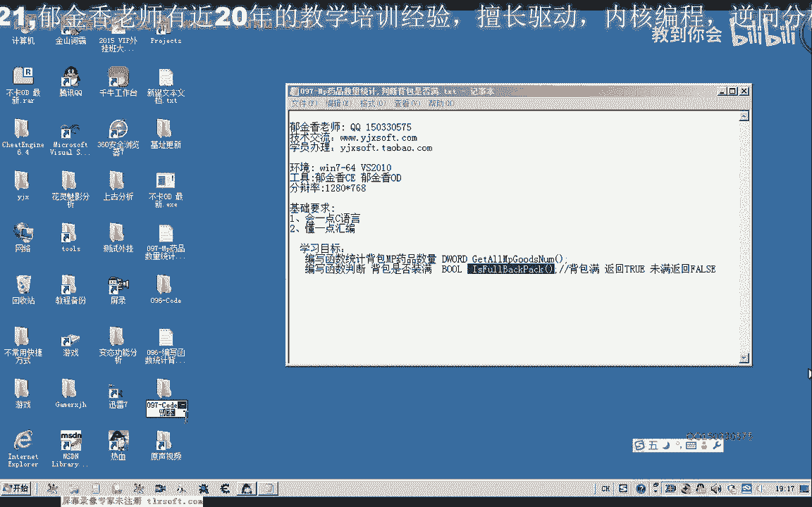
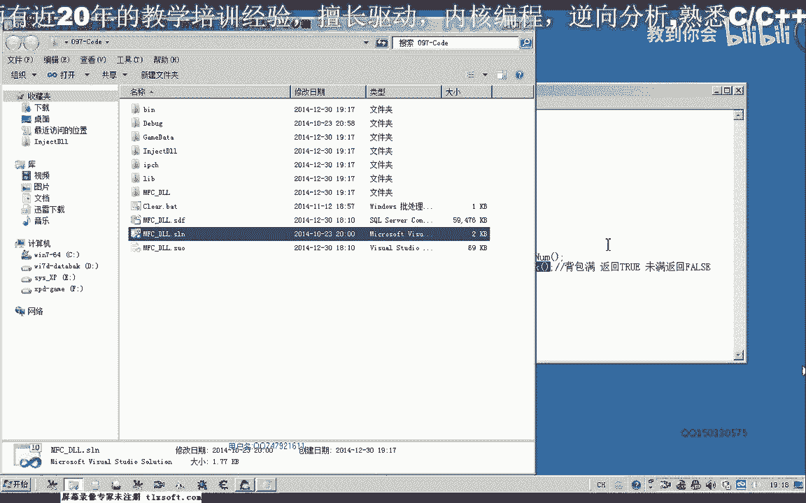
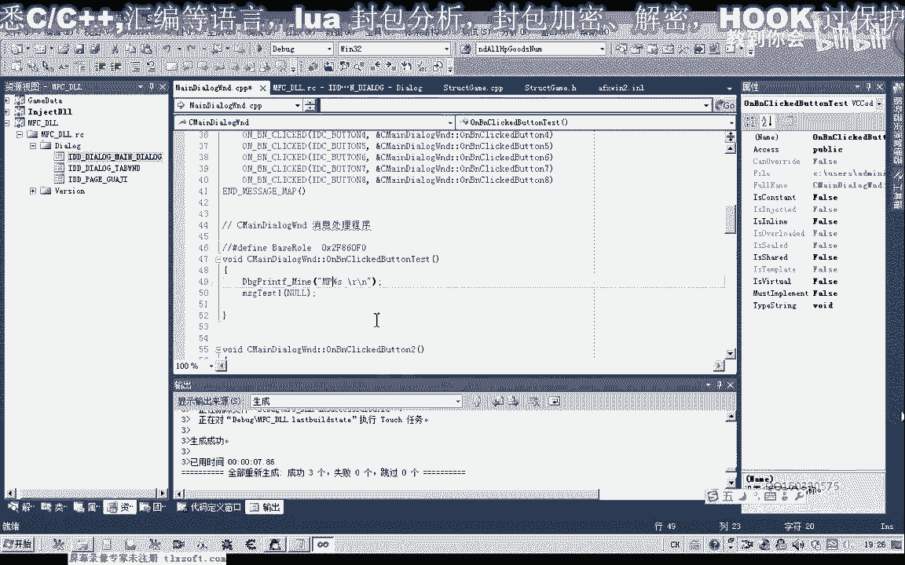
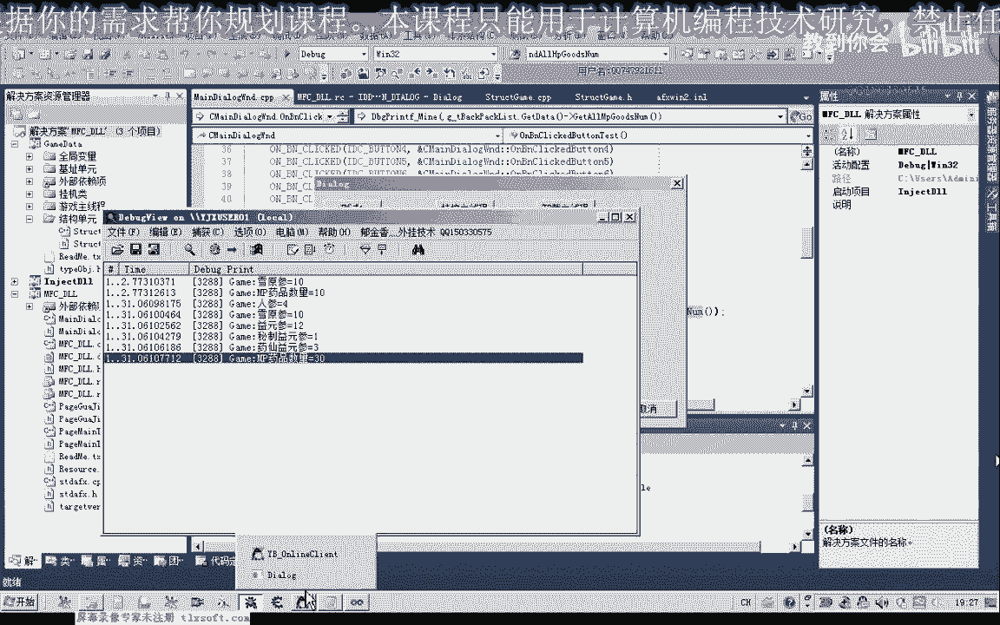

# 郁金香老师C／C++纯干货 - P86：097-Mp药品数量统计,判断背包是否满 - 教到你会 - BV1DS4y1n7qF

大家好，我是郁金香老师，那么这节课呢我们首先来完成上一节课的作业啊，然后再编写一个函数来判断我们的背包，那么是否呢已经装满，那么我们首先打开第96课的代码。

然后呢我们转到背包的结构单元，然后我们在统计金创药和数量，在这后面呢添加哈统计我们这个mp药品数量的函数，嗯嗯，然后转到这里呢，我们复制一下前面的统计这个药品的这个函数啊，那么把它的名字呢我们改一下。

改为mp，然后呢就是这里的呃名字呢我们把它改一下，改为人生，你三三，还有雪原三，然后呢再是，呃一原声哈，然后再生必次，嗯好像是秘制人生哈，我们在这个药店里面再去看一下，人生雪原声啊，然后呢再是一原声。

嗯秘制和药先啊，医院生突变，秘制意愿生活，这个要先原生，而这个野山参的话是在这个三邪关和领证官啊，呃才有相应的这个啊mp的这个药品，还有这里呢我们可以把它改一下这个变量，那么可以改也可以不改啊。

好那么我们把它保存一下，那么这是我们上一节课的作业的话，实际上很简单，只需要稍微修改几句代码就可以了，那么另外我们还需要添加一个函数，用来判断我们的背包呢是否已经满足啊，那么如果背包满的时候呢。

我们就要清空我们的背包，要回城，要补剂啊，这一类的还要清理的垃圾物品呢，要出售给商店，那么我们在它的后边啊添加这个函数，然后再转到静音，那么在这里呢我们编写相应的代码，第二。

那么如果整个背包我们都建立完成了之后的话，每一个呃都是有这个物品对象的，那么呢我们就返回处啊，表示呢背包满，那么这里呢我们需要用一个循环来骗你，那么我们看一下，好像我记得有定义这个背包的一个大小啊。

in size，这，这家人就真难了，那么这里呢我们要给它添加一个前缀，表示呢，它是我们的这个背包的这个结构的成员，然后我们才可以使用里面的相应的成员变量，那么在这里呢我们对它的一个数量呢进行一个判断。

那么这个数量啊必须要大于零，或者说这个这个数量它等于零的话，表示这一个呢它没有相应的这个物品，那么没有相应的这个物品存在的话，那么我们直接就返回death就行了，那么如果整个偏离都完成了啊。

那么呢呃执行到这里的时候呢，就表示我们呃从下标0~35的一共是36个，那么所有的背包我们的判断啊都有这个相应的物品，它的数量都不等于零的啊，那么说明的话我们这个背包栏就满嗯，就是满足了。

那么如果当中某一格等于零的话，那么我们就返回啊，fs表示了这个背包未满，啊，好那么我们还有之前的这个作业呢，我们测试一下他统计的这个药品的一个数量，m p的，那么我们转到资源，测试证。

咕噜噜噜噜噜噜噜，好那么我们来测试一下，看一下他药品数量的一个统计，那么我们来看一下游戏的决定呃，当然也可以买买一些其他的这个药品，好的，那么我们再次统计一下，那么这是人生的数量，是原生的数量啊。

一元生的啊，要先的啊，一共是30个。

那么我们来看一下啊，取原生十个人生四个，然后再是一元32个，秘制一元三，然后是一个药药，先应原生，然后是三个啊，一共是30个，14啊，26，27加三个，一共30个，好的，那么我们这节课呢比较简单了。

那么我们就到这里呃，那么下一节课呢我们接着分析一些相关的数据，那么这里呢也留一个做作业给大家给大家，这类，就是当我们金疮药啊总数，那么小于某一个数值的时候啊，比如说小于十的时候呢。

那么我们就回城就5g啊，相应的相应数量，比如说我们就5g哈，100个金创药小，那么这个呢我们当时是一个助力哈，大家有时间的话下去完成一下，好的。

