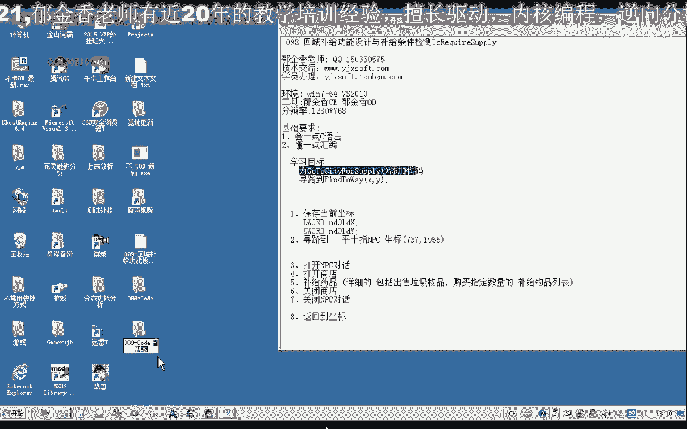
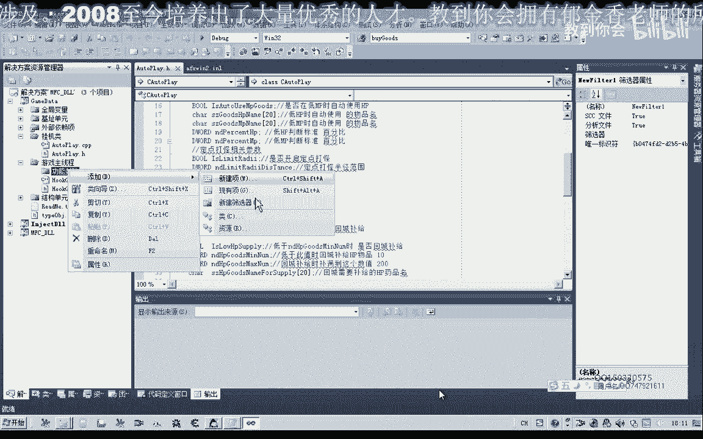
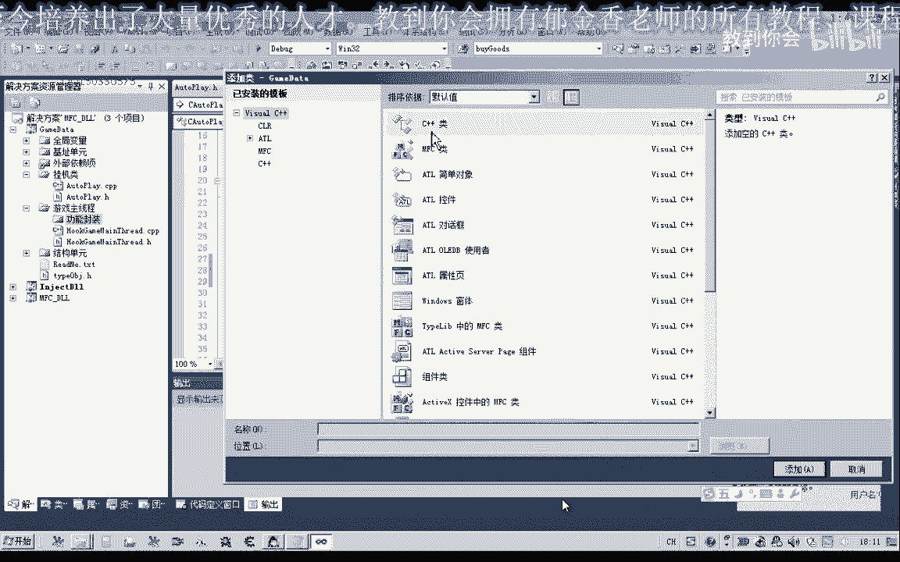
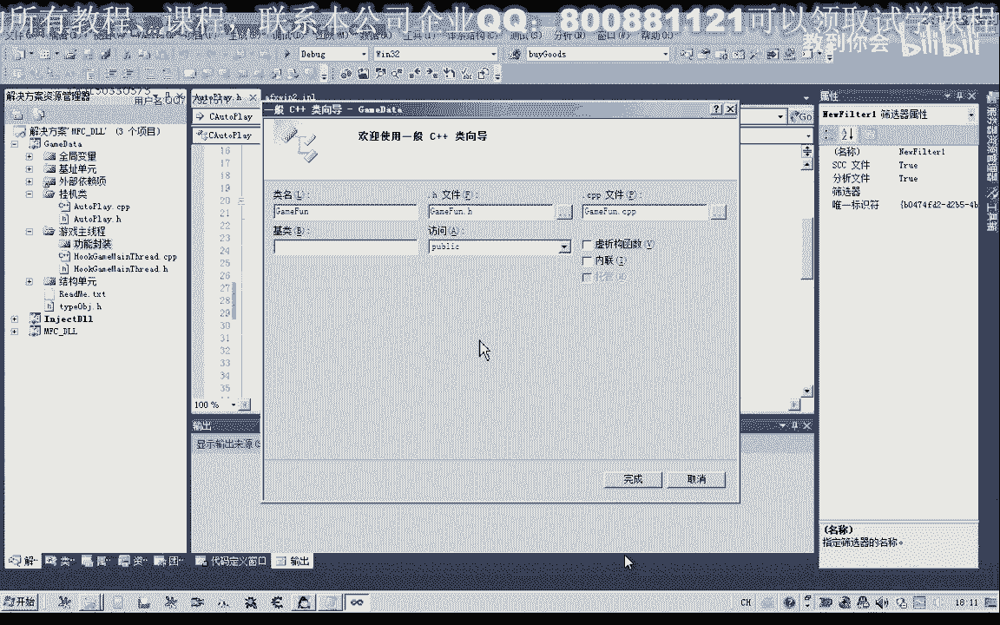
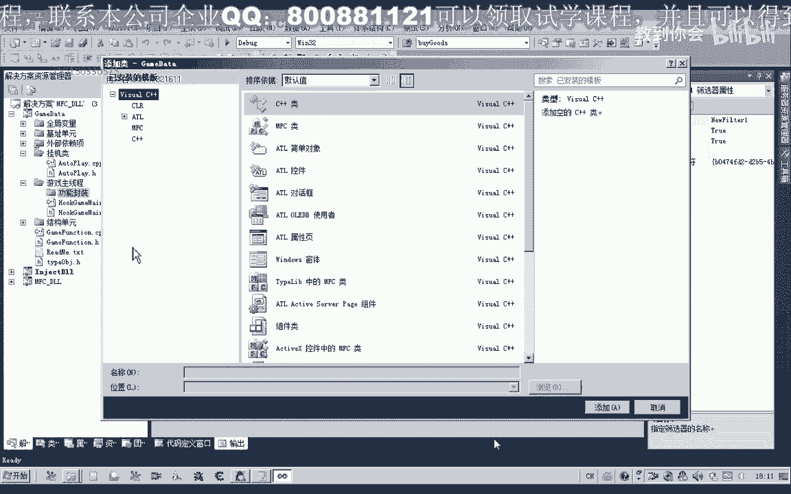
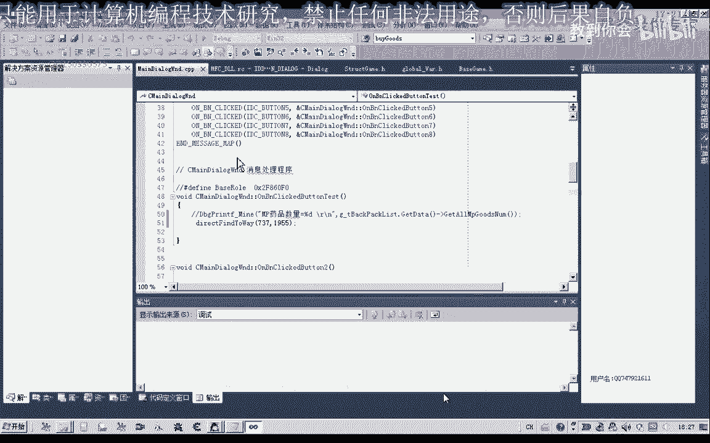

# 郁金香老师C／C++纯干货 - P88：099-回城补给功能设计相关函数寻路到FindToWay - 教到你会 - BV1DS4y1n7qF

大家好，我是欲擊先老師，在這一節課我們首先封裝尋路道的函數，也就是上一節課的座列，然後再為我們的go to設定，或是plan，那麼也就是說回程記得函數來添加一部分代碼，那麼我們先移到掛件錄影片。

由於我們的第一步需要在執行尋路道之前，我們需要保存一下當前的座標，那麼在這裡我們先添加兩個成員變量，補漆相關的這一部分，然後我們需要編寫一個尋路道的這樣一個功能，那麼在這個功能裏面。

我們把它建到遊戲主現場，這裡面另外再添加一個目錄，用來實現一個功能的封裝，然後我們需要添加一個頭文件和一個原文件。

那麼在這裡我們可以直接選一下，是加加的綠，那麼在選綠的時候，它就自動的會添加一個頭文件，和一個相應的一個原文件，函數的一個功能，或者是遊戲的一個功能的一個封裝，點完成。

然後把新建的這兩個移到功能封裝裏面。

或者也可以把它獨立出來，也是可以的，獨立到外邊也是可以，那麼這個功能封裝裏面的一個約定，我們就是說它裏面所有的涉及到遊戲擴展，都不直接調用，而是調用主線程裏面的這一個功能，那麼也就是說這裏面的函數的話。

我們就可以直接的調用，最終就可以直接的調用來實現，好的，那麼在這裡，我們肯定因為它依賴於我們的主線程單元，那麼所以說我們需要包含相應的頭文件，還有我們的機子單元，它也需要用到，以及我們的全局變量單元。

這些它都會用到，用到的，我們把它寫在頭文件裏面，那麼同樣的，我們為了防止頭文件的反復的被包含，那麼我們也可以了，寫一段紅，來對它進行一下封裝，來看一看，(音樂)，(音樂)，(音樂)，(音樂)，(音樂)。

(音樂)，那么这样的话就能够保留上来了，那么这样的话就能够保证了我们图文件的不被重复的包含，只包含一次，好的，那么我们在这里来定义我们的相应的寻路道的函数，那么这个我们也可以给他加上一个相应的一个程序。

那么在这里，我们跟他加上一个前缀来表示，就是说后来我们可以不挂接主线程，可以直接的调用，因为它里边都是依赖于主线程单元的函数来实现，好，(音量注意，請別忘了按讚分享哦)，(音量注意。

請別忘了按讚分享哦)，(音量注意，請別忘了按讚分享哦)，(音量注意，請別忘了按讚分享哦)，(音量注意，請別忘了按讚分享哦)，(音量注意，請別忘了按讚分享哦)，(音量注意，請別忘了按讚分享哦)。

(音量注意，請別忘了按讚分享哦)，(音量注意，請別忘了按讚分享哦)，(音量注意，請別忘了按讚分享哦)，(音量注意，請別忘了按讚分享哦)，(音量注意，請別忘了按讚分享哦)，(音量注意。

請別忘了按讚分享哦)，(音量注意，請別忘了按讚分享哦)，(音量注意，請別忘了按讚分享哦)，(音量注意，請別忘了按讚分享哦)，(音量注意，請別忘了按讚分享哦)，(音量注意，請別忘了按讚分享哦)。

(音量注意，請別忘了按讚分享哦)，(音量注意，請別忘了按讚分享哦)，(音量注意，請別忘了按讚分享哦)，(音量注意，請別忘了按讚分享哦)，(音量注意，請別忘了按讚分享哦)，(音量注意。

請別忘了按讚分享哦)，(音量注意，請別忘了按讚分享哦)，(音量注意，請別忘了按讚分享哦)，(音量注意，請別忘了按讚分享哦)，(音量注意，請別忘了按讚分享哦)，(音量注意，請別忘了按讚分享哦)。

(音量注意，請別忘了按讚分享哦)，(音量注意，請別忘了按讚分享哦)，(音量注意，請別忘了按讚分享哦)，(音量注意，請別忘了按讚分享哦)，(音量注意，請別忘了按讚分享哦)，(音量注意。

請別忘了按讚分享哦)，(音量注意，請別忘了按讚分享哦)，(音量注意，請別忘了按讚分享哦)，(音量注意，請別忘了按讚分享哦)，(音量注意，請別忘了按讚分享哦)，(音量注意，請別忘了按讚分享哦)。

(音量注意，請別忘了按讚分享哦)，(音量注意，請別忘了按讚分享哦)，(音量注意，請別忘了按讚分享哦)，(音量注意，請別忘了按讚分享哦)，(音量注意，請別忘了按讚分享哦)，(音量注意。

請別忘了按讚分享哦)，(音量注意，請別忘了按讚分享哦)，(音量注意，請別忘了按讚分享哦)，(音量注意，請別忘了按讚分享哦)，(音量注意，請別忘了按讚分享哦)，(音量注意，請別忘了按讚分享哦)。

(音量注意，請別忘了按讚分享哦)，(音量注意，請別忘了按讚分享哦)，(音量注意，請別忘了按讚分享哦)，(音量注意，請別忘了按讚分享哦)，(音量注意，請別忘了按讚分享哦)，(音量注意。

請別忘了按讚分享哦)，(音量注意，請別忘了按讚分享哦)，(音量注意，請別忘了按讚分享哦)，(音量注意，請別忘了按讚分享哦)，(音量注意，請別忘了按讚分享哦)，(音量注意，請別忘了按讚分享哦)。

(音量注意，請別忘了按讚分享哦)，(音量注意，請別忘了按讚分享哦)，(音量注意，請別忘了按讚分享哦)，(音量注意，請別忘了按讚分享哦)，(音量注意，請別忘了按讚分享哦)，(音量注意。

請別忘了按讚分享哦)，(音量注意，請別忘了按讚分享哦)，(音量注意，請別忘了按讚分享哦)，(音量注意，請別忘了按讚分享哦)，(音量注意，請別忘了按讚分享哦)，(音量注意，請別忘了按讚分享哦)。

(音量注意，請別忘了按讚分享哦)，(音量注意，請別忘了按讚分享哦)，(音量注意，請別忘了按讚分享哦)，(音量注意，請別忘了按讚分享哦)，(音量注意，請別忘了按讚分享哦)，(音量注意。

請別忘了按讚分享哦)，(音量注意，請別忘了按讚分享哦)，(音量注意，請別忘了按讚分享哦)，(音量注意，請別忘了按讚分享哦)，(音量注意，請別忘了按讚分享哦)，(音量注意，請別忘了按讚分享哦)。

(音量注意，請別忘了按讚分享哦)，(音量注意，請別忘了按讚分享哦)，(音量注意，請別忘了按讚分享哦)，(音量注意，請別忘了按讚分享哦)，(音量注意，請別忘了按讚分享哦)，(音量注意。

請別忘了按讚分享哦)，(音量注意，請別忘了按讚分享哦)，(音量注意，請別忘了按讚分享哦)，(音量注意，請別忘了按讚分享哦)，(音量注意，請別忘了按讚分享哦)，(音量注意，請別忘了按讚分享哦)。

(音量注意，請別忘了按讚分享哦)，(音量注意，請別忘了按讚分享哦)，(音量注意，請別忘了按讚分享哦)，(音量注意，請別忘了按讚分享哦)，(音量注意，請別忘了按讚分享哦)，(音量注意。

請別忘了按讚分享哦)，(音量注意，請別忘了按讚分享哦)，(音量注意，請別忘了按讚分享哦)，(音量注意，請別忘了按讚分享哦)，(音量注意，請別忘了按讚分享哦)，(音量注意，請別忘了按讚分享哦)。

(音量注意，請別忘了按讚分享哦)，(音量注意，請別忘了按讚分享哦)，(音量注意，請別忘了按讚分享哦)，(音量注意，請別忘了按讚分享哦)，(音量注意，請別忘了按讚分享哦)，(音量注意。

請別忘了按讚分享哦)，(音量注意，請別忘了按讚分享哦)，(音量注意，請別忘了按讚分享哦)，(音量注意，請別忘了按讚分享哦)，(音量注意，請別忘了按讚分享哦)，(音量注意，請別忘了按讚分享哦)。

(音量注意，請別忘了按讚分享哦)，(音量注意，請別忘了按讚分享哦)，(音量注意，請別忘了按讚分享哦)，(音量注意，請別忘了按讚分享哦)，(音量注意，請別忘了按讚分享哦)，(音量注意。

請別忘了按讚分享哦)，(音量注意，請別忘了按讚分享哦)，(音量注意，請別忘了按讚分享哦)，(音量注意，請別忘了按讚分享哦)，(音量注意，請別忘了按讚分享哦)，(音量注意，請別忘了按讚分享哦)。

(音量注意，請別忘了按讚分享哦)，(音量注意，請別忘了按讚分享哦)，(音量注意，請別忘了按讚分享哦)，(音量注意，請別忘了按讚分享哦)，(音量注意，請別忘了按讚分享哦)，(音量注意。

請別忘了按讚分享哦)，(音量注意，請別忘了按讚分享哦)，(音量注意，請別忘了按讚分享哦)，(音量注意，請別忘了按讚分享哦)，(音量注意，請別忘了按讚分享哦)，(音量注意，請別忘了按讚分享哦)。

(音量注意，請別忘了按讚分享哦)，(音量注意，請別忘了按讚分享哦)，(音量注意，請別忘了按讚分享哦)，(音量注意，請別忘了按讚分享哦)，(音量注意，請別忘了按讚分享哦)，(音量注意。

請別忘了按讚分享哦)，(音量注意，請別忘了按讚分享哦)，(音量注意，請別忘了按讚分享哦)，(音量注意，請別忘了按讚分享哦)，(音量注意，請別忘了按讚分享哦)，(音量注意，請別忘了按讚分享哦)。

(音量注意，請別忘了按讚分享哦)，(音量注意，請別忘了按讚分享哦)，(音量注意，請別忘了按讚分享哦)，(音量注意，請別忘了按讚分享哦)，(音量注意，請別忘了按讚分享哦)，(音量注意。

請別忘了按讚分享哦)，(音量注意，請別忘了按讚分享哦)，(音量注意，請別忘了按讚分享哦)，(音量注意，請別忘了按讚分享哦)，(音量注意，請別忘了按讚分享哦)，(音量注意，請別忘了按讚分享哦)。

(音量注意，請別忘了按讚分享哦)，(音量注意，請別忘了按讚分享哦)，(音量注意，請別忘了按讚分享哦)，(音量注意，請別忘了按讚分享哦)，(音量注意，請別忘了按讚分享哦)，(音量注意。

請別忘了按讚分享哦)，(音量注意，請別忘了按讚分享哦)，(音量注意，請別忘了按讚分享哦)，(音量注意，請別忘了按讚分享哦)，(音量注意，請別忘了按讚分享哦)，(音量注意，請別忘了按讚分享哦)。

(音量注意，請別忘了按讚分享哦)，(音量注意，請別忘了按讚分享哦)，(音量注意，請別忘了按讚分享哦)，(音量注意，請別忘了按讚分享哦)，(音量注意，請別忘了按讚分享哦)，(音量注意。

請別忘了按讚分享哦)，(音量注意，請別忘了按讚分享哦)，(音量注意，請別忘了按讚分享哦)，(音量注意，請別忘了按讚分享哦)，(音量注意，請別忘了按讚分享哦)，(音量注意，請別忘了按讚分享哦)。

(音量注意，請別忘了按讚分享哦)，(音量注意，請別忘了按讚分享哦)，(音量注意，請別忘了按讚分享哦)，(音量注意，請別忘了按讚分享哦)，(音量注意，請別忘了按讚分享哦)，(音量注意。

請別忘了按讚分享哦)，(音量注意，請別忘了按讚分享哦)，(音量注意，請別忘了按讚分享哦)，(音量注意，請別忘了按讚分享哦)，(音量注意，請別忘了按讚分享哦)，(音量注意，請別忘了按讚分享哦)。

(音量注意，請別忘了按讚分享哦)，(音量注意，請別忘了按讚分享哦)，(音量注意，請別忘了按讚分享哦)，(音量注意，請別忘了按讚分享哦)，(音量注意，請別忘了按讚分享哦)，(音量注意。

請別忘了按讚分享哦)，(音量注意，請別忘了按讚分享哦)，(音量注意，請別忘了按讚分享哦)，(音量注意，請別忘了按讚分享哦)，(音量注意，請別忘了按讚分享哦)，(音量注意，請別忘了按讚分享哦)。

(音量注意，請別忘了按讚分享哦)，(音量注意，請別忘了按讚分享哦)，(音量注意，請別忘了按讚分享哦)，(音量注意，請別忘了按讚分享哦)，(音量注意，請別忘了按讚分享哦)，(音量注意。

請別忘了按讚分享哦)，(音量注意，請別忘了按讚分享哦)，(音量注意，請別忘了按讚分享哦)，(音量注意，請別忘了按讚分享哦)，(音量注意，請別忘了按讚分享哦)，(音量注意，請別忘了按讚分享哦)。

(音量注意，請別忘了按讚分享哦)，(音量注意，請別忘了按讚分享哦)，(音量注意，請別忘了按讚分享哦)，(音量注意，請別忘了按讚分享哦)，(音量注意，請別忘了按讚分享哦)，(音量注意。

請別忘了按讚分享哦)，(音量注意，請別忘了按讚分享哦)，(音量注意，請別忘了按讚分享哦)，(音量注意，請別忘了按讚分享哦)，(音量注意，請別忘了按讚分享哦)，(音量注意，請別忘了按讚分享哦)。

(音量注意，請別忘了按讚分享哦)，(音量注意，請別忘了按讚分享哦)，(音量注意，請別忘了按讚分享哦)，(音量注意，請別忘了按讚分享哦)，(音量注意，請別忘了按讚分享哦)，(音量注意。

請別忘了按讚分享哦)，(音量注意，請別忘了按讚分享哦)，(音量注意，請別忘了按讚分享哦)，(音量注意，請別忘了按讚分享哦)，(音量注意，請別忘了按讚分享哦)，(音量注意，請別忘了按讚分享哦)。

(音量注意，請別忘了按讚分享哦)，(音量注意，請別忘了按讚分享哦)，(音量注意，請別忘了按讚分享哦)，(音量注意，請別忘了按讚分享哦)，(音量注意，請別忘了按讚分享哦)，(音量注意。

請別忘了按讚分享哦)，(音量注意，請別忘了按讚分享哦)，(音量注意，請別忘了按讚分享哦)，(音量注意，請別忘了按讚分享哦)，(音量注意，請別忘了按讚分享哦)，(音量注意，請別忘了按讚分享哦)。

(音量注意，請別忘了按讚分享哦)，(音量注意，請別忘了按讚分享哦)，(音量注意，請別忘了按讚分享哦)，(音量注意，請別忘了按讚分享哦)，(音量注意，請別忘了按讚分享哦)，(音量注意。

請別忘了按讚分享哦)，(音量注意，請別忘了按讚分享哦)，(音量注意，請別忘了按讚分享哦)，(音量注意，請別忘了按讚分享哦)，(音量注意，請別忘了按讚分享哦)，(音量注意，請別忘了按讚分享哦)。

(音量注意，請別忘了按讚分享哦)，(音量注意，請別忘了按讚分享哦)，(音量注意，請別忘了按讚分享哦)，(音量注意，請別忘了按讚分享哦)，(音量注意，請別忘了按讚分享哦)，(音量注意。

請別忘了按讚分享哦)，(音量注意，請別忘了按讚分享哦)，(音量注意，請別忘了按讚分享哦)，(音量注意，請別忘了按讚分享哦)，(音量注意，請別忘了按讚分享哦)，(音量注意，請別忘了按讚分享哦)。

(音量注意，請別忘了按讚分享哦)，(音量注意，請別忘了按讚分享哦)，(音量注意，請別忘了按讚分享哦)，(音量注意，請別忘了按讚分享哦)，(音量注意，請別忘了按讚分享哦)，(音量注意。

請別忘了按讚分享哦)，(音量注意，請別忘了按讚分享哦)，(音量注意，請別忘了按讚分享哦)，(音量注意，請別忘了按讚分享哦)，(音量注意，請別忘了按讚分享哦)，(音量注意，請別忘了按讚分享哦)。

(音量注意，請別忘了按讚分享哦)，(音量注意，請別忘了按讚分享哦)，(音量注意，請別忘了按讚分享哦)，(音量注意，請別忘了按讚分享哦)，(音量注意，請別忘了按讚分享哦)，(音量注意。

請別忘了按讚分享哦)，(音量注意，請別忘了按讚分享哦)，(音量注意，請別忘了按讚分享哦)，(音量注意，請別忘了按讚分享哦)，(音量注意，請別忘了按讚分享哦)，(音量注意，請別忘了按讚分享哦)。

(音量注意，請別忘了按讚分享哦)，(音量注意，請別忘了按讚分享哦)，(音量注意，請別忘了按讚分享哦)，(音量注意，請別忘了按讚分享哦)，(音量注意，請別忘了按讚分享哦)，(音量注意。

請別忘了按讚分享哦)，(音量注意，請別忘了按讚分享哦)，(音量注意，請別忘了按讚分享哦)，(音量注意，請別忘了按讚分享哦)，(音量注意，請別忘了按讚分享哦)，(音量注意，請別忘了按讚分享哦)。

(音量注意，請別忘了按讚分享哦)，(音量注意，請別忘了按讚分享哦)，(音量注意，請別忘了按讚分享哦)，(音量注意，請別忘了按讚分享哦)，(音量注意，請別忘了按讚分享哦)，(音量注意。

請別忘了按讚分享哦)，(音量注意，請別忘了按讚分享哦)，(音量注意，請別忘了按讚分享哦)，(音量注意，請別忘了按讚分享哦)，(音量注意，請別忘了按讚分享哦)，(音量注意，請別忘了按讚分享哦)。

(音量注意，請別忘了按讚分享哦)，然後我們再切換到我們的資源視圖進行我們相應的測試，首先我們在這裡需要包含我們相關的同文件，然後在這裡來調用我們的尋路道，在這裡我們就用平時指的這個座標，再重新編譯一下。

好的，那麼我們輸入我們的代碼，(音量注意，請別忘了按讚分享哦)，先掛接主線程。

然後看一下當前的一個座標，然後點測試，然後我們看一下這裡的相關信息，那麼這個時候他會顯示相應的一個時間，好的，再重新測試一下，那麼之前的這裡有一段消息可能是錯的，我們到主線程看一下。

那麼我們發現在這裡的他傳送的信息裡面，這裡我們打印了一個字串，因為在這裡的他傳進來的參數不是我們的字串，所以說我們在這裡他會有一段ROM，那麼我們可以這樣的把它改一下，X鍵門，好的。

那麼這一節課我們暫時就講到這裡，那麼我們下一期課再見，(字幕由Amara。org社區提供，感謝大家的支持)，(音量注意，請別忘了按讚分享哦)，(字幕由Amara。org社區提供，感謝大家的支持)。

(音量注意)，再次感谢粉丝们 今天的支持 chten0908@C-hub 谢谢！