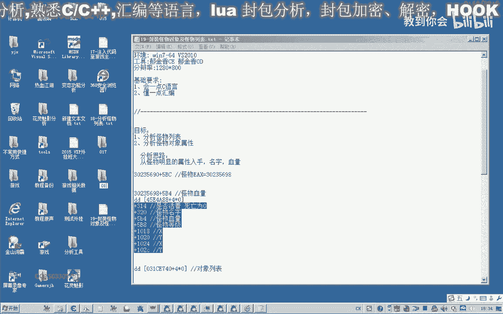
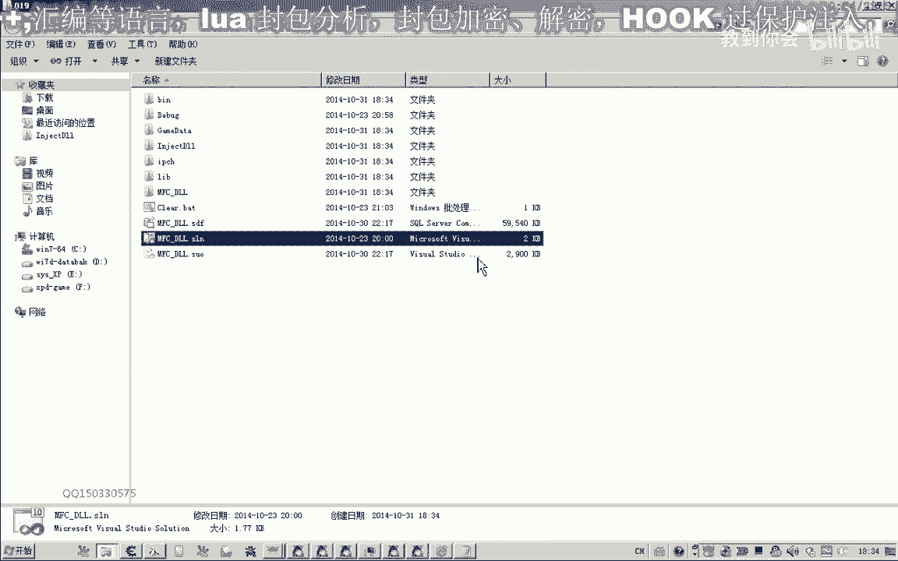
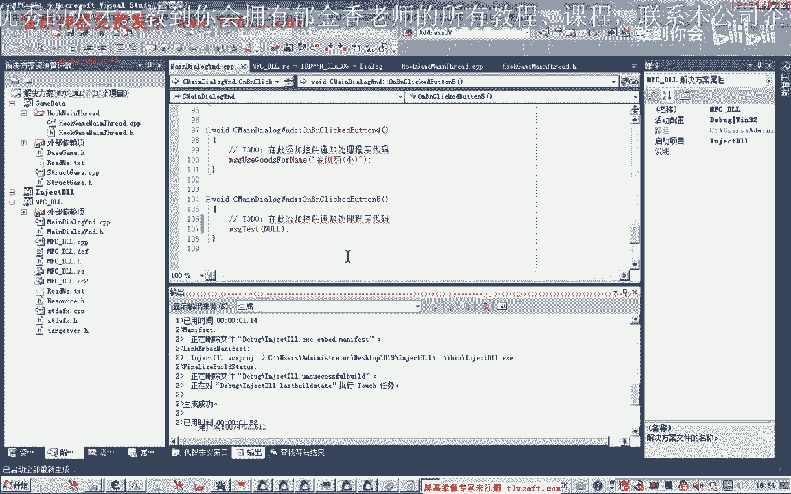
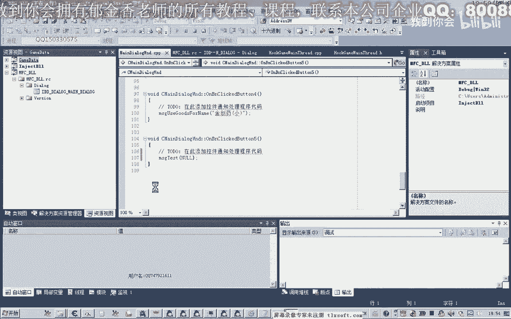
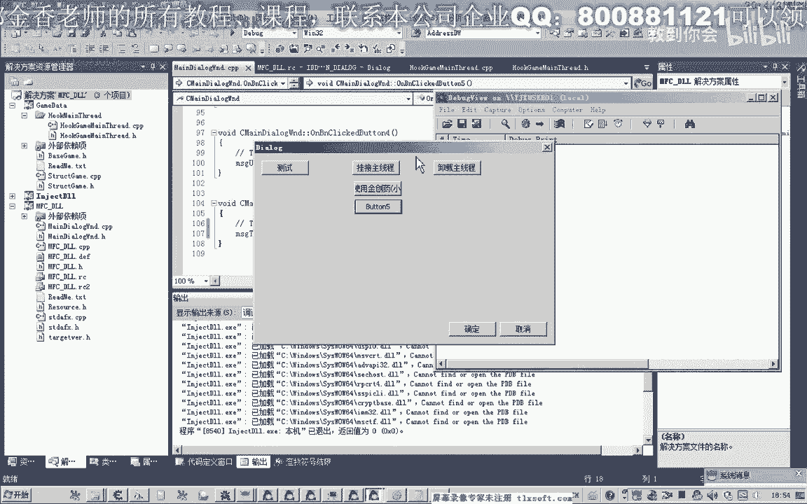

# P8：019-封装怪物对象及怪物列表 - 教到你会 - BV1DS4y1n7qF

啊大家好。

我是郁金香老师，qq 150330575，欢迎大家参加滤芯技术编程培训，那么上一节课呢我们大致的分析了一下怪物列表，只为了怪物列表以及一些怪物的属性啊。

那么今天呢我们就来对外部对象以及怪物列表来进行呃一些封装啊，把代码写好呃，另外呢我们练证一下我们我们所分析的这些属性啊，是是不是正确的打印出来看一下，那么我们打开第17课的代码。

那么首先呢我们在图鉴里面添加我们所找到的机子，二，那，么添加了机子之后呢，接下来我们在结构单元呢添加我们的怪物类型，怪物对象或者是怪物节奏，8888啊啊啊啊，那么这个怪物结构里面呢。

我们把所分析的这些偏移把它粘贴进去，我在那，么第一个怪物是否死亡，这里呢应该是一个不容易形啊，比较竖写，那么第二个呢是我们购物的名字好，那么这里呢我们继续啊，直接用一个指针直接指向蛮怪物的名字。

好这个偏移呢是我们怪物的血量，血量呢我们是一个四字节的，然后是怪物的等级，那么接下来是怪物的坐标，那么还有第二个坐标啊，看看我们现在还不能够确定接近哪一个坐标是当前的坐标，咳咳咳咳好，那么好了之后呢。

我们把多余的这些人注释掉，把偏移注释掉，方便我们编辑，那么这样的话我们怪物的结构呢，基本上我们就把它设置好了，那么接下来呢我们再定义一个怪物列表啊，当然现在我们还不知道这个怪物列表的一个大小。

那么这个我们留到下一节课呢，我们再继续的分析，那么这里呢实际上我们可以用一个动态的数组，用这个victor来表示，那么暂时呢我们先用这个静态做一个测试啊，那么到后边呢我们再对它进行一个修改。

那么暂时呢我们把它定义成20啊，这个植物的怪物为对象的个数呢，我们定义为20，咳咳咳咳咳，那么接下来呢我们就对啊这个怪物述出来呃，进行一些功能性的一些封装哈，写一些函数。

那么首先呢我们对它进行一个初始化，好像我们之前的写法一样，首先要跟它返回一个指针，可以这，哈哈哈，复制一下，然后在我们的cp p单元呢添加我们的这个函数。

它的返回值呢就是我们的这个它本身呢就是返回到它的指针，然后呢我们对它进行初始化，初始化，这个我们也要涉及到一些指针的一些操作，那么我们先加一个异常的处理，那么暂时呢我们把它的数组大小来定义为20。

具体它数量的大小呢，我们在后面通过分析了再来确定，嗯嗯嗯咳咳咳咳咳，然后我们就复初始的时候呢，首先我们呃看一下哈，嗯怪物的名字先读出来啊，换不到两次，那么在读出来之前呢。

我们先计算一下这个怪物对象的首地址，另外我们在定义一个变量，嗯嗯那我给他做一个相应的初始化，2222，那么首先呢我们把机子写上怪物列表的机子，再加上了i4 乘以我们的i。

这就是我们的数组的一个表示方式啊，去掉啊，它的下标是i啊，就是从零开始，学习者好好，那么这样呢为零的时候我们取出第一个外部对象，那么取出来之后呢，它的名字，那么我们加上相关的一个偏移，二零。

那么我们看一下他名字的偏移是多少，是怪物的名字是320，我们把它复制到前边，你好，320加上，当然这里呢最好是用括号括起来，那么后边我们把这个公式复制一下，刚刚名字过来是怪物的血量五比四。

那么五比四的话，这里的路径呢是第一位，并且我们要把你的数据呢读出来，因为他不是只是类型，那么然后再是怪物的等级，五比八，我想看你好好，怪物的等级过了之后呢，然后是怪物的坐标啊，坐标是从1018开始，一。

0202，啊这个我们数组就取出来了，但是我们还要考虑到一个问题，当我们嗯这个取出来的对象是零的时候，我们要做一个判断，如果这个对象呢等于空的时候呢，我们这个循环呢就退出了啊，他后面呢就没有对象。

或者呢我们其实就继续下一个循环偏离，后面还有一个你可以这样写，好，的，那么我们先写一下啊，写上之后我们还要考虑一下呃，这个数组的一个对象的一个初始化对象结构。

我们先用那个设置来跟这个对象的结构来进行初始化平民，那么后面它的大小呢就是三之后这个结构，那么等一会我们打印的时候呢，我们可以通过这个等级来判断啊，如果等级这个数据它有文明的话，说明的话。

相应的这个数组的话也没有我们所要的数据不会正常的话，这个怪物的数这个等级应该是大于一的，那么这样的话我们就写好了，那么我们编译一下初始化的这个部分，那么初始化完成之后呢，我们再写一个成员函数。

那用来打击我们的信息，叫，那么这个我们用来测试的时候，来用来打印我们的一个信息，然后转换到我们的设计，p的，给代码单元添加我们的代码，那，么执行完之后返回真。

那么在这里呢我们打印的时候我们就可以考虑这个异常了，那么我们直接对他骗子进行答案，就i等于2022i拿下，然后呢我们要打印的下，首先呢是我们的名字，我们这后面是等级，等级后面呢我们呃跟坐标。

那我先打印一个坐标进行行写，那么后面呢就是我们相应的数据，哒哒哒哒哒怪物列表下标，然后是我们的名字，第二个是等级，然后再打印一下血量，那么这个时候呢我们可以进行一个换行，在下一行。

为了方便这个代码的一个可能性呢，我们把它进行一下后，这，里要有一个下标，等级过了，这回血量好了，复制一下，那么血量过来之后呢，我们看还有胆子，就是做标准，那么除了这个呢，我们还有一个死亡状态。

是不是死亡，等级血量，hp坐标啊，最后一个死亡状态，为什么，那么我们这里打印出来相应的一个数据啊，如果是未死亡的话，这应该是唯一，嗯那么在打印之前呢，我们做一个判断啊，如果达到一个顶级旗舰里。

看有没有数据，这个如果是等于零的话，说明相应的呃，数据单元呢没有我们所要的数值，那么我们就继续下一个循环就行，心情一下，大概，在后边呢我们有听过一个类型的，那我们加上一个类型。

那么在之前的y30010 之前的版本的话，我们在定义这个结构变量的时候，要用后面啊这个加下划线，那是2010之后啊，许愿进前面一个，后面一个都应该是可以的哈，这里让我们，这里面是不点类型。

我不会做太多啊，好打开我们的调试工具啊，然后我们看一下这个道理，并没挂机主线前啊，对了，我们还没有添加相应的一个测试代码，在这里呢我们还需要在前面的这个单元里面添加一个我们的前面函数。

一定似于这个使用物品，那么我们这里就叫做测试，那么在这里呢我们再另外给他定一个消息的一个类型的，看下就看，那，么这里呢就是我们的几个test，后面呢就是这个代理，我直接跟他说，传过去是一个指针，什么。

然后呢在这里呢加上一个开始处理我们的相关的一个消息，那，么首先呢我们要给这个题二，再打印我们的这个消息，那么在这里面的话没有进行一个数据的初始化，所以说必须调用啊，先调用前面一个函数，哈哈哈哈。

哈哈哈哈，好那么我们再进行测试的话，还要在我们的这个窗口里面添加一个相应的按钮，调用我们这个函数，嗯嗯嗯好听的啊，我们知道那，这里呢我们暂时不需要传什么数据过去，叔叔我回来。

好的，那么我们再来进行一下测试。

画在主线程。

嘟嘟嘟，那么现在呢我们这里可以看到还有一些乱码，那么这个乱码的话证明了我们可能这个所谓的对象列表里面，让它包含的不只不只是这个怪物啊，那么还有其他的呃对象可能是我们的呃，周围的玩家呢或者是掉落的物品。

这一轮的对象，那么我们看一下其他的应该都是证据啊，等级嗯，血量这个是12级的，160级的120，这是坐标啊，那么后面这个呢这个数字是错的，那我们上次分析的时候呢，是就是说未死亡的话，应该是一。

那么当时呢我们应该是选中了这个怪物，它是唯一的，我们再区分一下，打一下他的信息，好那么其他的呢我们到下一节课了再分析一下啊，那么有一个偏移是错的，另外呢这个列表里面呢可能还包含了其他的一些东西嗯。

那么我们在下一节课啊再分析，那么这节课呢我们先保存我们的代码，就探讨到这里，那么这个属性呢我给他打一个问号，另外分析一下哈，这个怪物的是否死亡或者是是否重回，好的。

那么我们下一节课呢再对我们的代码进行一个改进，另外呢我们对这个怪物的属性来进行一下啊。

