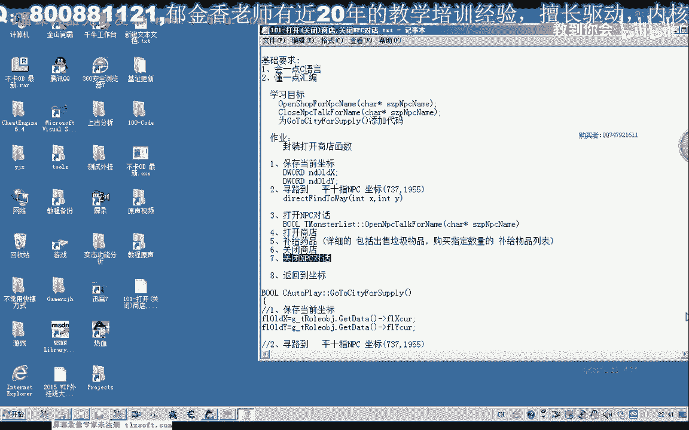
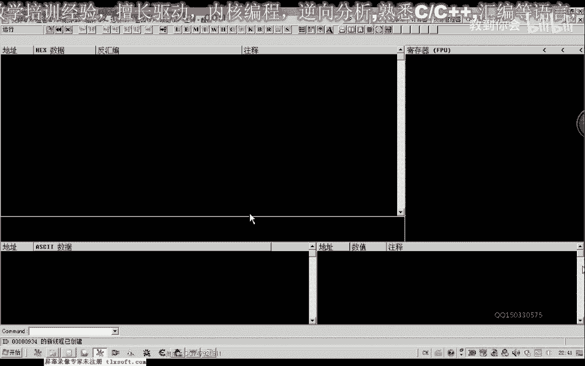
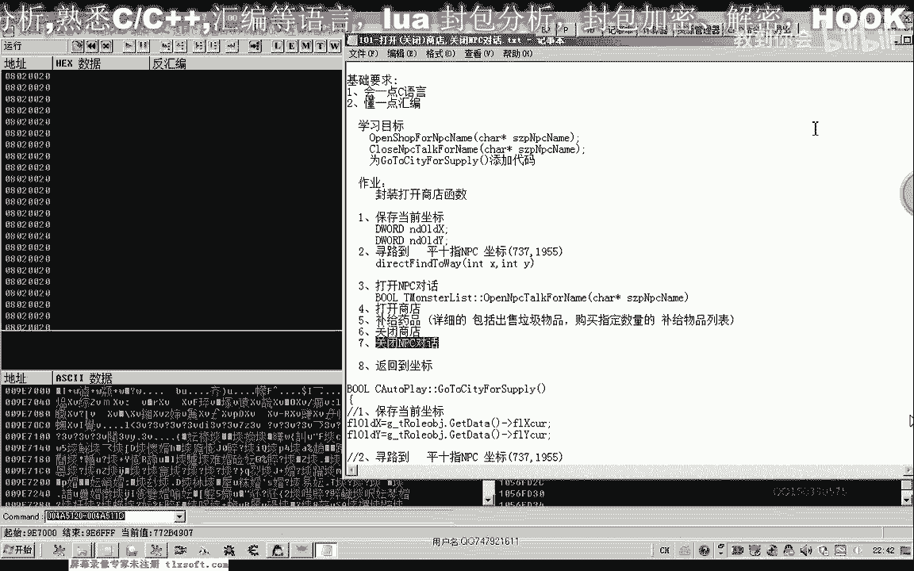
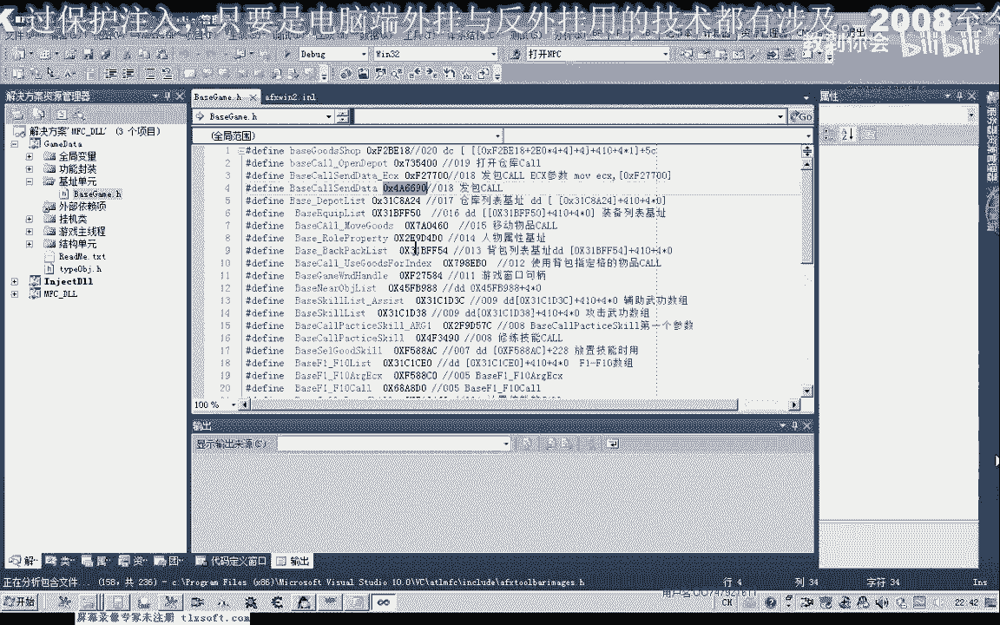
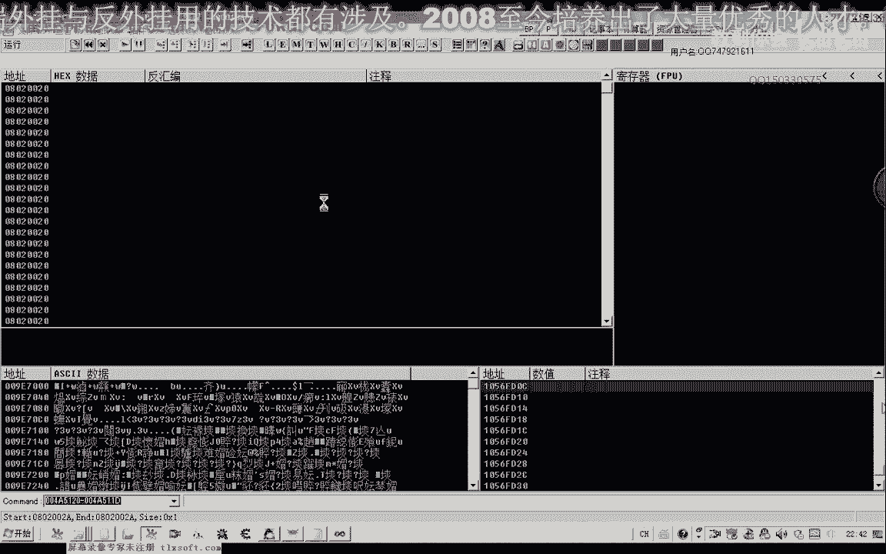
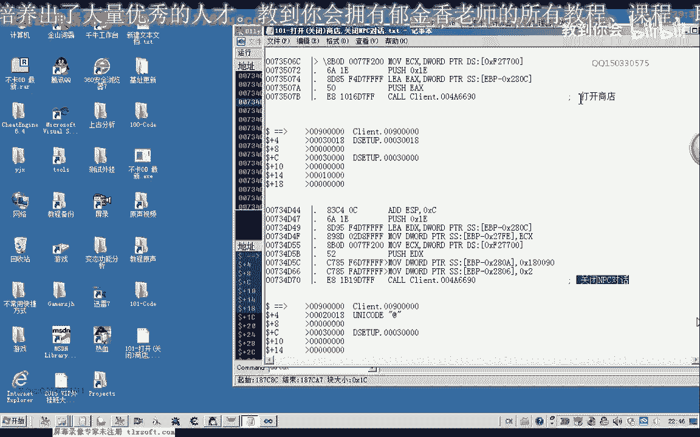
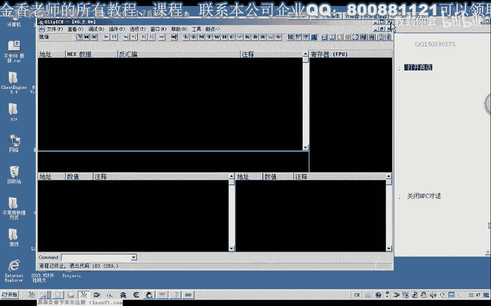
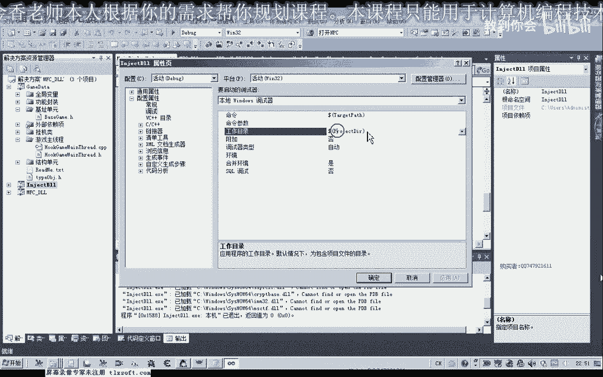
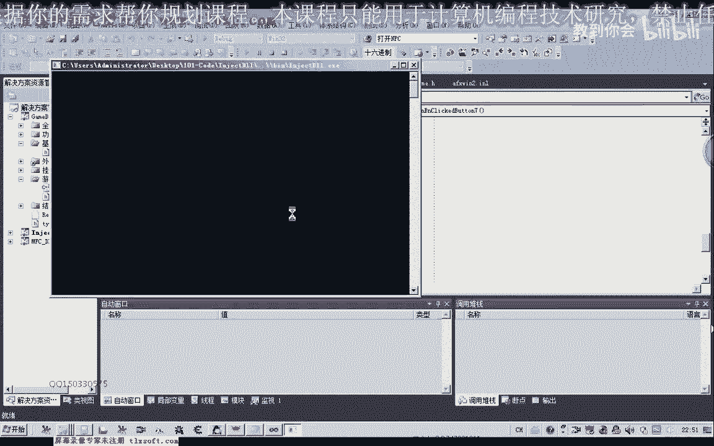
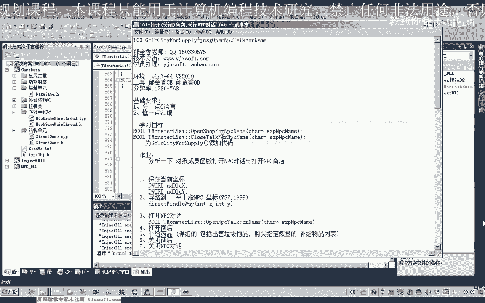

# 郁金香老师C／C++纯干货 - P90：101-打开(关闭)商店,关闭NPC对话 - 教到你会 - BV1DS4y1n7qF

大家好，我是郁金香老师，那么这节课呢我们一起来分析一下，打开商店，一起关闭商店，关闭npc对话的相关功能啊，并且把它封装成相应的一个函数。

那么首先呢我们打开ot嗯，附加到我们的游戏里面。

那么我们通过之前的一个分析的网络，知道他在打开npc的时候呢，我打开商店的时候要向我们的服务器发送这个信息，而这个发包的这个函数的话。

在我们的这个代码里面呢，我们有相应的机制，那么我们先转到机子单元来看一下嗯，这个是我们最新的包包的这个函数。

那么我们转到发包函数这里来，等会在打开商店的时候呢，我们下一个断点，那么我们先打开n p c，那么这个时候马上我们需要打开这个买卖的这个商店，那么我们在这里呢下一个断点，那么切换到游戏里面。

那么这个时候我们还没有点击商店的时候，断下的，我们不管它，那么现在我们点击打开商店啊，那么这个时候呢断下断下之后呢，我们在这个堆栈里面呢按一下回车键啊，返回到发包的这个地址。

那么这个地方的话就是我们的打开商店的这个代码，那么我们顺便看一下现在ex呢这里呢是它的一个数据的缓冲区，那么我们可以用db的形式来看一下ex，那么更简单的方式呢，像这种缓冲区数据比较少的情况下。

我们直接可以用d word形式来显示，那么我们把它的缓冲区的参数呢把它取出来，那么后边这里是大片的零，我们就不管它，那么有数据的地方呢，我们把它复制出来，那么前面的18个字节相当于。

那么这里这里加上了一共是20个字节的数据呢，我们把它复制出来啊，那么这个20个字节呢是16进制的0x20 ，那么这，是打开商店的分析，那么这是它的一个缓冲区，这是它相关的代码，那么我们先让它跑起来。

然后我们再来看一下关闭商店的时候，它的缓冲区是一个什么数据，同样的在这个地方能下断，但是我们发现的时候来关闭这个商店的时候，它没有断下，那么接下来我们看一下呃，结束对话啊，结束npc对话的时候。

那么我们从就在里边吧，看一下这里呢是关闭npc的哎嘛，那么我们看一下缓冲区呢是一dx，那么从这里来看的话啊，这前面的一共是16个字节啊，0x0 c啊。

那么这一段数据呢就是我们关闭的关闭npc对话的一个代码，那么我们也把它复制出来，那么这里的参数呢也是复习到ux 1，好的，那么我们接下来呢我们进行一下打开商店，我关闭npc对话的一个测试。

那么呃应当来说呢，这个关闭npc对话的话可能就会自动的啊关闭这个商店。

好的，我们来试一下，那么我们可以先把工地的这个分析来退出。

然后我们在这里来编辑一下相应的代码，看一下主线程单元单元，那么在主线程单元这里txt 3的时候呢，我们有一个任务的一个交任务的一个相应的一个缓冲区的数据的发送，那么我们可以在他的基础上来进行一下修改。

那么只需要把这个缓冲区设大一点就可以了，那么这里呢我们尽量的方法设置大一点，0x868 ，所以因为呢这个d问的类型的话，一个元素呢是占四字节，那么除以四之后的话，我们大概是等于二一个样子。

那么这样的话缓冲区就足够大了，但是呢我们相对有用的只是前边的一段数据啊，那么我们把这一段数据呢把它移植到我们的这个缓冲区就可以了，那么我们就在它的基础上来进行测试，那么首先测试题这里注释掉，466。

然后我们把相应的数据来复制进去，好的，那么这一段呢这里的参数呢是1e那么这里呢我们就是打开商店里，那么我们再把这一段了哈，复制一下，那么在它的基础上，我们再修改一下关闭npc的这个缓冲区。

那么这里呢我们只需要改为二人，那么其他的数据的话，下面这里是三，那么后边这里是零，就只只只需要来做一个少量的修改就可以了，那么好的啊，接下来呢我们可以来进行相关的测试，这里是关闭npc。

那么我们移到窗口上边啊，进行相应的代码的关联测试，一这里，然后再是测试这个地方，我们再来看一下，好的，那么我们编译一下这段代码，在这里呢我们需要来设置它的调试目录。

好的，我们先挂接到主线层，然后我们到游戏里面先打开npc的对话，然后呢打开商店，这里呢是关闭npc对话，我们看它主要是看能不能关闭商店，那么是能够关闭的嘛，那么说明我们的测试人是成功的。

那么测试成功之后呢，我们再把它封装成我们相应的呃函数的形式，再回到我们的主线成家园里，那么我们在这里呢需要因为在可能的话可能不同的npc呢，他的这个打开对话的代码有一些区别。

那么所以说在这里吧打开npc的这个代码，我这个关闭mc的代码的话，我们也也用了呃，相应的这个与我们的npc名字呢进行一个观点，那么我们先啊封装一下啊，打开这个商店的，那么打开商店这个代码的话，嗯。

我们可以把它单单独的成分啊，也可以的把它关联到我们的这个怪物列表里面，它实际上应该与我们的这个外部列表的话应该有一些关系啊，只是我们没有去深入的分析，那么理论上我们通过这个对象的一些成员函数来操作呢。

它应当来说也能够实现同样的这个目的啊，好的，那么我们先添加相应的代码，那么这里的话我们当时呢实际上我们打开n p c对话的时候，它掉了这个np c对象里面加四这个地方的函数。

那么实际上我们在关闭npc的时候，可能也会调用这个函数，但是这节课呢我们先不分析这一类的数据啊，我们先把我们已经分析好的数据了，做一个封装测试，然后我们再封装一下，关闭npc对话的。

好复制一下上面的代码，可以在上边的代码的基础上进行相应的修改，那么关闭mp 4对话的代码，复制一下，好的我们编译生成一下，对了这里呢我们还需要来定义一个相应的变量啊，在这个地方啊。

这一段局部变量的一个定义了，把它复制过来，哈哈哈哈，好的，这个时候呢生成成功啊，成功之后呢，我们还需要来进行一个代码了，一个封装在主线层单元，在这这个地方，好的，那么我们先定义这两个函数。

一个是打开这个商店的，一个是关闭npc的，那么在这里呢我们也需要来定义两个相应的这个啊，可，那么另外一个呢是关闭商店啊，是通过这个npc的这个名字，那么这个呢是打开我们npc对话的。

我们在他的基础上呢呃进行修改，首先是打开商店，那么另外一个呢是关闭我们的npc对话，然后我们再转到主线程单元，添加对这两个消息的一个，嗯，那么这里面应该是关闭npc的，转到npc的定义。

这里玩b n p c，然后在这里呢我们在呃调用相应的这个函数，这里呢都是npc的名字，仅在上面的这个基础上进行修改，复制这一行的代码，然后在这里呢我们改为这个close啊。

fpp这对方通过他的一个这个名字好的，那么我们再次测试的时候呢，我们调用一下嗯，新定义的这两个函数来进行一下测试，打开npc，打开商店，打开我们的关闭我们的这个商店啊。

这三个函数呢我们再进行相应的一个测试，等着，那么现在的话在这里的话，实际上我们的npc的名字呢呃没有利用起来啊，这个时候我们在调用这个相应的这个库的时候，这个是为我们后边呢预留一个相关的一个接口。

在这个地方，那么后边的话我们如果还是按照这种啊发送数据包的方式，来实现这个npc的打开的话，那么我们可以建立一个开始结构啊，那么不同的npc的话，那么我们进行一个名字的一个判断。

然后呢我们给它在这里呢缓冲区的数据来给它填充不同的这个数据嗯，那么我们具体的实现呢可能要要在后边一些的课，程好的，我们再次进行一下相关的测试，再重新编译型，挂接到主线程，然后打开mp c打开商店。

然后是关掉我们的pc对话，好的，那么我们中间的话，这个时候呢我们就只差我们的卖出这个商品啊，还有这个买入我们的需要5g的这个商品，也就是差差这一个步骤啊，那么关闭商店和关闭n p c对话呢。

它实际上是疫情，关闭分批次对话的时候就关闭了这个商店，第六部就欺负了它是同一个不成，那么基本上我们所要这个功能的话，基本上已经完成了，那么还有呢就是我们这个在出售物品，我这个购买物品的时候。

他也需要一个呃循环啊，需要一个循环，那么还有呢这里也布置一个作业啊，大家可以下去尝试进行一下分析，看不通过我们的这个发送这个封包的这个形式，通过另外一种形式。

也就是调用我们的这个对象里面的成员函数的形式，看能不能够实现我们这个对话的关闭呃，以及我们这个商店呢要打开啊，好的，那么这个呢只是可以进行一下尝试，不一定可以的。

但是有很大的可能是可以通过我们的这个成员函数，传递不同的参数的形式呢来打开一个n p c对话，我一个打开m p c呃，这个菜单，那么如果在这种形式能够实现的话，我们的这个风中这个函数的时候呢。

那么更加的方便一些啊，行那么我们所用的代码的量的话会更少一些，好的那么我们下一节课再见，这节课呢我们就讨论到这个地方，那么还有一个做了呢，也就是把我们相关的这个今天的这个代码，我们可以把它添加到。

这个为什么补剂里面把开商店，我关闭这个商店。

那么这个呢是在我们的挂机单元里面，那么实际上我们在设计的时候呢，我们可以把在这之前呢还可以加上一个条件的一个判断，看一下是不是啊，呼吸条件是否成立，那么不成立的话，我们就直接来，那么我们就直接去看。

直接就反了，那么后面呢我们就可以啊，不用执行，也就是说我们到时候呢只需要在我们的这个挂机搬运里边了，直接调用这个函数啊进行补剂就行了，那么这个函数内部呢它自动啊形成这个条件的一个检测，好的。

那么我们下一节课再见。