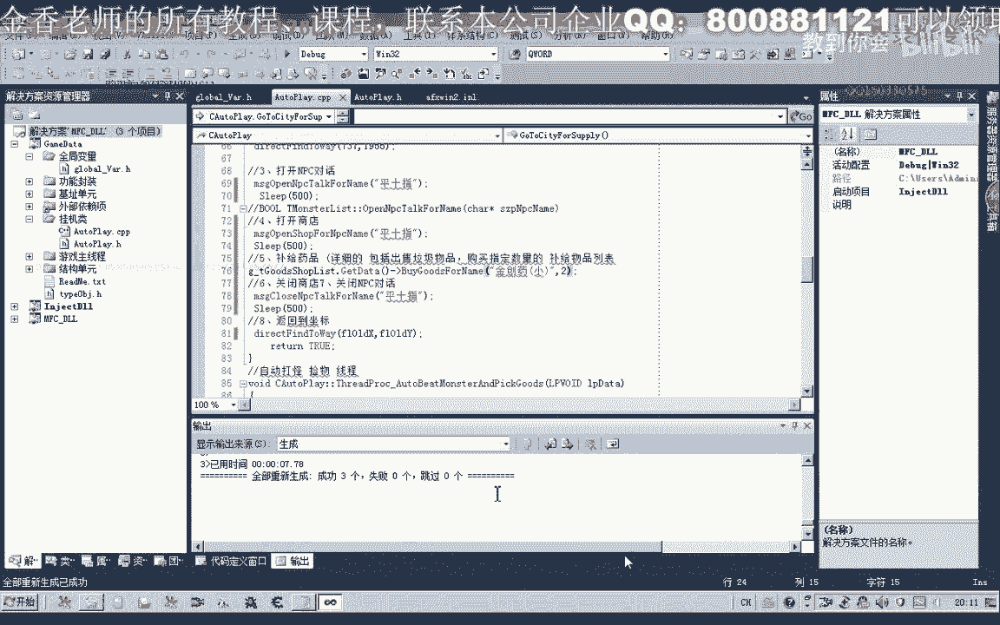

# 郁金香老师C／C++纯干货 - P91：102-完善回城补给功能GoToCityForSupply - 教到你会 - BV1DS4y1n7qF

大家好，我是郁金香老师，那么这节课呢我们继续来完善回城补剂的这个函数，那么我们先打开第101课的代码。

然后我们转到挂机类，转到回城补给的这个函数，那么打开商店这个呢我们之前呢在上一节课已经完成了这个函数，那么我们在这里添加这个功能，然后关闭商店这个函数我们之前也有呃，封装这个功能直接调用。

关闭商店和关闭npc的话是一个功能，我们直接添添加在这后边就可以了，那么最后呢是我们返回啊，直接调用这个函数呃，完成了前面的功能之后呢，我们直接调用返回就可以了。

当然在这里呢我们需要来一个时间的一个间隔，那么我们给它呃0。1秒的时间来反应，或者是0。5秒的时间呢，让他来响应我们的这个关闭的兑换的这个窗口，那么前边的他这里呢。

我们同样的给他预留一段时间来进行相应动作的一个响应，好的，那么最后呢我们又返回到以前的这个坐标就可以了，那么关键这里呢是我们要补剂的这个药品啊，也就是要购买的这个药品。

那么我们看一下全局变量单元有关于商店的，那么这里呢我们购买相应的这个物品，那么需要购买这个物品的名字呢，我们在呃这个相应的参数里边呢，呃应当是有，那么也就是这个名字啊，但是呢之前的话。

我们并没有给这个参数来进行一个相应的一个初始化啊，所以说在这里的话我们先呢直接的啊输入这个物品的名字，就是精通要小，那么在这里呢它所用的这个hp药品的名字呢是给我们预留了一个接口。

到时候我们在窗口界面的时候嗯，传入这个参数，当然我们测试的时候呢，现在这个参数呢他用不着啊，那么我们再来看一下，好的，我们先编译生成一下，那么这里呢我们在复制这个变量的时候呢。

把它写成了这个结构的名字啊，那么我们把它修改一下，那么还有一个药品的一个数量，那么在这里呢我们也直接啊直接传入这个药品的一个数量啊，先做一个测试，好的。

那么我们打开游戏呢来进行相应的测试。

那么在测试之前的话，我们还需要给它加上一个条件的一个判断啊，那么我们先看一下呃，现在的一个金创药是金疮药，小的是三个啊，它的总量的话大概是347个啊，那么我们就可以对它的总量来进行一个判断。

现在的一个技巧347，那么我们就要保证它的金疮药的一个数量保持在，比如说是要保证它的这个数量呢在400以上，那么在这里呢我们可以做一个条件的一个判断，当然这个条件判断的话，我们也也可以写成一个函数。

啊就是说是否需要记得这个函数，那么我们直接写在这里面，那么这里的话我们已经有一个相应的这个函数了，但是呢这个初始值呢他们并没有跟他呃初始化这相应的这个数值。

那么我们先把这个函数呢先添加到我们的回城补记里边，那么如果这个普及的条件成立的话，我们就要执行下边的一个代码，那么如果不成立的时候啊，我们就返回，但是呢这里边所用的这些呃，我们所用的这些数量的话。

它的都是未初始化的，比如说我们的最小值最大值，那么这些数字的话我们需要来，现在的话我们可以在它的一个呃构造函数里边呢先进行一个初始化啊，也就是这个地方，那么我们看一下我们有哪些参数将会用到。

我们先把它复制出来，那么现在我们所涉及到的呢，也就是全部是hp的这这一部分药品嘛，那么也就是这四个数字会不会用到，我们把它复制一下，那么首先呢是否需要补剂啊，这个呢我们测试的时候的话肯定要设设置为啊。

真那么低于此值的时候呢，我们回程补给，那么这个数字为了方便测试的话，我们肯定要大于它的一个当前的一个数值啊，也就是一个总量的话，也就是这个数字的话是300这样子啊，基于这个数字或者是340。

能把他340或者是330都可以把它设置稍微大一点，那么最大的一个数值的一个保有量，我们把它设置为400这里，那么需要补剂的这个名字的话，这里呢我们那就可以不进行设置了，因为在这后边的话。

我们直接是传的金创药小，当然如果是要初始化的话，我们也可以把它直接嗯初始化为精重要小，那么这里呢我们就改成了这个成员变量，那么我们再来检测一下啊，那么这是补习条件的一个判断，再转到这个函数里边。

那么同样的这里呢我们还有一个地方也需要初始化，因为这里呢对我们的最小的这个数值呢也进行了一个判断，那么我们看现在的一个hp的一个数量，那么这个数量的话，我们为了测试方便呢，我们可以把它设置小一点啊。

也就是相当于越过这个条件，那么我们把hp啊这个mp的这个物品呢也进行一下初始化，那么最大我们要保持一个数值的话，这里呢我们先设置为100啊，这里好的，我们再检测一下我们的这个逻辑的一个思路啊。

那么在这里呢当小于这个数值的时候呢，呃hp的药品总量小于330的时候呢，将会成补给啊，补计满400这个数字，那么也就是说它真正的补剂的一个数量，这个精装要小的话，我们需要的是一个差值。

这里这里的话我们需要定义一个变量啊，把它算出来，那么或者是直接传入呃这个相关的一个数据，那么你这就是我们前面的这个变量，来减掉我们当前的那所拥有的这个hp药品的一个总量。

那我们来看一下前面的这个相关数值，也就是这个最大的这个数值减去当前的这个值啊，就是我们要购买的这个金创药的这个数量，那么这个呢是我们当前hp药品的一个总量，按ctrl加减号来，我们退回来。

啊to在这个地方，那么这两个相减的一个数值呢，就是我们要记得这个数量。

嘟嘟嘟嘟好。

那么我们只需要购买这么多数量呢，最后呢我们hp药品的总量的话呃，就是400个好的，我们再编译生成影响，那么这段代码的话，我们需要添加在什么什么地方呢，那么我们需要把它添加在自动挂机的代码里面。

也就是这个回调函数的一点，那么这里呢是一个定点打怪的一个范围的一个检测啊，那么我们需要呃是一个循环的话，我们需要来加在他的一个同步来完成，啊啊，那么实际上这个定轨定点打怪的话。

这里的话我们也可以把它呃进行一些修改，那么我们再ctrl减号退回来，我们看一下，那么这是一个范围的一个判断，那么在这里的话我们可以把它简单的写一下，这里有一个寻路的相关的。

那么在这里的话我们可以把它进行简化啊，这一段代码呢我们把它去掉，那么直接那我们转到这个呃限定范围的定点，这个我们叫做近点，打破了，没办法，那么直接我们在这个函数里边呢啊给它封装这样的一个功能。

那么当它超出这个范围的时候，也就是说这个距离大于这个范围的时候呢，我们就在这个地方啊，呃给他来一个寻路啊，群落到某一个地点，就考虑，好的，我们再次申请一下代码，然后我们看一下我们的调试的一个位置。

输入到游戏里边啊，进行测试，挂机主线程，然后呢，我们寝室外挂，然后呢我们开始挂机，我们看一下，那么这个时候呢我们的这个数量的话要小于某一个数值呢，它才会回程的条件，回程补给的这个条件呢才会达成。

我们再来看一下我们回城补齐的一个条件，那么低于330的时候呢，才会呃回程进行一个补给，那么这个时候呢我们可以来使用一下这些药品，让它的总总量呢到达330以下，那么这个时候是39相应的这个数量。

那么我们可以看到这个时候的话可以看到这个小地图的呃，这个角色的话它就在往回城的这个方向呢啊进行一个寻路，但是呢这个时候呢角色它被卡住了，可能是我由于我们中间呢有人为的在干净率在操作这个嗯。

这操作是个外挂啊，所以说呢超神呢他寻路的过程当中呢被抢救了，那么我们再次编译一下，重新注入一下。

那么我们看一下调试信息，那么我们再把这个代码来进行进一步的一些修改哈，呃添加我们的调试信息进去，那么现在呢我们是这个寻路的时候呢，出现了这个问题啊，因为没有没有寻路到我们指定的这个地理嗯。

我们再来看一下嗯回城补剂的代码，那么我们把这个相应的被卡住的这个时间呢，我们进行一个调整，那么如果是30秒没有到达指定的这个地点的话，呃我们就就是说就返回就说了，这个地方人被卡住了啊。

那么在前面呢我们也输出一段调试信息，我们看它执行到了什么地方啊，主要是来判断，那么在这里的话我们这种测试的话，它需要在寻路的时候呢，因为它寻路之后就进入到这个循环里面了，所以说在进入循环里面的时候的话。

我们测试的时候呢不能够去动这个鼠标，那么如果我们要去让他反复的寻路的话，我们就应该把这个寻路的这个库啊，加在这个循环的里边啊，夹在这个循环的里边，或者是加在这个位置，让他反复的往一个地方跑。

那么这个时候的话就应该是在反复的在进行群殴，然后呢他开始进行一个返回，返回到我们相应的一个地址，当然这个地址的话也就是我们之前的所在的这个地址，而不是我们打怪的这个地址，好的。

我们再次把我们的嗯这个外挂来卸载掉，再退出来，那么重新找一个地方来进行一个测试，好那么我们就在这个地方进行一个测试，重新啊再次注入我们的代码。

嗯这个时候呢我们需要呢嗯改动一下它的这个数量啊，这个条件我们需要改动一下，因为现在的这个数量的话已经有400块了，嗯在这里的话我们把它的这个条件改动一下，不然的话我们要浪费掉很多的药品。

那么这里呢我们把它设置为390个总量，那么低于这个数值的时候呢，就回城补剂，啊，那么这个时候呢它也会反复的寻路看一下，啊因为这附近的怪物呢比较少，好的我们再使用一下这个物品。

那么这个时候呢呃物品的总量的话就是小于我们的390个了，我们可以在这个小地图上面能看到它，它就在往平时指的这个方向呢在移动，那么我们看一下，但是在这个地方呢它被卡住了啊，被卡住了之后，然后呢超时了。

超时之后呢，他就回到了原有的这个地址，那么是寻路失败了，在前面这个地方，那么这可能是我们设置的这个时间呢，呃太短了，也就是我们卡住的这个时间太短了，那么我们再把它的这个卡住的时间设置长一点。

那我们再转到回程补给这里，查看一下我们的坐标是否正确，那么在这里呢我们呢也打印出相应的x坐标和y坐标，嗯，那我们再来看一下，输入之后呢，我们挂接到主线程显示外挂，然后呢获得当前的坐标嗯。

在这里来开始开始挂机，那么这个时候呢，他会发现了这个药品的数量低于了我们所要所要保持的这个数量啊，最低数量，所以说它呃回城正确的话，应该跑到平时指这个地方呢去补充药品，但是他在寻路的过程当中呢。

被卡在了这个地方，那么这个时候呢成功的补充了这个17个这个金创药，然后呢开始原路的返回，那么返回到这个地点去啊，这是他之前我们保存的这个地点，然后呢应该是继续的开始嗯，寻路完成，开始打怪。

但是我们看一下现在的药品的一个数量，这个时候呢已经是400个啊，这个药品，那么他就应该是退出我们的这个寻路系统啊，但是现在呢还在继续的进行一个寻路，那么可能是我们的这个距离的话，计算呢出现了一些问题。

好的，那么我们这节课呢我们暂时来进行到这里，那么下一节课呢我们再来纠正这节课的一些错误，好的。