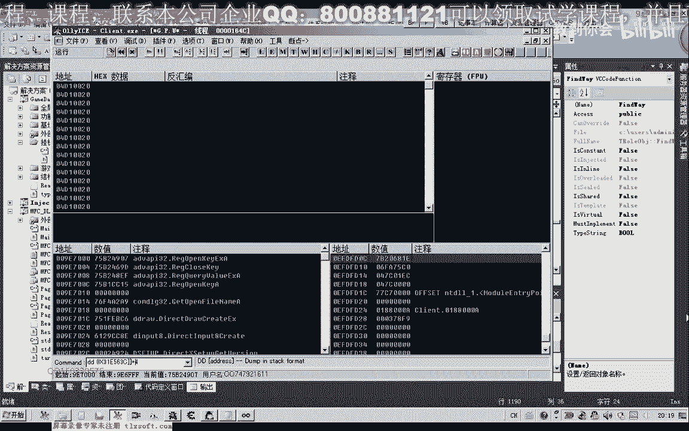
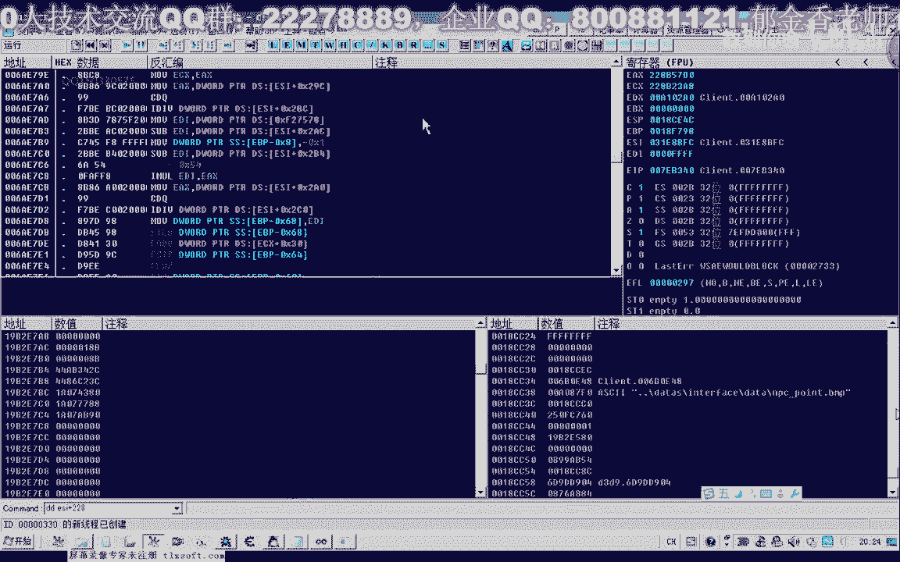
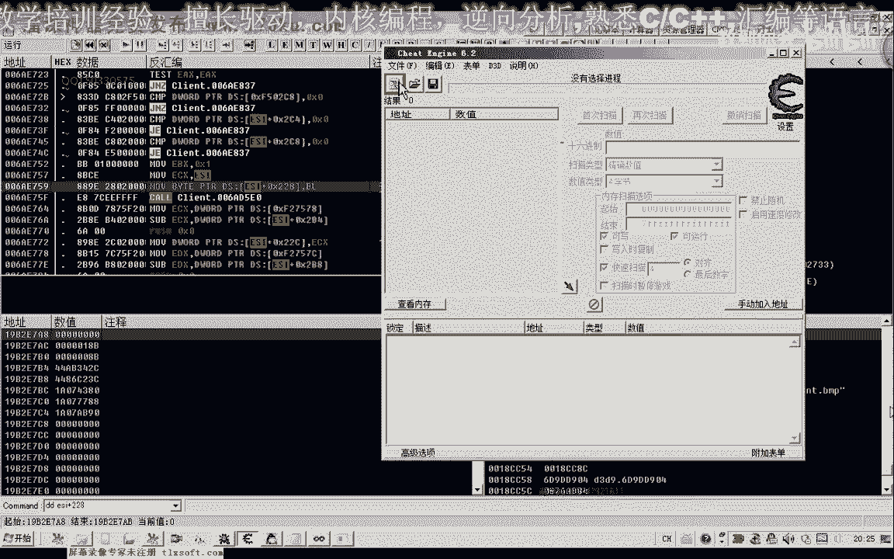
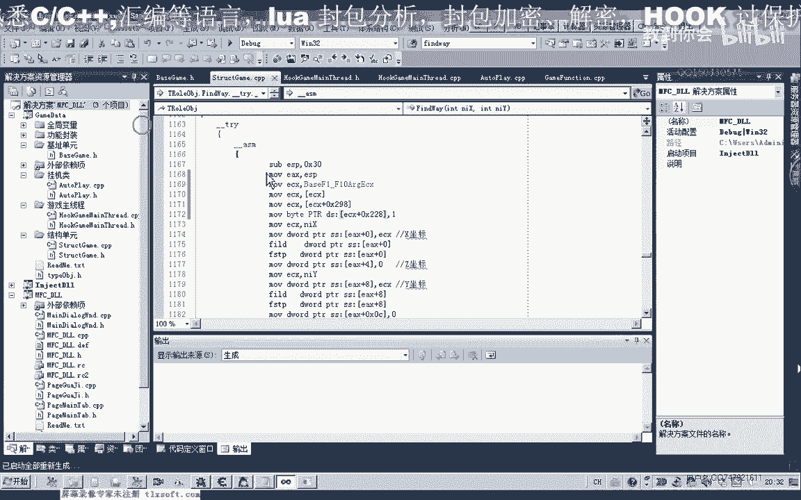

# P92：103-解决寻路问题,完善回城补给功能GoToCityForSupply - 教到你会 - BV1DS4y1n7qF

大家好，我是郁金香老师，那么这节课呢，我们主要主要来解决这个寻路道的这个，函数的这个问题，那么上一节课我们在测试这个g啊，回城g的这个函数，go to s was plan，呃。

那么测试这个函数的时候呢，我们发现了它不能够到达我们的目的地，那么应该是这个寻路到的这个函数呢，出了相应的这个问题，那么我们先打开第102课的代码，我们先单独的测试一下这两个函数。

那么首先呢我们移到测试窗口上，添加一个按钮，那么另外呢添加两个坐标啊，我们看一下啊，通过这个寻路到，它能不能够到达我们的目的地坐标，然后在这里呢我们添加一个变量，整形或者是浮点型就可以。

然后在这里呢我们添加去录到的这个代码，首先把我们窗口的数据更新到我们，我们的变量里面，然后调用这个寻路道，那么这里的调试信息呢，我们也把它写详细一点啊，看是什么原因，它是由于这个距离呢，还是我们的坐标。

还是我们本身这个函数的呃，写写法有一些问题，那么我们把它相距的距离呢也打印出来，那么这是距离，那么还有还有两个坐标哈，我们看一下这两个坐标呢，当前的这两个坐标的话是佛点类型的，那么在这里的话。

我们需要用宝典类型呢来格式化，好的，那么我们先编译一下，那么在初始化的时候呢，我们看一下之前的这个平时指的坐标，我们把它调过来。

那么在这个位置呢，是这两个变量的x坐标和y坐标，的一个初始化，那么在这里呢我们写上它的值，797191，2737190，好的，我们再次编译一下，嗯调试查看啊，这个调试信息查看器，我们查看一下。

设置一下调试目录，首先我们挂接到主线层，然后呢我们点这个寻路道，我们先看一下它输出的一些信息，那么这个时候呢我们的距离在变化在变化，说明的话它在寻路，那么这个时候的话，我们的寻路呢它是成功的啊。

那么我们到游戏里面看一下，这个时候呢他跑到了平时直接个位置啊，那么我们在另外啊把它移动远一点，另外移动到一个位置的时候，等一会儿我们再来看，好的，那么这个时候呢我们让它停下来啊，停下来之后呢。

我们再次调用我们的寻路道，看一下它的一个流程，那么这个时候呢距离呢也在不断的减少，然后在这个地方的话应当是被卡住了，距离呢就没有减少，就没有检测了，一直被卡住，那么我们来看一下呃游戏当中的一个情况。

那么这里也有一个障碍物啊，它被这个障碍物呢给卡住掉了哈，卡掉了，那么这个时候呢一直处在这个循环当中啊，所以说这里呢嗯这个我们的测试窗口呢，它也被嗯也停止这个响应了，因为一直处在这个循环当中的。

它才会吐出来，我们来看一下，啊这个时候呢寻路失败哈，要60秒之后呢，他才会退出来，好的，那么我们先把这个代码呢取消掉啊，现在叫掉这个主线程，然后退出嗯，那么这个时候呢，我们在测试这个扩的时候呢。

我们发现这个小地图上，它没有显示这个路径，那么我们想办法把这个路径呢，也就是这个红色的这个小点呢，把它显示出来，那么这个小小点的话应该是有一个标记，可能就在这个寻路货的这个附近，嗯，那么我们用og呢啊。

附加一下。

先找找一下这个红色的小点呢，这个坐标啊，路径的啊，帮助我们分析，那么我们首先看一下它的这个呃，就是我们的这个安全路径，对不对，那么我们先找到这个屏幕的库，这个位置，搜索一下。

那么我们看一下这个扩的地址的话，它是通过我们的人物角色来计算出来的啊，取两次，然后再加上一个偏移四，那么我们看一下这是人物角色的机制，再按ctrl减号哈，退回来。

前四这个位置，那么也就是这个括，我们在反馈汇编窗口里边跟随，也就是转到这个地址，然后我们在这里下断，但是呢这个库来调用的地方呢非常的多，下段之后呢。

他马上就会断下，嗯所以说这个时候呢，我们需要下一个条件断点，那么我们看一下它的一个断下的一个条件。

我们就根据这两个参数来，那么这个参数的话是e s p加四这个地方，而这个猜出来e s p加八，那么这里呢是usp加0c，那么我们就在这两个位置了，下一个条件断点，那么下最终的结果呢就是e s p加四。

要等于我们的1x31 f，那么并且呢另外一个条件也要达成，usp加零碎，这里要等于我们的x54 ，好的，我们把这个条件的复制一下，然后呢我们再次啊点这个小地图，那么这个时候呢。

我们会调用这个相应的寻路控，我们从这里返回，那么这里的话应该就是在这个寻路廓里边，啊，啊临近的这个地方，我们三in f这里啊，那么我们在这里下一个断点，那么这里下断点的话，就能够保证它不会反复的被断下。

但是呢我们在寻路的时候呢，它会断下，那么在这里边我们在它的前面来找一下，有没有这样的一个标志啊，呃也就是写了这个一般这种标志的话是呃，零或者是一这一类的，或者是其他的调用或啊这一类的，也有可能。

我们仔细的找一下，那么找的话我们找一下目录指令，注意一下写入的像某个机子里面写入的，那么这里呢都是读取数据啊，这一段这里有一个写入的，但是呢呃这一类写入的话，它是一个局部的一个变量啊。

我们不管它再往前面来看啊，这里也是一个局部的变量，这次读取读取，那么只有这个地方呢写入的写入的地方呢，我们给他标记一下，等会我们来查看，还有这个地方呢它也写入了数据，啊这里是读取的啊，另外呢这个地方。

那么这里有代码呢也是写了一个字节的，那么像这种一个字节的话，可能它的可能性要大一些，因为我们零和一的话，他用一个字节来表示就够了啊，而且这里的话有一个目录啊，1b x为一。

那么也就是说我们的b l的它为一了啊，这个地方的话，那么我们首先来测试一下这个地方，那么再让它跑起来，那么进入到游戏里面，我们来看一下呃，首先查一下，现在e s i加上228这个位置的数值。

那么现在是零，那么下面呢就是我们的寻路扩啊，在寻路的过程当中呢，它马上就会值一了啊，这个市场我们可以看到啊，这个时候寻路的一个变化，它被质疑，那么在寻路过程当中呢，这个地方呢可能都是一。

但是他马上就到达这个地方，那么我们再来看一下看，由于我们把这个群众，那么我们先来测试一下，我们可以这样测试，在这里呢我们弄不掉这一句，那么local这一句的话，也就是说，他不会往我们这个地址里面写入一。

那么也就是说我们巡逻的时候的话，如果是正确的话，那么这个时候呢我们的这个红色的小点，这个路径的话就不会在小地图上显示，那么我们再把下边的断点取消掉，那么这个时候我们来看一下，这个时候呢。

小小地图上的这个安全路径呢就没有了啊，好的我们把这个弄出来恢复恢复一下，那么说明这个地方的话，就是我们的安全路径，或者叫安全路线啊，嗯嗯，好的我们把这一段复制一下，做一个特制码，这里是寻路。

哈哈那么理论上来说的话，这一段的话都与我们的寻路相关的。

那么前面这两个扩呢，可能也有一些相关的功能，但我们只要这些关键的这些数据，那么呃得到了这个安全路线的这个呃，标记之后呢，我们还需要来对es si这个数字来进行查找，找一下它的一个机制的一个来源。

那么我们最方便的话还是用我们的c来讲，这个数据。

那么我们再次在这个地方断下，或者我们往前找一下呃，有没有看一下这个e si的来源，如果用o d找不到的话，我们再用c一来找，那么我们看一下前边有没有对yes si，这个数据进行显著的。

我们发现了它来源于e c x，那么再往上找一下来源于e s i，那么再往前走，它又来源于上一次的那e4 x，那么我们再往前走，那么这里呢他再一次的这个1e x呢，来源于我们上一层的这个参数。

这个地方我们可以看到，那么再从这里来访问，那么返回的话也就是这个ex，那么这个一二来来源于e s i，那么这里的话，我们就找到这个所有对象里面去了啊，呃31416640，这个的话应该是我们的所有对象。

找到这个对象数组里面去了啊，所以说这样的话我们找不到啊，通过我们这个o d的方法的话，就找到这个要需要去骗你这个对象，我们才能够获得，还要做一些属性的判断，那么我们通过c一来找一下，看有没有呃。

其他地方保存了这个机制，那么按减号退回一步，在这里下一个断点，好再让它断向，那么我们看一下现在e si的这个数值，我们把它复制出来，看一下另外的地方有没有保存，我们的所要的这个机子。

那么这个呢就是我们刚才所找到的，应该是所有对象数组的地方，我们可以尝试一下，搜一下这个3116670，3116670，那么当然这个时候呢我们找不到啊，那么找不到的话，说明的话。

这个呢不是我们所要的真实的一个机制，那么我们直接从后边的这些数字里面来找，那么这个地方呢，我们可以先对它下一个断点，看一下有什么地方呢对它进行了访问的，我找到另外的一个偏移，那么这个时候呢我们看一下啊。

他在这个位置呢会断一下，我们再把ea x的数值呢复制出来，那么这个时候呢我们找到第二个偏移，就是298，这个偏移，好298啊，这里有一个，好的，那么我们把这个偏移了删掉，这里298，那么在这里的话。

我们实际上我们就找到了他的一个机制，e4 x呢，它来源于我们的f8840 这个地方，可这下面的是e4 x加上298啊，在这个地方断一下，好的我们注释一下啊，而且这个机子的话我们应当也有录像啊。

把他先让他跑起来。

这个58840的话，我们看在这个起始单元里面有没有这里啊，这里也就是我们的f一到f 10的这个call的，一个e c x的一个这个参数，快捷栏的时候呢，要传递的这个参数呢，就是这个机制，好的。

那么我们把这个机子呢，添加到我们的寻路库里面啊，就也就是说把这个安全的路线呢，标记出来了，他的一个路径啊，寻路的一个路径的标示出来，那么再次转到我们的许诺库里，嗯嗯，嗯，那么在这个位置呢。

我们应当向他写入这个数字一啊，只切如一字节就可以了。

好的，那么我们再移到游戏里面看一下，现在我们群众回去，那么我们可以看到它标记的路径的话，应当是正确的，这个时候我们看一下调试信息，在这里的话，那这个能够移动的距离大概是十啊，距离是大概是10左右，分数。

那么这个时候呢没有被卡住哈，继续的在移动，让它让它跑快一点，那么现在的话我们可以看到它也可以呃，移动到这个地方，但是有可能呢也也会被卡住，那么我们再来看一下我们的询问，那么像这这一类的话。

需要很多的时间呢去做这个测试好的，那么我们再次调用这个，再次调用这个寻路的空啊来进行测试，再来看一下我们的调试信息，那么这个时候呢再次被卡住了哈，再次被卡在了这个地方啊，说明这个地方呢它总容易被卡住。

距离还有37的时候，我们看一下，那么这里呢也有一个障碍物呢，把它挡住了啊，所以呢所以说这卡在了这个地方，那么像这种问题的话，我们呢嗯可以了，呃一个是可以用穿墙的功能来解决，第二个我们可以试一下嗯。

可以试一下，把这个函数来单独的来测试一下哈，有可能是我们这个函数封装的一个，写法的问题，那么也可能是我们的这个寻路的这个过程，它本身就有可能被卡住，好的我们再次单独的测一下，现在卸载掉我们的主线程。

再添加一个按钮，嗯，那么这个海这个按钮里边呢，我们直接调用这个寻路的函数，那么我们看一下，直接调用这个屏幕的函数会不会被卡住。

我们看一下我们的这个动态链接库来，这个时候我们又可以卸载干净，再重新把它卸载一下，好的，那么我们再次输入，那么这个时候呢我们再次来挂接主线层，来看一下我们的调试信息嗯，看一下直接调用寻路。

那么这个时候呢直接调用群众之后呢，我们这里有没有这个调试信息的输出呢，这里看不到结果，我们只有进游戏里边点查看，同样的被卡在了这里，那么如果我们站在这个地方的话，我们再来测试一下嗯。

也写上我们相应的这个调试信息，这里的话我们写这个调试信息的，不是很方便，要这个寻路到了，在这个循环里面呢，我们才才能够输出这种信息，那么在这里的话，我们最多呢能够输出一个坐标。

不能够检测它当前的一个距离啊，因为没有这个循环，那我们直接来直接在这里边测试查看，那么我们记住这个位置，看我们直接调用调用这个寻路道，会不会被卡住，那么寻路到的时候呢，在这个地方呢被卡住了。

那么被卡住之后的话，它只能够等待这个，卡住的这个时间到了之后呢，它有一个相应的一个提示，那么这个时间呢我们为了方便测试呢，我们现在把它改小一点，再看一下啊，60秒哈，还要等十多秒。

好那么这个时候他退出来了，我再重新退出一下，那么为了方便测试呢，我们这里呢只等待20年，那么现在我们要做的测试呢，是直接我们调用这个群众的货，看它嗯，也就是不用这个循用到的这个循环，看会不会被卡住。

那么我们再次走到这个位置，这个位置，然后我们点寻路，那么这个时候呢，它也会有一个安全的一个坐标记出来，然后呢他能够直接跑到这个位置，那么我们这个时候呢，我们再用寻路道在同一个位置做测试。

那么用寻路到的时候呢，我们发现了它卡在了这个位置，如果我们在这个地方用寻路的话，他不会啊又被卡住了，像这种情况被卡住的话，可也有可能是，我们多次调用这个屏幕的问题，群众示范退出。

那么我们再次把这个寻路的这个扩呢，把它移到这个外边来进行一个判断啊，那么只调用一次，不去循环的调用啊，我们再来做测试，卸载掉主线层，好再次测试，挂机到主线程，然后呢我们同样的跑在上一个地方啊。

这个地方呢上次被卡住了，那么我们再次用全力道来看一下，他绕了一个大弯子啊，最后到达了这个地方，那么可能是与我们多次调用，这个寻路的问题，如果是在这个循环里面的话，在这个位置位置呢，它就容易被卡住一点啊。

那么这样写的话，那就，容易被卡住，当然最终我们要解决问题的话，我们还是应当然，也就是说去掉这个障碍物啊，能够穿墙穿，穿过，穿透这这些障碍物的这个功能，分析出来的话，这个问题呢就能够彻底的解决，好的。

那么我们就是，就是说呃目前的这个测试的话，嗯就到这里，那么我们再把这个相应的功能呢，啊回城补给的这个功能来进行一下测试，看一下自动自动玩的这个单元哈，工程补剂，那么我们看一下现在的初始值是多少。

那么现在的话是不是要求是低于，390的时候呢，回城补给我们看一下里面的数值，那么现在的话加起来呢一共是400啊，400，那么我们另外找一个地方，去城外，把它慢慢到了城外之后呢。

我们在这里呢选择啊显示外挂，获取当前的一个坐标，在这里呢我们实实行这个挂机，然后呢我们再把相应的这个药品呢，让它低于这个390这个数值，那么这个时候的话我们发现的话，它会执行这个相应的这个寻路。

但是我们发现的话，它寻路呢呃也不能够到达这个目的地，那么许诺中，那么你在一个位置应当是被卡住了，310这个位置，当前坐标，但是这个目的地的坐标不对，我们可以看一下，这里的话它传入的坐标的话。

我们当时1399212嗯，那这个才是我们的目的地坐标，那么这个时候呢，他他写的这个目的地坐标呢呃是错的啊，所以说呢他不能就够这个笔记啊，我们从这里可以看出，那么我们卸载掉我们的主线程。

那么也就是说我们传入的坐标实际上错了，那么我们再来看一下我们的回城补给单元，但是我们这里的话应当是写的这个坐标啊，他应该是执行到到了这个地方，这里应该是返回我们的这个坐标地址。

我们再来看一下这个寻路到白云，因为20秒的这个距离，这个时间太短了哈，因为这个时候呢，我们是这里我们应当设置大一点这个数值，那么我们重新把，这个外挂啊，现在这样重新编译一下。

好那么我们这个时候来挂件属性值，显示外挂获取当前的坐标啊，然后呢我们开启我们的调试器，来查看一下应用设置，开始挂机，那么这个时候呢，我们发现了，他没有开始这个进行相应的一个群众，看一下吧。

这个时候呢他直接在打坏，那我们再来看一下，那么应当是这个判断的条件哈，可能是出了问题，按ctrl减号退回来，那么这里呢我们是条件不成立的时候呢，就返回，那么如果这里是返回的，是真的话。

那么在后面的数字呢才会被执行，我们再看一下，这是我们药品的一个总量，它小于这个指定的数值的时候，它的一个初始号，我们去看一下最小的这个数值，那么这里是390，再来看一下，这个时候呢它运行了一段时间之后。

好像是检测到了，那么我们看一下购买的这个药品，有没有成功，63个，65个恰好是390个，这是什么，因为它是低于这个数值，他应该是这个时候呢去选择了这个打官，在巡逻的时候呢，他就选择了一个npc啊。

所以说这个时候呢他被卡住了，因为呢他这个把这个npc当成，当成一个是怪物去的，上传了这个相应的怪物，那么我们先停止挂机，再来看一下，那么在在这里边的话，我们还应该呢，呃也就是说呢。

把他的这个选择的怪物人应该取消掉啊，不然的话这个技能的话，它在自动的放这个技能，所以说呢他要去打这个周围的这个怪物啊，那么在这里呢，我们首先呢是应该停止打怪啊，停止这个释放技能。

所以说在这个为什么补剂里面的话，如果条件成立了，我们还需要做一件事啊，也就是在进行寻路之前，我们还要就是说嗯选中怪物，这里呢要做一些，停止，旋转或者是清除首选怪物，那么我们看一下这里嗯。

打怪里面的话应该有一个选怪的，我们转转进去看一下，那么我们看一下选怪里面的选择怪物，那么这里呢选的是对象，那么这个时候的话，我们实际上是要去除这个选中的这个对象，那么我们需要来另外写一个函数啊。

在这里面，好的，那么我们在前面呢，需要先定义一下这个变量，word，那么现在我们把它复制为空，那么这个数值呢，我们再把它添加到这个日常处理里面的，好的，那么我们再次编译一下嗯。

这里呢我们需要添加一个头文件的一个说，明，还需要，那么这个是在人物角色里面，这里我们写错了，嗯嗯，好的，那么我们再次进行测试，那么化解主线层显示外挂呢，获取当前当前坐标，选一个有怪的地方，好。

那么这个时候呢，我们再一次打开我们的信息调试器啊，查看器，然后呢开始挂机，我们再看一下，那么这个时候呢没有被卡住，我们看这里的距离呢不断的在减少，这个是我们的目的地坐标哈，也是对的啊。

737要求平时几个坐标，那么这个时候呢我们，没有成功，那么这个时候可能已经买好了这个药品，那么我们可以到游戏里面来看一下，那么这里的话买了11个金创药小啊，那么好了之后呢。

又返回到我们的目的地进行这个挂机打怪，那么目前的测试的话应当是成功的啊，但是呢还有一些错误啊，这个时候呢他没有打怪，这个时候到了我们的目的地坐标之后，可能是离这个npc的距离太近了。

他把这个npc当成了这个怪物，所以说我们下一节课呢，我们还要写一个打怪的时候，我们要对mtc来进行一个判断，好的那么这个bug我们在下一节课再解决，这节课呢我们暂时就到这里，那么大家下去之后呢。

也可以尝试一下啊，解决这个bug，也就是我们在打怪里边呢，要加上一个怪物的npc的一个判断，那么如果是npc的话，我们就把它过滤掉啊，那么再加一个坐垫，打怪做那个pc好的，那么这节课呢我们就到这里。

