# 郁金香老师C／C++纯干货 - P94：105-获取商店列表基址GetShopListBase - 教到你会 - BV1DS4y1n7qF

大家好，我是郁金香老师，那么这节课呢我们主要的呃来看一下我们啊商店列表的一个更新，呃，主要我们是用来获得某一个物品的一个呃对象的一个id啊，我们再来看一下104克里面的一个代码。

那么在我们结构单元里面的一个函数，哎，那么也就是在这个商店列表里面呢，我们要查询这个物品啊，要来查询这个物品栏是否存在，然后再返回它的一个呃，具体的一个，那么我们再来看一下对于这个函数的一个调用。

在购买物品的时候啊，在这里呢它需要的一些呃数值。

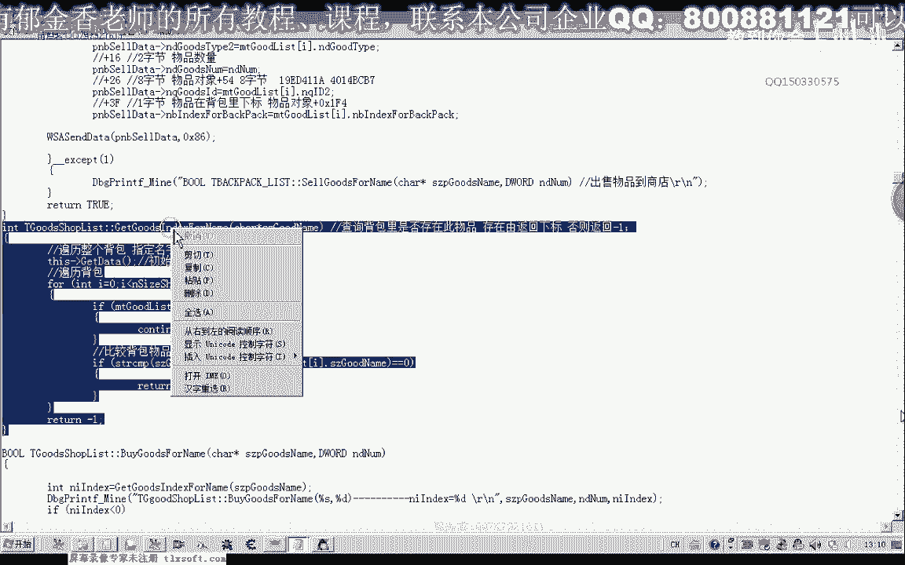

那么现在我们要做的呢也就是要嗯找到一种方式哈，就是说要获得一个准确的这个这前面的这一段啊，也就是我们的呃商店的一个列表的一个机制，但是我们上一节课通过这个公式来计算的话，他有时候呢会偏离不出来哈。

这个相应的机制它会偏离出来的这个数据来是为为零的啊，那么我们先看一下这个公式。

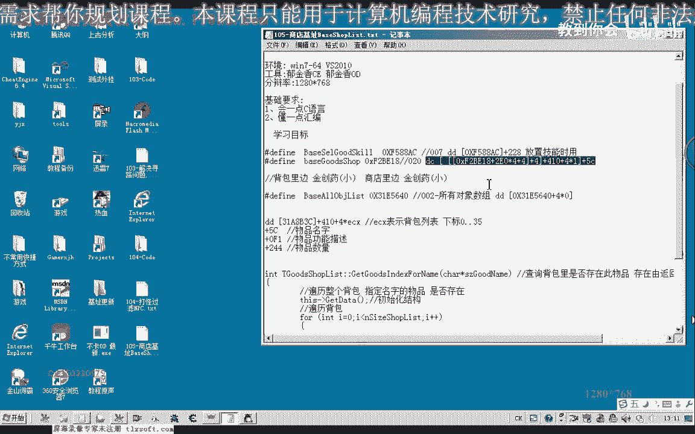

继续，那么当时这个时候我们用这个公式呢，它又可以了，那么上一节课的话，我们用这个公司呢，它不能够偏离出来，那么首先呢我们来看一下它的一些属性。

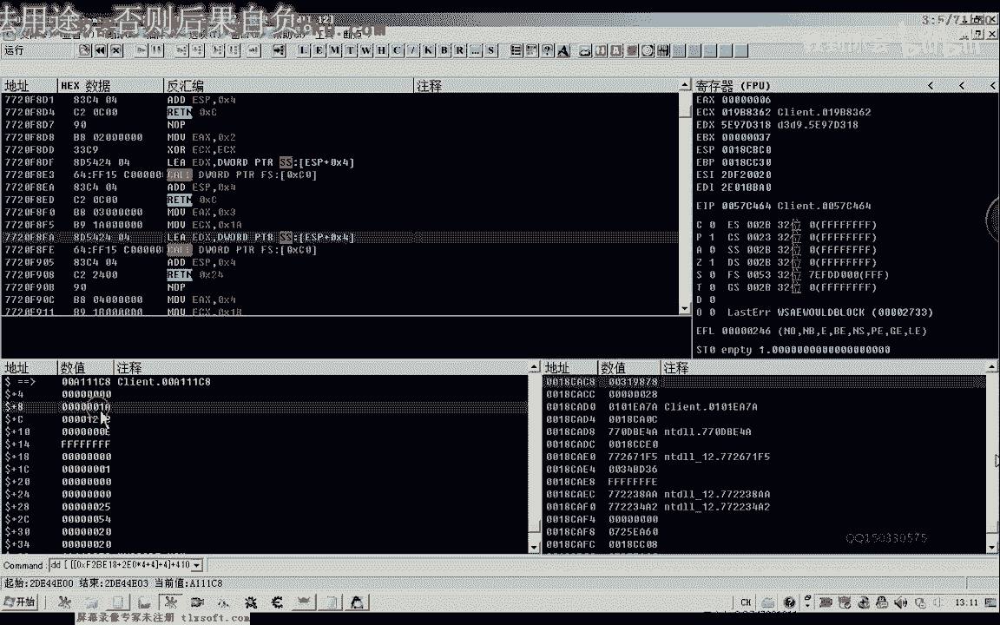

把它做一下记录，那么首先呢我们来看一下呃，他是怎么把我们在前面的这一段人嗯，怎么把它计算出来的啊，那么我们把这整个数据哈复制一下。

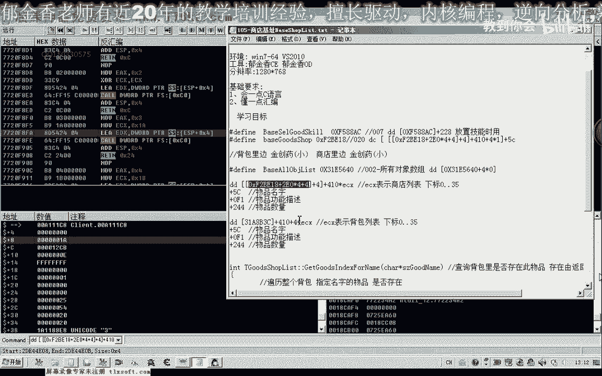

那么它最终的话计算的实际上是这个位置呢，是我们的一个相对的一个机制。

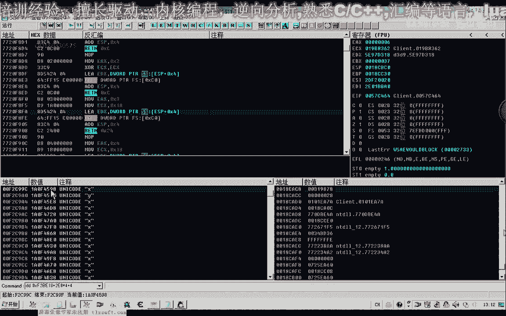

那么通过这个地址的话，加上一个我们后边的一个412，加上一个四啊，再加上我们的410，这样呢组成了组成我们的这个商店列表的一个公式。

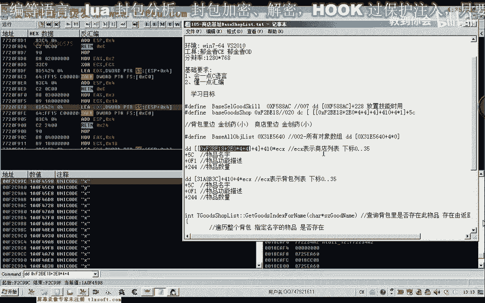

那么我们来查找一下对这个地方来进行访问的一个数字，那么我们看一下现在一si的这个数字，也就是我们的f299 c啊，那在这里呢它通过了一个循环的来骗你，最终的这个e si的词呢，它不断的在这里。

它会不断的进行啊相加啊，相当于是在偏离这个数组，那么这个数组的大小呢可能就是这个0x1900 这么大，那我们再看另外一个地方，这个地方的话，因为它没有一些条件的一些判断，嗯加油，那么一个是分析这个代码。

从这个代码来看的话，它里面也没有一些就是说cao啊这样的一些的指令啊，最终把它取出来嗯，那么我们再来看一下，就是我们把先把这个商店来关掉，然后看一下他什么时候呢对我们里边的这个数字啊进行了访问。

嗯也就是这个数字，假设这个位置呢，因为这个数字它最终呢加上了410，我们看它是什么时候把它取出来的，在这里我们添加一个内存访问的断点，这里有个comple，那么这个时候我们先把它退出来。

先用c一来找一下，那么我们要找的话，应当是在我们打开商店的时候，他来访问的这个数字才对啊，那么我们先把这个数字来取出来，那么因为是这个数值，它加上410，这个偏移，然后加上了四乘以我们的下标。

这个地方呢就是我们的商店里的物品。

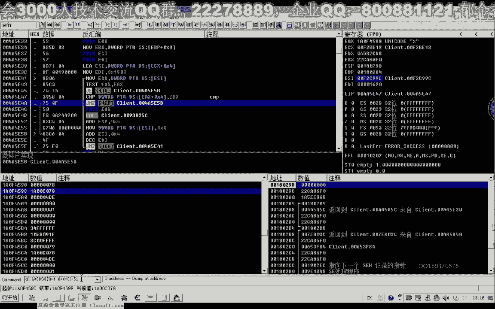

那么所以说我们现在呢需要找这个对象的一个来源，当然，那么我们主要是找一些条件看它是怎么判断啊，怎么把这个数字来取出来的啊，我们因为这个公司的话，之前呢实际上我们已经做过相应的这个分析了。

因为这个这个公司呢它不是很靠谱啊，嗯那么我们先用c要先把o d来退出来，先用c e来尝试一下，当然在这个所有对象列表里面呢，它也存在这个对象，实际上我们也可以偏离这个列表呃，来实现啊。

也就是我们最新的这个所有对象机制的话，也就是这个数值了640这个数字，但是呢我们如果是要偏偏离这个对象列表来实现的话，我们就需要了他的一些属性来做判断啊，当然我们先试一下其他的地方能不能够找到。

那么这里有很多的列表，我们先看一下，那么我们打开商店的时候啊，那么打开商店的时候没有访问的话，这个地方呢它是有访问的，有一个比较的一个指令，那么我们再看一下。

但是这个时候呢它不是在我们打开商店的时候访问题，那么这个地址的话，我们可以把它删除掉，好我们先把这里面所有的地址来都添加进来，那么这个地方的话也是呢我们看一下，也是在我们打开商店的时候，他们有这个反应。

应当来说的话，我们打开商店的时候呢，它会去访问这个地方，而且只访问一次啊，那么所以说这个地址的话也不是的，我们再继续找一下，那么而且好像每个代码都是在这个地址进行的访问，我们先把它复制下来。

再打开一下商店，那么这里呢他没有这个技术呢，它没有马上增加，所以说这个的话可能性也比较小，那么也删掉，那我再继续下一个地址，那么都是同一个地方在这里访问的，我们看有没有其他的地方就给它删掉。

那么这个的话根本就没有反应啊，最后呢他也是转到了这个地方，那么继续看一下下边，那么这个呢也删掉，删掉，那我们找一下后面的这些数字来看一下，那么这个的话看着的话可能有点像打开的一瞬间的话。

很多地方都访问到这个地址，但是呢他访问的次数比较多啊，有一个22c的这样一个，这样的一个地址e d i，那我们看一下现在e d i的数值是多少，又是另外一个数值，那么我们先把这个数字来啊，复制一下。

等会可能可能能够用得上，好的把这个删掉，然后呢再对这个地方呢下一个断点，然后再打开我们的商店，但是呢这里呢没有反应，也就是说没有访问到这个地方删掉，那么这里呢我们，打开商店啊，那么从这里来看的话。

这个呢可能是我们所有对象列表里面的这个数据，他在不停地在偏离这个地方，那么这个呢也删掉，那么再来看一下这个这个对象列表啊，这个对象那么同样的是断在了同一个地方去比较，那么我们就把它关掉，那我随便选一个。

再看一下吧，这个呢没有反应，怎么删掉，这个访问的地方过多哈，我们也把它删掉，这个是断在了同一个地址，我们之前啊分析的很多很多的数据呢都断在一个相同的代码，那么在这一大片我们看到它断的了。

都是在626a39 这个位置啊，那么这这种的话可能我们看一下这些，其实地址呢也都差不多，那么可能能够分析出其他机子我偏移的可能性呢也是比较小的，那么我们先尝试一下刚才这个可能性较大的这一个。

那么我们看一下它的e d i的数值是多少，那么我们来搜一下这个对象，看能不能够找到另外一个机制或偏移指向我们的这个商店列表，311，那么我们看一下311开始，那么311开始的应该是所有对象数组。

那么所以说这个呢机子呢我们又不用考虑，而一七开始的呢是我们的堆栈里面的一个数据，从这里呢我们也不需要考虑，那么我们来看一下后面的这一串数字，看能不能找到另外的机子，好的我们打开一下商店列表。

那么这个时候呢我们从第一个来这里能够找到一个二八的一个偏移，那么我们也把它做出来，那么同样的一dx的数字呢，我们需要复制出来，那么我们继续从这里找吧，之前是e d i。

我们需要这里可以看到这个e s p e bp开始是从一七开始的，所以说刚才的这两个数据呢，我们不需要，然后关掉我们的商店，那么这个数据呢可能是一个比较重要的数据。

然后呢我们再从一dx看能不能够找到对它进行访问，那么这个时候呢也是有一个311开始问的，那么这里我们取名为一，或者说我们以他之前的一个偏移来一名，也就是22c的这个偏移啊，找到了e d i的一个数字。

那么我们这里呢因为2c，好那么这些新的对象呢，我们再次给它添加进来，那么这些对象呢也比较多啊，然后我们再找一下对这个对象的一个访问，打开一下商店，那么没有访问的呢，我们先做一个标记。

那么我们每一段地址呢，我们都可以做一个标记，进行一下尝试，你看一下它的，dx，那么这个呢又跑到了另外的一个数组里面去啊，这样找的话也比较复杂哈，那么我们再找一下其他的也没有，简单一点的。

能不能够直接找出这个偏移的，那么这一串的地址呢都是从1a开始的，我们找一个不同的它的可能性呢可能要大一些，啊这里呢又跑到了我们的66a39 这个对象里面去了，再看一下这个地方。

那么全部都跑到了这个循环里面去啊，那么所以说我们用这种查找机制的办法的话，可能呢就除了我们之前这里分析的这个机制，可能还有一些作用之外，也就是我们的之前分析的这个机制了，有一些作用之外呢。

那么现在的这个呢可能它没有太大的一个作用，那么所以说的话我们得另外想办办法来获得这个商店对象的这个机制，也就是我们的1030，这个78这个数字，好的，这个是时候呢游戏呢它被卡掉了啊，死掉了。

那么我们重新打开一下游戏。

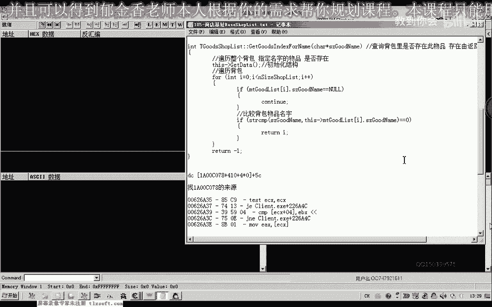

那么重新打开游戏之后呢，我们用d来附加到游戏里面。

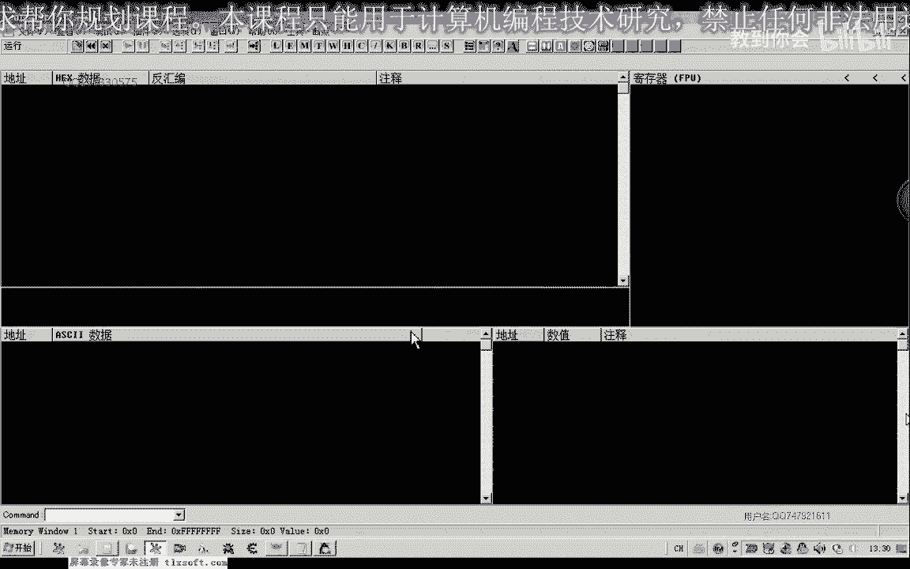

那么既然我们不能够直接找到这个偏移呃，我这个机子的话，那么我们可以通过它现有的这个列表呢，可以进行一个偏离，但是要加上某一些条件的一个判断来判断它，就是我们的这个相应的一个机制。

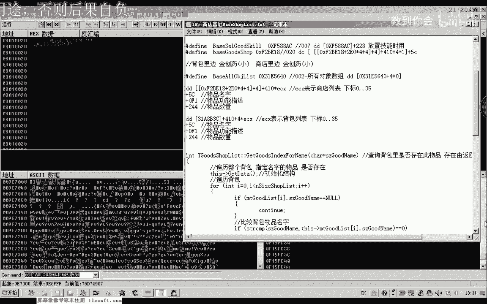

那么我们再次打开我们的商店列表。

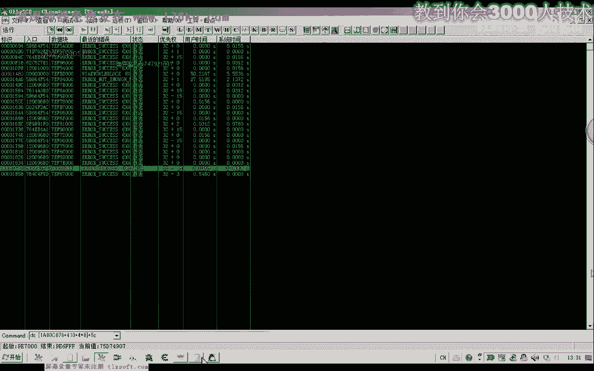

来看一下我们的这个公式。

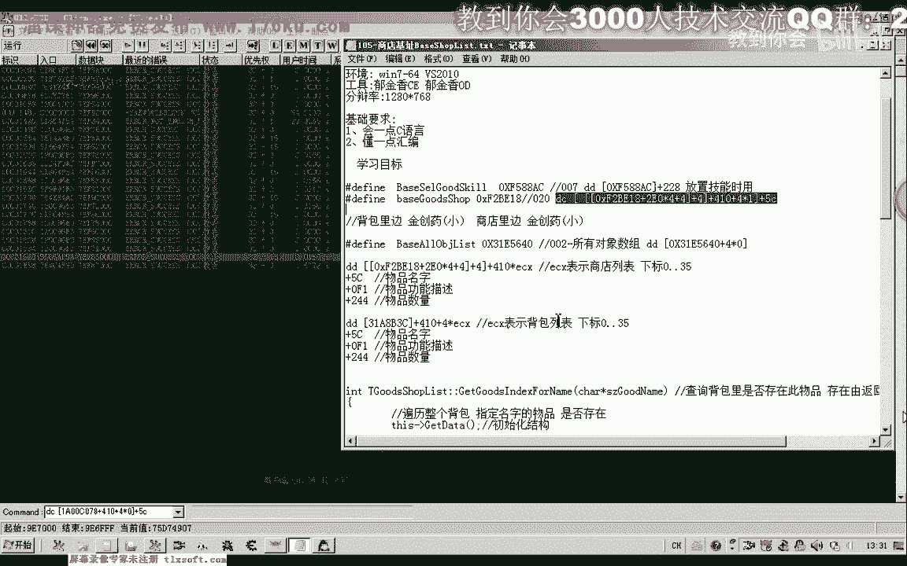

那当然这个时候呢它又可以用啊，嗯那么可以用的时候呢，我们就直接用这个公式，那么如果如果这个公式它在嗯在偏离出错的时候呢，我们另外再准备一个预备的一个方案，那么我们可以这样做哈。

可以来直接的从这个下标来开始进行一个偏离，那么偏离了我们需要一些条件，那么它的条件呢我们可以这样来判断，比如说这个商店里面的第一个是这个精通要小，那么我们就来看一下它能不能够取出第一个物品。

那么第一个物品是不是我们的精创要小啊，可以做这一类的一个判断，那么或者我们可以通过呃，因为不同的npc的话，可能它出色的在第一个商店里面的这个商品呢，它可能不一样，比如说换一个n p c。

他可能第一个药品呢不是青春要小，那么我们还可以通过他的一个嗯类型来做一个判断，也就是说不是五色的这个偏移，我们看一下它其它的一个偏移，那么我们可以通过加八这个啊它的一个类型要判断呢。

它是1a1 a1 a呢代表它是一个嗯物品，加零八这个偏移我们进行判断，那么在这里判断呢，我们就需要判断它是否这个数值呢，是不是等于0x1 a那么如果是商店里面的物品的话，那么这里呢他是。

因为那么我们看一下，如果是背包里边的话，它会是什么情况，我们也可以看一下，two two two two two。

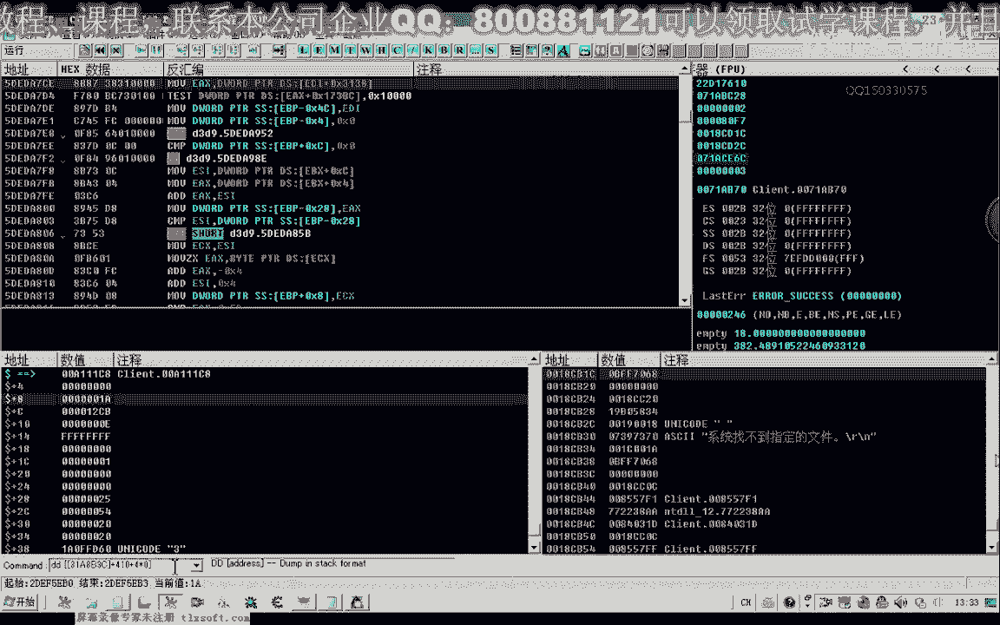

那么我们再来看一下背包里面的一个最新的一个机制。

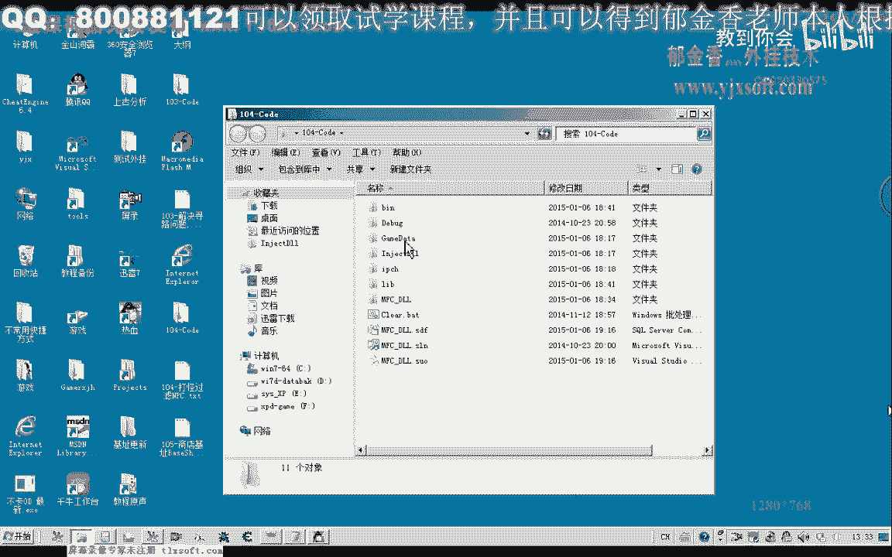

嗯，那么我们发现了这个地方呢，它也会是1a啊，那么我们来找一下他们之间有没有一些区别啊，这个背包里面的，我们把这个金创药小也放到第一个，看起相同的物品之间，他们有没有什么区别，这两个都是轻松要想。

那么它有一个区别的话，我相信呢可能会在数量这个上边啊。

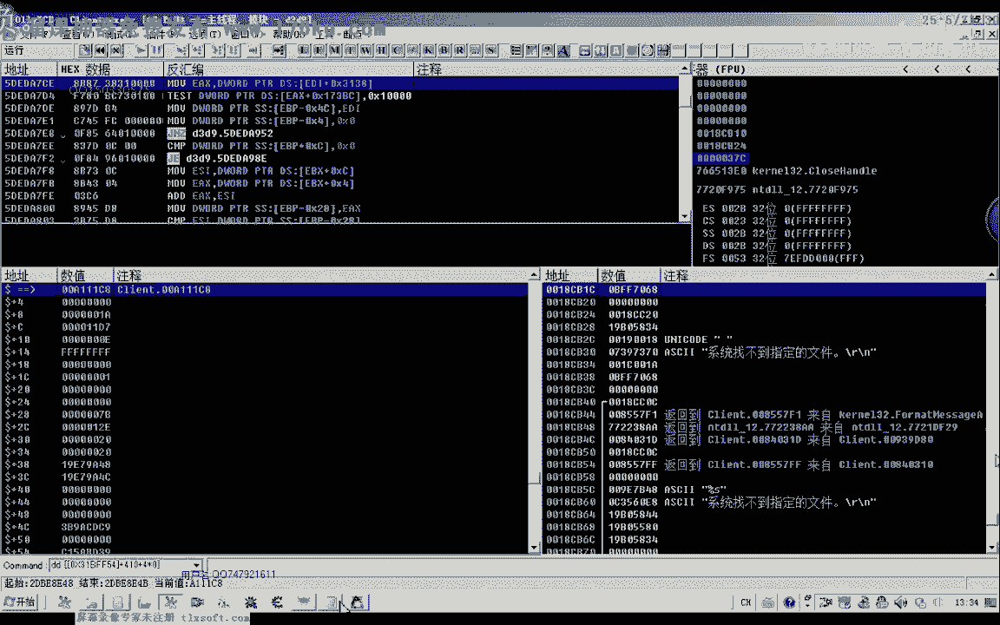

因为背包里面的这个数量的话，它肯定不一样，那么我们看一下244这个地方。

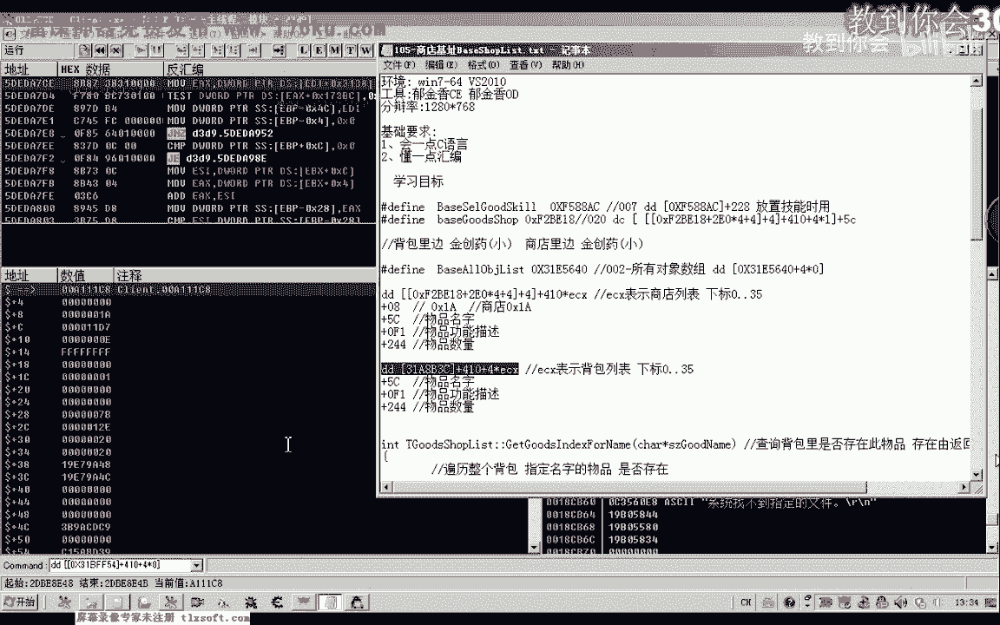

加240，这是背包里面的啊，现在好像是变成了444，那么这是金创药小，那么有59个它的一个数量。

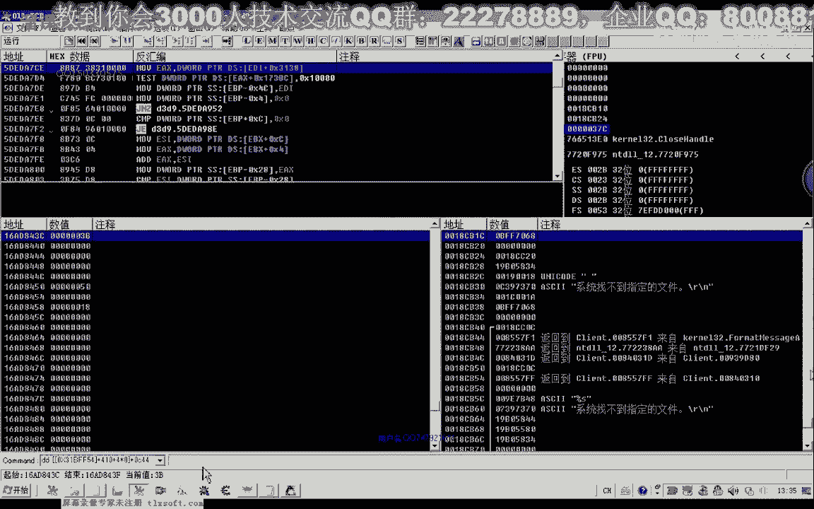

那么这里的变化了是c40 。

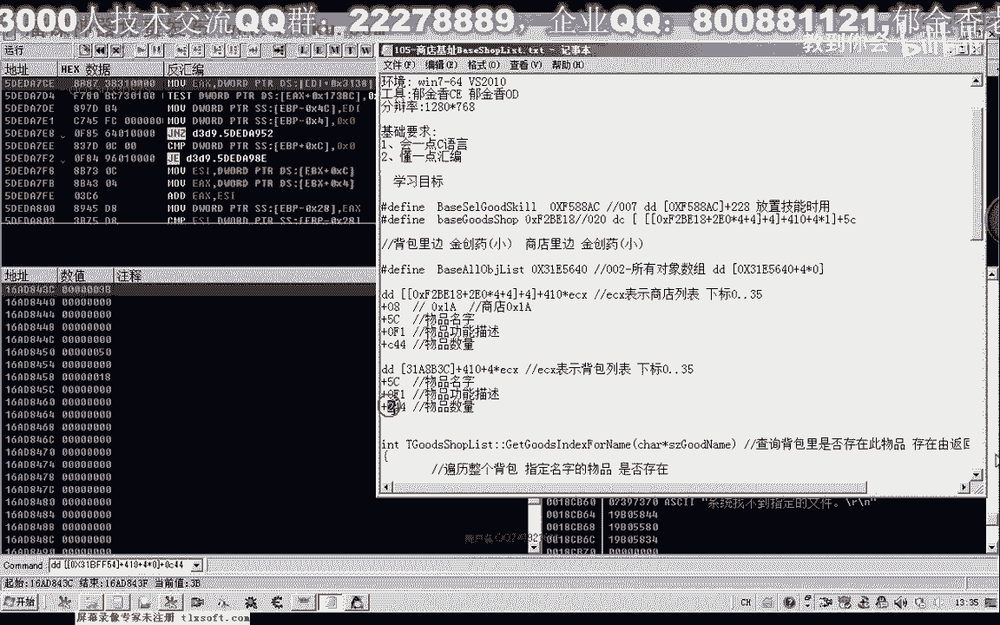

那么我们再来看一下，这里面的cs 4。

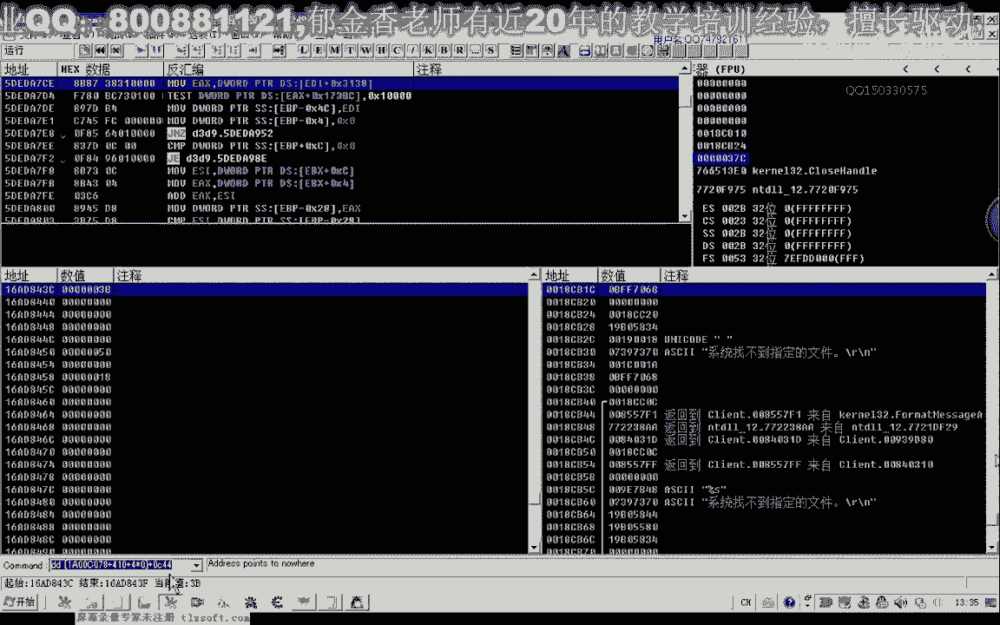

那么我们可以看到它这里的数量的话是f f啊，也就是-1，那么数量这里的话它不一样，那么我们在这里下一个断点，看看有没有相应的这个访问这一类，啊这里呢它也有一个cs 4，也有一个相应的一个判断。

证明他也是有这个偏移，有这个属性的，那么还他还有一个c48 ，这两个呢都为-1，那么我们可以做一个条件的一个判断。

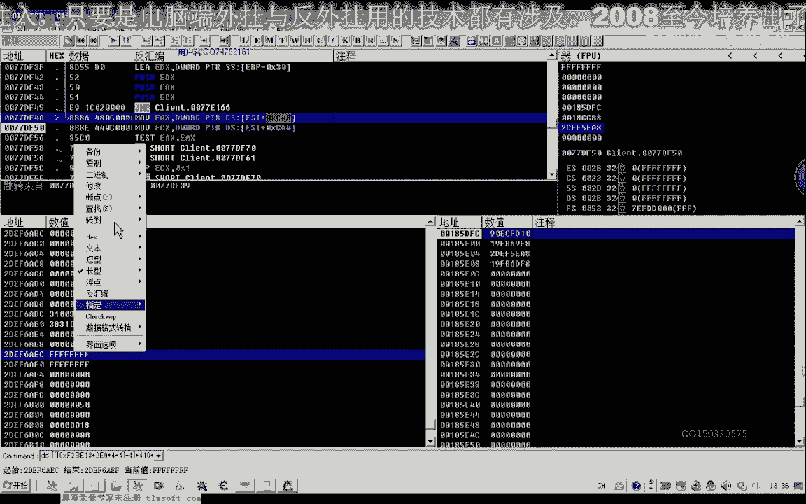

那么如果是商店的话，cs是这个来这里要点一，上面是38，也就是等于-1，还有48这个地方是为-1，那么我们可以就可以通过这前面的一个条件，这里来等于1a啊，这两个地方呢等于-1啊。

那么我们可以通过这两个数据来进行一些判断，当然另外的可能呢还有就是我们的一个所属的一个关系，这个对象的，那么这个需要大量的时间可能去分析一下，也就是说嗯可能还有另外的一个属性。

用来表示这个对象究竟是我们商店里面的，还是我们背包里边的，还是在我们地面上啊，它可能有一个相相关的一个标志来进行一个区别。

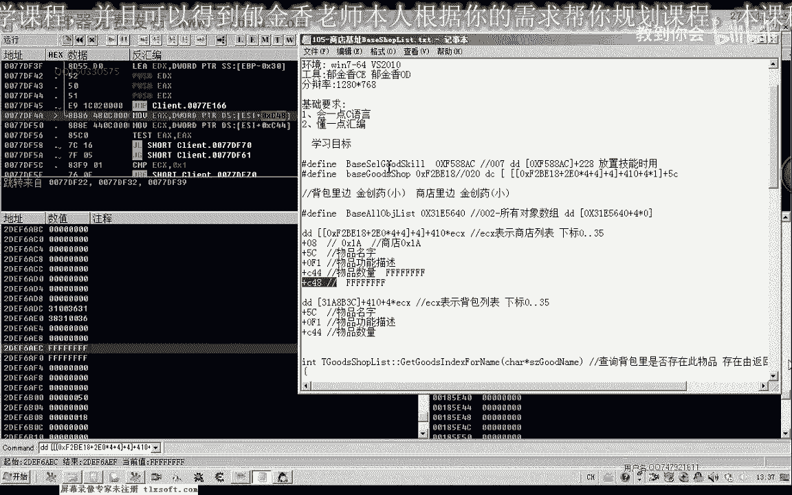

当然这个时候呢需要仔细地对这个属性呢去进行一个分析啊，比较才可以，那么我们通过现有的这些数据的话，也可以来我们进行一些区别，当然那么这一串里面呢我们还可以把它复制出来进行一下比较。

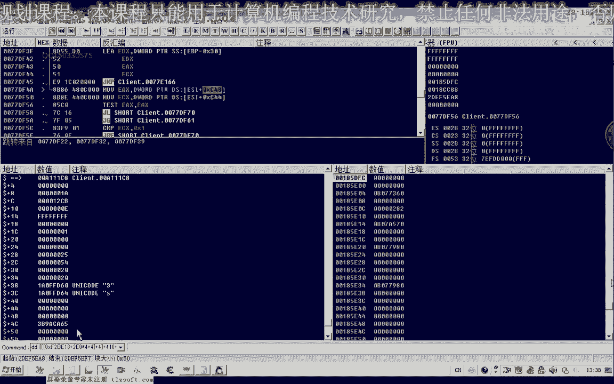

看看还能不能够找到一些其他引用的数据，那么这是背包里面的。

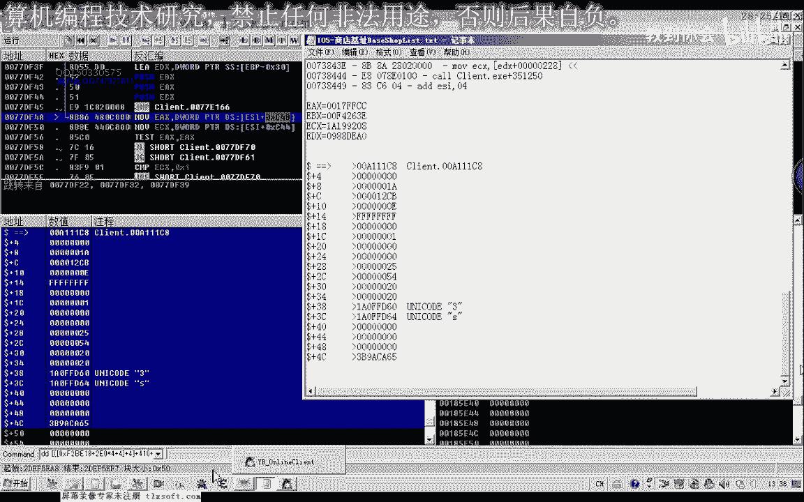

啊啊刚才的是商店里面，那么这个呢是我们背包里面。

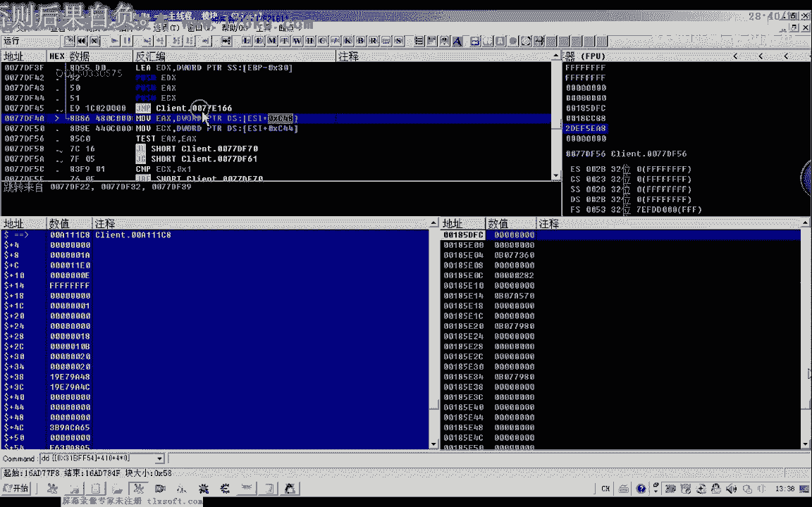

那么我们看一下第一个竖起来都是一样的啊，当然这个t呢不一样，灵异，这里是一，那么28这个位置还不一样，日c这几个位置好像是它的一个坐标，还有这两个位置呢它不一样，三八和3c这个地方。

四在这个地方呢是一样的，那么试试这个地方呢就是我们物品的一个i d啊，就是说一个分类的一个编号。

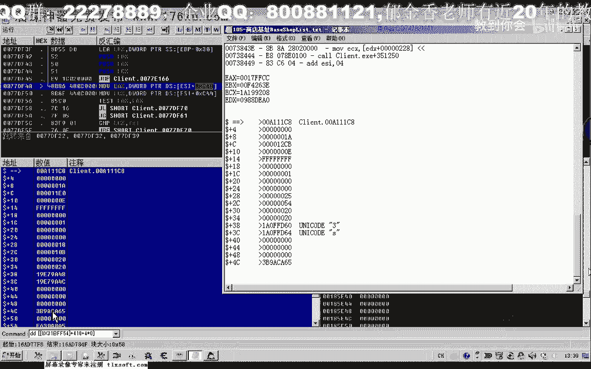

它的类型呢肯定是一样的，在这。

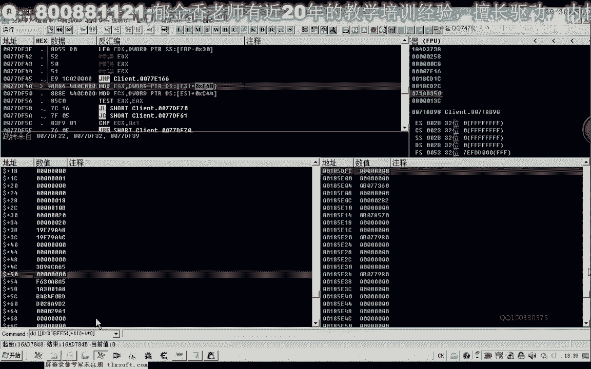

那么好的，我们有了现在这些条件的话，实际上我们已经可以写一个函数来进行偏离，然后获得我们的一个嗯这个商店列表的一个机制，那么我们再另外写一个函数，用来获取我们的这个商店列表的一个机制。

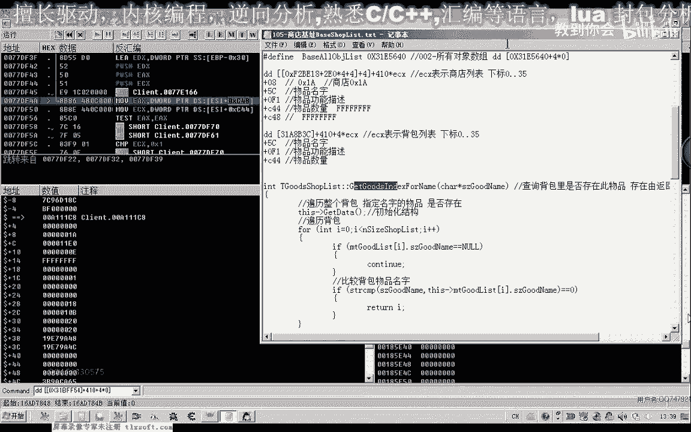

那么我们先打开第104课的代码，我们看一下在他的基础上，我们进行怎么进行一个优化修改。

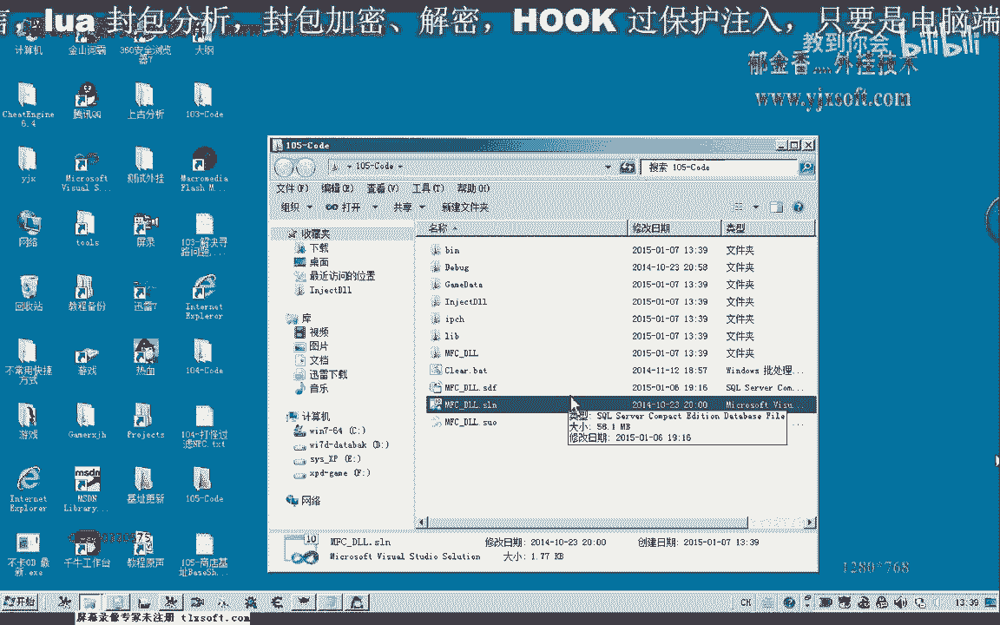

那么我们结构单元转到我们的商店，这个单元做补，那么首先呢我们再添加一个函数在这里，dio，那么这个函数呢我们就用来获取这个商店的一个机制，觉得，那么我们所说的这个商店列表机制。

也就是这一段哈公式里面的一个数字，好复制一下，然后转到我们的这个相关的成员函数的前面，在这里呢我们，我们来添加它相应的代码，那么这里呢我们也需要一个循环啊，一个循环的来骗你。

他当然在后边这个家事呢我们都可以啊，不需要了啊，我们只需要偏离这里给他数据，但是呢这个我们也要参照这个公式来，那么也就是这个啊相应的一个公司来进行一个偏离，那么我们首先来看一下。

首先我们也需要一个for循环，那么因为它的这个坐标的话，都是在210这个附近呢进行一个变化啊，那么在这里呢我们把它写稍微写大一点啊，当然这个具体的数值呢我们需要了进行一个尝试啊。

那么我们暂时把它写为310，或者是我们这样啊，这里的为21比加嗯，一般，那么它的起始数值呢我们等于x2 经理啊，简易反应，也就是说我们向前向后啊来进行一个搜索，i加加啊，那么这是它一个相应的一个下标。

然后呢我们开始了对它进行一个偏离，那么首先我们是要取出这里面的一个数值啊，这个公式的一个数值，那么我们来看一下它相关的一个机制，商店的，那么另外我们在定义一个指针啊，用于指向这个嗯这里面的这个对象，啊。

啊，好那么这是最新的一个机制，那么这个机制呢我们需要来呃来加上一个i乘以四，那么因为这里呢它这个加四呢我们就可以了把它省略掉了啊，省略掉的话，这里应该是211211。

那么这里我们也可以把它改变向是体积啊，这个公司呢就可以这样的进行一个简化，那么这样的话我们就能够取出里边的这个对象啊，那么取出这个对象之后呢，我们嗯需要来进行一个判断。

判断它最终是不是指向着我们的一个商店列表啊，需要做这样一个判断，那么首先呢我们需要把里面的这个数字来读取出来，那么在这里呢我们需要进行一个类型的转化，那么先把它转换成指针的类型。

那么最终呢我们在前面加上一个星号啊，表示了读出里面的这个地址，那么读出来之后啊，我们可以呢在这里呢还有一个加四啊，那么呢我们也可以在他的基础上进行加四，加四，那玩家加四之后呢，我们需要做一个判断啊。

嗯再次把它读取出来，或者我们这个加四的话，也可以在后边这里来实现，然后我们读出这个数值，这个数字读出来之后呢，我们需要做一个判断，判断它是否为空啊，如果里边取出来的对象是为空的话。

那么我们继续来下一个循环啊，那么如果不为空的话，那么我们接着啊进行一个判断，那么我们现在呢已经把这前面这一段了，已经把读取出来啊，已经读取出来了，这里一个括号，两个两个括号啊，这前面呢也是两个括号。

您当然已经是把这前面一段啊都已经读取出来了，那么读取出来之后呢，这个时候呢我们就需要加上410啊，来取出这个商店里面的列表里边的一个对象，410应该是加上嗯，这里呢四乘以一个数字下标，看一下啊。

i s e4 啊，并且读出了相应的一个数据啊，也就是那如果正常情况下的话，它可能就是它的一个机制，但是我们要判断啊究竟是不是，那么是不是的话，我们可以通过商店列表的一些属性加八这个位置。

加50这个位置看能不能够读取出来啊，如果不能够读取出来的话，可能它相应的位置呢就是提，那么我们再加上一个410，首先呢它加上一个0x410 ，那么再加上一个相应的一个物品的一个下标。

当然这里呢我们实际上我们不需要下标，只需要取他的第一个，也就是四神一平，但是这个四神一民呢我们可以省略掉啊，但是在这里为了呃一个可读性呢，我们把它加上去第一个商店列表第一，那么我们先取出这个数据。

那么取出来看一下，看一下这个对象呢是否为也是需要进行一个判断，再次的判断，那么也就是前面这一句啊，再次进行判断，看它是否为零，啊如果为零的话，也继续了下一次循环，那么如果不为零的话，我们就分别取出呃。

加8+5 c加八和加c44 这两个地方呢进行比较啊，那么在这里呢我们另外的定义的变量就达到了，那么一个是我们的类型位置type，这个呢用来表示我们加八这个位置它的一个类型。

另外一个呢用来表示它的一个数量，再定义一个变量，拉普那么也赋值为，首先呢我们复制为零，那么首先呢呃在这里的话，如果这个数值不为空的话，我们就可以尝试取它的一个类型和数量出来啊。

但是呢实际上这些必有关于指针的操作的话，都有可能的出现异常啊，那么如果是出现了异常的话，我们也进行需要进行一个相应的处理，哈哈那么进行的异常的话，我们就继续来下一次循环就可以。

当然这里呢我们也可以打印出一些调试信息啊，二，好那么如果是正常的情况下的话，我们就接着取它的类型和数量，类型呢是加八这个位置，当时好像是定义了一个对象类型的一个偏移的一个红利，啊这里加八这个位置。

那么我们取出它的一个类型，然后来做一个判断啊，另外呢我们需要来去除它的一个数量，啊，那么这里呢我们也可以定义一个相应的一个红啊，物品的一个数量的，那么我们就到前面来进行一个红的一个定义。

或者是物品对象的，数量，在ctrl减号啊，退回了，好那么我们在这里呢加一个判断，那么如果我们的这个对象类型，那么等于0x1 a也就是表示的是物品，那么这当然这里的话我们也可以了嗯，做一个红的一个定义啊。

表示它是一个物品，在这里我们也把它定义为题，嗯，那么另外呢还有一个条件呢，也就是它的一个数量，这里呢我们要等于的是-1或者是0x的f f这个数字，那么如果这两个条件都达成的话。

呃我们就返回这个对象的一个地址，啊这是取出的物品的对象，不是他的机制，他的机制在，在这个地方我们需要对它的一个机制来进行一个保存，你倒是这样来写的，这是它的一个相应的一个机制，那么如果这两个都相等的话。

在这里呢我们就直接返回嗯这个机制，当然如果是执行到最后的话，这里呢我们就返回空啊，就表示了没有找到这个相应的机制啊，获取失败了，那么我们先编译生成一项，那这里呢我们少了一个新号，那么我们就再检测一下啊。

先把这个数字呢我们打印出来看一下，那么我们获取的这个数值是否正确的，先测试一下，在主线程单元看一下，测试一这里。

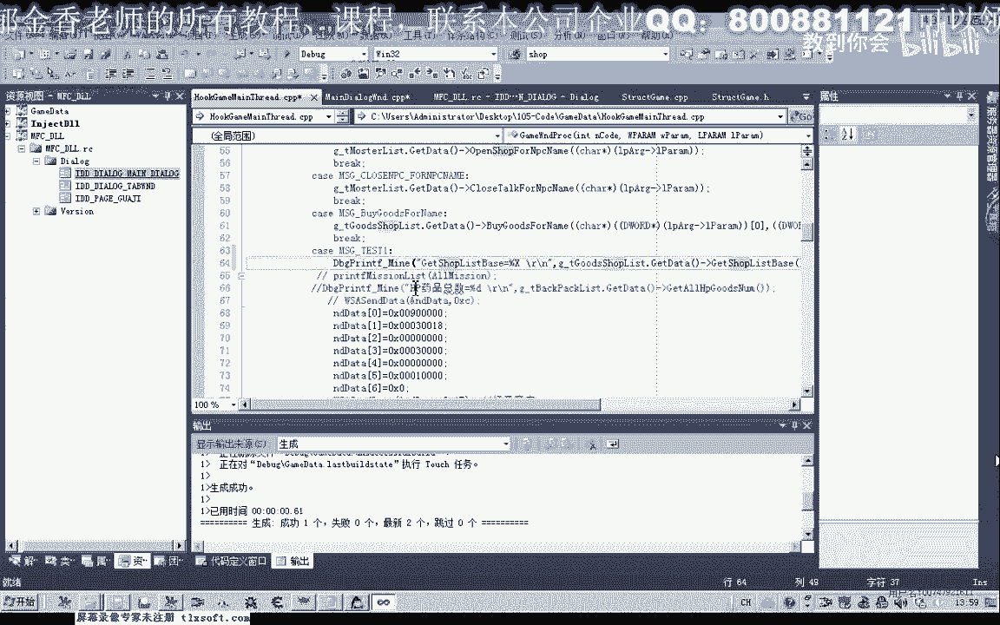

好的，那么我们注入一下我们的游戏啊，进行一下相应的测试。

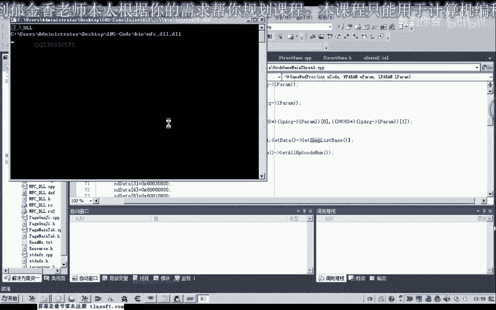

不可能。

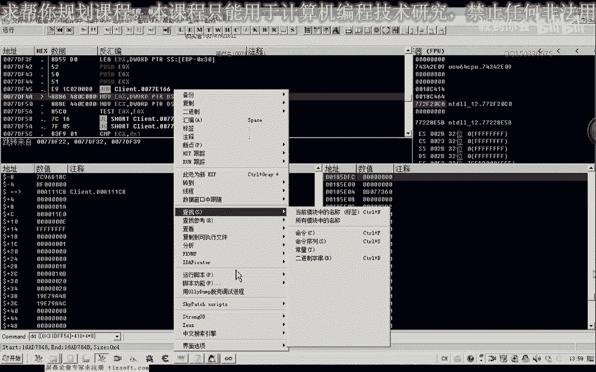

这，首先挂机我们的主线程啊测试呃，最终得到的机子呢是这个19f，b6918 ，那么我们看一下嗯，这个对象是否正确，那么因为还有另外一种情况，他也可能会偏离到这个机子，有可能是偏离到了我们的仓库。

或者是偏离到了我们的背包，它也可能会存在这样的对象，那么我们先来看一下啊，背包应该是不可能，因为我背包里面没有这个数量，那么因为我们仓库里面的这个物品的话也是有数量的，那么可能会偏离到我们的仓库里面。

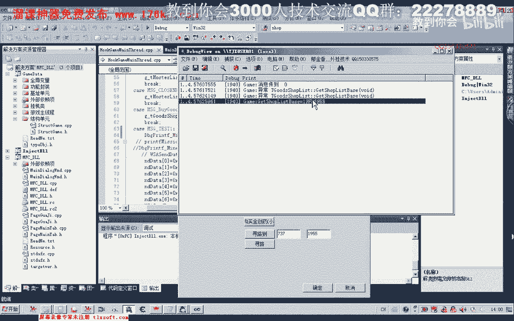

那么我们在附加到游戏里面。

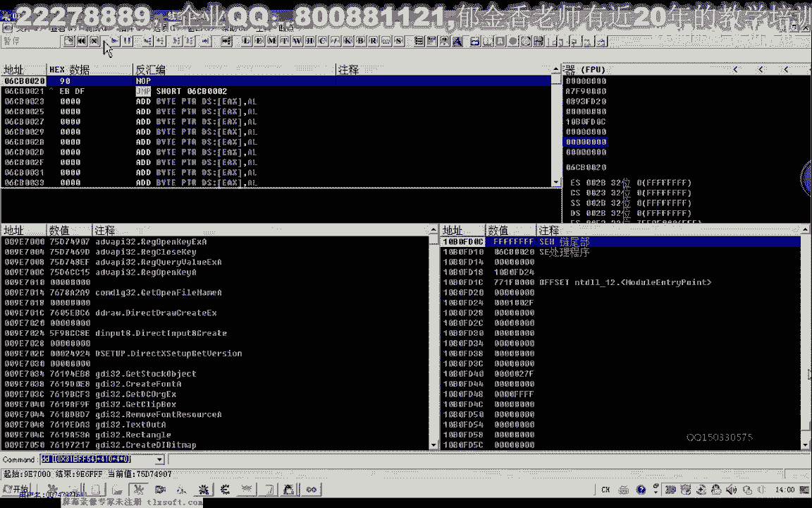

好的，那么我们再用之前的公式来查看一下。

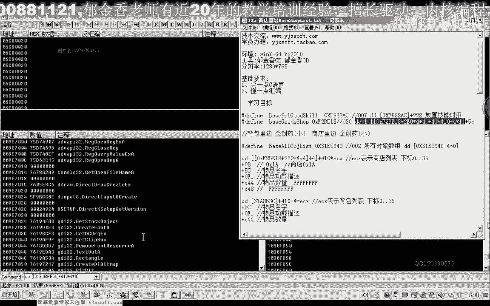

那么也就是410前边这一部分，这几个点，918，那么我们看一下我们所找到的这个地方，也是一九fb 6918，一九fb 6918，196169678，那么这个地址呢加上我们的410，这大概就是这个地方了。

再加上40米，我们的下标i，再加上c。

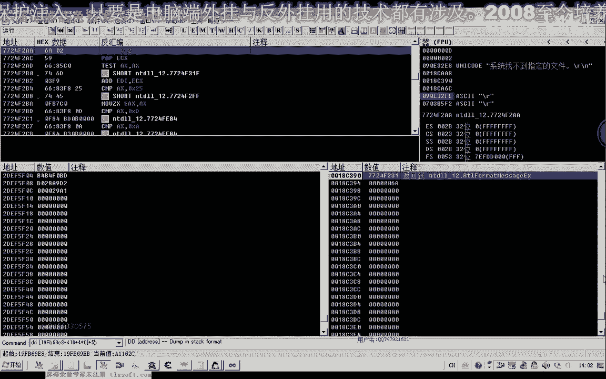

金疮要小，金疮要重，经常要大啊，人生嗯，那么基本上的话是正确的哈，嗯好的，那么我们接下来呢我们再进行嗯，再把我们的这个机子呢把它利用起来，对我们的这个商店啊，相关的这个函数来进行修改。

嗯嗯嗯嗯第一个我们就是购买物品。

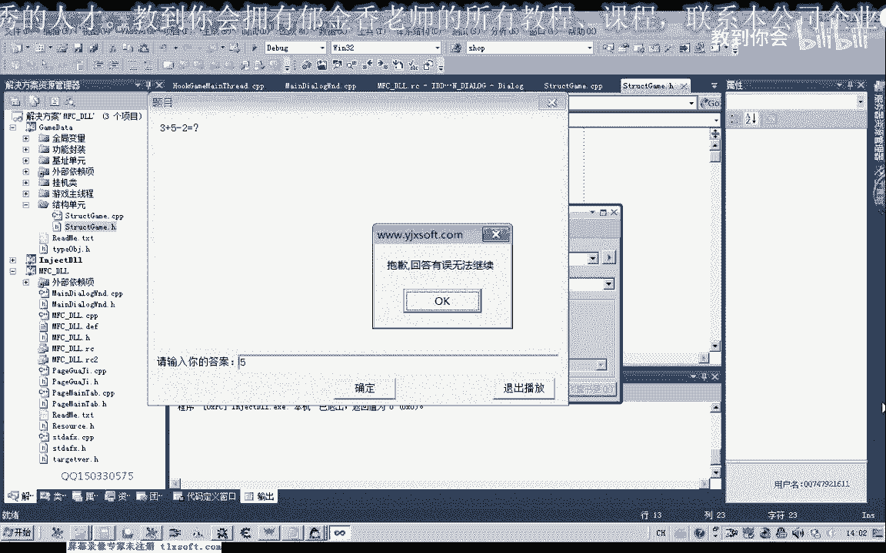

即可能我们需要进行一个修改，by gods blame，这个，那么在这里的话它有一个偏离，还有一个get dirty的话，也应当有一个它的一个初始化，我们也需要主要是它的一个初始化，我们需要来进行一个。

修改它的一个机制，也就是这个公式啊，这里它的一个相应的一个base，那么这个这个base的话，我们就需要通过这个函数，该提到题了，用的这个函数来替代它，来完成，好的，那么我们接下来呢，恢复一下主线程。

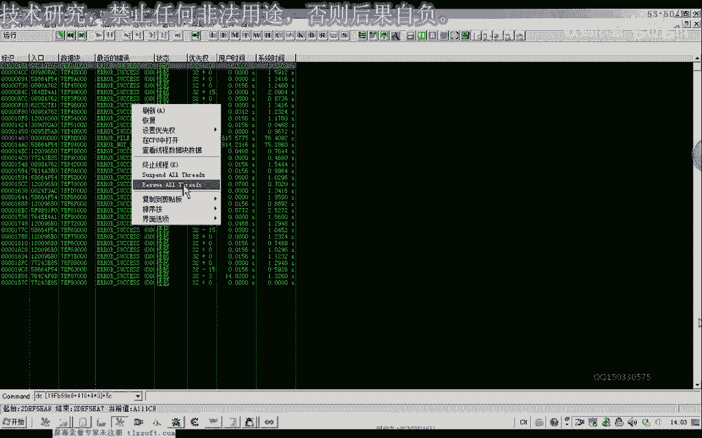

然后呢我们退出，那么我们再来看一下我们可不可以购买这个相应的这个物品，那么这里有一个购买精装要小的，我们继续用它来做一个测试，卸载掉主线程了，突出，重新再申请一下，好再次注入，那么我们看一下啊。

现在精装要小59个挂机主线产购买精装要小，那么我们发现这个时候呢他依然没有反应，我们看一下，结果呢他这里返回的结果的话依然是-1，说明我们还是有一些问题，那我们再来看一下，异常了啊，这个时候呢我们的。

或许这个机制失败了啊，这个时候，那我们再来看一下相应的代码，那么刚才我们县里的时候的话，这个数字都是正确的，来我们看一下刚才是怎么确定，啊刚才是测试一这里我们看一下测试一这里。

那么当时测试一这里它是正确的，那为什么这个购买精装要小，这里它会出现异常，哦他有出现几次异常，但是最后他返回了这个机子的接口的话是正确的，那么它的有出现异常的话。

说明我们的条件的一个判断的话还不是很准确哈，那么我们再来看一下我们的代码，购买金疮药行还是没有查询到指定的这个物品，那么我们把这个范围缩小一点，前后呢我们嗯这个十个对象啊进行一个偏离。

卸载掉我们的主线程，那么可能是这个范围过大，从，还有我们再来看一下购买的物品，这个题desplay啊，再来看一下这，那么因为我们在调用的时候就已经初始化了，这一句话是可以不要的。

但是我们现在的话还没有发现这个代码什么地方有出现错误，嗯，给体的题，再转到它的初始化函数里面去看一下，那么在这里呢我们显示一下它相关的一个获取的一个机体，是否对正确的。

对了这里呢他还再次把这个机子加了四啊，最后呢这里呢再加上了一个410，那么在这里的话，实际上我们应该是forest cobase呢，应当等于我们的这个机制，好像是这样才对，那么我们再转进去看一下。

商店列表的机制啊，应该是410之前的这个，但是这一步呢我们就要省略掉这一步，我们需要省略掉，那么这样的话应当才不会出错啊，好的，那么我们继续来再进行一下测试。

那么我们这里的话它取得的是这前面这一段的一个数值，那么也就是说这个加时啊，这里的话他用不着再次加上这个四，直接加上这个410就可以了，好那么我们再重新编译一下，好挂机到主线程，然后我们再来看一下。

购买清仓，要想，这个时候呢还是没有正确，那么这个时候我们返回的下标的话已经是正确的，这里异常的话，我们可以不管它，这个时候他返回的它相应的下标是正确的，那么我们看一下呃，接下来输出应该是出错在什么地方。

那么这里呢他返回了它相应的一个下标，10%，百分之d，sd，好像是这这段代码它并没有被执行到，我们再来看一下，购买情况下写，那么它执执行到这个i估值不令，哦是执行到这里了，它产生了一个异常。

但是这段代码它也没有被执行到啊，这很奇怪，直接就跳到了我们的下边的这个异常，这里啊对啊，这里他是被执行到的，这前面这一段呢就是我们的这个调试语句打印出来的这个代码啊，然后呢执行到下边的时候呢。

这里面出现了这个异常，那么这个异常的话可能是我们的这个库呃引起的一个相应的一个异常，但这个扩的话，它里边呢它也有相应的一个处理，那么这里有个message box。

但是呢呃这个时候好像他没有执行到这个message box这个地方，那么我们再次按ctrl减号退回来，那么如果是出现异常的话，我们看一下是什么地方最可能出现，那么这里呢也打印出来一个调试信息。

那么这一段的话都没有对我们的相应的指针进行一个读取，一，那么这里是数组下标的零的一个读取，那我们再看一下调试信息，这里输入输出的话也是正常的，我们再次把汽车掉主线程，再检查一下这段代码。

这里肯定是不会被执行的，然后是执行到这个下边的时候呢，才出现了一个异常，但是这里呢它并没有被执行到，那么就产生了一个异常，如果这句被执行到的话。

它就会显示我们的这里面的这个message box会被显示出来，那么我们在前边呢再加上一些调试去，那么我们这个时候呢可以这样来做啊，这里面加上一个一，那么我们看某年去调试一句没有被打印出来的话。

说明的是相应的地方呢出现了异常，那么这里的话一般是不可能出现异常啊，那么等会儿我们可以看到它执行了几个一，或者在这里呢给他编一个号码，那么我们就知道一个异常的一个位置，那么再重新申请一下。

那么这也是我们诊断错误的一种方法，好的，那么我们再次挂一些主线层，再用调试查看器查看一下，那么我们可以看到是1234啊，嗯都有执行，那么异常的话证明是在这里在这个框里面啊，产生对这个异常。

那么很有可能就是我们的这个地方产生的异常，那么我们把这个message book注释掉，好的，那么我们呢再次来卸载掉我们的主线程，再重新申请一下。

当时我们用这个message box呢是为了在这里有一个断点，让它会断一下，因为我们看一下出错的话，只可能是呃在这个地方突出，因为这里的话它另外的加了异常处理，如果是在这里报了异常的话，应该是在这里报。

或者是这一段好的，那么我们看一下还有没有错误的化解主线成嗯，然后我们再来看一下游戏里边嗯购买情况要想啊，这个时候呢呃能够正常的购买吗，好的，那么这节课呢我们就到这里了，那么我们下一节课了啊，再见，嗯。

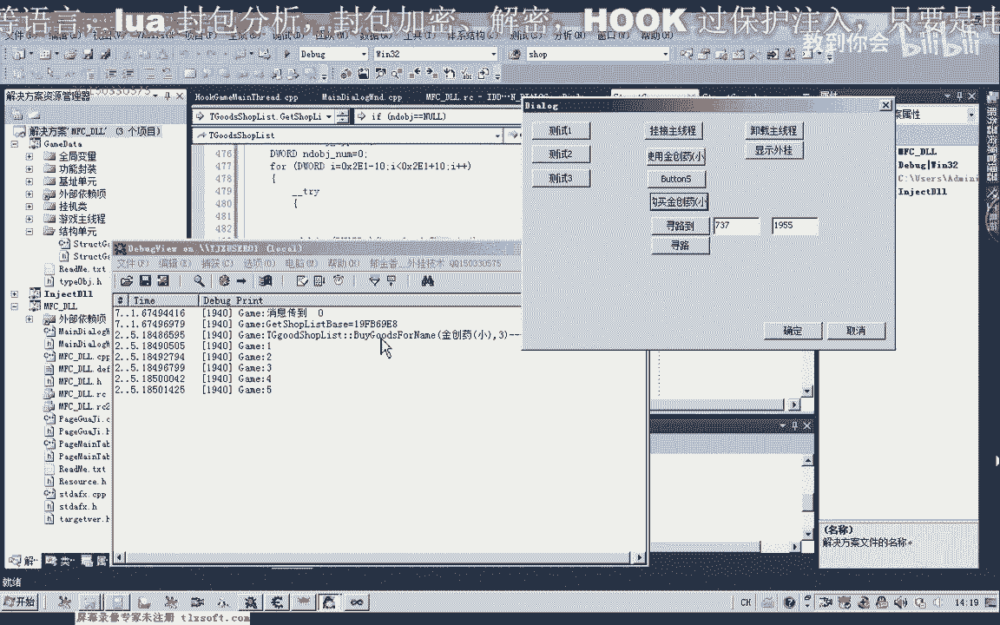

那么这里呢我们需要再加上一个判断啊，他就会呃这里的异常呢就会被忽略掉啊，因为这个对象呢他读出来也有可能为空的时候，这前面的这个对象好的。

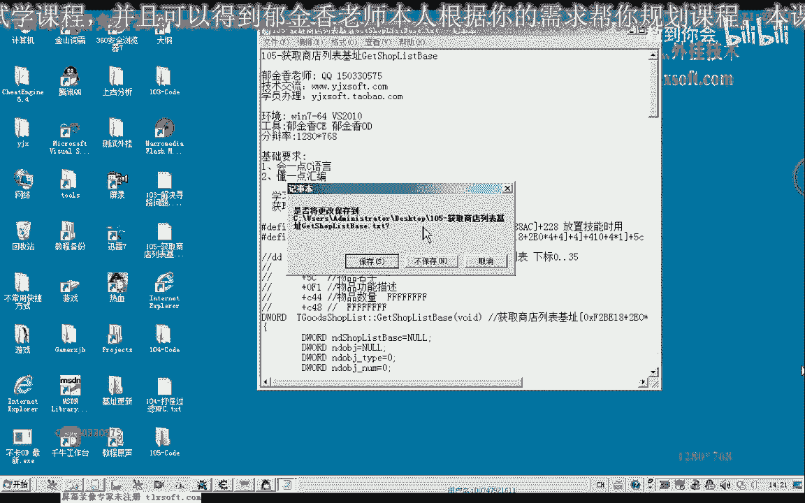