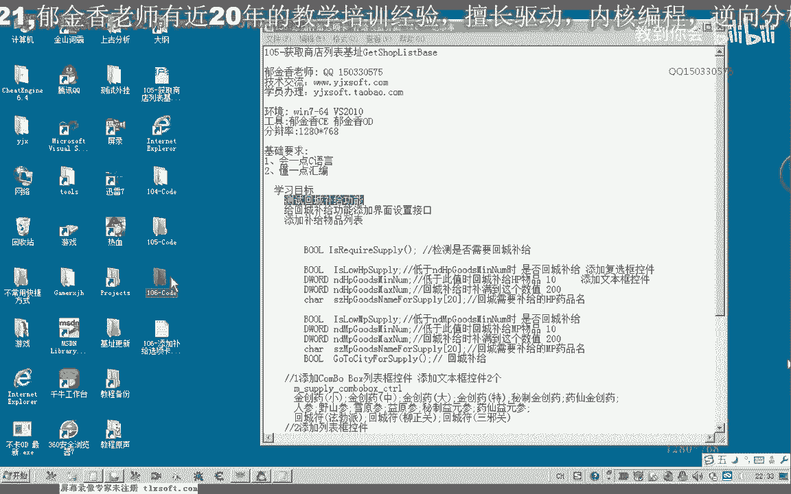
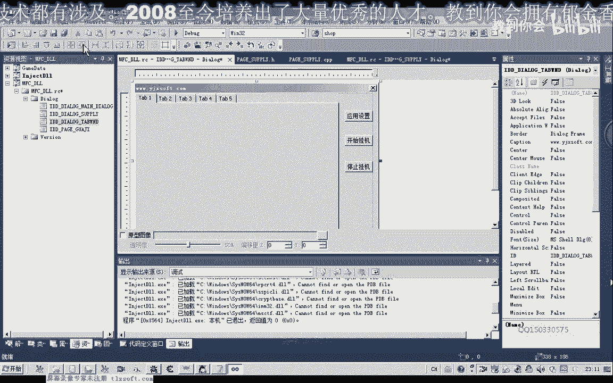
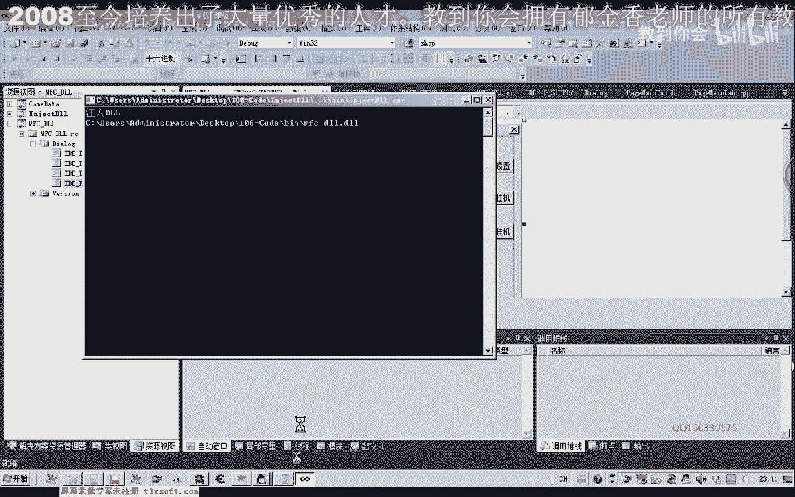

# 郁金香老师C／C++纯干货 - P95：106-回城补给功能测试-添加补给选项卡界面 - 教到你会 - BV1DS4y1n7qF

我是郁金香老师，那么首先呢我们测试一下回城补剂的一个功能啊，上一节课呢我们嗯对回声补剂的一些功能来进行了修改，并且我们修正了我们商店列表的机子，那么首先我们先测试一下。

那么我们首先看一下它的一个数量哈，需要记得这个条件，那么我们看一下游戏里面，现在现在是418，那么在这里的话，我们需要来，回程普及的一个数值的话，这里呢我们需要把它设大一点，410。

那么这里呢我们7042030是要帮我们需要使用哈，八个这个相应的hp的这个药品啊，那么它才会回神器补剂，好的我们再次申请一下，那么首先呢我们挂接主线成，然后获取当前的一个坐标。

我们看一下周围有没有怪物嗯，有这个怪物存在，那么我们应用一下设置，开始挂机，然后呢我们在这里来使用一下相应的这个物品，按f，那么再算一下f5 ，那么这个时候呢我们看到它的这个路径的话已经形成了。

也就是要回到城里边去买这个东西，那么我们打开我们的这个调试信息查看器，我们看一下，那么这个时候呢他购买了七个金创药啊，呃然后返回我们的挂机地点，二，一，好的，那么我们来看一下现在我们的人物角色在做什么。

那么现在呢他已经在开始了嗯打怪，那么并且呢这里呢是在统计我们的这个药品做一个相应的一个判断，在这里的话我们能够看到他购买了这个七个金创药啊，那么说明我们的这个g功能的话，基本上嗯是可以了啊。

那么这节课呢我们为这个补剂的的这个功能呢，添加一个专门的一个页面啊，用来设置我们混成补剂的一些参数啊，那么我们先停止挂机，卸载掉主线程退出来，那么我们现在的这些接口的话。

也就是我们的这个呃i t哈里边的笔记的相关的这些成员变量，那么这些成员变量的值的话，我们要需要一个窗口来来做一个设置的一个接口，就像我们之前的啊挂机这个选项一样，那么比如说我们在挂机的哈。

这里的话也有很多很多的数字，我们通过一个窗口的设置，那么最终呢实际上也是改变这个呃录音里面的一些成员变量啊，比如说我们的定点的坐标，还有我们的是否定点打怪，还有我们的这个呃滴血保护啊。

这一类的都在这个挂机选项卡里面呢可以设置，那么今天呢我们就是要添加一个补剂的几个选项卡，那么在这里呢我们首先可以插插入一个这个窗口，那么在这里呢更改一下它的i d，super line啊统计。

那么另外呢我们可以啊改变一下窗口的一些大小，还有窗口的样式啊，呃让它是没有边框的啊，这种样式好的，我们保存一下，那么首先呢我们看一下我们需要提供哪些接口，那么第一个的话肯定是两个浮选框啊。

那么复选框控件呢用于呃选择是否我们要回城补给啊，比如说我们的这个mp药品的数量低于某个数字的时候，或者是hp药品低于某个数字的时候好的，那么我们首先呢添加两个复选框啊，那么这个时候可以按住控制键啊。

拖动鼠标啊，这个时候呢就有两个，然后呢我们把它左对齐，那么这里我们可以设置为hp，药品数量低于，那么这个呢是mp药品数量低于某个数值，那么具体的低于某个数字呢，我们可以在这里加上一个编辑框。

就是低于某个数的时候，那么低于某个数的时候呢，我们就什么呢，就回城补剂，那我也按住控制键啊，再拖拖出一个这个窗口，那么顶端对齐啊，再给你选择，好那么后边呢我们添加一个静态的文本。

那么当这个hp药品的数量低于这个数值的时候呢，我们就是应当是要回城补剂，那么要回程补剂的这个物品的话，在这里呢我们改变一下它的设置，那么之前我们的一个设计的话是单独的啊。

需要补剂的这个mp的药品或者是这个mp的药品呢进行了一个复制，而形成了一个成员变量，但是我们还要考虑到他可能还要去其他的，比如说我们的啊回城符或者是其他的一些呃。

这个比如说还有我们弓箭手要记得弓箭这一类的，那么所以说在这里呢我们用一个控件来给它添加一个补剂的列表，那么在这里呢我们添加一个list box，那么在添加这个misty boss之前呢。

在这里呢我们给它添加一个主控件，那么这里呢我们给它，设置为啊对了，他的ip我们需要给他改过，那么在这里呢我们设置为它系列表啊，或者是设置设置为武器啊，那么里边我们再添加一个武器的一个列表。

那么普及列表这边呢我们再给它添加一些要补剂的内容，那么回去补气的时候，由于n p c不同呢，他店里面的物品也不同，那么如果是回程补气弓箭的话，我们就是要去这个地图里边啊。

这个刀剑鞘这个商店七上店的名气补剂，而药品我回城符这类的需要在这个平时指这里补记得，那么还有可能要在其他这个n p c这里补记其他的这个物品，那么所以说呢在这里呢我们呃设置几个补充的这个地点。

在这里我们也添加静态的文本，那么第一个呢我们是药店的，嗯，那么第二个地方呢，我们暂时把它呃属于这个武器，或者是仓库，我们也可以去的仓库取这个物品啊，那么我们暂时把它设置为仓库。

那么后边呢我们就是跟我们要记得这个物品的名字，那么也就是一些常用的这个物品，那么后边呢我们跟一个焊点添加，那么首先呢我们也让它左对齐啊，这个也是啊左对齐，那么添加后边的话还需要有一个数量。

那么数量呢我们也用一个编辑框来表示，好那么我们再次把它对齐，那么这里呢我们选择顶端对齐，那么这里我们同样的是顶端对齐，好的，那么接下来呢我们就是给他关联一个相应的一个变量，那么在关联这个变量之前呢。

我们需要来先把它添加一个类啊，不然的话我们是不能够添加这个呃相应变量的，那么在添加变量之前呢，我们把它的id呢啊也做一下相应的这个修改，嗯嗯，不知道，哈，好的，那么还有这里呢是相应的一个数量啊，一品。

那么接下来呢我们就是给他关联一个相应的变量，但是在关联这个变量之前的话，我们需要来先给它建立一个类，要添加一个类，那么这里呢我们创建一个g的这个类，然后点完成，那么完成之后呢。

我们再跟他关联这个相应的一个变量，那么首先是hp药品的这个啊，那么我们看一下这个观点的话，应当是关联我们的这个呃相应的成员变量的这个啊前面，那么我们在这里呢添加相应的一个变量，那么选数值类型。

那么成员变量呢我们以m开头，那么第二个成员变量呢，我们是这个mp的啊，那么这里也是选数字类型，乘用变量以小写的m开头嗯，这个完成，那么这里是不记得一个呃最低的一个数量，那么它关联了数字的这个数字。

那么低于辞职的时候呢，将会成补气，选数值类型，那么在这里呢我们选d word啊，这个类型，那么回程补给的这个数值的话啊，嗯那么这个数字的话我们也可以不要了，嗯这个数字呢我们可以再添加在这个位置啊。

np啊，药店里面啊，那么这两个我们可以呢在下一节课呢进行一些修改了，那么接下来的话还有我们的这个回城补给的这个药品的名字嗯，那么这个呢我们也可以把它注释掉啊，做一些修改，那么在下一课的时候。

因为这这些呢我们都是通过啊这两个控件来完成，然后往里面添加的这个物品，那么所有的这个物品的名字和数量呢将添加到这个列表里边啊，到时候我们要另外的写一个结构啊，来获得相应的这个药品的名字和数量。

那么在这里呢我们需要对它进行一些初始化啊，嗯这个仓库的这里呢我们暂时用不到啊，那么我们就以这个药店里面的这个药品为例，那么比如说我们需要这些药品，那么它的初始化呢我们可以放在它有一个个体这一项。

那么另外排序这里我们称为fast，然后这里面代替我们添加这些初始化的一些数字，那么比如说我们仓库里边，我们要去取的是这些回城符是什么，那么我们举个例子，在这里呢我们也给它进行一个初始化，对，好的。

那么在这里呢我们也关联一下啊，相应的成员变量，那么这里呢我们表示控件啊c t l，那么这个控件的话，它是用来补给我们的啊，这个物品的一个列表，嗯，或者是这个呢我们写的是商店的药店，就。

那么这个呢是仓库的，破图，那么在这里的话我们也是关联的是数量哈，第二段飞行，这里添加一个相应的一个变量，数值是jo的类型，那么这个呢是仓库的就可，好那么这些添加完了之后呢，我们嗯在这里添加的时候呢。

我们将把这些相关的这个数据的药物，这是要补记得这个药品的名字，那么这里是要普及药品的一个数量嗯，那么添加在我们的这个补剂列表里边，我们进去看一下，那么这是我们相应的一些数值，它的一个初始化。

那么我们可以在这里呢输入一个初始化的一个数值，那么这个我们初始化为一，我们看一下啊，这个是我们要添加的这个物品，那么这里是要回城5g的一个最小的一个数值，那么这里呢我们初始化为102 10。

那么接下来呢我们在这里呢把这两个数据呢，添加到我们的这个列表里边去，在这里呢添加我们相应的一个代码，那么首先呢我们可以用一个sister来获取，我们这个combbox里面的一个数据，哈哈哈，对对对。

那么这里呢它是一个序号，那么这个序号呢就是我们选中的这个序号，我们选择，也就是说它当前的一个选中的一个数值，然后后边呢我们可以用，就是我们之前申请的这个变量来获取一个相应的一个数值，他选择的这个数值。

那么这里呢我们可以把它格式化了，那么首先呢这个我们是去药店，那么去药店买什么呢，我们就是前面啊选中的这个物品，要去买的这个物品，那么后边呢是他要买的这个数量，那么数量的话我们，来吧没问题。

那么也就是去商店购买物品的这个数量，那么大致就是这样的呃，但是这个数量的话我们需要来首先呢update从窗口的这个数据呢，把它更新到我们的变量里面啊，然后把它添加进去好，那么这次我们要添加的这个字串。

然后我们把这个字串来添加到列表，那么我们再来看一下它的一个成员变量，那么还有一个成员变量呢，我们没有添加，啊也就是这里我们还需要添加一个变量，嗯，那么最后呢我们把这个我们要添加到这个药品的一个信息呢。

添加到这个列表里面去，还有一个成员变量a d d c string啊，然后呢是t r t h好的，那么我们先编译编译一下，那么这个页面存在了之后呢。

我们还需要来把这个页面呢显示到我们的这个选项卡里面去啊，那么这个时候呢我们需要在我们的这个主选项卡上面呢，添加我们的相应的一个代码，那么首先呢我们在初始化里面啊，初始化我们相关的一个数据。

那么在这之前呢，我们需要了到他的这个头文件里边呢，嗯添加一个相应的一个成员变量，那么首先呢我们包含这个新的图文件，那么这是我们的挂机选项卡，那我们再来看一下它的这个绿的一个名字，什么还sl就是大写的。

然后呢这里呢我们添加一个相应的成员变量更清啊，那么这是我们的武器全参考，那么我们再转到初始化单元，那么我们可以在前面的基础上呢啊复制一下，那我把这前面这段代码复制一下，我们进行一下修改。

那么这是我们记得成员变量，进行替换，那么同样的这里呢也是记得先拍几下面，那么它的i d我们传送进去，那么这里呢我们设置为七，那么这里的序号呢我们设置为一，那么这里的工作我们做完之后呢。

我们还需要呢在这个选项卡的啊，选项卡的动作里面呢添加这个相应的代码，那么如果，开始的时候我们显示某一个数值，那么这个时候呢是嗯看一下最先这里，那么这个的话我们最先呢我们还是显示这个挂机的这个选项看看。

那么在这里的话单击这个选项和选项卡一的时候呢，我们这个是fly武器的选项卡呢，我们先把它引进你，跳，那么在班级这个选项卡日的时候呢，我们在这里显示他，好的，那么大致就是这样子，我们再次编辑一下。

然后就用，那么我们显示一下外挂啊，呃点击一下补给的这个选项卡，那么这个时候呢它的大小呢我们还需要进行一些调整啊，那么这里我们还没有添加相应的这个代码，好的，那么这里呢就是我们回城补给的一个数量。

当然这个呢我们还得另外写一个函数来解析这个字串里面的这些信息，那么一个是我们要回去购买的物品名和这个物品的数量，因为这是字符串类型的，到时候我们还要专门写一个函数呢。

把里边的这个相应的信息和物品名和这个物品的数量，那么提取之后呢存放到一个结构里面，那么另外还有这里呢它的一个数字呢没有进行一个初始化，那么我们还有一些要改动的，那么我们来看一下，那么首先是界面。

我们要改动一下它的一个大小，然后我们改变这个选项卡的一个大小啊，它就能够呃相应的改变它的一个大小，那么再次移到普及的这个选项卡上边，嗯那么我们看一下还有一个数值呢，嗯这里有一个数字呢。

我们没有对它进行一个初始化，那么我们首先看一下它有没有关联一个相应的一个变量，那么这个数字呢我们还没有给他管理一个相应的一个变量，这是当我们的m p的这个药品低于某一个数值的时候。

那么呢我们要回身进行一个补给，好那么我们来看一下mp的这个药品，那么这里是mp的这个药品，那么我们也是当它的数值来低于逆时的时候呢，才回城补给啊，这是一个默认的一个数值，那么再回到头文件查看一下。

那么还有一个数字呢，我们在这里呢，嗯这里这两个数字好像没有进行一个初始化，不能微信，我们再过来看一下，啊这里也有进行一个初始化，初始化呢都是零啊，这两个数字好的，我们再把这段出去复制一下。

那么我们再次编辑，嗯那我们再来看一下普及的这个界面啊，那么这个列表呢我们还可以把它调整大一些嗯，那么这里呢我们也可以做一些调整啊，那么这里呢我们再把它调整小一点。

再来看一下。

啊这个坎普列列表框呢我们可以把它呃调整大一点，单击这个这个部分往下拉，那么这里也是我们往下拉一点，好的保存一下，那么这节课呢我们界面的设计呢暂时就到这里。

那么下一节课呢我们对这个回程补给的这个结构的一些成员变量呢，呃进行一下修改，还有这个补剂物品，这里我们需要把这个补剂的这个列表呢，呃把它同步到我们的这个成员函数里面，所以说我们还要添加一些成员啊。

那么这个大家下去了也可以做一个坐力啊，试一下，那么作者之一呢，我们就是要把这个列表框里面的这个数据哈提取出来，放到一个结构里面，那么就这个结结构的话，可以说有两个成员。

那么一个呢也就是我们要补贴的一个物品名，要把它提取出来，那么第二个呢应当是一个，d word类型的一个物品数量需要提取出来，那么这两个一个结构啊，那么这个呢我们应该是一个字符类型的。

那么大概呢是这样的一个结构啊，一个结构列表，那么具体的我们下一节课呢再设计，那么这个列表里面的一个数据，这我们看一下它的一个名字。

好。