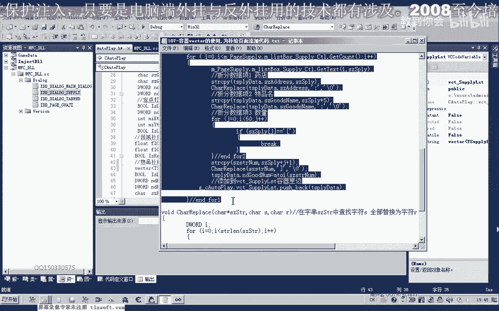

# P96：107-容器vector的使用,为补给页面添加代码 - 教到你会 - BV1DS4y1n7qF

大家好，我是郁金香老师，那么这节课我们学习的目标呢一个是呃剩下家里面的总体的微课堂嗯，那么另外一个呢，我们就是把我们呃这个补剂选项卡里面的这个呃补给物品的列表呢，更新到我们的这个对象当中啊。

就是挂机类的这个对象当中，那么在这之前呢，我们需要来设计一个结构啊，那么这个结构呢也就是用来存放我们的物品啊，第一个我们是要普及的一个物品，那么第二个呢我们是要统计的一个数量啊。

那么第一个呢我们这个补剂的这个物品的话，去向来可以是仓库或者是药店，那么或者我们把它设置得更细一点啊，去某一个坐标点呃，某一个npc或者这里可以也可以是一个呃npc的一个名字啊，都是可以的啊。

嗯这个呢我们主要是能够通过呃这个关键，自然能够确定一个我们嗯补给的一个坐标，那么通过这个，那么第二个呢我们是要普及物品的一个名字啊，最后一个呢我们是不计数这个物品的这个数量。

那么我们首先打开106课的代码，那么我们先添加这些成员变量。

那么我们在在补剂这个选项卡这里呢有一个呃补贴的这个列表啊，就是我们通过这个药店呢添加进去的相关的一些信息啊，那么我们最后呢我们在呃泰国选项卡这里点应用设置的时候呢。

我们就要把这个数据呢要更新到我们的挂机柜里面，那么我们需要在挂机录这里来添加一些成员变量用来替换啊，一个是我们回城补贴的一个mp的药品一，以及我们这一个啊成员变量hp的药品名。

那么在这里呢我们用一个新的呃5g列表物物品，其他数据或者是列表来替代啊，它的一个功能啊，物品普及这个数组，那么这个数组呢也就是我们之前所说的呃，呃这个结构的一个类型啊。

那么我们先呢在前面呢添加这个结构的一个说明啊，这样写一个结构，然后我们再添加一个成员变量啊，这里呢我们回升股息相关的，那么这个呢也就是我们回程补剂的一个数组，那么这个数组呢它是一个动态的，是一个容器啊。

那么微课呢这个我们需要来包含一个它的一个图文件啊，那么有了这个图文件的支持了，我们才能够使用这个v k的，那么但是这个wk呢它需要一个命名空间的一个支持啊。

也就是这个using this space std用来限定它的一个就是匿名的一个空间啊，这个把它放在前边就可以了，在这个地方，那么在这里呢我们就定义了一个容器啊，也就是相当于一个动态的一个数组。

因为我们在这里的话，因为我们的普及列表呢它是不固定的啊，这种情况下呢，我们最好呢就用这个维克特来描述它，这样呢是一个动态的一个数组，当然我们也可以使用一个静态的一个这个补给的一个列表。

把它的数字呢设置较大一点也是可以的哈，那么这里我们用这个微课题来，主要也是呃对这个c加加一个容器的一个认识啊，好那么这里添加了这个相应的这个数组列表之后呢，我们接下来就要想办法把我们的这个补剂哈。

里面的这些呃信息要把它呃转化到我们的嗯这个动态数组里面啊，那么在这里呢我们可以编写如下的代码来实现，那么我们先把这段代码呢啊复制进去，我们一起来认识一下这段代码的一个功能。

那么首先我们转到哈应用设置这里啊，那么在这后边呢我们添加这个武器选项卡数据的一个定期，那么补给页面的一个数据盘，那么这里呢我们在前面呢还要定义一个啊字符数组，嗯然后这里呢我们还需要另外一个函数啊。

嗯需要了一个字符替代的一个函数，那么这个函数的功能我们说一下，先把它复制到它的一个前边，那么这个函数的功能呢也就是替换这个字符串里面的呃，先查找某一个字符，那么查找之后呢，然后把它替换成后边的这个字母。

那么比如说我们这里啊，他就是来找到这个函数里边，然后呢呃找到这个冒号，然后替换成这个结束的字符零，那么在这前边呢我们还需要呢再申请一个变量，啊啊这就是我们普及数组的这个结构啊。

在这前面呢我们有这个相应的定义，它包含三个项啊，前面两个是一个字符串，字符数组，后面一个是一个主机物品的一个数量，那么这里呢我们还需要来定义一个这个字符串的一个数据。

那么这个数组呢我们就是用来获得这个列表里面的一个字符串啊，在这里，那么首先我们是偏离整个，那么整个这个列表啊，笔记的一个列表，偏离这个列表，那么偏离列表我们从这个下标一下标零开始。

然后呢我们把偏离的这个字符串的数据呢把它存放到这个s z啊，ly这个变量里边啊，然后呢我们对这个字符串呢，因为这个字符串它的格式的话就会是药店啊，呃就会是这种格式啊，取出来它是一行一行的取出来。

那么取出来的话就可能呢是这个药店，然后呢是我们的药品名，比如说这里可能就是我们的金创药小，然后呢这里是他的要购买的一个数量，就是说要一，那么首先的话我们就是取出了这样一个字串，那么取出来之后呢。

我们需要把这几个数字呢要把它拆分出来，拆分成三项，第一项是药店，第二项呢是金创药小，那么第三部分呢是这个数字类型的呃，幺幺啊，那么我们拆分的话，我们可以这样啊，首先呢我们把这个字串来把它复制出来。

也就是把整个字串来复制到我们的这个地址数组里边，然后呢我们再找到找到这个分号的位置哈，第一个分号的位置，那么呢我们把它替换成了这个结束的字符零，那么也就是说在这里呢我们就把这个字符串呢独立出来了。

在这个位置呢就是我们字串的一个结束，那么后边的话肯定就没有用了啊，那么这样的话我们就能够拆分出第一个数据，那么第一个数据拆分之后呢，我们拆分第二行数据啊，要的是金创药小，那么这个呢我们也可以了。

因为前面这个药药店那么一个汉字呢，它是占两个字节，两个汉字是占四个字节，再加上一个这个封号的话呃，它是英文状态下的封号，只占一个字节，那么所以说这里呢它占了五个字节，那么所以说我们可以从数组加五这。

里呢开始复制这个字串啊，加五这个位置，那么复制到我们的这个物品名字这个字串里面啊，然后就是这一串，然后这一串之后呢，我们再用这个替换字符的这个函数呢，把这这个啊封号替换成我们的一个结束的一个字符。

也就是零啊，实际上是向这个位置来写出来一个零，那么也就是说这个字串的话在判断的时候呢，它就是独立的单独的一个字串啊，在这个地方呢就结束了，因为这个地方呢被替换掉了啊。

那么这样呢我们能够拆分出第二个数据下，把物品，那么稍微难一点呢，就是我们的最后这一个啊，因为要把它转换成我们d word的一个数量啊，数字类型整形成一个数字，那么首先我们也是要取出幺幺这个字符串。

那么这个字符串的话我们啊也很方便把它找出来，首先呢我们用一个循环来找到这个左括号哈，找到这个位置，那么定位到它的一个下标记啊，把它的这个下标呢j啊计算出来，因为在这里呢我们不认可它。

也就是从这里跳出这个循环，那么也就是说，那么这个最终呢这个界这个变量的位置呢，恰好是停留在我们这个组号这里，那么我们在复制这个字串的时候呢，我们就从这个左括号再加一的这个位置开始复制。

那么他得到的就是一一或一个右括号，然后呢复制到我们这个临时的字符串变量里面去了哈，嗯我们看一下，首先呢是这样把它复制过去啊，呃然后我们复制过去就是这一串这个字符串，那么复制过去之后呢。

我们后边这个右括号呢我们是不需要的，那么不需要的呢，我们就找不到这个用括号，也用这个结束字符去替换，那么替换之后呢，他就得到了一个字符串与幺幺啊，那么得到之后呢，我们再用一个hi啊。

把字符串转换成我们的整数，那么最终呢这里物品的数量呢也可以得出啊，可以得出啊，那么最后呢我们就是要涉及到这个victor，victor的话，它其中呢有这样一项哈，呃它可以了呃。

victory它是嗯先进后出的一个模式，是一个站的一个模式，就像我们亚战一样，就像我们平时的有一点类似于我们的嗯，它所组成的这个容器呢有点相当于我们一bp暂停与我们的1p啊，那么压战之后呢。

他用一个push back压战之后呢，那么这个结构的数据呢就在占点啊，就在我们的战局啊，然后也就是相当于放进这个容器里里边去了，然后它是叠加的，那么我们可以用一个模型来表示一下。

然后我们可以大致的画一下啊，画一下这个所谓的战，那么我们打个比方，如果这就是一个赞哈，那么我们第一次复习的时候呢，它就会向这里来压入一个结构，那么这个结构呢肯定有三项，那么第一项呢是我们的地址。

第二项是我们要补给的这个名字，第三三项呢这里是一个数量，那么第二次亚战的时候呢，他也压在这个位置，那么比如说这里是二，这里是一啊，那么第三次压战的时候呢，他压在这里啊，那么每一次呢他都放在这个站停。

那么在弹出数据的时候呢，它也是从这个站点这里呢取这个数据啊，从占点这里取数据啊，这个取了之后呢，弹出去之后呢，然后取这一个啊，最后取这个，那么这是最底层的取数据的时候呢，最先进去的数据呢。

他最后才能够取得到啊，当然这是我们一个是嗯push push bike，另外还有一个purple啊，弹出我们的一个数据，当然除了这个这个pp bug嗯，它是阐述我们战警的一个数据。

当然还有另外一种访问方式，也就是一个培根所恨的这种反访问的一个方式啊，那么begin的话，他也就是他这个时候呢才是从这个战绩来开始取这个数据，一项一项的去啊，如果是啊，大致就是这样的，好的。

我们来看一下它执行的一个情况，那么像这样的话，我们就把我们的数据呢呃添加到我们的这个呃，相应的动态数组列表里面去了，读机物品的，那么我们要来验证啊，也就是说要偏离这个数。

主要取出差了一个数据中应该怎么取出来啊，那么这个时候呢，我们也可以用一个循环来取出我们的这个相应的数据项，那么我们这个时候呢可以转到这里来添加一个按钮啊，任意地方都可以啊。

那么我们只要能够访问到这个相应的自动挂机的这个全局变量的地方，我们都可以建立这样一个测试案例，那么这个这个时候呢我们可以要用到这个victory里面的一个啊，这rector啊要用到这样一个成员啊。

它的一个静态的一个成员，那么呢用它来定义一个呃相应的一个指针啊，那么这个是我们指针的变量名，就相当于我们之前的这个引导，有一点相当于我们这种啊for int i。

那么副词为多少多少的这一个数字的个初始化啊，那么这个地方那么前面这一段啊就相当于是我们的一个类型啊，相当于这个inte，那么这一段呢就相当于与我们的i赋值为零。

但是这个时候呢它是从我们的这个也就是说这个vector对象啊，这个结构的啊，我们从这个微课等等这个类型的一个列表，从begin这个地方来开始访问，那么也就是我们占占比的啊，这个一那比如说这里是三啊。

这里是四，那么它就是从这个元素一这里开始访问，那么最后它的一个结束条件呢，在这里呢这个议题的还要小于这个n的，小于这个n的，那么也就是相当于这里了i它小于我们数组的一个下标啊。

那么这里呢比如说小于三小于二啊，放到最后呢哎加加，那么它它这里呢也也有一个指针指针的一个字加，那么它每次加一的话，实际上就是加的这个元素的呃，这个字节数，那么也就是这个结构的一个大小，相当于加的。

那么从这个占点的话，最先呢这个一体只是呢指向这里，那么因为他的话占了12个字节啊，那么所以说他加一次呢也是12个字节，第二次指向这个地方，第三次加的时候指向这个地方，第四次的时候像这个位置啊，嗯好的。

我们一起来看一下，再次编译一下，那么先挂机主线程显示外挂，那么首先呢我们需要在记这个选项卡，那么这里我们需要添加一些数据啊，进去啊，金疮要中，比如说精通要到这里添加两个，精通要小，这里添加三个。

那么这里添加四个嗯，这里呢我们添加了很多很多个啊，那这里的话我们还可以了，因为他有一个排序啊，把这个顺序把它排乱了，那么我们可以在这里进行一下设置武器选项卡，它其中呢有一个选项说的，那么我们来看一下。

那么这里呢排序了，自动排序呢我们把它禁用掉啊，关掉再重新编一下，但这个时候这个时候呢只是为了我们测试的一个方便，也可以把它打开，实际上挂件主线程，然后显示外挂啊，呃到我们的这里。

我们顺序的添加二要先金创药啊，这个我们三，然后呢我们这里呢是最后随便选一个集中要大，那么我们多添加一点，好的，然后呢我们开始应用设置，应用设置之后呢，我们的这个数据的话就更新到我们的这个成员变量。

记得这个数组里面用维克特呢就一个一个的压战了，他啊就压到了这这个里面，就把这几个元素，那么压到里边之后呢，我们然后测试的时候再开始呢取出里边的一个数值啊，那么也就是从比跟从这个站点这里开始取数据打造。

然后你像一项的啊往上去，那么最后的话它的这个下载也相当于是从已经开始，但是呢最后呢他要小于四，这个数值相当于这个地方的一个地址，相当于四，那么我们来看一下，打开我们的强势信息查看器，那我们测试一下。

那么这里我们可以看到我们啊取药店哈，补齐这个金创药小数量多少多少，因为我们这里里边的这个数数据的话是一致的，那么最先的话我们偏离这个列表的时候，最先是把这个数据压榨，它就是在占比的。

但是我们从begin这里啊开始偏离的时候的话，他是首先呢从这个一也就是说占比这里的开始，我们呃骗你啊，那么我们还有另外的一种方式，啊，那么还有另外一种方式呢。

我们就是通过呃取站点元素一直以及我们的这个呃谈战呢，也就弹出这个数据来实现嗯，那么我们可以把这一段呢先注释掉，嗯那么在这里呢我们但是另一种方法的话可以实现骗你啊，在这里的话并不是很实用。

那么我们也可以做一个研究啊，真的，那么首先在这里判断的时候呢，我们判断它不为空的时候呢，我们可以不断的让他出战啊，那么也就是我们把这个对象里边的列表先取出来，那么另外呢它有一个成员啊，susize。

也就是说它的一个大小，那么这个大小它大于呃，大于零的时候呢，我们就让它循环，那么下边这一段呢我们可以是一样的嘛，三，那么我们每次访问他的一个站点，它的占比呢是back，然后这里我们用点来代替啊。

因为它不是指占理，而是直接取出这个站点的一个元素，那么每次取出站点了元素之后呢，我们让他出一次战场，有一个popo就把你当成google bike，这样呢我们就是呃清除掉，战警的一个元素。

那么也就是执行一次这个po bike的话，那么我们比如说现在执行一个pp bk，那么这一点啊，第四元素呢将被擦除掉，下一次执行的时候呢，这个元素呢会被擦除掉，那么这样取出来的一个顺序呢。

他也是一个最后压榨的，这个顺序的话是最先出来，是从占领这样出来，那么它的顺序的话就是4321，那么如果开始的一个亚洲顺序是1234的话，那么我们可以来看一下嗯，他骗你的一个情况，挂机主线程啊。

显示我们的外挂呃，补贴选项卡，那么我们开始验证的数据，比如说是123，四，嗯，你说了好吧，这样的一个顺序，那么我们先应用设置了，把数据呢更新到我们的容器里边啊，然后呢开始测试，那么这个时候我们发现的话。

它最先的话，那这个元素的话是我们最后添加进去的啊，最后添加进去的也就是说是一个暂停的一个元素，那么它的一个操作过程的话，也就是我们的在这个push bike的时候呢，他最先压战的时候是在。

看一下在补习的一个选项卡里面了，嗯应用设置里面，那么在这里的话，最先呢它是把这个元素来用push bike来入账啊，那么我们再来演示一下它的一个过程，那么首先呢我们看一下它里边的一个工具。

嗯用来画一个字啊，那么我们打个比方啊，这个是一个账，然后来看一下它的一个，那么这样的话，比如说第一次呢它是压轴的啊，元素一，但是元素一里边的话，他肯定分为我们的三个单元，第一个单元是我们的地址。

也就是药店，第二个单元是药品的名字，金创药小，第三个单元呢是我们药品的数量，那么这是我们第一次压榨，第一次来这个push bike，那么第二次压战的时候呢，他就压到这个地方啊，这是远处，第二个元素。

它也是分为三个地址空间片啊，那么第一个这里呢也是药店呃，金创药中啊，这里是数量二啊，然后呢第三次压战的时候呢，呃压到这个地方，然后呢它也是一共是可能也就是我们一个结构大小的一个地址啊。

那么这里可能是60个字节，这里也可能是60个字节，那么这里呢是四字节的，我们的数量，比如说这里是三啊，这里呢也就是一个字串的一个空间，一个药店和我们的物品，然后是第四次亚战啊，然后呢第五次要战。

刚才我们来看一下它的这个嗯情况，那么第五次下降的时候呢，这里的数量就是呃555，啊这个地方才是无语，那么第六次压战的时候在这个地方啊，那我前面的同样是字算，那么最后这里要占的数量，这里的话是八八啊。

那么然后呢最后再是一个出站，那么出站也就是在我们测试的时候呢，它这里呢会首先呢判断它的一个大小，那么它的大小的话，从这里来看的话，它就是一共56个元素啊，那么这里的大小的话可能就是六啊。

然后呢在骗你之后呢，我们取得bike来就是占点，首先取得这个这个元素啊，把里面的这个元素的数值取出来之后，然后执行一个popo bag，那么执行这个pop bike呢。

就相当于我们用这个叉子把栈顶的元素来就去掉了，那么下一次这个b卡呢嗯就指向这个地方啊，拜托，占比，而麦克指向这里来取出它它的数据之后呢，我们再次执行一个破口拜访，然后呢他只是呢又往下移啊。

然后呢这上面的一个数据呢被清除掉啊，这一段数据了都在被清除掉啊，然后呢一个一个的清除，那么所以说我们这种偏离方式的话，只是在这里演示一下，那么实际上它呃这种方式来不适合我们游戏里面这样骗你啊。

那么这样偏离之后的话，一次之后呢，我们就把这里面的数据就清空了，那么下次要补剂的时候的话啊，我们就找不到这个补贴率高，武器列表里面的一个数据啊。

那么所以说在这里呢我们只是一个测试啊，对一个这个文科的一个了解好的，那么这节课呢我们就讲到这里。