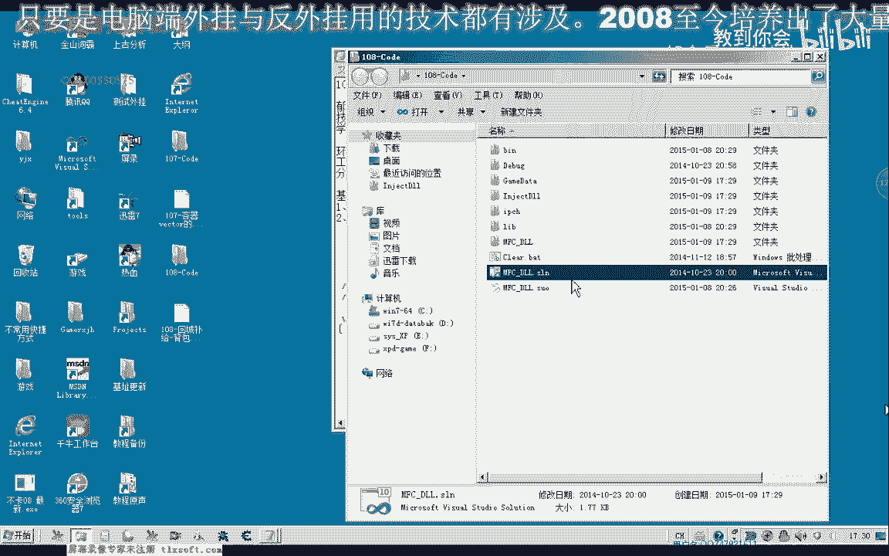
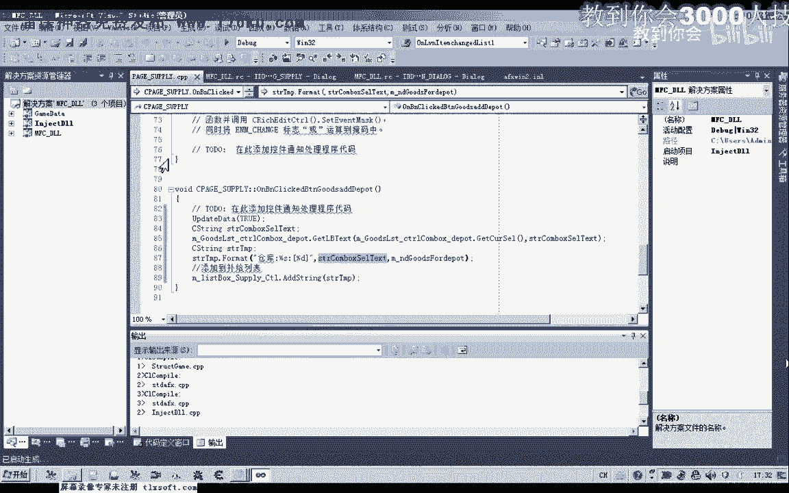
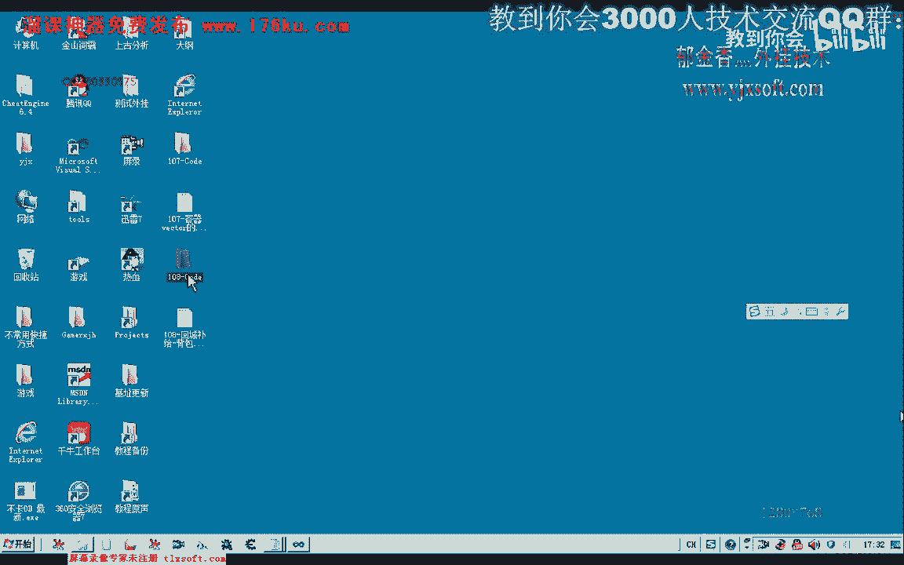
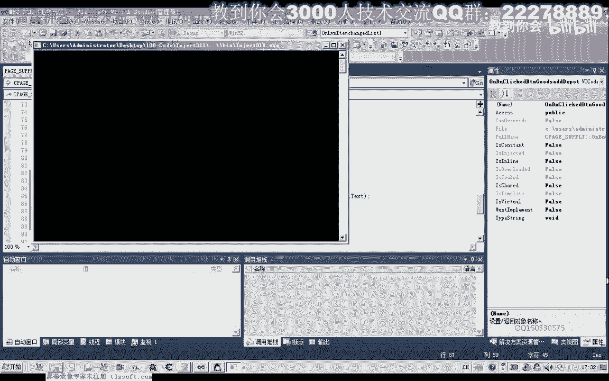
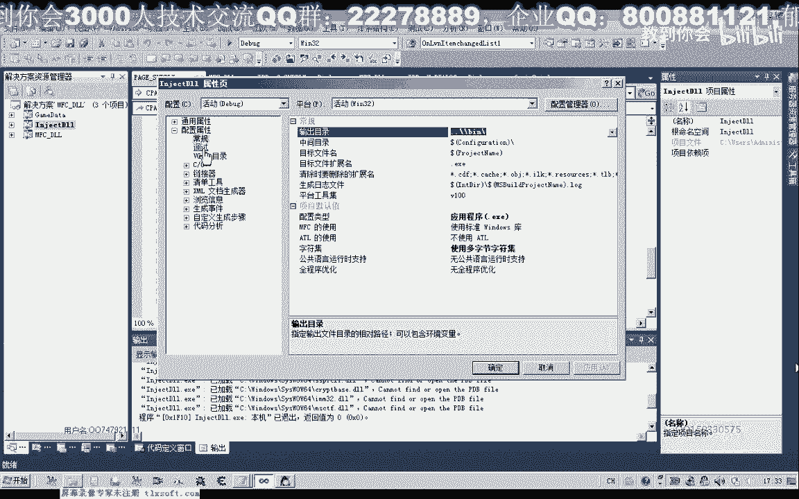
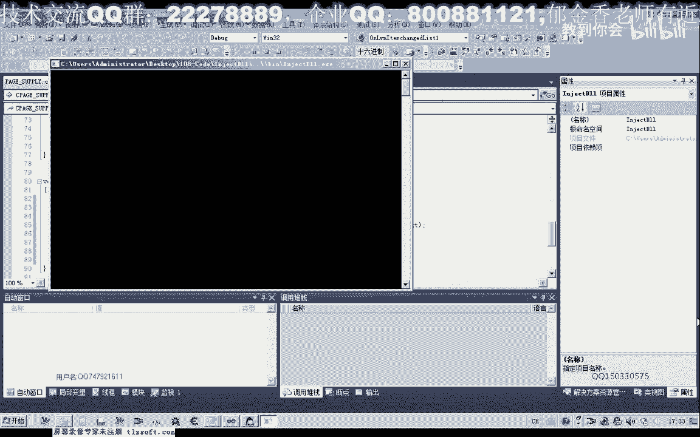
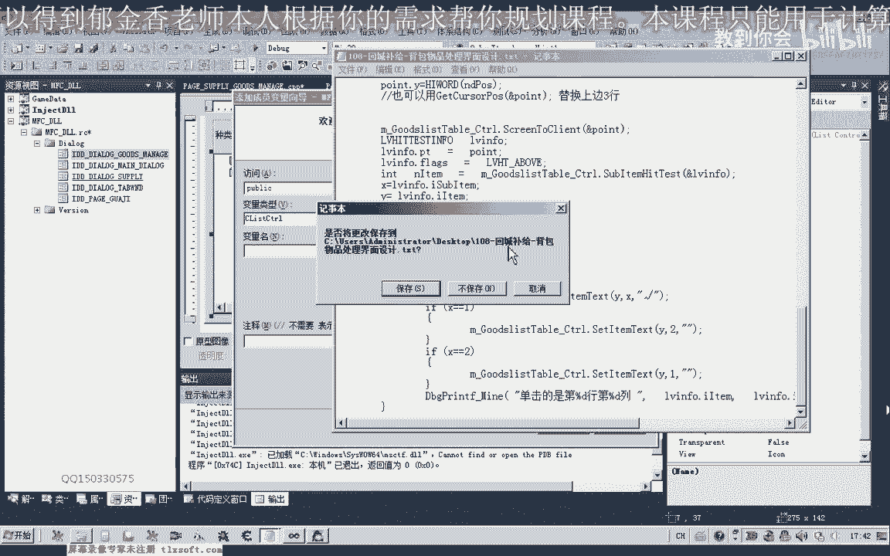
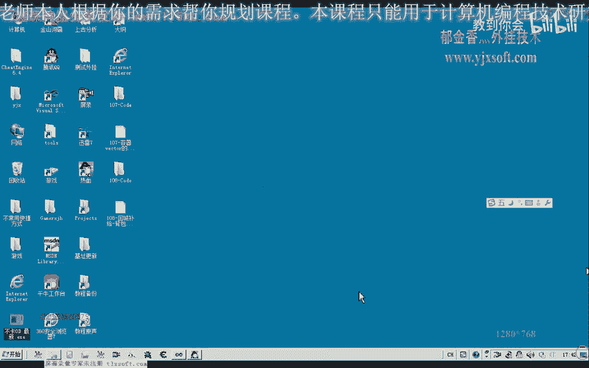
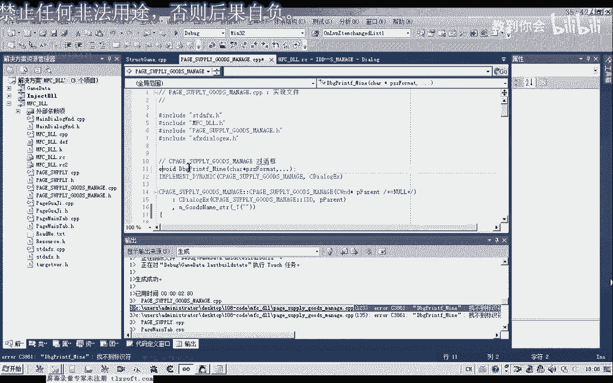

# 郁金香老师C／C++纯干货 - P97：108-回城补给-背包物品处理界面设计 - 教到你会 - BV1DS4y1n7qF

大家好，我是郁金香老师，那么这节课我们主要是做一些界面的设计，那么一个是仓库的一个记的一个列表，那么另外一个是我们背包物品一个处理的，一个界面的一个设计，那么也就是我们背包物品的一些去向。

回神补迹的时候，那么一个是回神补迹的物品，我们有可能从仓库里面去物品，那么另外一种情况，也就是从商店里面买物品来进行补充物品，那么另外一种也就是我们出售物品给商店，或者是放物品到仓库。

那么一般分为这几种情况，那么补记的也就是从仓库和商店这两个地方，那么出售的我们另外写一个列表，那么一个是相当于一个是补记的一个列表，另外一个是出售或者是保存的一个列表，好的。

那么我们先打开第107个的代码，那么首先我们简单的处理一下，记得这个列表，添加仓库的这一部分。

那么首先我们也跟他添加相应的初始化部分，把精创药这一类的我们都给他添加进去，然后我们需要来在这里来添加相应的代码，那么它的代码的话，我们可以在之前的基础上进行修改，把前面的这一段复制过来。

然后在这里添加相应的代码，那么这是我们保存到仓库的，那么同样的这里的关键字格式化，也就是一个去向问题了，我们就要写去仓库这里补记，然后这里的名字我们需要做一下修改，那么这里是仓库的成员变量复制一下。

那么最后这里我们把它添加进去，当然这里我们它的一个物品，也是仓库的，那么大致我们就可以这样的修改，那么我们现在测试一下，那么我们还需要来打开游戏。

好的。

那么我们注入一下游戏。

看一下我们这边界面的一个效果，那么我们显示一下外挂。

看一下补记这里，添加一个这个时候显示仓库，这里显示我们的药店去向式，从药店，一个是从我们的仓库进行补习，好的，那么这些数据我们就添加到了一个，补记的一个列表，那么另外的我们就是说还需要来添加。

一个背包物品的一个处理，比如说背包里面肯定有很多垃圾，这一类的，我们有的需要存放到仓库里面，那么有的我们需要来储备给我们的，商店，那么我们在这里再添加另外的一个，按钮用来处理我们仓库的一个物品。

在这里我们再添加一个按钮，可以放在这上面这个空位，那我们就把它叫做背包物品处理，或者我们叫做简单的物品处理，只要知道它的一个大致意思就可以了，那么在这个物品处理这里面，我们另外来显示一个仓库的一个界面。

在这边我们给它另外添加一个仓库的，一个资源，插入一个窗口，那么这个窗口也就是我们要显示的窗口，因为我们刚才的界面的话，它已经放不下这么多东西了，所以说这里我们另外用一个窗口来进行一个相应的处理。

我改一下它的ID，就叫物品的一个处理，那么在这里我们主要的添加一个列表的空间，ListControl，那么这个空间我们就来相当于我们刚才的列表，就来因为设计的物品可能要多一些。

如果我们再用刚才的listBox，用这个空间来处理的话就不是很好，那么我们最好来用像Excel这一类表格来处理，可能要好一些，那么这里我们再添加几个项目，一个是静态文本的一个说明。

那么我们可以跟它分一个类，那么这里是物品的一个种类，那么种类后边我们跟一个listBox或者是comboBox，用来显示物品的一个种类，那么这里我们可以做一个初始化。

那么这里分类里面我们可以添加一些数据，比如说我们的是衣服这一类的，或者是我们石头这一类的，或者是武器，那么还有或者是一个活字，或者是其他的这一类的，或者是药品，好的，那么在后边。

我们再跟一个物品的一个名字用来添加到我们的列表里面去，那么先添加一个静态的文本，那么物品名后边我们跟一个编辑框，编辑框也就是我们物品的名字，那么后边我们添加几个按钮。

这个按钮用来我们添加我们相应的一个数据，那么我们把它复制一下，那么我们用来删除选中的一个项，那么另外我们还需要一个用来返回，把它大一点，那么在这里我们按内容来调整大小，那么这里我们叫转转。

那么最后我们还需要一个来返回到上一层，这里是Tab，我们调整一下它的一个位置，调整好之后，我们需要在这里来添加我们的一个代码，那么在添加代码之前，我们需要把Nisti Country进行一个初始化。

要设置一下它的一个格式，那么我们先把这个界面进行内化，这个是基页面下面的，我们作为一个物品处理的一个页面，那么在这里，我们还需要来进到相应的类里面，那么我们要重写它的初始化函数，在初始化函数这里。

我们需要了初始化我们的Nisti Country，当然在这之前的话，我们需要了给它关联一个电量。

那么这里我们选空间类型，这是变量的一个名字，那么方便我们在这个类的初始化函数，里面对它进行一个初始化，转到初始化函数，那么我们重写的这个函数，刚才我们选错了，应该是在前面这一个，那么在初始化函数这里。

我们需要设置它的一个相应的格式，那么由于代码比较多，我们直接把初始化的这段代码的，那么我们做一下相应的一个说明，那么首先我们需要获得Nisti Country，它原有的一个格式。

那么最后我们需要的主要的是要跟它加上一个report，这个格式也就是它的实际上数值为1，那么有了report这个格式，它表现出来的才是一个网格，一个表格的形式，那么另外需要设置的一个是网格线。

这个是一个扩展的格式里面的，可以通过这个函数来获得它本身的一个扩展的格式，然后保存在这个常量里面，然后再跟它添加新的格式，网格线或者是选择某行的高量，这两个是扩展格式里面。

我们要把这个属性来跟它添加进去，保存在这个变量里面，最后用这个settingstyle来设置扩展的一个风格，那么最后就是我们的相当于是一个选项卡，这里的添加每一页的相应的名称，那么添加了之后。

我们先编译一下来看一下现在的一个效果，物品除了这里来我们还需要来显示，显示相应的窗口，那么在这之前的话，我们还需要到这里来显示窗口，那么要显示它的话，我们需要在补给的这个类里面来添加相应的一个成员。

我们先移到这个类的定义这里，那么首先我们包含它的一个投文件，物品处理的页面的一个投文件，那么在这里我们需要进行一个相应的说明，那么在这里我们把它设置一致，等会这些代码才可以利用起来，那么成员编程的名字。

我们就设为这一个，那么设置了成员编程之后的话，我们就可以在这里来对它进行一个操作，那么物品处理这里来我们就显示这个页面，当然在这里面我们也要添加一个按钮，就是这个返回这里。

那么返回这里我们就隐藏它本身对象，好的，那么我们先编译一下，那么我们先编译一下，那么我们再来看一下，去页面这里，那么我们还应当要对它进行一些初始化，这个页面，我们需要在这个窗口创建的同时。

要创建这个窗口的一个页面，不然的话我们不能够对它进行一个显示，那么我们再转到我们的这个补给的内里面，在它的一个初始化函数这里，我们进行重启，那么首先我们要创建这个物品，然后它的ID，我们要给它传进去。

那么只有先创建了我们这个页面，我们才可以显示它，好的，我们再来看一下，那么创建之后的话，显示不出来了，它可能已经显示了，可能是被其他的窗口遮挡掉了，那么在这里创建的时候，我们还需要来跟它设置一个副窗口。

或者是这个副窗口的话，我们最好是设置为选项卡，那么这样的话，它与我们当前的窗口的话，才属于同一个显示的一个层次，那么我们移动到table这里，看一下它的初始化部分，後來才能夠做到，所以就是，我們再看看。

這瓶酒，我們再看看，這瓶酒的味道，這瓶酒的味道，這瓶酒的味道，形成一種，不同的行為，我們再看看，這瓶酒的味道，這瓶酒的味道，後來，我們來看看，我們來看看，我們來看看，這瓶酒的味道，這瓶酒的味道。

這瓶酒的味道，這瓶酒的味道，這瓶酒的味道，這瓶酒的味道，這瓶酒的味道，這瓶酒的味道，這瓶酒的味道，這瓶酒的味道，這瓶酒的味道，這瓶酒的味道，在這個補氣這個地方，我們同時也對它的成員的頁面進行一個設置。

那麼設置首先是設置它的一個服裝卡，這樣的話我們物品處理的窗口與補氣的窗口就處於同一個層次，然後我們再設置一下它的相應的一個大小，把這兩句複製一下，然後我們在這裡添加一個所屬關係，好的。

那麼我們再重新編譯一下，這是一個廣東話的字體，這是一個廣東話的字體，這是一個廣東話的字體，這是一個廣東話的字體，這是一個廣東話的字體，這是一個廣東話的字體，這是一個廣東話的字體，這是一個廣東話的字體。

這是一個廣東話的字體，這是一個廣東話的字體，這是一個廣東話的字體，這是一個廣東話的字體，這是一個廣東話的字體，這是一個廣東話的字體，這是一個廣東話的字體，這是一個廣東話的字體，這是一個廣東話的字體。

這是一個廣東話的字體，這是一個廣東話的字體，這是一個廣東話的字體，這是一個廣東話的字體，這是一個廣東話的字體，這是一個廣東話的字體，這是一個廣東話的字體，這是一個廣東話的字體，這是一個廣東話的字體。

這是一個廣東話的字體，這是一個廣東話的字體，這是一個廣東話的字體，這是一個廣東話的字體，這是一個廣東話的字體，這是一個廣東話的字體，這是一個廣東話的字體，這是一個廣東話的字體，這是一個廣東話的字體。

這是一個廣東話的字體，這是一個廣東話的字體，這是一個廣東話的字體，這是一個廣東話的字體，這是一個廣東話的字體，這是一個廣東話的字體，這是一個廣東話的字體，這是一個廣東話的字體，這是一個廣東話的字體。

這是一個廣東話的字體，這是一個廣東話的字體，這是一個廣東話的字體，這是一個廣東話的字體，這是一個廣東話的字體，這是一個廣東話的字體，這是一個廣東話的字體，這是一個廣東話的字體，這是一個廣東話的字體。

這是一個廣東話的字體，這是一個廣東話的字體，這是一個廣東話的字體，這是一個廣東話的字體，這是一個廣東話的字體，這是一個廣東話的字體，這是一個廣東話的字體，這是一個廣東話的字體，這是一個廣東話的字體。

這是一個廣東話的字體，這是一個廣東話的字體，這是一個廣東話的字體，這是一個廣東話的字體，這是一個廣東話的字體，這是一個廣東話的字體，這是一個廣東話的字體，這是一個廣東話的字體，這是一個廣東話的字體。

這是一個廣東話的字體，這是一個廣東話的字體，這是一個廣東話的字體，這是一個廣東話的字體，這是一個廣東話的字體，這是一個廣東話的字體，這是一個廣東話的字體，這是一個廣東話的字體，這是一個廣東話的字體。

這是一個廣東話的字體，這是一個廣東話的字體，這是一個廣東話的字體，這是一個廣東話的字體，這是一個廣東話的字體，這是一個廣東話的字體，這是一個廣東話的字體，這是一個廣東話的字體，這是一個廣東話的字體。

這是一個廣東話的字體，這是一個廣東話的字體，這是一個廣東話的字體，這是一個廣東話的字體，這是一個廣東話的字體，這是一個廣東話的字體，這是一個廣東話的字體，這是一個廣東話的字體，這是一個廣東話的字體。

這是一個廣東話的字體，這是一個廣東話的字體，這是一個廣東話的字體，這是一個廣東話的字體，這是一個廣東話的字體，這是一個廣東話的字體，這是一個廣東話的字體，這是一個廣東話的字體，這是一個廣東話的字體。

這是一個廣東話的字體，這是一個廣東話的字體，這是一個廣東話的字體，這是一個廣東話的字體，這是一個廣東話的字體，這是一個廣東話的字體，這是一個廣東話的字體，這是一個廣東話的字體，這是一個廣東話的字體。

這是一個廣東話的字體，這是一個廣東話的字體，這是一個廣東話的字體，這是一個廣東話的字體，這是一個廣東話的字體，這是一個廣東話的字體，這是一個廣東話的字體，這是一個廣東話的字體，這是一個廣東話的字體。

這是一個廣東話的字體，這是一個廣東話的字體，這是一個廣東話的字體，這是一個廣東話的字體，這是一個廣東話的字體，這是一個廣東話的字體，這是一個廣東話的字體，這是一個廣東話的字體，這是一個廣東話的字體。

這是一個廣東話的字體，這是一個廣東話的字體，這是一個廣東話的字體，這是一個廣東話的字體，這是一個廣東話的字體，這是一個廣東話的字體，這是一個廣東話的字體，這是一個廣東話的字體，這是一個廣東話的字體。

這是一個廣東話的字體，這是一個廣東話的字體，這是一個廣東話的字體，這是一個廣東話的字體，這是一個廣東話的字體，這是一個廣東話的字體，這是一個廣東話的字體，這是一個廣東話的字體，這是一個廣東話的字體。

這是一個廣東話的字體，這是一個廣東話的字體，這是一個廣東話的字體，這是一個廣東話的字體，這是一個廣東話的字體，這是一個廣東話的字體，這是一個廣東話的字體，這是一個廣東話的字體，這是一個廣東話的字體。

這是一個廣東話的字體，這是一個廣東話的字體，這是一個廣東話的字體，這是一個廣東話的字體，這是一個廣東話的字體，這是一個廣東話的字體，這是一個廣東話的字體，這是一個廣東話的字體，這是一個廣東話的字體。

這是一個廣東話的字體，這是一個廣東話的字體，這是一個廣東話的字體，這是一個廣東話的字體，這是一個廣東話的字體，這是一個廣東話的字體，這是一個廣東話的字體，這是一個廣東話的字體，這是一個廣東話的字體。

這是一個廣東話的字體，這是一個廣東話的字體，這是一個廣東話的字體，這是一個廣東話的字體，這是一個廣東話的字體，這是一個廣東話的字體，這是一個廣東話的字體，這是一個廣東話的字體，這是一個廣東話的字體。

這是一個廣東話的字體，這是一個廣東話的字體，這是一個廣東話的字體，這是一個廣東話的字體，這是一個廣東話的字體，這是一個廣東話的字體，這是一個廣東話的字體，這是一個廣東話的字體，這是一個廣東話的字體。

這是一個廣東話的字體，這是一個廣東話的字體，這是一個廣東話的字體，這是一個廣東話的字體，這是一個廣東話的字體，這是一個廣東話的字體，這是一個廣東話的字體，這是一個廣東話的字體，這是一個廣東話的字體。

這是一個廣東話的字體，這是一個廣東話的字體，這是一個廣東話的字體，這是一個廣東話的字體，這是一個廣東話的字體，這是一個廣東話的字體，這是一個廣東話的字體，這是一個廣東話的字體，這是一個廣東話的字體。

這是一個廣東話的字體，這是一個廣東話的字體，這是一個廣東話的字體，這是一個廣東話的字體，這是一個廣東話的字體，這是一個廣東話的字體，這是一個廣東話的字體，這是一個廣東話的字體，這是一個廣東話的字體。

這是一個廣東話的字體，這是一個廣東話的字體，這是一個廣東話的字體，這是一個廣東話的字體，這是一個廣東話的字體，這是一個廣東話的字體，這是一個廣東話的字體，這是一個廣東話的字體，這是一個廣東話的字體。

這是一個廣東話的字體，這是一個廣東話的字體，這是一個廣東話的字體，這是一個廣東話的字體，這是一個廣東話的字體，這是一個廣東話的字體，這是一個廣東話的字體，這是一個廣東話的字體，這是一個廣東話的字體。

這是一個廣東話的字體，這是一個廣東話的字體，這是一個廣東話的字體，這是一個廣東話的字體，這是一個廣東話的字體，這是一個廣東話的字體，這是一個廣東話的字體，這是一個廣東話的字體，這是一個廣東話的字體。

這是一個廣東話的字體，這是一個廣東話的字體，這是一個廣東話的字體，這是一個廣東話的字體，這是一個廣東話的字體，這是一個廣東話的字體，這是一個廣東話的字體，這是一個廣東話的字體，這是一個廣東話的字體。

這是一個廣東話的字體，這是一個廣東話的字體，這是一個廣東話的字體，這是一個廣東話的字體，這是一個廣東話的字體，這是一個廣東話的字體，這是一個廣東話的字體，這是一個廣東話的字體，這是一個廣東話的字體。

這是一個廣東話的字體，這是一個廣東話的字體，這是一個廣東話的字體，這是一個廣東話的字體，這是一個廣東話的字體，這是一個廣東話的字體，這是一個廣東話的字體，這是一個廣東話的字體，這是一個廣東話的字體。

這是一個廣東話的字體，這是一個廣東話的字體，這是一個廣東話的字體，這是一個廣東話的字體，這是一個廣東話的字體，這是一個廣東話的字體，這是一個廣東話的字體，這是一個廣東話的字體，這是一個廣東話的字體。

這是一個廣東話的字體，這是一個廣東話的字體，這是一個廣東話的字體，這是一個廣東話的字體，這是一個廣東話的字體，這是一個廣東話的字體，這是一個廣東話的字體，這是一個廣東話的字體，這是一個廣東話的字體。

這是一個廣東話的字體，這是一個廣東話的字體，這是一個廣東話的字體，這是一個廣東話的字體，這是一個廣東話的字體，這是一個廣東話的字體，這是一個廣東話的字體，這是一個廣東話的字體，這是一個廣東話的字體。

這是一個廣東話的字體，這是一個廣東話的字體，這是一個廣東話的字體，這是一個廣東話的字體，這是一個廣東話的字體，這是一個廣東話的字體，這是一個廣東話的字體，這是一個廣東話的字體，這是一個廣東話的字體。

這是一個廣東話的字體，這是一個廣東話的字體，這是一個廣東話的字體，這是一個廣東話的字體，這是一個廣東話的字體，這是一個廣東話的字體，這是一個廣東話的字體，這是一個廣東話的字體，這是一個廣東話的字體。

這是一個廣東話的字體，這是一個廣東話的字體，這是一個廣東話的字體，這是一個廣東話的字體，這是一個廣東話的字體，這是一個廣東話的字體，這是一個廣東話的字體，這是一個廣東話的字體，這是一個廣東話的字體。

這是一個廣東話的字體，這是一個廣東話的字體，這是一個廣東話的字體，這是一個廣東話的字體，這是一個廣東話的字體，這是一個廣東話的字體，這是一個廣東話的字體，這是一個廣東話的字體，這是一個廣東話的字體。

這是一個廣東話的字體，這是一個廣東話的字體，這是一個廣東話的字體，這是一個廣東話的字體，這是一個廣東話的字體，這是一個廣東話的字體，這是一個廣東話的字體，這是一個廣東話的字體。

這是一個廣東話的字體，這是一個廣東話的字體，這是一個廣東話的字體，這是一個廣東話的字體，這是一個廣東話的字體，這是一個廣東話的字體，這是一個廣東話的字體，這是一個廣東話的字體，這是一個廣東話的字體。

這是一個廣東話的字體，這是一個廣東話的字體，這是一個廣東話的字體，這是一個廣東話的字體，這是一個廣東話的字體，這是一個廣東話的字體，這是一個廣東話的字體，這是一個廣東話的字體，這是一個廣東話的字體。

這是一個廣東話的字體，這是一個廣東話的字體，這是一個廣東話的字體，這是一個廣東話的字體，這是一個廣東話的字體，這是一個廣東話的字體，這是一個廣東話的字體，這是一個廣東話的字體，這是一個廣東話的字體。

這是一個廣東話的字體，這是一個廣東話的字體，這是一個廣東話的字體，這是一個廣東話的字體，這是一個廣東話的字體，這是一個廣東話的字體，這是一個廣東話的字體，這是一個廣東話的字體，這是一個廣東話的字體。

這是一個廣東話的字體，這是一個廣東話的字體，這是一個廣東話的字體，這是一個廣東話的字體，這是一個廣東話的字體，這是一個廣東話的字體，這是一個廣東話的字體，這是一個廣東話的字體，這是一個廣東話的字體。

這是一個廣東話的字體，這是一個廣東話的字體，這是一個廣東話的字體，這是一個廣東話的字體，這是一個廣東話的字體。

