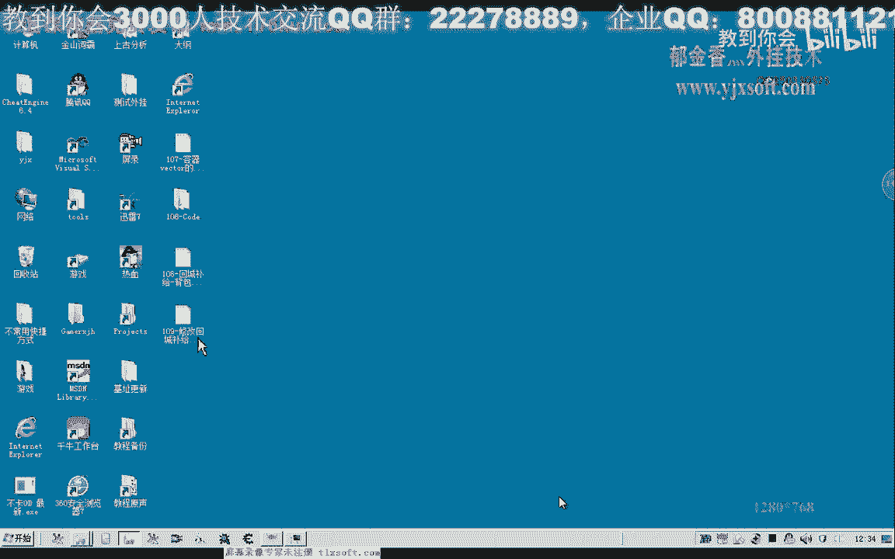
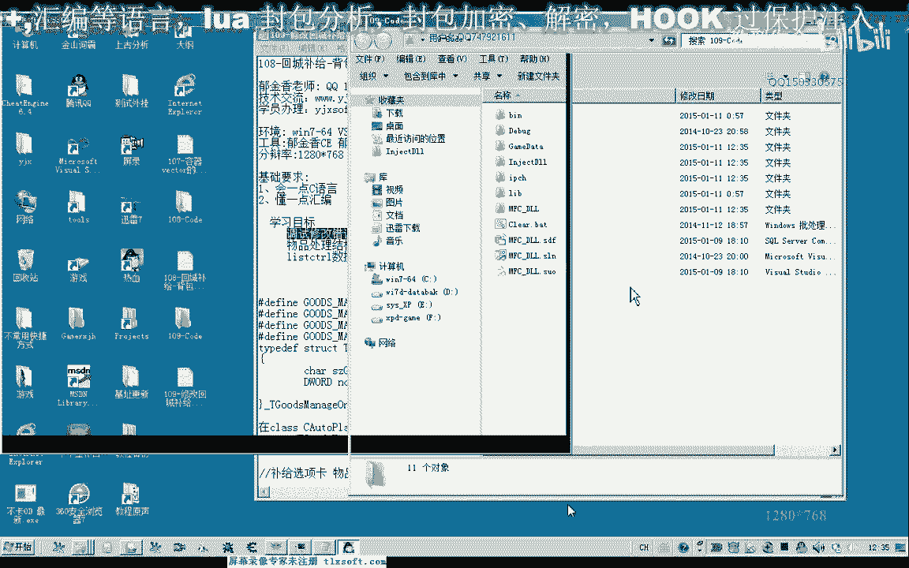
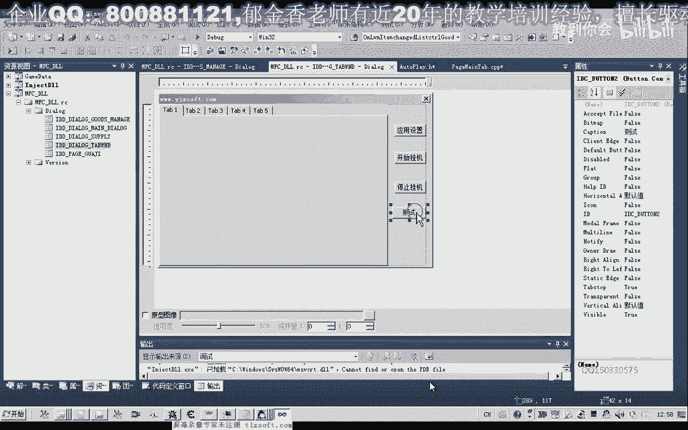
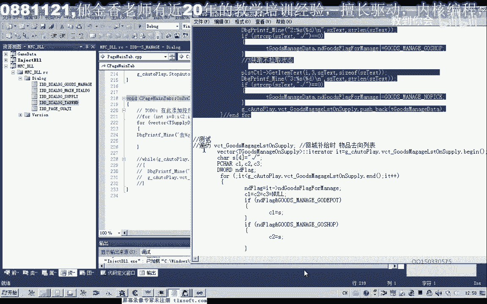
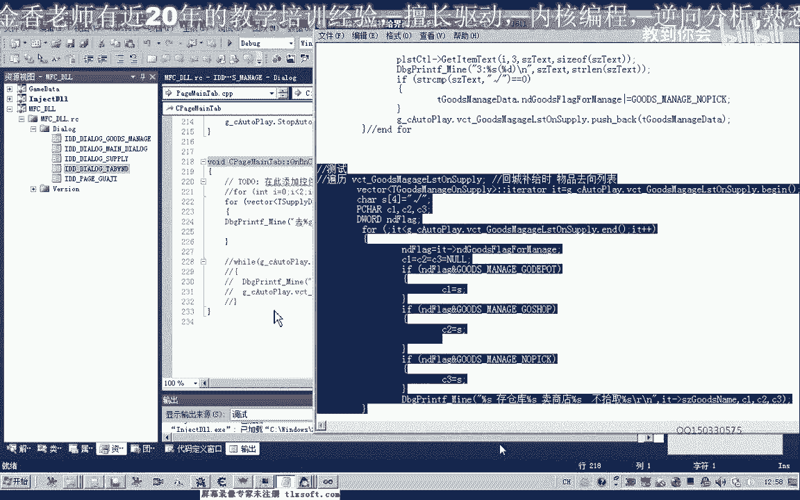
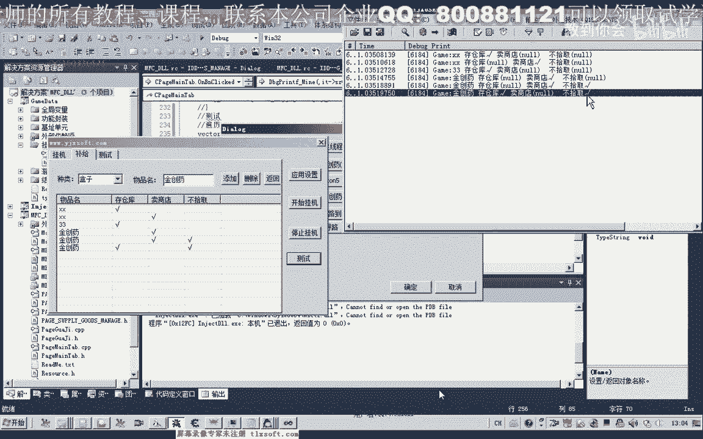

# 郁金香老师C／C++纯干货 - P98：109-修改回城补给界面和更新窗口数据到对象列表 - 教到你会 - BV1DS4y1n7qF

大家好。

我是俞京翔老師，那麼這集我們主要來是修改一個錯誤，另外來添加一個物品結構，還有也就是把我們NIST country，控件裡面的數據，更新到我們的，玩家掛機位裡面，好的。

那麼我們首先來查找一下上一課的一個錯誤，那麼我們先把代碼來打開，109克的代碼，那麼打開代碼之後。

我們再來看一下我們出錯的代碼的地方，物品處理，然後我們是NIST country的控件，那麼這個控件裡面的話，我們看一下我們哪些地方容易出錯，那麼像前面這一類的API函數的話，這個它沒有參數。

不可能出錯，那麼這裡也沒有涉及到指針的一個訪問，基本上是不可能出錯的，那麼另外就是這個函數，這個函數的話，這裡我們也跟他分配了一個結構，這個指針的話也是正確的，理論上也不可能出錯。

那麼這裡我們也跟他分配了相應的結構，也不可能出錯，那麼可能出錯的話，這個函數這裡，這裡我們是打印的是整數，也不是自創或者是結構這類的，它不涉及到指針的這類的訪問，它理論上也不會出錯。

那麼唯一可能出錯的就是這個地方，那麼這個地方涉及到一個座標，那麼這兩個座標的話，它有可能來造成一個下標的一個越界，那麼比如說我們只添加了兩行，但是如果這個Y座標，如果它越界了，那麼就可能造成出錯。

那麼我們再把後邊這一段，先把它return，也就是相當於注釋掉後邊的代碼，不會被執行了，那麼我們再來看一下，它執行的一個流程，那麼順便我們把這些有警告的地方，也把它更改一下。

那麼這裡我們加上一個強制類型的一個轉換，因為警告過多的話，我們看著也不是很舒服，那麼這裡我們調用安全版本的橫豎，這樣就沒有警告了，看起來輸出的信息就比較乾淨，好的，那麼我們顯示一下我們的這個勃起窗口。

那麼這裡我們添加幾個行，然後我們再查看一下，輸出的調試信息，那麼但是我們注意一點，在這裡的話，我們單擊了一個項，它一共一下子就產生了三者相應的信息，那麼這種處理的話，它本身也不是很效率。

而且我們如果是單擊了，在後面的這些區域的話，這裡下標它會越界，它會越界，那麼本身它也不是很效率，那麼所以說我們考慮了，另外跟它關聯一個相關的信息，那麼比如說我們可以關聯這個鼠標單擊的信息。

那麼現在的話我們看一下，這個它一共我們單擊某一行的時候，它會產生兩個信息，兩個就是說我們選出的信息更改了，它一共會被執行兩次，那麼如果我們是另外選一行的話，甚至它會執行三次，這樣的話我們的代碼的話。

它會反復的多執行幾次，這樣影響我們的效率，所以說出錯的地方也可能就是我們的剛才的函數，它可能是一個下部的越界，還有可能也是代碼被執行了三次，造成了其他的異常。

那麼我們可以把這部分代碼移植到我們的鼠標單擊的信息裡面去，它相關聯，那麼把這個輿圖先注釋掉，也可以一起把它移植過去，那麼這後面這一片數據，剪掉，然後我們找到這裡，空間的事件。

找到去這個Click單擊鼠標的左鍵，那麼在這裡我們與它關聯的相應的函數，添加我們的代碼，把我們的代碼輻射到這裡來，那麼然後我們再來看一下，然後我們再次進行測試，再來看一下調試信息。

然後我們在這裡隨便的添加幾個物品名，然後我們再訪問相應的地方，那麼這個時候我們可以發現我們單擊某一行的時候，它也能夠取得相應的座標，但是這個時候我們就顯得更加的效率，因為你選中某一個單元格的時候。

它只會執行一次相應的代碼，那麼理論上的話這個時候可能會出錯了，那麼我們再來進行一下調試，那麼這個時候我們可以發現，響應的速度也快上了很多，那麼而且不會出錯，但是代碼還是有一些錯誤，因為我們第一行的時候。

這個物品名的話我們不應當去改變它，所以說在這裡我們還需要加上一個下標的判斷，在這裡，那麼一個是不能夠超出範圍，那麼我們還要加上一個判斷，也就是我們的X座標，它必須要大於0，必須要大於0才可以。

它不能夠為0，因為為0的話，我們是對第一個標籤進行設置，也就是我們的第一列進行設置，好的，那麼我們再來看一下，好的，編譯之後，我們再次進行測試，那麼這個時候來選中前面的時候就不會。

那麼從倉庫或賣商店只能選一個，這個時候也是可以的，那麼不撿這個東西，也就是不拾取與賣商店或者是存倉庫，可以是同時選取的，好的，那麼我們再來看一下，應用下設置測試，當然這個時候測試裏面。

我們沒有添加相應的代碼，因為我們之前的話測試它只遍領了這個地方，遍領了這個地方，那麼這幾個我們也把我們的物品處理的，表格裏面的數據，我們也把它更新到我們的掛機率裏面，那麼也就是說我們需要在掛機率裏面。

設計一個相應的結構，來接收這些數據，接收這些數據，那麼我們可以這樣的設計，我們先把窗口關掉，那麼首先我們在這前面添加一個相應的結構，那麼由於這個數據比較多，那麼我們為了精簡一點，我這裏提前就把它準備好。

那麼我們首先直接複製出來，那麼這個結構一個是物品的一個名字，那麼後面這個Dword的變量，用來標記了我們的處理的方式，那麼0表示不處理，1表示存倉庫，2表示賣商店，4表示不拾取，那麼這個原理的話。

它是利用的我們的二進制來實現的，那麼比如說我們的4，那麼4的話轉換成二進制，就是124，也就是第三位，第三的一個二進制位，它等於1，是這樣來實現的，那麼如果我們是2的話，我們來看一下。

那麼這個是我們利用的二進制的原理，因為我們最大的這個數的話，它一共可以是32位，也就是4個字節，32位的話它可以表示32種狀態，實際上那麼我們這裏，它這裏相當於0表示沒有。

那麼1表示我們的二進制的第一位為1，那麼2的話表示第二位為1，那麼這裏第三位為1，它是為4，就是我們剛才在這個計算器裏面看到的，那麼我們也可以用這種方式來看一下，12345678。

那麼這就是我們的4字節的-1，那麼當然-1是相當於是帶符號的數來表示的，那麼如果是無符號的數，那麼這個8個F的話就表示的是一個整數的最大值，那麼我們用二進制來顯示看一下，它一共就有32個這個數字的1。

是32個，那麼這個數字1的話，我們就相當於來這裏的這個存倉庫來表示第一位為1，那麼售商店的第二位為1，但是它的數字也就是為2，轉換成我們的四進制，那麼這一位它為1，也就是第三位的時候為1，我們是4。

那麼通過這幾個數字的一個組合的話，那麼我們進行一些位運算，我們就可以了取得它相應的一個設置的一個數字，當然如果是對位運算沒有具體的了解的話，那麼可能這樣理解起來比較複雜，那麼等一會我們看一下我們的代碼。

可能就更好的理解了，而且這種方式來用的比較多，它比較節省我們的空間，好的，那麼這個也就是說它可以表示幾種類型，那麼也可以表示我們存倉庫和博實區，這兩個都選擇的話，那麼它最終的一個數字就是5。

那麼這個數字5的話，它也包含4，那麼也包含1，那麼如果是這個數字7的話，就表示了這三位都已經選取，當然我們到時候可以取相應的位，可以取相應的位，好的，那麼我們的結構就是這樣的一個設計。

那麼這個結構設計好了之後，我們整個列表的話，它肯定包含了很多項，那麼是一個樹種，但是這個樹種的大小它又不固定，那麼我們就可以用之前的這個Wiktor來進行一個操作，它就相當於是一個動態樹種。

那麼在這裡我們也用，我們剛才定義的物品處理的結構，然後我們把這個結構定義成一個動態的一個Wiktor的容器的一個樹種，那麼也添加到它的一個成員裡面去，那麼這裡是相當於我們物品，物品補給的一個樹種。

那麼這裡相當於是回程補給式了物品的一個去向的一個樹種的一個列表，那麼這個設計好了之後，我們就可以來開始把我們的相應的補給列表裡面的這些數據，更新到我們的樹種裡面，那麼在這裡邊的話。

它每一行就是一個我們的數據，我們可以來看一下，那麼這一行的話，我們應該怎麼來表示了，那麼首先我們第一個是物品名，我們先把它取出來，取出來之後，我們就存放到我們的結構裡面，是相當於這個對的結構裡面。

那麼我們現在可以定義一個變量存放物品的名字，那麼後面我們這裡只有一個變量，那麼怎麼去存放這三個數據，這裡有一個兩個有三個數據，那麼這個時候我們就可以用一個未運算了，這裡的表示的是1，這裡是2，這裡是4。

那麼我們可以用剛才我們說的未運算，那麼如果第一位它是1的話，那麼我們再來與1進行一個運算，進行一個運算，那麼如果它本身這裡是為0的話，那麼它就為1了，表示這裡選中，那麼如果這裡沒有選中的話。

那麼我們就可以不管它，它本身就是為0的，因為我們肯定要進行一個初始化，那麼如果是這一下與這一下不時取兩項，都同時選取了，那麼最後這裡它的結果就是，二進制的就是101，那麼最後就是我們的數字6。

應該是數字5，就是數字5，那麼數字5我們到時候要取數據的時候，我們可以進行一個貨運算，那麼我們可以取相應的這一位，檢測它的第一位，這裡是不是為1，如果是為1的話，就表示了這個存倉庫，都去了。

那麼如果我們要檢查第二位的時候，我們可以就檢查它的第二位是不是為1，這個二進制的，那麼我們也可以檢查它的第三位是不是為1，那麼第三位這裡實際上就是檢測裡面，它是不是，就是這裡的話。

它表示的話就是二進制的001，實際上，那麼這裡實際上我們可以這樣表示，就是表示100檢查這一位，那麼這裡表示的是0010，那麼這裡表示的是二進制的001，那麼我們進行貨運算的時候，就是去檢測相應的位。

這個是貨運算，那麼我們進行位的一個運算的時候，那麼我們就是去檢測這一位，那麼這個是為了一個操作，把相應的數據添加到裡面去，好的，那麼我們接下來我們就可以開始，測分我們的數據。

然後把它保存到我們的解庫裡面，然後再添加到Wikipedia的容器裡面，那麼在這裡的話，我們需要在應用設置裡面，進行相應的數值的一個添加，好的，我們來看一下代碼應該怎麼寫，這個代碼比較多。

那麼我們來看一下，那麼首先我們是取得，這個Wikipedia這個Nested Country，這個空降的一個指針，因為這個數據來太長了，我們直接操作的話不是很方便，所以說我們用另外一個指針。

來對它進行一個操作，那麼首先我們要遍離整個列表，要遍離整個列表，那麼這個列表一共有三行，那麼這裡我們就循環三次，那麼這裡它這個項目的數量就是3，012，它肯定也執行三次，那麼這樣我們對它遍離之後。

首先在這裡我們取出它第I行，這樣第I行，比如說它最先是從0開始，就是取第一行，那麼取第一行的第一個縮影，那麼取第一個縮影的話為0的話，也就是取1，也就是物品的名字，先把它取出來，先取出來。

取出來之後存放到SizeText的緩衝區裏面，然後因為下標為0的時候，它是物品的名字，所以說我們就把物品的名字，用STR Copy複製到這個結構裏面去，因為在這裡我們定義了這個結構的名詞變量，好。

那麼這是物品名，我們就這樣把它取出來了，然後我們在這裡再對它的一個標記做一個初始化，那麼這個標記初始化了之後，然後我們再取一個存倉庫狀態，看這裡有沒有勾選，那麼我們把這個字串取出來了之後。

也是保存在SizeText裏面，也是取得我們的第一，某一行的第一項，也就是存倉庫這裡，那麼取出來，如果它裏面的字符串等於勾選的，那麼我們在這裡就給它做一個什麼呢，做一個貨運算，貨運算。

那麼也就是說它本身為0的，那麼做了一個貨運算之後，也就是說它的第一位，如果它本身是為0的話，那麼做一個貨運算之後，它就為1了，但是我們做多次了，它也是為1，也是為1。

那麼我們又接下來又檢查商店的一個狀態，如果賣商店這裡的它也是勾選的，那麼我們也給它做一個貨運算，那麼把我們相應的狀態添加到我們相應的位，那麼當然這裡我們就是添加到二進制位的第二位，那麼這裡是第三位。

如果是不檢取的話，那麼這樣我們就把我們的狀態就添加進去了，添加到這個結構，那麼整個循環結束之後，我們的相當於第一行的數據的話，就添加到這個結構裡面去了，然後我們再把這個結構的Pushback進行壓榨。

壓到我們那個容器Wicked裡面，放到它的底部相當於，這就我們就添加了一個元素，像我們的這個容器裡面，然後整個循環，然後是第二次取物品，你也是取狀態，一次取狀態，然後放到標誌位裡面，狀態位裡面。

然後三行循環完，它的工作簡介就完成了，也就添加了三個元素，添加到我們的這個Wicked容器裡面，這樣添加完了之後，我們也可以做一個測試，那麼測試的話。

我們也是要直接來看代碼測試的時候。

那麼測試就要簡單很多。

那麼測試的話，這裡也是一個循環，那麼首先我們在這裡也是定一個Wicked指針對象，因為這個太長了，當然本來是這一行的話，可以寫在這個Four循環的這個位置，因為這一段代碼太長了。

所以說把它提到外邊來定義，定義這個指針，定義了之後，我們在這裡直接它的初始化這個條件，我們就不要就直接在這裡進行一個片例，那麼直到了它結束之後，條件結束之後，那麼我們的片例才結束。

那麼每次我們指針這個結構指值+1，那麼+1之後，我們也要從裡面取出相應的數據，那麼循環到第一的時候，它就取最底部的數據開始取，那麼開始取之後，最先我們取出的是它的一個標誌位，那麼標誌位取出來之後。

也是放到一個Dword的類型裡面，那麼首先我們就要檢測這個標誌位，那麼檢測標誌位，我們這裡就要用一個運算進行一個運行，那麼也就是說取出它相應的位，那麼是否就是相應的未來是否為1。

那麼在這裡我們取它的第一位，就是對它的第一位檢查是否是唯一的，那麼唯一的話，那麼我們這裡定義了三個支串類型的，那麼如果是唯一的話，那麼這裡我們就設1，就指向勾選的支串，然後檢測我們的第二位。

然後這裡是檢查的第三位相當於是，那麼第三位的話，也就是這個4，我們就是表示的1。0，二進制，那麼這一位如果它是唯一的話，那麼最後它的結果才為真，才大於0，還是一個大於0的，如果這一位它為0的話。

那麼最後整個表達式的值也為0，那麼這裡也就不會被執行，不會被執行的話，它本身也就是一個空支串，好，我們來看一下，編輯之後我們看一下最終的一個結果，那麼這就是一個結果，然後這就是我們取出的一個狀態。

這裡我們先要退出，然後重新生成，那麼我們需要把DLL要把它卸載掉，再重新輸入，然後我們在這裡顯示我們的物品窗口，那麼在這裡我們隨便給它添加一些名字，然後在這裡我們做一下相應的一個選擇。

那麼選擇之後我們把數據更新到我們的，Wikipedia容器列表裡面去，然後我們在這裡再測試，把信息清掉，再測試一下，那麼這個時候我們可以看到這個XX這個物品，它要存倉庫，但是不賣商店也不失去。

那麼XX第二行的它只是賣給商店，那麼第三行的存倉庫，它是只存倉庫，不賣店它也不失去，那麼金窗鑰，這裡它也是只賣商店，我們這裡可以看到，那麼最後兩行這裡它有兩條勾選，賣商店或者拾取，最後這裡存倉庫。

這裡也是不拾取，這裡也是打勾的，那麼這樣的話，我們的數據的話就是正確的，那麼在下面的這個過程裡面，我們就可以根據這些數據來處理我們背包裡面的相關的物品，它的一個去向，那麼是該留在背包裡面，還是該存倉庫。

還是該賣給商店，那麼它的一個物品處理的一個去向，我們就可以來從這些數據裡面來獲取，好的，那麼今天我們的課程就到這裡，那麼我們下一期課再見。

敬愛的觀眾朋友們 敬愛的朋友們今天是如何過的。