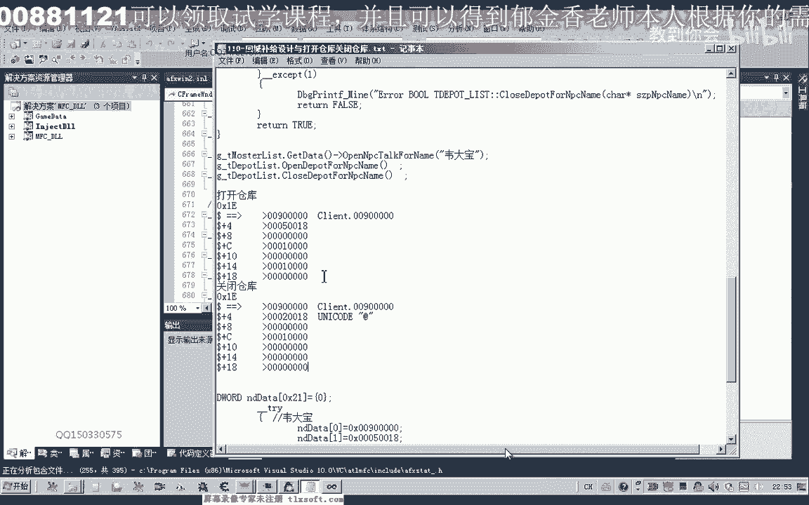
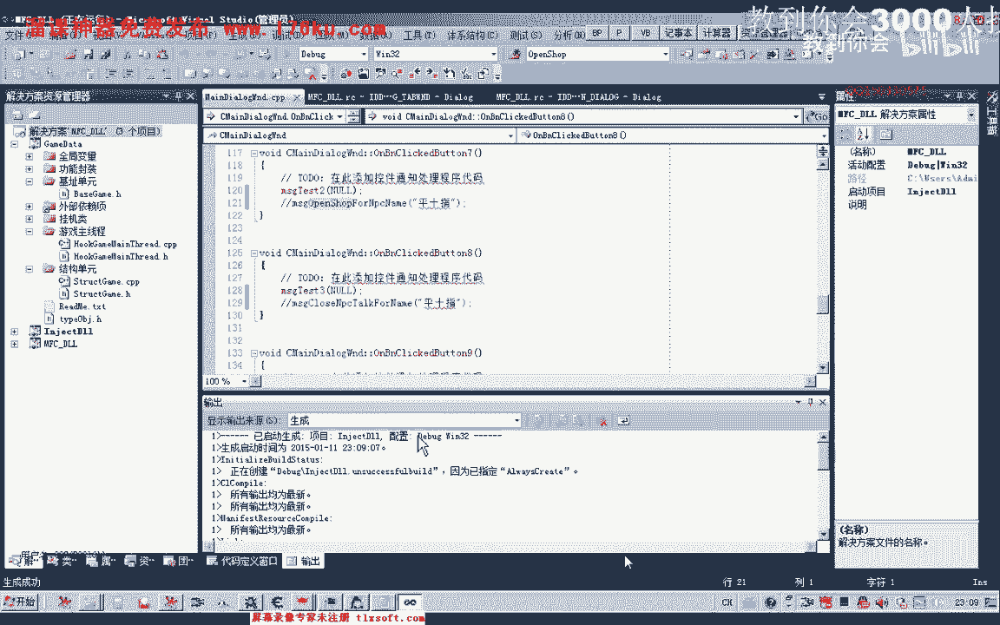

# P99：110-回城补给设计与打开仓库关闭仓库 - 教到你会 - BV1DS4y1n7qF

大家好，我是郁金香老师，那么这节课呢我们简单的说一下呃，灰尘笔记的一个大致的一个设计，那么回身补剂呢我们可以把它分为两个部分，那么一个是去仓库啊进行一个呃物品的一个存储的一个操作。

那么有的一部分物品呢我们需要保存到仓库的，那么我们就先到仓库里面去保存，保存了仓库之后呢，有一部分物品呢我们可能需要在仓库里面取出来，那么我们也在这一个功能函数里边完成，那么完成了之后呢。

我们再另外设计一个函数，去商店进行一个补给啊，买东西，那么另外还有一些背包的一些不要的一些东西呢，我们需要出售给商店的，那么也在这个函数里面来完成，那么我们先设计仓库这一部分啊。

仓库的话首先呢我们也要寻路到相应的npc的这个坐标，停下来之后呢，然后我们需要打开m pc，打开仓库呃，打开仓库之后呢，进行一个传获取的一个操作，完了之后呢，我们才在关闭仓库。

但是取啊我们从仓库里面取物品，这个函数呢我们在之前有封装和这个有分析和封装，但是我们的这个呃纯物品到仓库，还有就是打开m pc和关闭这个仓库的这个npc的话，我们没有封装相应的这个函数。

那么首先呢我们这节课呢就来分封装一下相应的这个函数，来看e109 课的代码，那么我们分析的流程呢，我们是要先取得这个缓冲区啊。

那么这个缓冲区的话我们可以呢，那也就是打开这个仓库的时候呢。

呃发包的一个缓冲区，那么我们可以先打开我们的附加到我们的游戏里面。

为什然后呢，我们呃转到我们发包的地址上边啊。

进行一个断点，下一个断点，把这个包包的获得这个弟子们扶持一下，然后我们在这个地方呢嗯下段先把游戏调出来，下一个断点啊，然后呢我们打开npc，在点击npc的时候呢，这个时候这个地方呢会断一下。

那么我们先把断点呢取消掉，返回到上一层的，这个地方啊不断下，但是这个地方会断一下，多次会断一下，多次的话，可能我们就这个断点来，可能是下错了吧，那么我们重新再下一下下一个这个断点，那么点击一下npc。

在这个地方下段再试一下，那么另外还有一个地方，把这个地方的断点了取消掉，然后我们再来看一下音乐，1g啊，这里有个地方啊断下了，另外有一个地方注意这个压榨呢参数呢是1亿啊，这个要多试几次。

那么我们再把这个断点呢取消掉，那么我们所要的话是只断一次的，在我们打开mp 3的时候，那么我们在此啊断一下，这个时候呢我们发现这个地方呢会被执行一次，那么刚才那个地方呢是断两次啊。

那么另外呢我们还需要再次打开mp 4的时候呢，进行一下测试，那么看一下他ex的这个数据，那么打开npc的时候来这里呢，这一段数据呢是我们npc嗯发包的这个缓冲区，我们把它取下来啊。

打开mp 4的这这个我们应该可以不要这个我们已经在怪物列表里边，我们已经有封装这个打开mp 4的这个相应的这个功能，那么我们所要的应应当是打开仓库才对啊，那么我们再次回到这个发包的这个缓冲区呢。

那下一个断点打开仓库的时候啊，让它断下，然后让我们返回那这个地方，我们发现了打开商店和打开仓库啊，可能是断在同一个地方，那么这里呢我们来看一下它一，因为这里的话缓冲区呢它是传到ex的。

那我们来看一下ex里面的一个数数值啊，那么复制下来呢，就是这一段啊，我们所取的这一段啊，550018这个100，这个100，这就是缓冲缓冲区的一个相应的一个数据，那么另外一个呢在关闭仓库的时候。

我们再次在这里下断，也取得它相应的一个缓冲区的数据好，那么这个时候断下把断点取消掉，那么我们看一下它的缓冲区呢也是ex，而且它这里传递的参数的话也是一，那么我们来看一下它相应的参数，那么就是这一段哈。

20018，这里100，这里是900，那么也就是我们下边的这一段参数啊，也就是缓冲区的一个数据好的，那么既然缓冲区的这个数据有了呃，另外呢我们对这个发包的这个货的话已经有一些封装了。

那么我们可以来呃参照他之前的打开商店的代码来进行这个设计，那么我们来看一下啊，结构单元，打开商店，我们搜一下shop商店相关的，那么再再说一下啊，给学分析，人大还有一个打开商店的这个动作。

我们看一下有没有，那么这个open shop的话，当时呢可能是封装错了哈，被封装到了我们的这个怪物列表里面来了，那么这里呢我们呃应当来把它封装在我们的，这个商店的列表里面呢更活力一些啊。

这里那么我们在这里呢把它改一下，我找一下shop，那么这里呢前缀我们也做一个相应的一个修改，那么修改之后呢，我们再把这个怪物列表里面的这个相应的代码呢，把它复制一下，找一下，转到它的这个定义部分。

那么把这一段代码再复制一下，好的，那么我们先申请一下，然后我们接下来的话我们就可以了，在这个函数的基础上来进行一个修改，那么在我们把这段代码来复制一下吧，那么我们可以先添加两个函数，在这个仓库这里边呢。

我们添加两个函数，那么一个是打开我们仓库的这，个是关闭我们仓库的，那么我们先转到图文件啊，仓库的，记下，那么另外一个呢是打开我们的npc，那么这段代码我们写好了之后呢。

我们可以把前面的代码呢你一直过来就可以了，然后把这两段代码复制一下，转到我们的cp p p p，然后我们再找到，说服相关的，我们说服，那么实际上后边这个参数来考虑可无，因为我们暂时没有用到哈。

只是预留了这样一个接口，那么我们把里边的代码复制一下，在ctrl减号退回，这里呢我们也进行复制，那么我们只需要改改变一下这个缓冲区就可以了，那么这里呢备注的名字呢我们可以写成它啊一大包。

然后这个缓冲区就是我们在后边哈取得的这个数据，那么这里呢我们只需要改为五，那么后面呢这里呢我们改为腰好，这样呢我们就可以来打开我们的仓库，那么关闭仓库呢，我们再来看一下，关闭仓库在这里啊。

那么我们来看一下关闭仓库的这个缓冲区，那么首先这里是二啊，这里我们需要改一下，那么这里呢我们改为腰，那么后边的话这篇呢都是零，那么我们这里呢把它改为零就可以了，这里呢可以不修改啊，也可以把它先简单一点。

那么这样的话我们就能够看，就能够关闭我们的这个仓库，那么最后呢我们把这里的异常处理呢，这里进行相应的信息呢进行替换，嗯，那么这是我们的打开仓库里关闭仓库啊，那么接下来我们封装好了之后呢。

我们可以来来进行相应的测试，先编译一下，那么编译成功之后呢，我们转到我们的主线程单元，那么这里呢有三个test，那么我们把之前的这个打开商店的这类信息呢先删掉，然后呢在这里呢我们首先呢通过怪物列表。

那么我们先注意要先调用这个get it，get it，get it代替初始化怪物列表，然后再调用我们的打开n p c对话的注意，这个名字一定要对大鹏，那么打开它的这个对话之后呢。

我们接着来通过我们的仓库列表，那么仓库列表来这里，我们需要来打开我们的这个仓库啊，当然后面的这个名字的话，我们站起来可以不要啊，也可以随便传一个名字，证据，因为这个时候呢我没有去什么作用啊。

这里呢最多只是为了增加一个可读性，我后边呢我们会有一个接口，那么这里呢我们最后呢啊关闭，那么这里呢关闭的话，我们可以不调用这个代替，当然也可以调用嗯，最后呢我们关闭这个仓库的这个对话。

那么另外呢我们还可以来做一个测试，因为在这里边呢我们另外的定义了一个呃，取这个仓库物品的这个函数啊，我们也可以一起来来进行测试啊，这条good for deport。

那么我们在这里呢需要另外随便添加一个按钮，那么我们这个还出来，我们就可以了，不挂解这个主线程上来测试也可以，那么在这里呢我们再添加一个按钮，取仓库物品，啊，那么这里呢我们取其中要小。

注意这个名字一定要对哈，那么呢我们一次取三个出来啊，这取三个四个都可以，为了方便测试哈，也可以取两个嗯，那么我们来看一下啊，重新再编译生成一下，好在输入调试，挂机主线程，那么我们把游戏前提下来看一下。

测试能打开仓库，那么这个时候我们发现打开仓库的时候的话，好像出现了一个相应的问题，那么我们看一下，打开仓库没有成功哈，那我们先卸载掉主线程，那么再看一下它相应的啊，tt 1。

那么这里呢我们开始调二并没有起作用，那我们也需要注释掉，因为打开平时值的话，这个打开商店的代码的话，他最终呢不能够测试重新投资，但是关闭这个商店的代码的话，可能呢它是通用的啊，那么重新让我们编译一下哈。

再次测试。

因为这个时候o d o d被打开副驾了。

所以注入的时候呢会慢一些，啊那么测试打开仓库啊，这个时候能够打开，现在的金创药小是12个，那么我们来看一下去仓库物品，那么这个时候呢只有十个了啊，那么我们从这个信息里面也能够看到你下来取了两个啊。

是然后呢我们再次去，每次呢他都会啊取两个，那么我们再取两次的话，最后就就是每六个啊取常用物品再取一次，生了两个，那么最后呢我们完毕点啊，好的那么这一节课的测试呢，我们暂时就到这里。

那么下一节课呢我们再对相应的这几个函数来进行一个啊封装，把它封装成这个message的这个函数，那么我们转到心里了，就是我们啊这这类啊格式的这个函数，我们把这个所有的相应的这个数据呢都挂机。

在这个主线程上通过发消息来传递，那么这个呢也作为一个拙劣啊，大家先去完成一下，当然这两个号的函数呢我们在后边呢，我们把这些前面的数据啊准备齐之后呢，我们才可以来编写这两个函数。

那么这节课的版本呢就是是编写相应的这个message的这个版本，好的这就是我们相应的这个作业啊，当然另外还有从仓库里面取物品的这个相应的代码啊，这个也需要把它写一个message，不是一个版本的好。

的那么我们下节课再见啊。

