# 郁金香老师C／C++纯干货 - P9：020-分析圣物对象属性 - 教到你会 - BV1DS4y1n7qF

大家好，我是郁金香老师，qq 66003307，那么在前面的课程里面呢，我们分析了怪物列表以及怪物对象的属性，那么在第19课我们编写代码测试的时候呢，我们发现有一些怪物的属性呢呃不正确啊。

那么在这一节节课里面呢，我们来解决这些问题，那么首先一个呢是怪物的一个死亡的一个状态啊，这个我们没有分析对啊，那么我们先打开我们的op。

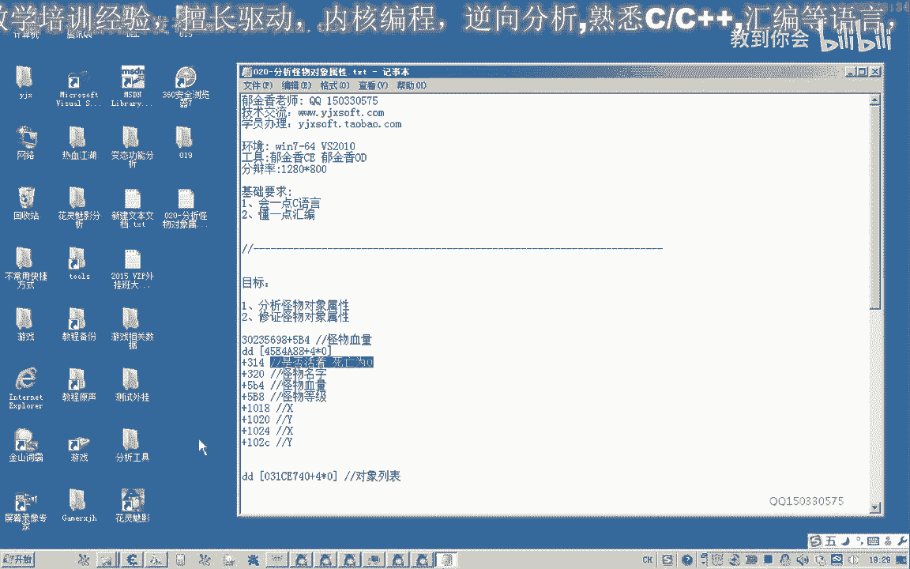

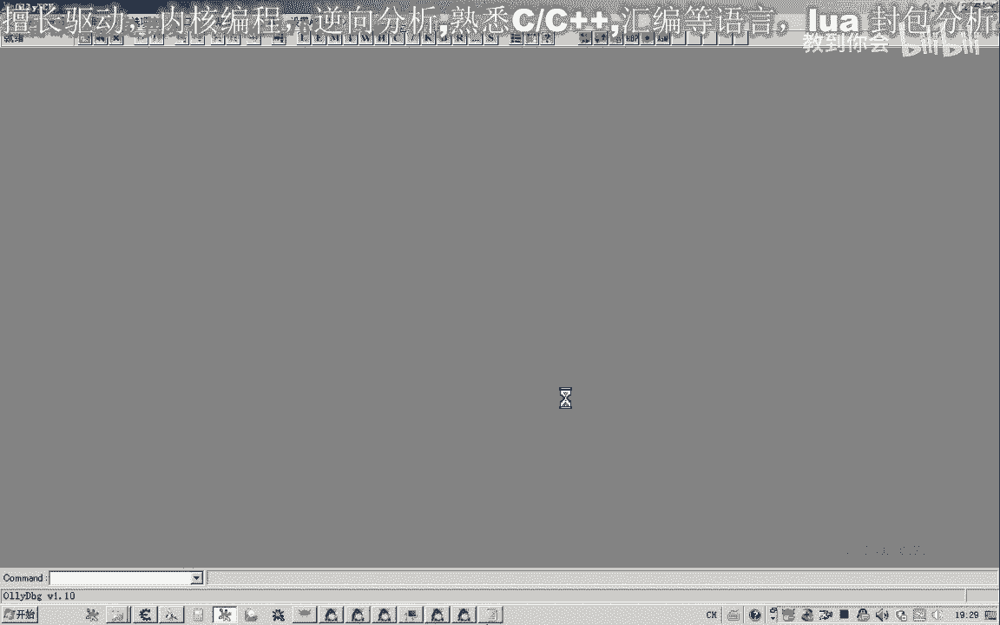

就嗯加载到我们的游戏里面，那么这是我们上一结构啊分析的对象，其实，这个名字呢是被我改过的啊，他本来是这个牛同名，嗯那么我们在发现这个，所以我在怪物列表里面哈，它的下标为三的时候呢。

呃出现了一个人物角色的名字啊，就是我们自己啊，这个啊就是我们自己，那么也就是说这个对象的列表里面，那么现在我们在这里来用相对的地址来表示，然后我们把周一个，这些数据啊嗯先复制出来。

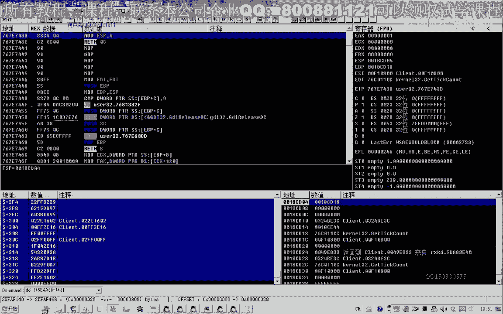

先复制一段出来，然后两个呢我们做一下比较。

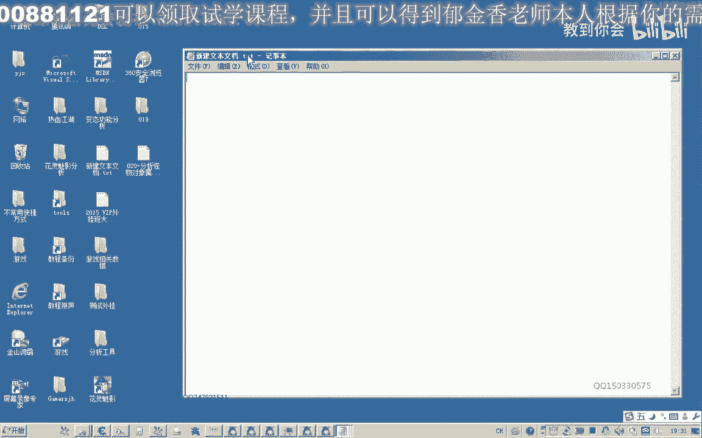

那么另外呢我们选一个怪物的话，选下边我要按这个啊，dc这个是狂牛的啊，那么我们也选一个，这里我们也用相对的地址来表示，把它选一段数据之后呢，我们把它复制出来。

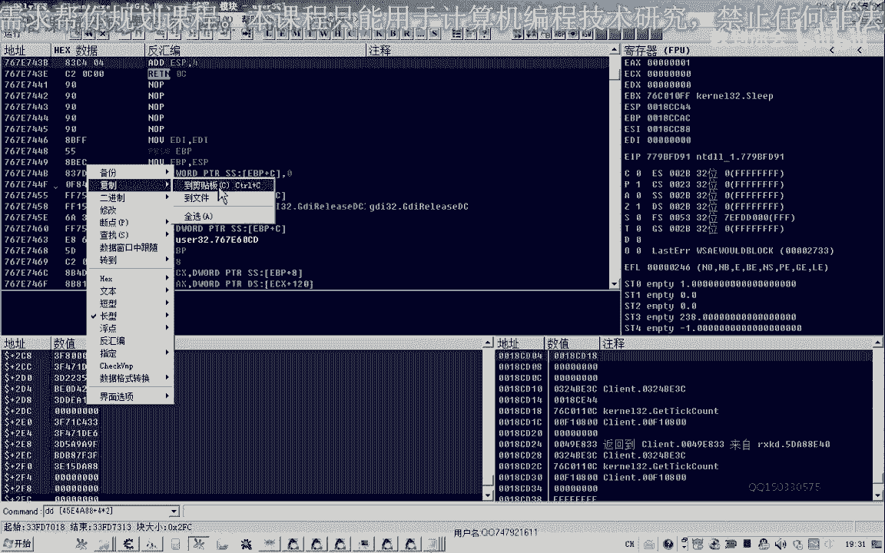

那么调整它的大小，然后我们进行一下对比。

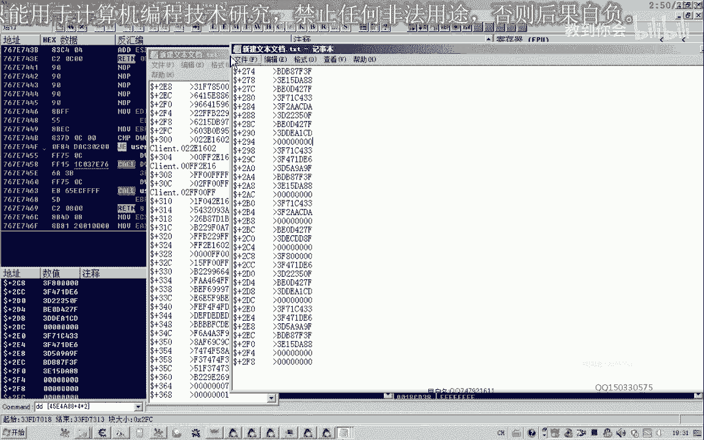

看哪些地方它是不同的，那么首先呢我们从前面的偏移呢开始看，那么这个呢是它相关的一个函数的一个列表，那么第二个是零，那么加八这个位置呢，它们两个不相同，还有加设这两个位置呢它也不相同。

后边呢也有很多不相同的一些地方，那么这里的话加幺八这个位置呢，它看起来像一个坐标，是玩家的啊，但现在呢我们暂时不分析这个玩家的这个对象啊，当然这个不同的地方很多啊，不同的地方很多。

那么我们再啊再复制一个怪物的对象出来。

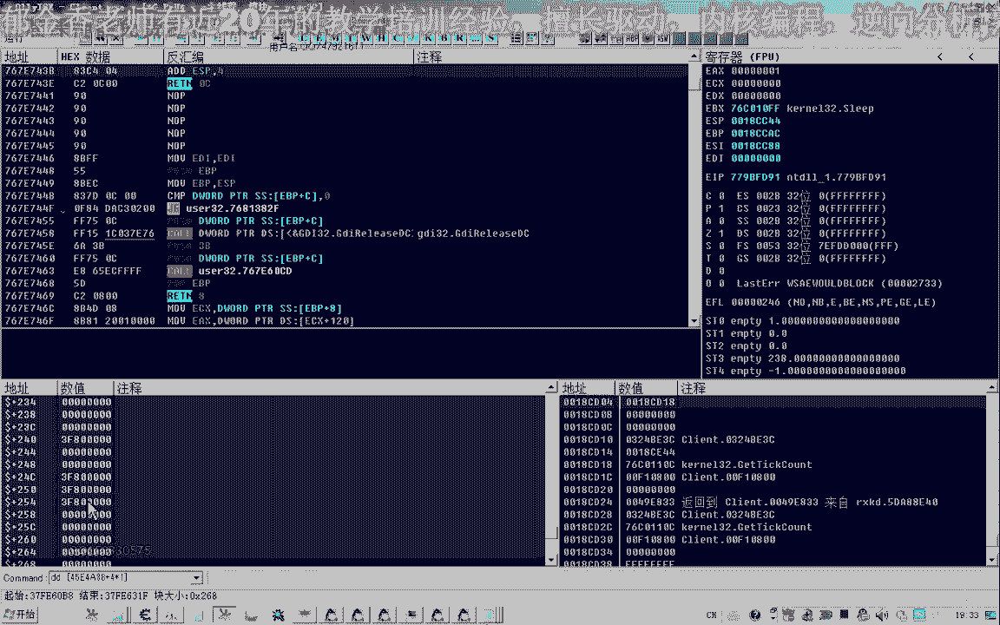

那么我们几个数据我们进行一下比较。

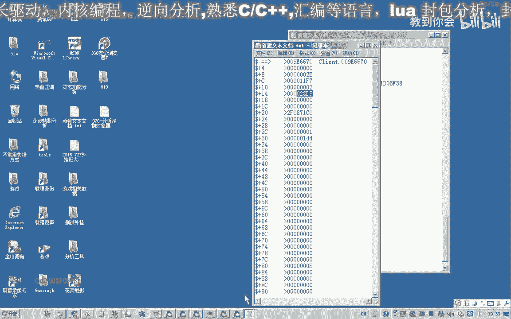

那么我们发现呢再加八这个位置呢，如果是怪物的话，这两个都是等于二一啊，而加八这里呢为三幺，这里呢是玩家，那么后面这个i这个加c这个位置呢它是变动的啊。

11f d11 f711 dc这个像一个什么编号啊这一类的，那下面这一栏这些呢它不是很明显，这些数据都是变动的，它不能用来作为一个分类的一个编号，那么也就是说我们可以通过jie这个地方来进行一个判断。

那么另外呢我们可以在，在里面呢对加2g这个地方下一个段看一下它是什么情况，加8+8这个位置呢它与e s i进行一个比较，2710，313，因为这里呢可能就是比较的我们的玩家，三一的高墙。

我们看一下是玩家不是怪物，那么这里呢也有一些比较啊，三幺的二一的，二来福的1c x加八这个位置，那么说明这个地方的话，极有可能就是我们的嗯对象的一个分类的一个编号。

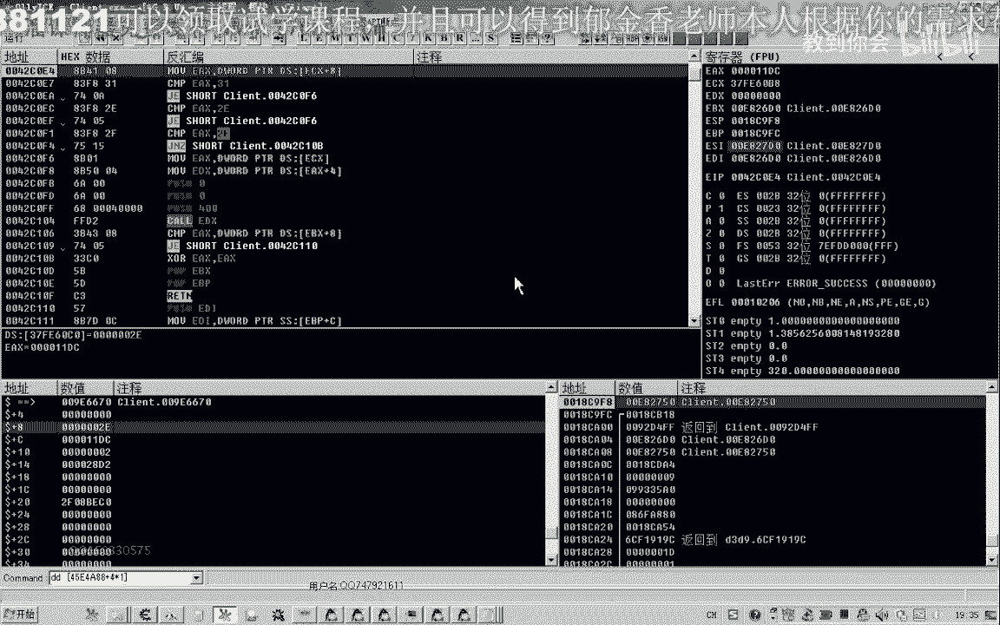

先给他记一下，那么如果不是，那我们在后面我们再改加八这个意思，对象类型分类编号，那么另外还有一个怪物的一个死亡的一个状态，当然顺便呢我们也可以把玩家的一些属性呢就可以把它分解了。

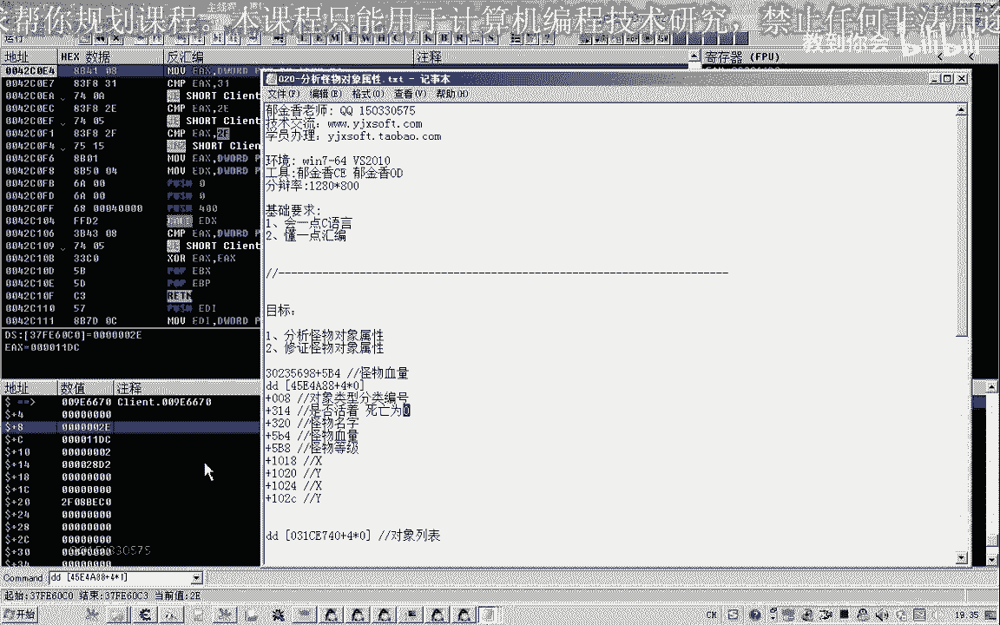

那么我们加三这个位置呢，刚才是我们玩家dc，第c列表示了，那么这是它行号的一个内容，对这前面这个地方呢是它的名字，你们看他的名字偏移是多少，打开这，那你地址来看一下，就这样出去，大概在一八这个位置。

看起来有点像看小。

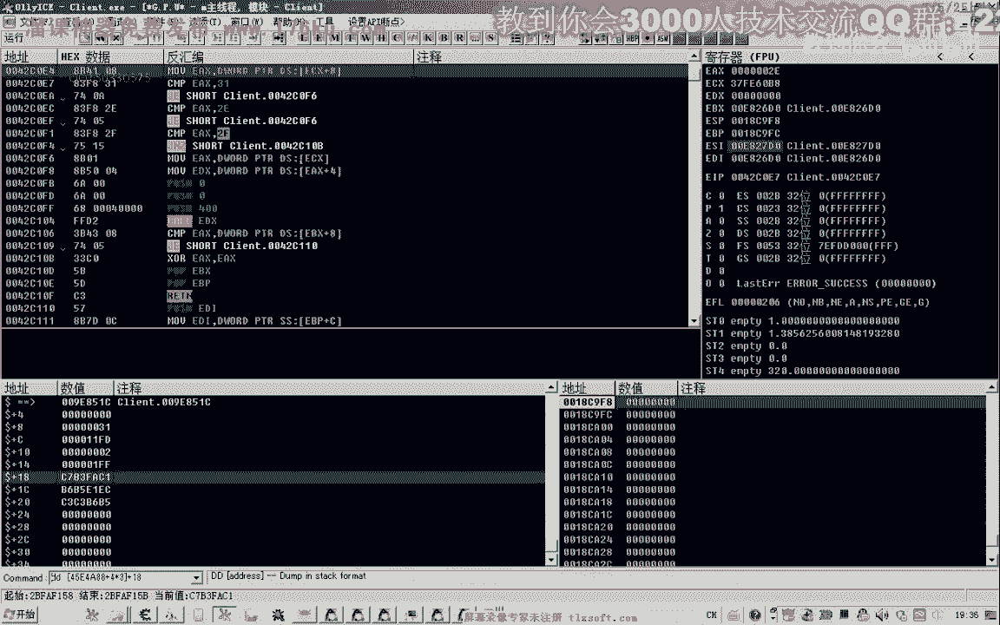

哦对了，幺八这个位置呢是我们玩家的玩家对象，我们训练也分析一下它的一个，属性，加幺八，这个是我们马家的提醒。

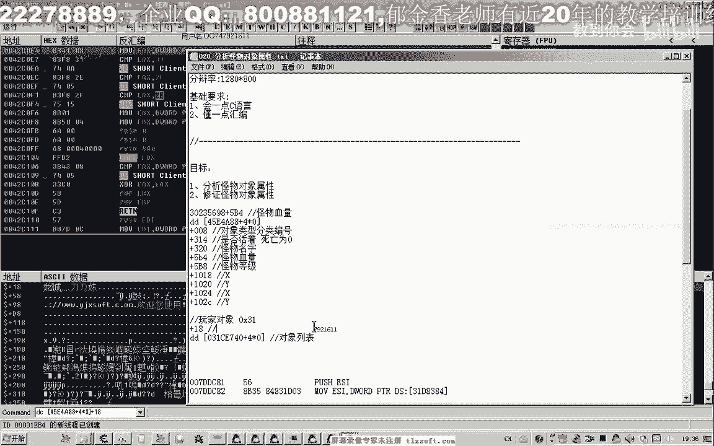

那么在后面呢，这里是一个喊话的内容，这个数据我们暂时用不到，哈哈哈，那么暂时呢我们就记住一个这个名字啊，这个属性当然其他还有等级啊，还有其他什么什么的啊，那么我们到后面我们再进行一下分析啊。

现在我们用不到。

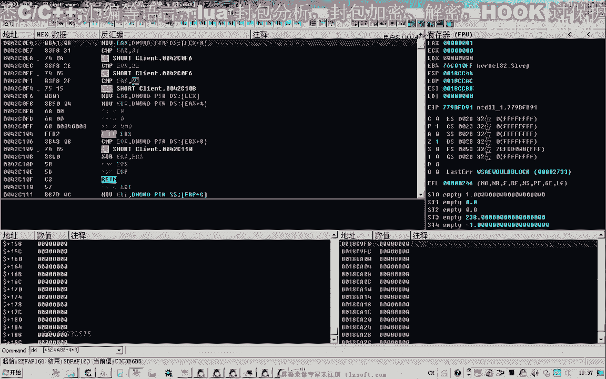

那么另外上一节课我们还有一个就是我们玩啊，这个怪物的一个死亡状态，这个我们在后期我们制作这个自动打怪的时候需要判断，因为怪物死亡之后的话，我们一般就不会再对它进行一个攻击。

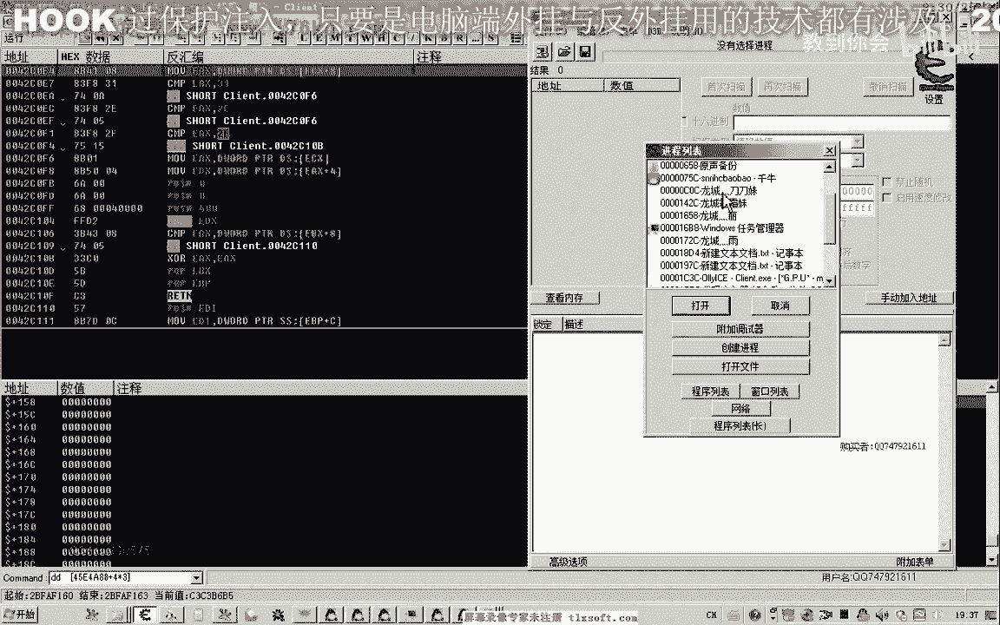

那么首先呢我们也是呃看一下打一个怪物的这个名字，你说这个野猪的话，那么说或者说我们在这里给他选一个演出的名字，然后我们把它改一下，根号一这里可这是我之前改了一个名字，编号二，这个也是狂流的。

那么我们在这里呢可以改改一下它的名字，还有a x，加上一个x，然后加上我们的商量一下，这个时候呢它变成了一个负值，那么我们可以把它改成字母的，你死了你死了，那么我们先看一下这个牛在什么地方。

可能在远处了，我们跑回去看一下，啊这个就是我们改的那个名字，那我改了名字之后呢，主要是我们来判断一下，这个呢是我们当前选中的这个怪物，那这个地址就找到了，这是我们当前选中的这个怪物。

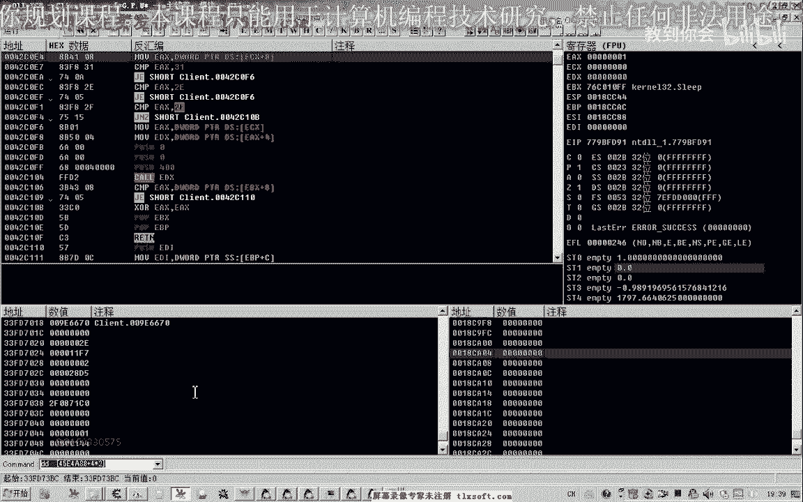

那么我们要来收他的死这个死亡的状态的话，这里呢我们就可以从他的那个70开始，三三还有fd 7018，那么如果他一般用用用两种状态来表示啊，你自己的这些东西，那么如果他是活着的，我们可能是一活着可能是一。

但是我们看一下33f d7044 啊，那么如果死亡的话，可能是为零，他可能是这样表示的，那，么我们先把这个先攻击他，那么死亡了之后我们看一下这个数值为零了，这个数字三三fd 73多少，那么我们一个数字。

它，那么这个离得太远了啊，不是三三fg开头的，那么这个呢可能是什么状态，死亡3500王者的时候有个一。

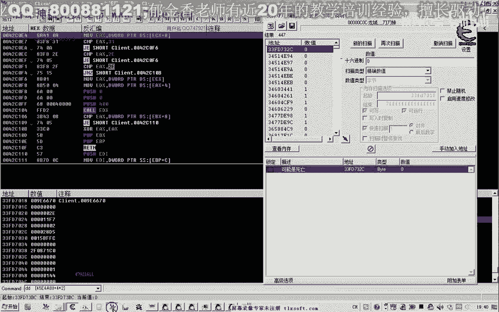

那么我们看一下这个地方，新游戏，那么这个时候呢这个怪物已经刷新了，他活着就是唯一啊。

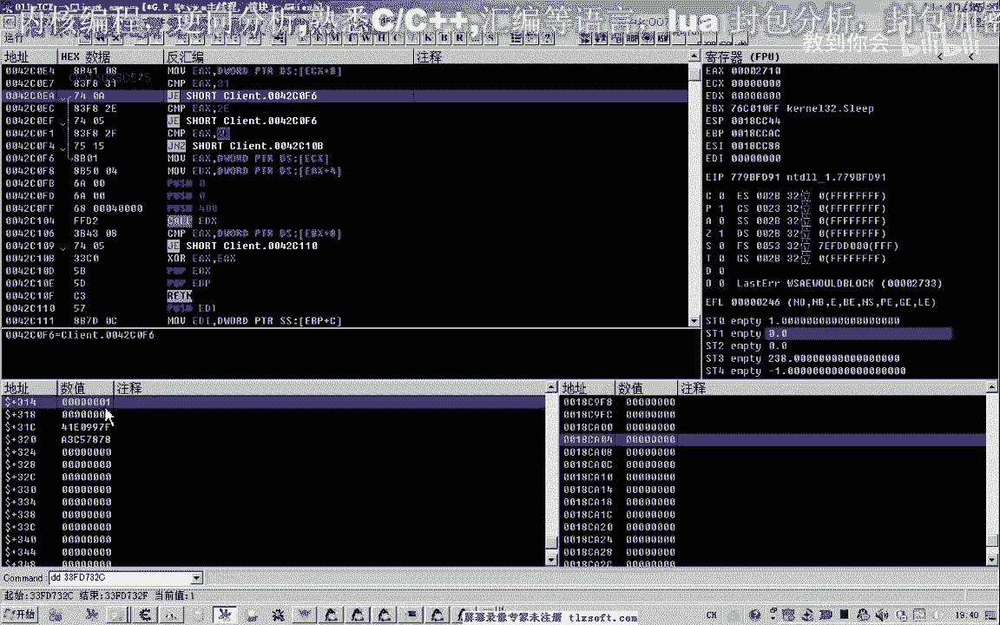

364，这个是我们上一节课所分析的这个地方啊，当时我们是分析出来的，那么刚才我们一瞬间呢，我们发现它还是零。

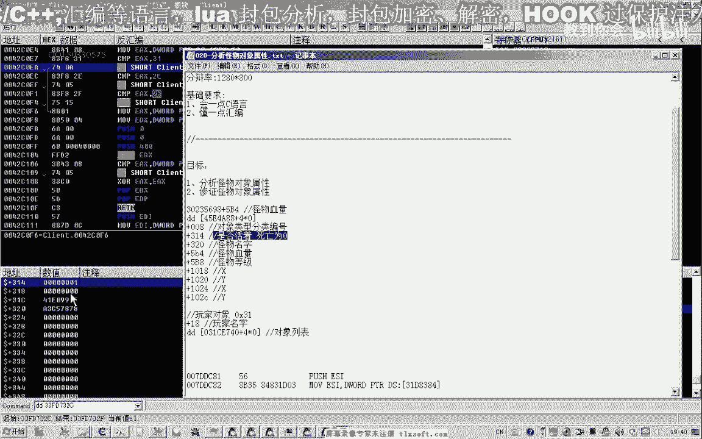

当我们鼠标指向它之后呢，他无息了啊，也就是说它显示了一个血条之后呢，它为一了，那么这个时候呢我们没有选中它之后呢。

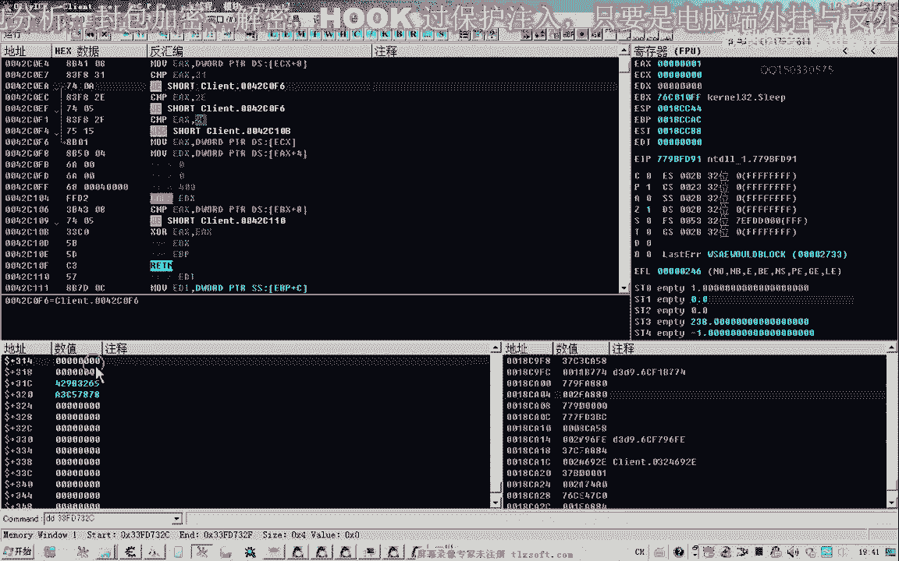

他又为零了，再来看一下是这个点，那么我们选中它之后呢，会一，那么所以说这个我们上节课分析的这个呢，他是不是死亡状态呃，应该是选中状态，或者是那个是否显示血条，这是我们314的内容。

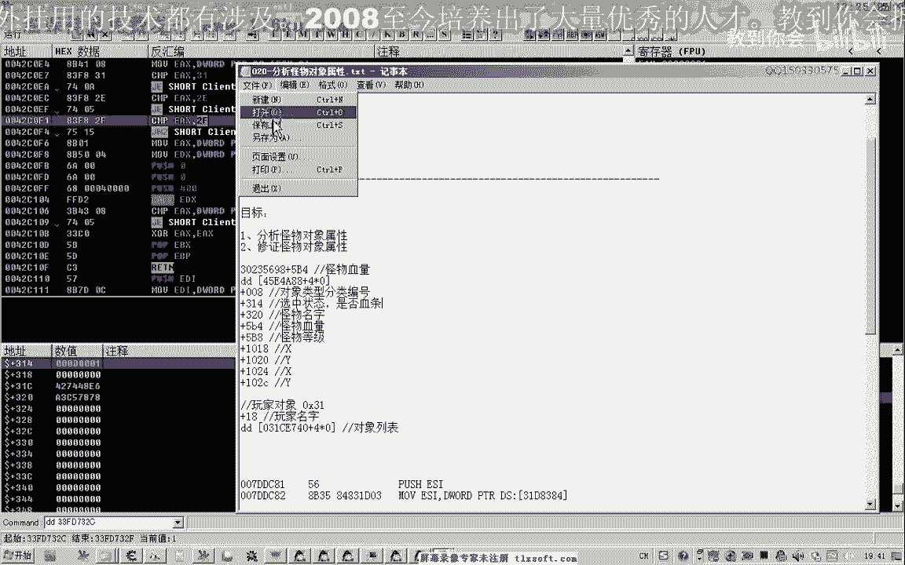

那么另外一种类型的话，他可能就是他死亡之后无一啊。

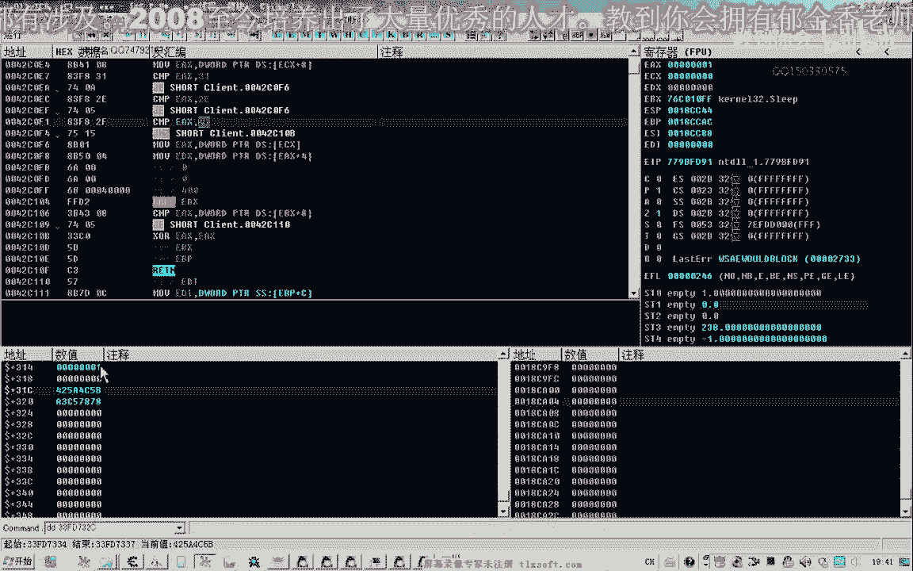

活着的时候无敌，那么我们换一种搜索的方式重新搜索啊，搜索灵异，然后我们攻击这个怪物，让他死亡，而死亡之后呢，我们输入一下133f973 ，那我只有这三个啊，只有这三个。

那么我们看一下它是否这个时候呢就活过来了，活过来了，那么应该是五零，那么最后这一个就不是了，那么我们再次攻击啊，有一个思考，死亡了之后，这个78年刚才我们已经学过了死亡超五一啊，喜欢。

一个是398780，我们看一下这两个就是。

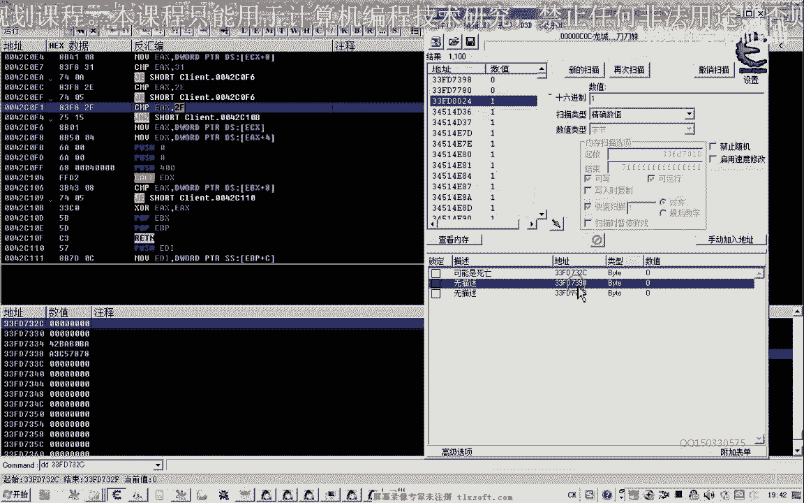

这是398。

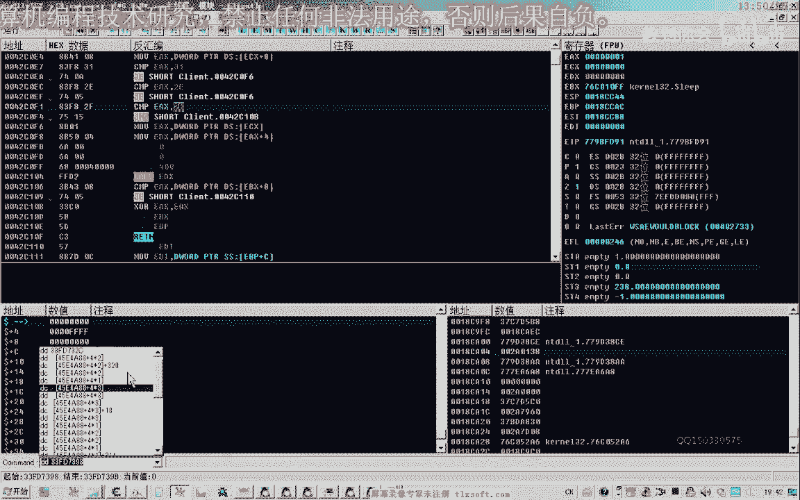

对应于我们分加380这个问题，那我们先备注一下，减伤二这个可能是死亡状态，那么另外还有一个地方是7780。

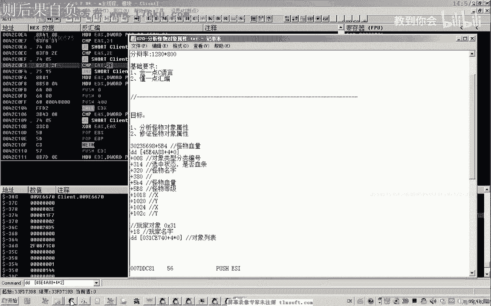

这个地方呢应该比较圆，那么这个呢是加768这个位置。

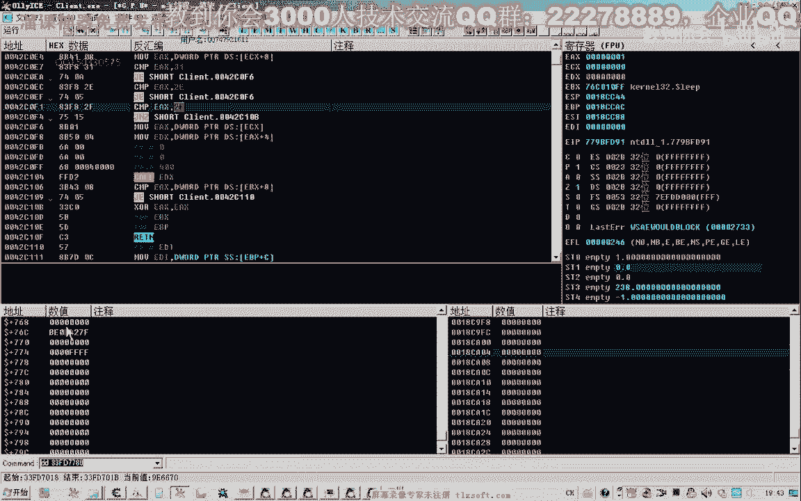

还有一个位置就是1768，那么在哪个位置呢，可能是死亡状态，那么我们再进行一下测试，完了完，再单击一下它，好死亡之后我们看一下c里面，那么只有这上面这个啊，他才不是五一死亡之后啊。

也就是398这个398这个那么398这个呢是我们的啊，这个啊起状态，死亡唯一会死亡呢，那么这就是我们大概的这个分分析的一个结果，那么还有加八这个位置呢是个分类，编号要从0x21 呢才是我们的怪物。

才是我们，五如果是0x31 的话，我们发现的是玩家，好那么我们根据这些分析的数据呢，我们可以对我们上一节课的这些内容来进行一些修改，打开我们上一节课的代码。

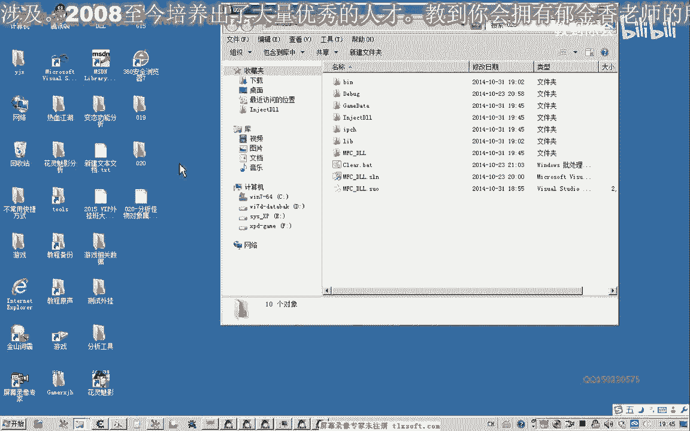

那么首先呢我们这个切换到结构单元，我们对它的结构来进行一下修改，是否死亡，那么死亡呢我们是为一，不是为了是否活着，因为是死亡状态，而且它的偏移我们要改，那么到初始化这里，320314这个地方，对了。

三阶段我们没有加这个属性，这是我们把它加进来，多，五的三，38年。

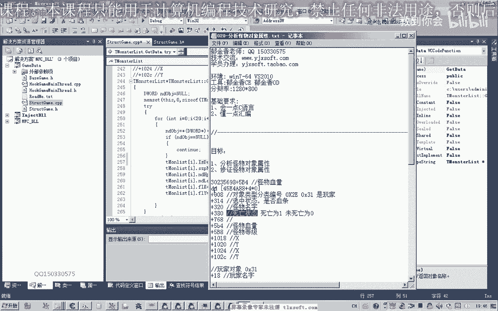

这个销量是好的，那么我们再来进行一下片名嗯。

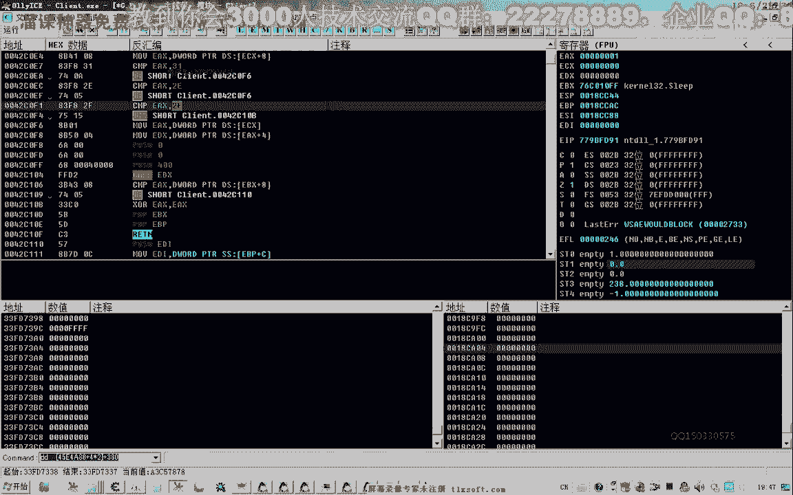

380死亡状态啊，能不能名字，那么在前面呢我们还需要加一个判断，它不等于空，并且呢我们出来的这个加八这个位置对象对象对象加八这个位置，那么我们要，等于5x2。1，如果是不等于0x31 的话。

不是怪物的话，那么我们就不执行下面的代码啊，所以所以说这里还要加一个条件，当然我们也可以把它分开一些，可能更好理解一些，哈哈，那么只有人当这个加八这个位置的分类编号，我们等于啊这个数值的时候。

那么我们才进行其他的操作，那么像这种对象的嗯，分队编号的话，它的一个定义呢，我们最好也是把它定义成我们布尔类型，这里我们看到，因为，做出相应说什么呢，能看出性，老婆呢，好的做到这些修改之后呢。

我们再来进行一下测试，打开我们的这个调试信息接收的一个工具，然后我们看它注意到哪一个线程里面去，哈哈哈哈哈，收集，这时候他没有接收到消息，让我们看一下，这里的读取也没有错误。

这里读取的这里多加了一个括号啊，应该是这样写的，只要把这里要加上一个括号，括号呢为什么加错了，所以说呢他这里所有的数据呢我们都没有被复制。

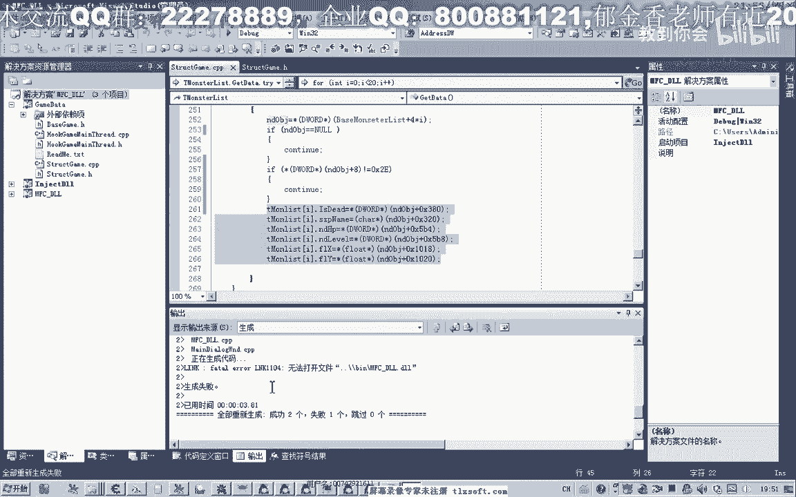

这里呢我们推一下我们的o t。

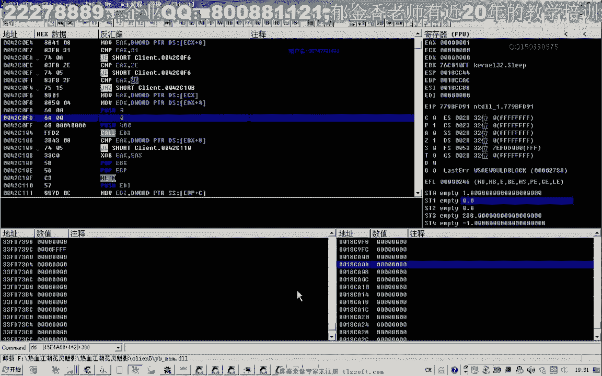

因为这个og呢它加载了这个相应的debug的这个号文件，所以就造成了它我不打开，而且这个d它加载了之后呢，有时候我们会造成我们这个动态链接库呢它不会正常的卸载。

那么我们可以这个时候来用工具再次卸载一下啊，啊，啊这个时候现在成功了，我们再编一遍。

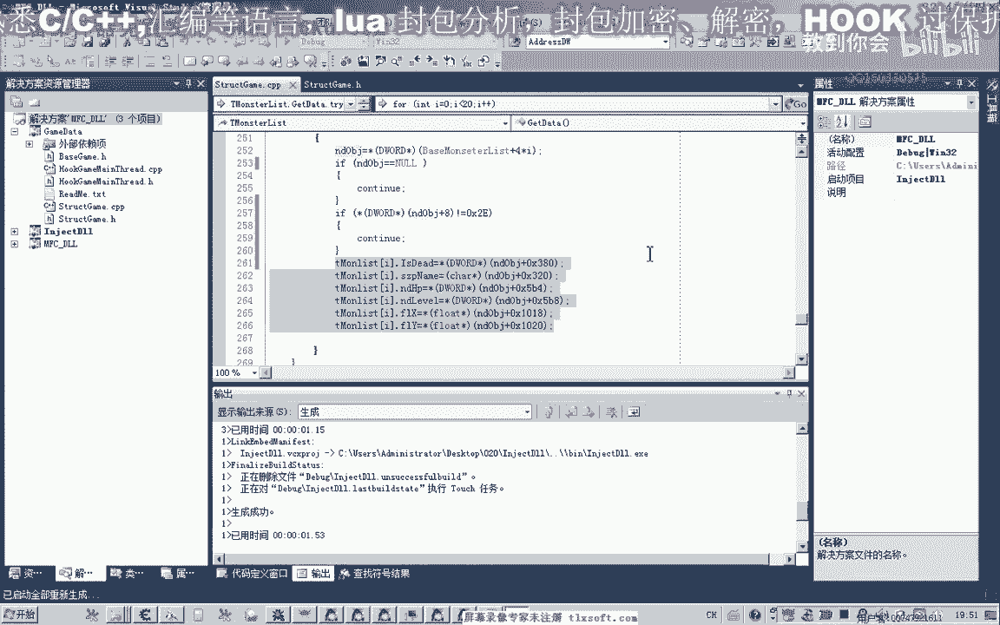

祝你快乐开心。

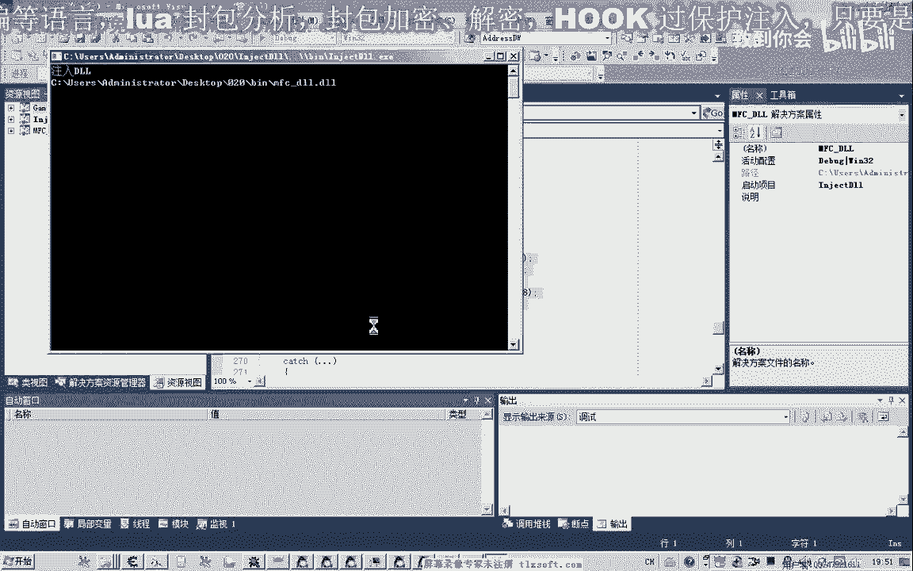

逛街主线程了，然后我发现我们的消息，那么这个时候我们看到的话，他就没有乱码，这个信息呢就比较干净，这些怪物都是活着的梦死亡，这里是它的坐标，等级取量全部都出来了，这两个的名字是被我们修改过的。

维修的过程，当然前面也有几个，这几个他们有相应的一个信息，就在看清，那可能是空指针没有被赋值的话，哈哈哈，这是消息传到那个地方啊，不是打印我们怪物列表的那个指针啊，所以说跟这个人没有关系，好的。

那么这节课呢我们就讲到这里，那么我们下一节课再见，那么另外呢像这个加八这个物体呢，因为其他我们后边的物品分类的时候呢，还要用，那么这里呢我们可以把它定义成一个这个偏移的话，可以把它定义成一个红啊。

分类的一个编号太，哈哈，这个我们可以把它定义成一个这个对象的，对线的一个分类编号啊，这个偏移，对象分对这个呢我们把它放到结构的头部，嘿嘿，好的，那么我们下节课再见啊，今天我们要分析呢就到这里。

那么下一节课呢我们准备对这个怪物的一个攻击啊，这些进行一些分析，技能呢啊攻击啊，已经选中怪物，这类的话，慢慢的开始分析。

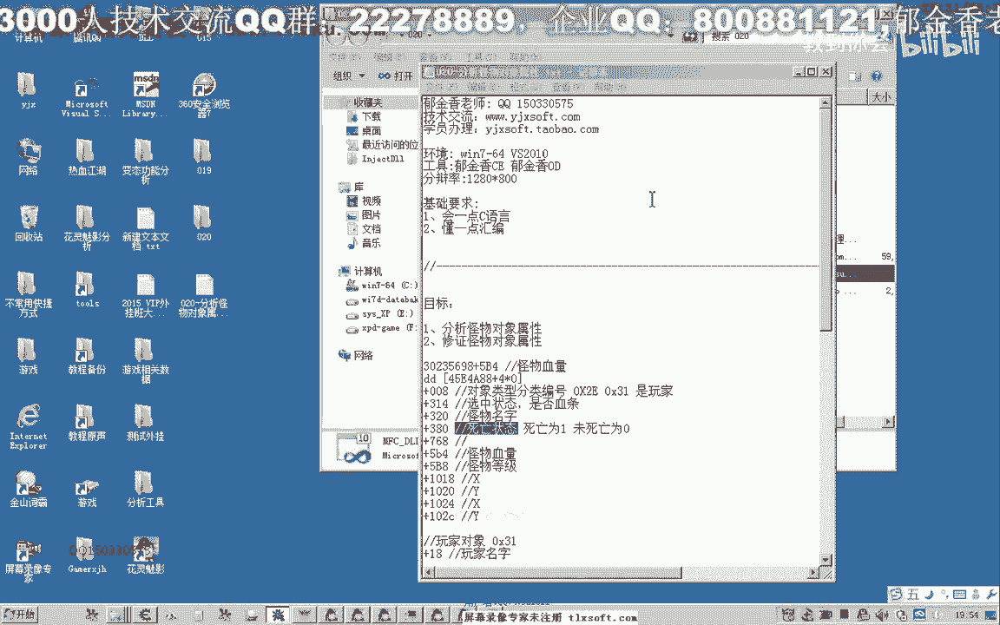