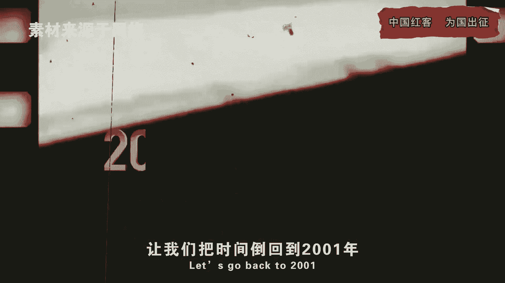
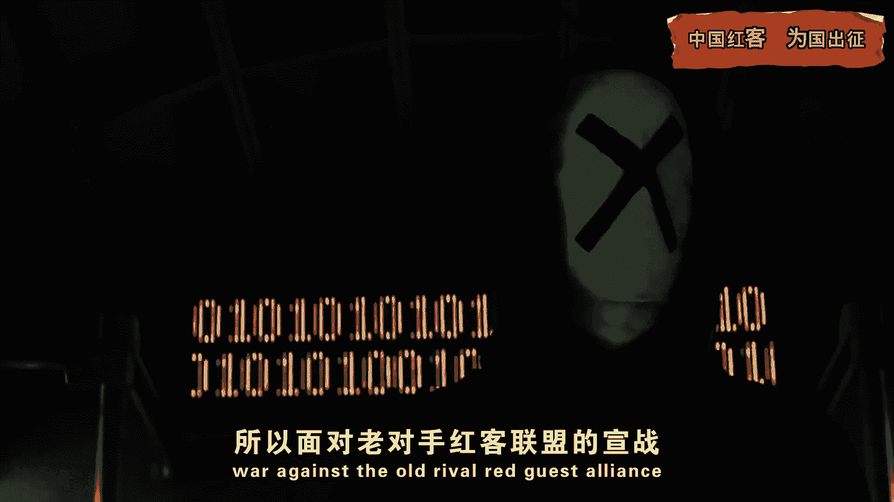

# 课程 P1：0.1 - 中国红客的起源与精神传承 🇨🇳

在本节课中，我们将要了解中国红客精神的起源，回顾2001年那场震惊世界的网络攻防战，并探讨其背后的技术策略与深远意义。

---

## 背景：冲突的导火索

上一节我们介绍了课程主题，本节中我们来看看事件的起因。2001年4月1日，美国EP-3侦察机擅自闯入中国领空。在遭到中国战机拦截后，美机竟主动攻击了前来执行任务的**中国81192号战机**。飞行员王伟在最后时刻留下“81192收到，我已无法返航，你们继续前进！”的通讯后壮烈牺牲。

更令人愤慨的是，作为事件的始作俑者，美国不仅未道歉，其国内的一些黑客反而开始疯狂攻击中国网络。这种嚣张行径彻底激怒了中国网民，反击的呼声日益高涨。

## 红客联盟的登场

面对挑衅，中国红客联盟站了出来。这并非他们首次亮相。早在1998年，中国红客便因黑掉印尼网站而一战成名。1999年，他们更是与美国黑客正面交锋，成功攻击美国网站以捍卫国家尊严。因此，面对老对手的宣战，美方也严阵以待。

美国方面高度重视，特别下发加强网络安全通知，修补漏洞。其网络安全团队甚至预判了红客的攻击路径，故意只留下一个漏洞，意图“瓮中捉鳖”。相比之下，当时的红客联盟更像是一群“散兵游勇”。

## 力量悬殊下的战术抉择

上一节我们看到了双方实力的差距，本节中我们来看看红客联盟如何应对。当时中国互联网远未普及，既无专门的网络安全部门，懂黑客技术的人也凤毛麟角。在无人无技术的困境下，这场仗还能打吗？

答案是肯定的。2001年5月4日晚，美国白宫网站出现严重卡顿，最终彻底瘫痪。这正是中国红客的杰作。美国专家们没想到，红客们选择了最直接的战术：**分布式拒绝服务攻击**。

其核心原理可以用一个简单的公式描述：
`网站瘫痪 = 海量请求 > 服务器承载极限`

原来，红客联盟预判了美方的预判，决定扬长避短，采用最朴素的“人海战术”。

以下是当时采取的具体步骤：
1.  **制作简易工具**：红客联盟制作了一个仅几十KB的攻击软件。
2.  **全民动员**：他们向广大网友呼吁，只需使用该软件，即可参战，但需承担电脑受损的风险。
3.  **集结力量**：无数网友响应号召，动用家庭电脑、网吧电脑甚至学校设备，迅速集结了一支约**8万人**的“红客大军”。

这支庞大的队伍从四面八方发起攻击。虽然美国黑客立即对攻击来源的IP进行反制，但“全民红客”的战术成功掩护了红客联盟的主力部队。美方黑客只能疲于应付这些“诱饵”，为红客主力争取了宝贵时间。

## 胜利的成果与代价

当白宫网站恢复后，全世界都看到了令人震惊的一幕：其首页上飘扬着**五星红旗**，并写着“王伟永垂不朽”。美国专家不得不酸溜溜地承认，中国的“脚本小子”们真的瘫痪了白宫网站。

在取得阶段性成果后，红客联盟并未恋战，于5月8日主动撤离，结束了战斗。

这场胜利的代价同样巨大：
*   我方共攻陷美方1200多个网站。
*   参与行动的电脑有过半数因遭受反击而损坏，成了“电子垃圾”。
*   许多年轻红客因使用家庭电脑参战并产生高额拨号上网费，而“挨了父母一顿揍”。

## 总结与传承

本节课中我们一起学习了2001年中美黑客大战的始末。这场依靠无数普通网民团结换来的胜利，是一个奇迹。它向世界展现了中国人的团结，并让世界听到了中国的声音。

同时，这场大战也让红客联盟清醒认识到自身与美国的巨大技术差距。他们意识到，当务之急是让更多人掌握电脑技术，培养新一代的红客人才。

**每一次行动，都是为了让世界看到我们不跪的模样。** 这种敢于对峙绝望、捍卫国家尊严的精神，正是中国红客技术需要传承的核心。

---

本节课中，我们回顾了历史，理解了红客精神的本质。从技术角度看，它教会我们即使在资源匮乏时，**创新的战术思维（如分布式攻击）和广泛的群众基础**也能形成强大的力量。这种精神与智慧，值得每一位技术学习者铭记与传承。