# 课程P11：4.3-网络安全基础-病毒、恶意程序、入侵（下）🔐

在本节课中，我们将继续学习网络安全的基础知识，重点了解加密、解密、数字签名、数字水印等核心概念，并对信息安全的基本分类和防护策略进行概述。


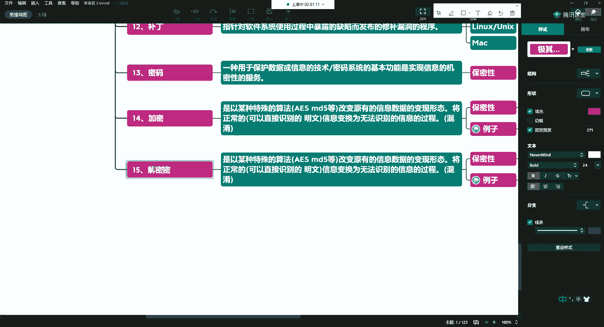

---

## 解密 🔓


上一节我们介绍了加密，本节中我们来看看解密。

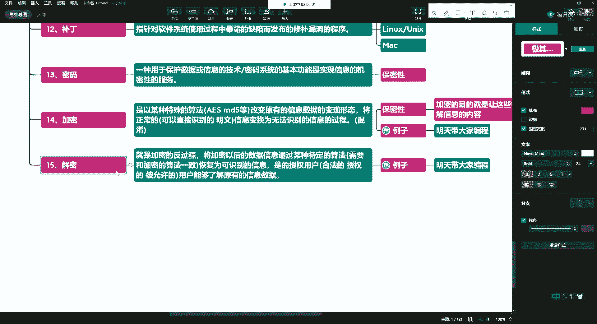


解密是加密的反过程。它将加密后的数据信息，通过某种特定的算法（该算法需要与加密时使用的算法一致）恢复为可识别的信息。这使得授权用户（即合法的、被允许的用户）能够了解原有的信息数据。

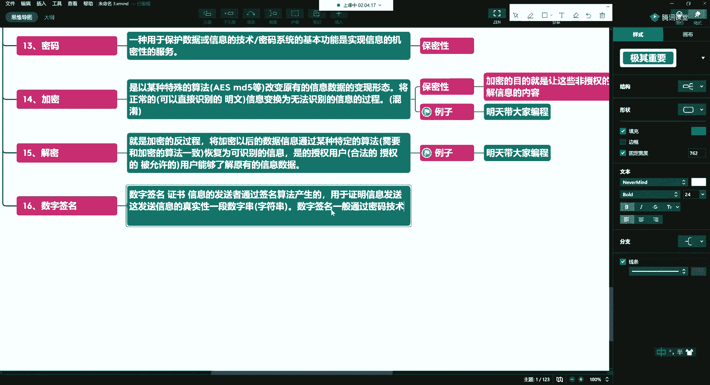

**核心公式/过程**：
```
解密过程 = 使用与加密相同的算法，将密文还原为明文
```

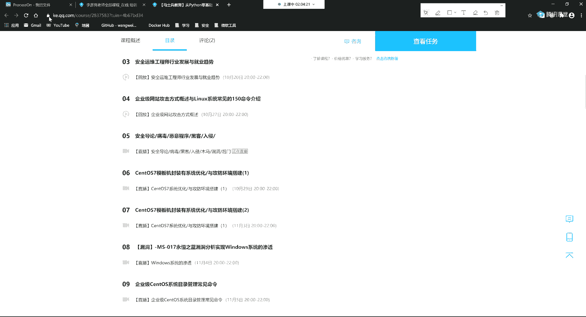

---

## 数字签名 ✍️


接下来，我们探讨数字签名这一概念。

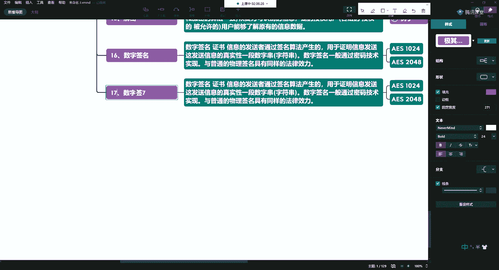


数字签名由信息的发送者通过签名算法产生，用于证明信息发送者身份以及所发送信息的真实性。它本质上是一个数字串（或字符串）。


数字签名一般通过密码技术实现，与普通的物理签名具有同等的法律效力。例如，我们在浏览器中看到的网址旁的小锁图标，就与SSL证书和数字签名技术有关，它表示连接是经过加密和认证的。


**核心概念**：
*   **作用**：验证发送者身份和信息的完整性、真实性。
*   **常见应用**：HTTPS协议、软件/文档签名。

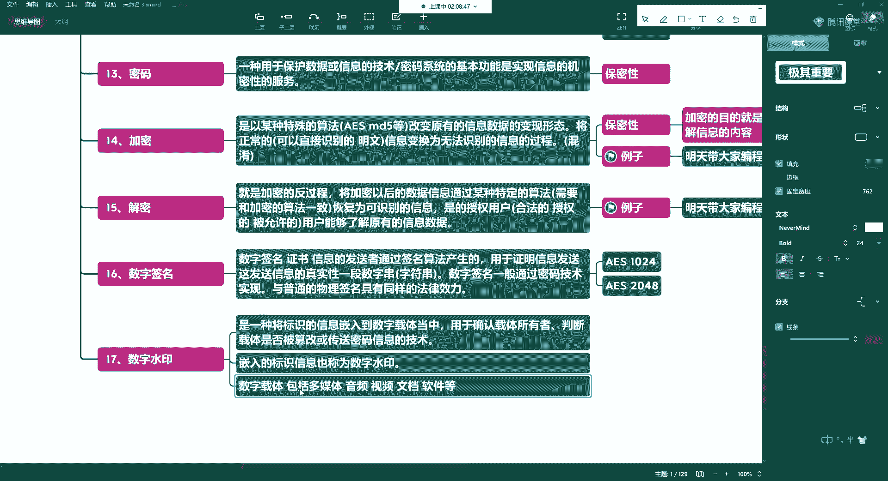

---

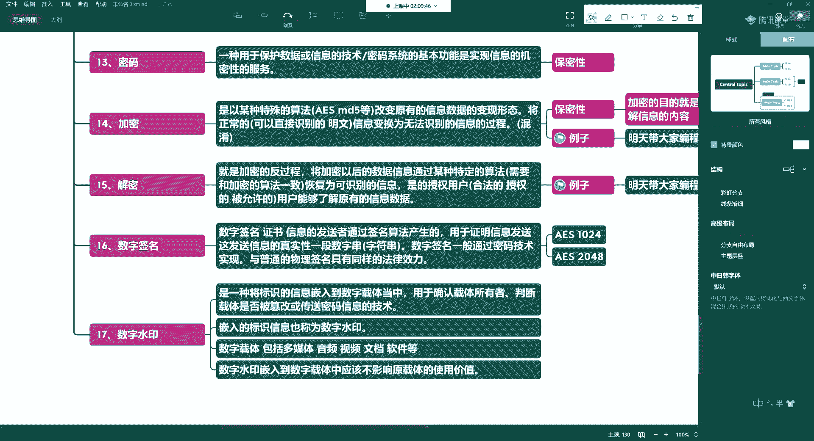


## 数字水印 💧


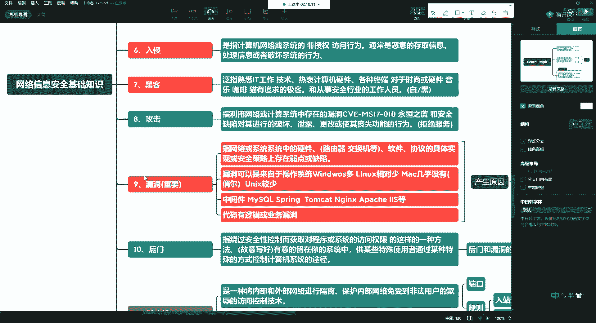

有数字签名，还有数字水印。

数字水印是一种将标识信息嵌入到数字载体中的技术，用于确认载体的所有者、判断载体是否被篡改或传送秘密信息。被嵌入的标识信息也称为数字水印。

以下是数字水印的一些关键点：

*   **数字载体**：可以是多媒体（音频、视频）、文档、软件等。
*   **核心要求**：嵌入水印不应影响原载体的使用价值。例如，人民币上的水印不会影响其流通功能。

---

## 信息安全的基本分类 🗂️


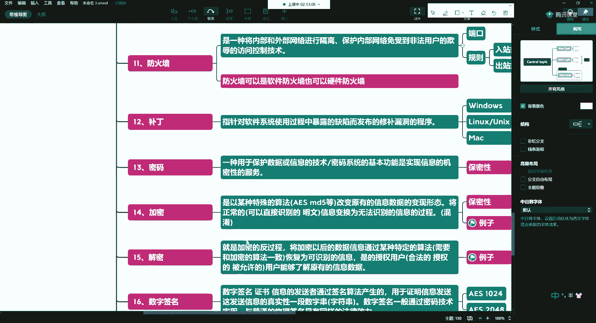

在了解了几个核心概念后，我们从一个更宏观的视角，看看信息安全的基本分类。


信息安全涉及多个层面，以下是其主要分类：

*   **物理安全**：保护硬件和物理设施。
    *   **存放位置**：如IDC机房、自建机房。
    *   **硬件安全**：设置BIOS密码、禁用不必要的USB/光驱接口、屏蔽闲置网络端口。
    *   **人员管理**：限制非授权人员接触设备，培养员工安全意识（如离开电脑必须锁屏）。

*   **系统与软件安全**：减少系统和应用软件的漏洞。
    *   **系统选择**：尽可能选择较新版本的操作系统，以修复已知漏洞。
    *   **软件管理**：尽可能使用正版软件，及时安装漏洞补丁。
    *   **服务管理**：关闭或卸载无关的软件和服务。

*   **账号与权限管理**：管理用户访问权限。
    *   **权限分离**：例如，开发人员通常不应拥有root权限。
    *   **密码策略**：设置高复杂度密码，并定期强制更换。

*   **网络安全**：保护网络传输和访问。
    *   **网络设计**：设计安全的无线网络（加密方式、密码强度）。
    *   **防护措施**：配置防火墙策略、进行入侵检测、使用加密传输。

*   **数据安全**：保护数据本身。
    *   **数据保护**：进行数据备份、数据加密。
    *   **权限控制**：控制数据的存取权限。
    *   **高级应用**：例如，通过证书控制公司内部文档（如Word、Excel）只能在授权环境下打开。

---

## 安全防护策略 🛡️

最后，我们简要了解一下常见的安全防护策略类型。这些策略是安全工作的具体指导方针。

以下是几种主要的安全防护策略：

*   **通用计算机安全防护策略**：规定公司内所有计算机系统的统一安全基线，如关闭哪些服务、使用统一镜像、通过组策略限制软件安装等。
*   **互联网安全防护策略**：在网络边界（如路由器）进行控制，例如设置网站访问白名单、限制文件下载类型等。
*   **无线网络安全防护策略**：专门针对无线网络的安全设计，防止通过无线网络进行的钓鱼、窃密等攻击。
*   **网上银行安全防护策略**：聚焦于保护金融交易和敏感信息的安全措施。
*   **等保（网络安全等级保护）要求**：符合国家相关法律法规和标准的安全体系建设要求。

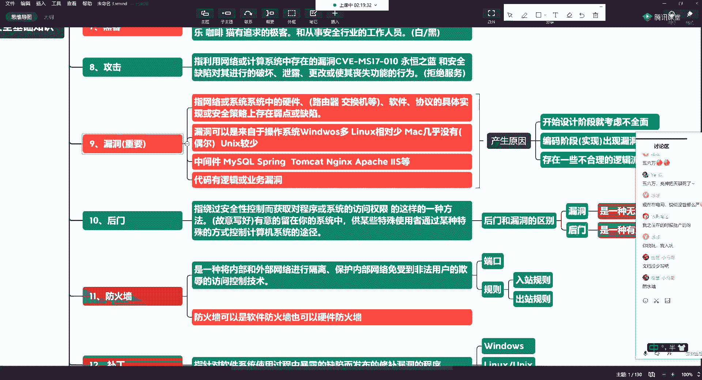

---


## 总结 📚

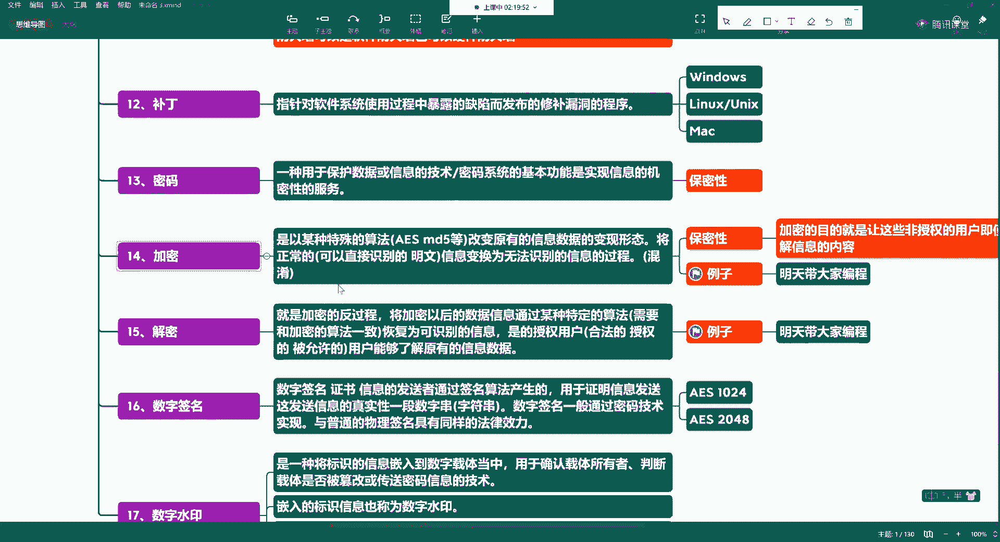

本节课中我们一起学习了：
1.  **解密**的原理，即使用相同算法将密文还原为明文的过程。
2.  **数字签名**的作用和意义，它用于验证信息发送者的身份和信息的真实性。
3.  **数字水印**的概念与应用，它是一种嵌入在数字载体中的防伪标识。
4.  信息安全的基本分类，包括**物理安全、系统安全、网络安全、数据安全**等多个层面。
5.  常见的安全防护策略类型，为实际安全工作提供框架性指导。


这些基础知识对于理解后续更深入的安全技术和操作至关重要。下一讲，我们将开始进入更实质性的内容学习。