# 课程 P12：5.1 - 网络安全基础 - 常见网站攻击方式概述 - 网页黑链 🔗

在本节课中，我们将要学习网络安全中一种常见的攻击方式：网页黑链。我们将了解它的表现形式、实现原理、攻击目的以及如何防范。

---

## 网页黑链的表现形式

网页黑链是一种隐蔽的攻击手段。表面上，被攻击的网站看起来一切正常，但实际运行中可能出现加载缓慢、图片无法显示等问题。这种情况常出现在一些盗版视频网站或包含不良广告的页面上。

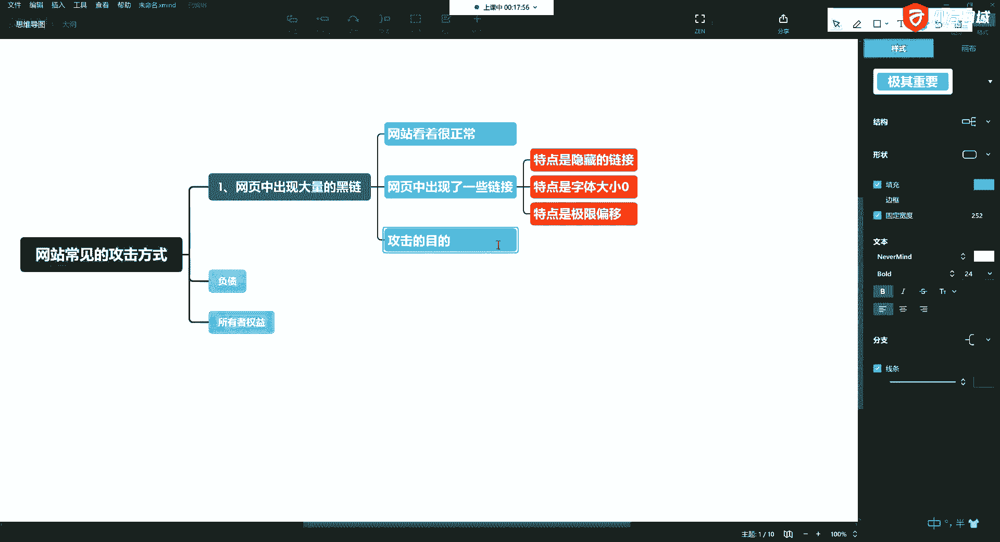

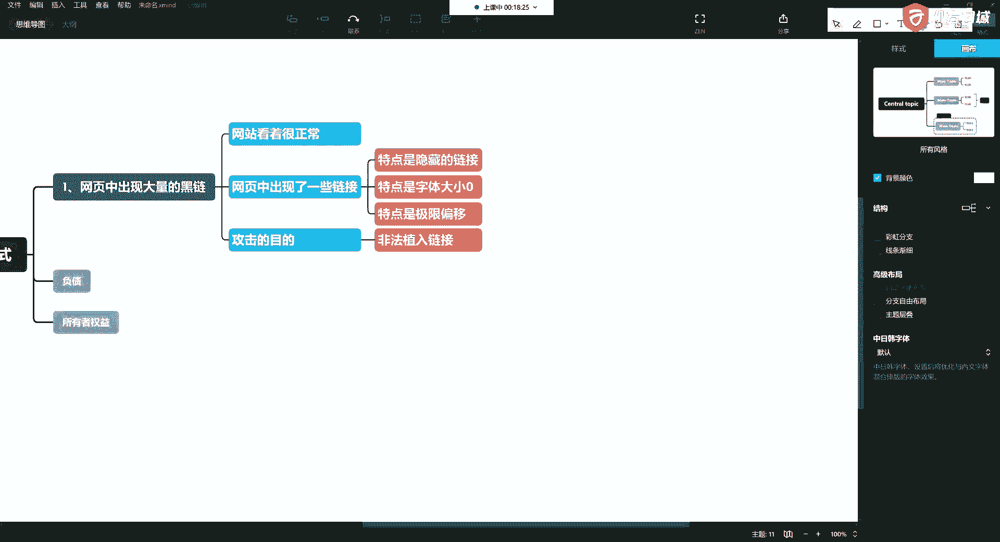

以下是网页黑链的几个典型特征：

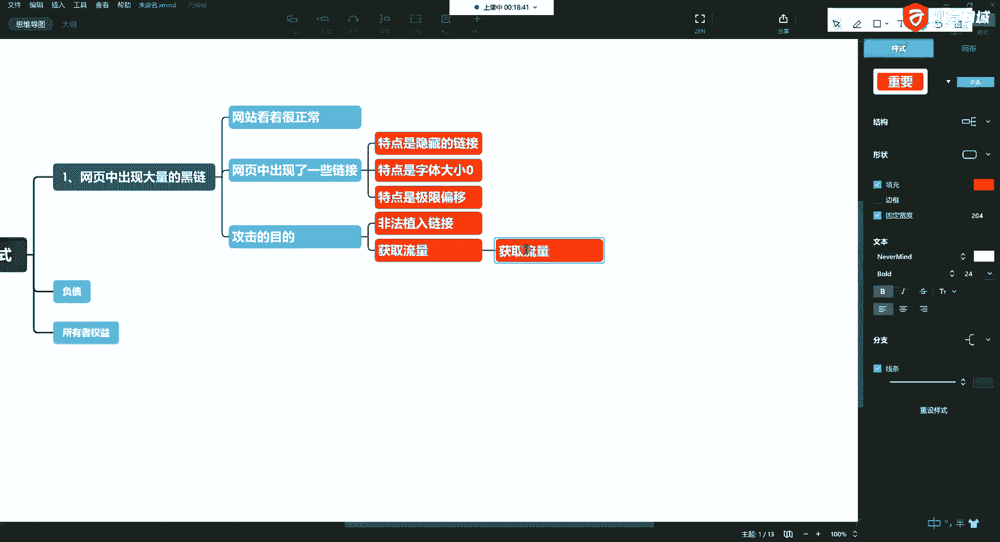

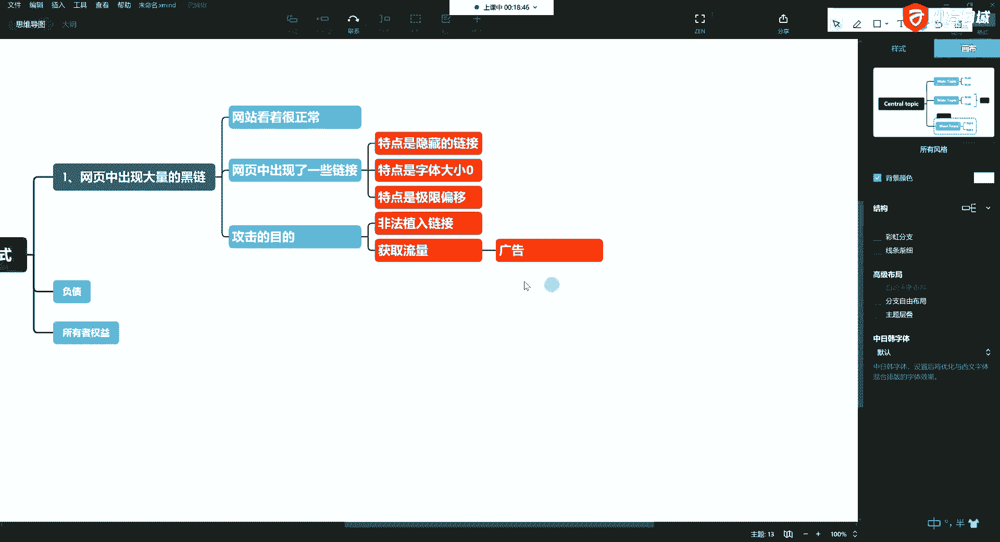

*   **表面正常，实则异常**：网站外观无异常，但内部HTML代码中植入了恶意链接或脚本。
*   **链接被隐藏**：这些恶意链接通常对用户不可见，但存在于网页源代码中。
*   **利用技术手段隐藏**：攻击者常使用两种技术来隐藏链接：
    1.  **字体大小为零**：在CSS中将链接的字体大小设置为0，例如 `font-size: 0px;`，使其在页面上不显示。
    2.  **极限偏移**：利用CSS的定位属性（如 `position: absolute; left: -9999px;`）将链接移出可视区域。

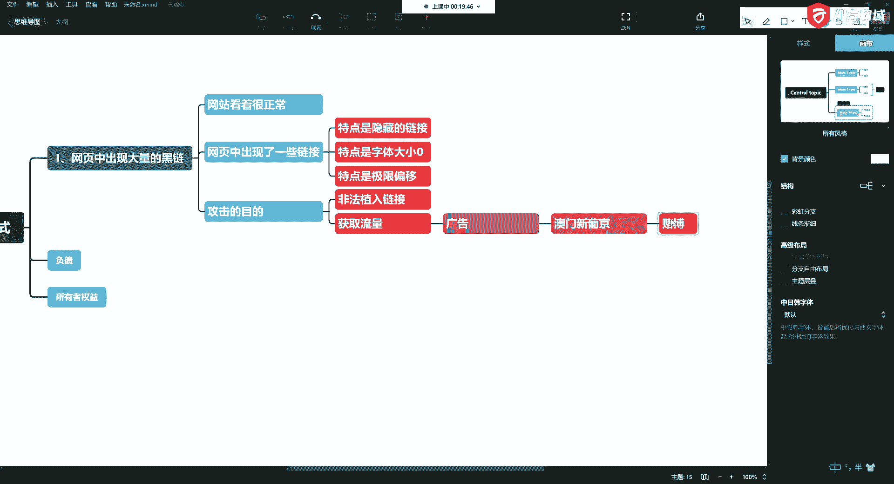

---

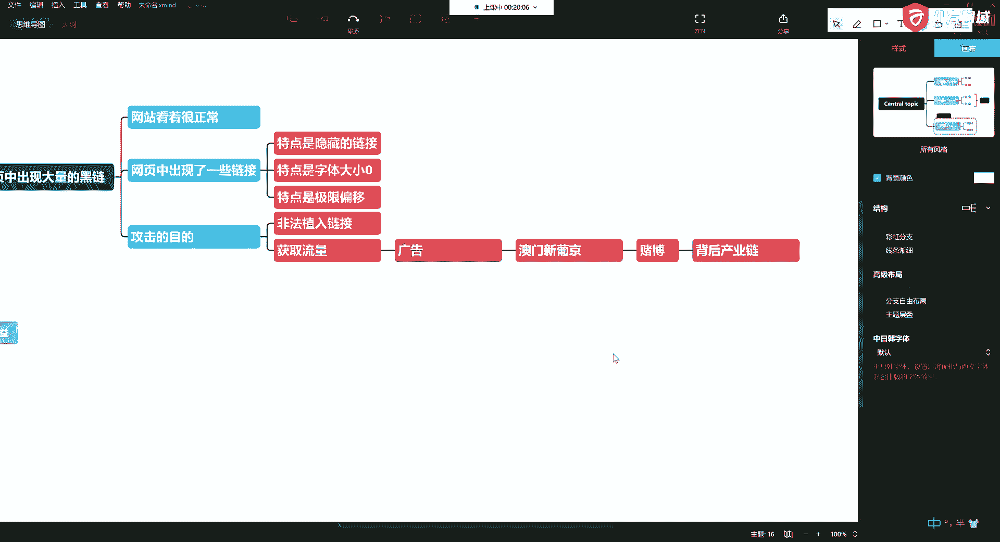

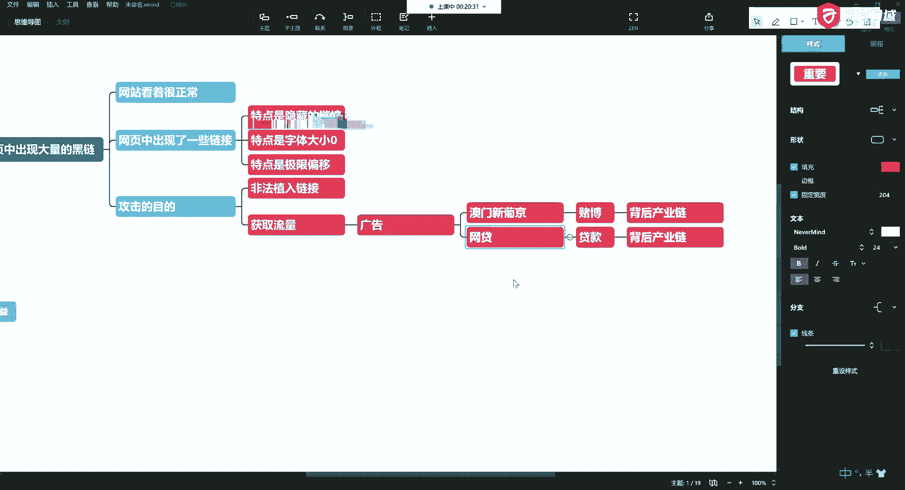

## 黑链的攻击目的

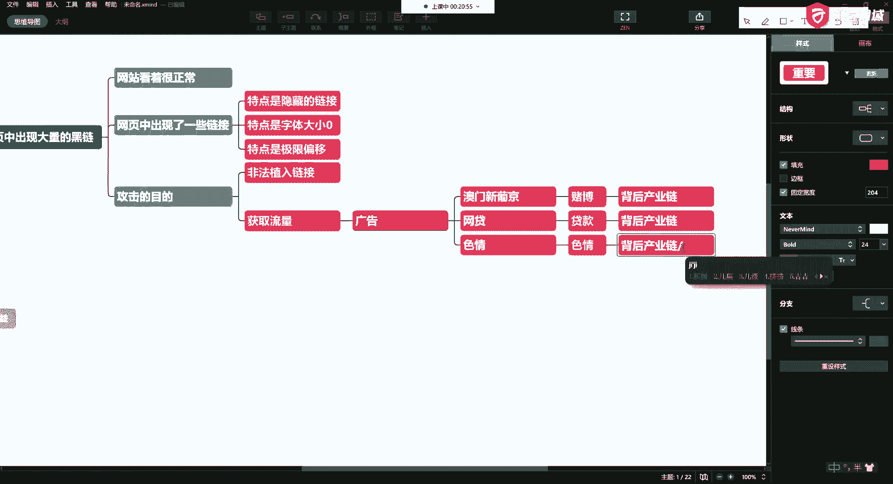

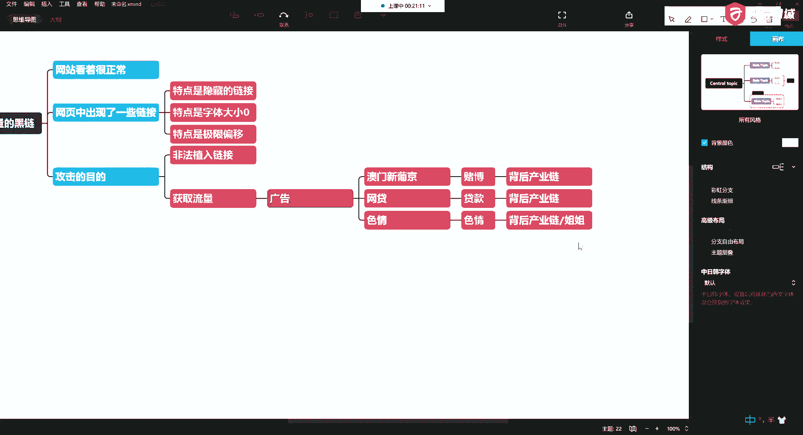

上一节我们介绍了黑链如何隐藏，本节中我们来看看攻击者植入这些黑链究竟想达到什么目的。其核心目的是利用被黑网站的流量进行非法牟利，背后往往形成黑色产业链。

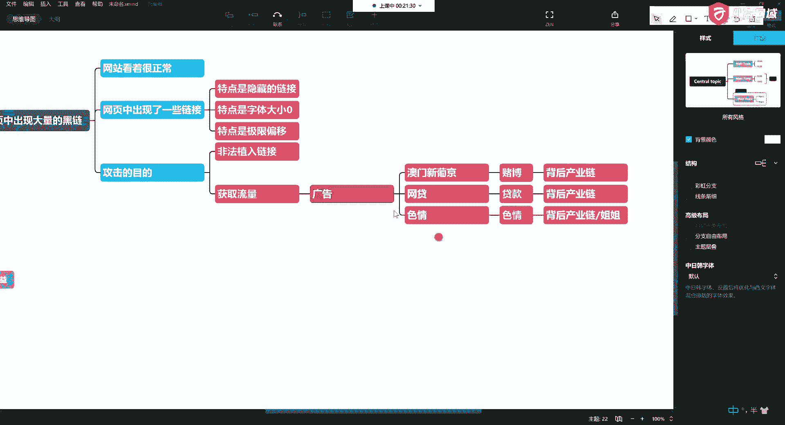

以下是几种常见的攻击目的：

*   **非法植入广告链接，获取流量**：用户点击后跳转到赌博（如“澳门新普京”）、网贷、色情等网站，为这些非法站点导流。
*   **推广盗版或私服内容**：引导用户访问盗版影视、游戏私服等网站，通常要求用户充值会员或下载客户端，这些客户端可能携带木马病毒。
*   **进行网页挖矿**：在网页中植入挖矿脚本，利用访问者的CPU或GPU算力秘密挖掘加密货币，消耗用户资源。

---

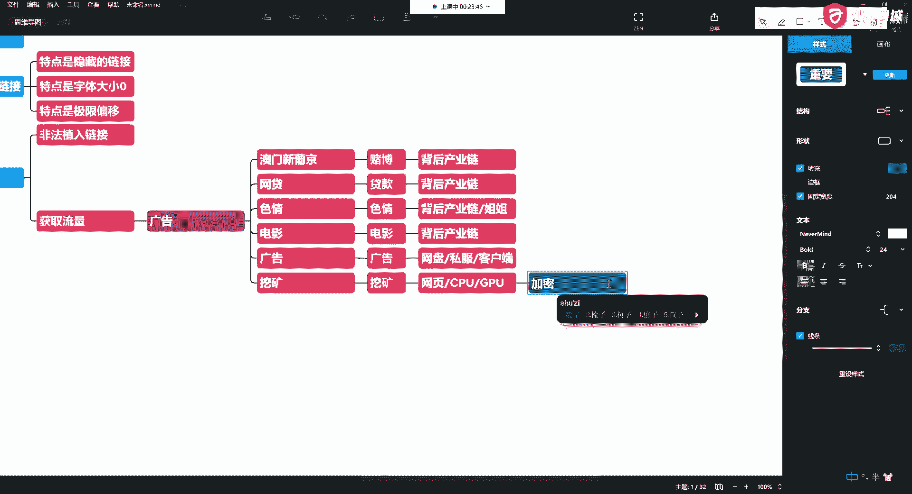

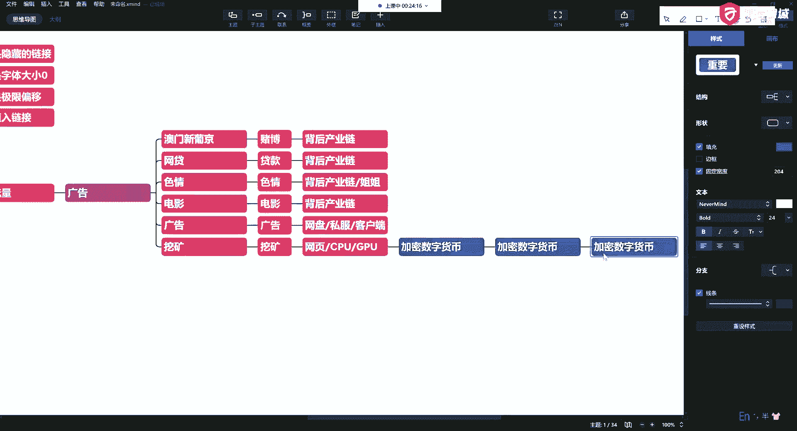

## 关于网页挖矿的深入解析

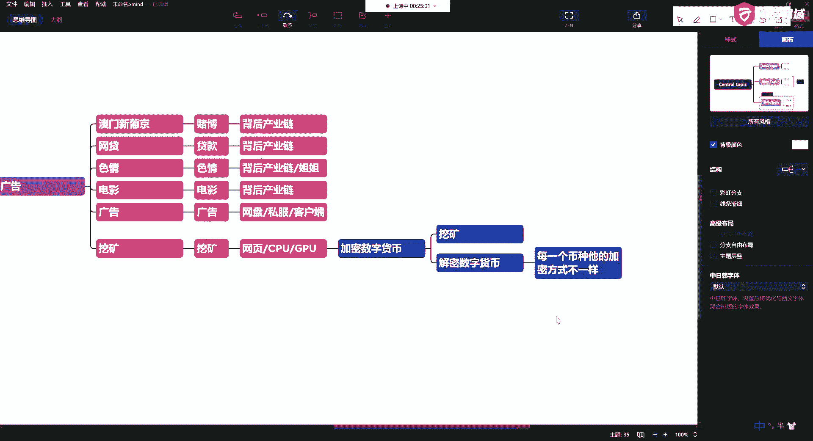

当黑链用于挖矿时，它直接消耗的是你的计算资源。这里我们需要理解一下“挖矿”的核心概念。

**挖矿的本质**是进行加密数字货币（如比特币、门罗币）的解密计算过程。每种币的加密算法不同，决定了使用CPU或GPU进行运算。其核心过程可以简化为：
`矿工计算机 -> 计算哈希值 -> 提交至矿池 -> 获得奖励（数字货币）`

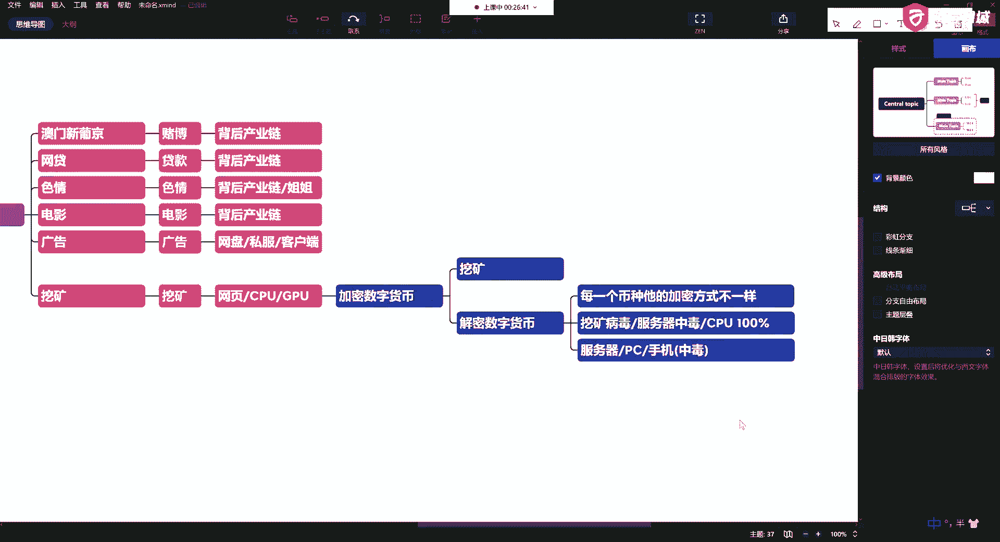

服务器和个人电脑常中的一种挖矿病毒是“门罗币”（XMRig）。中毒后，设备CPU使用率会持续高达100%，风扇狂转。

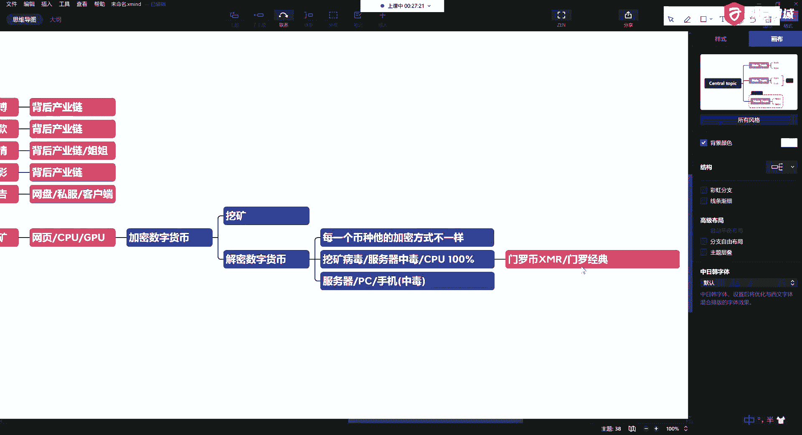

**应对挖矿病毒的思路**是切断它与矿池服务器的连接。可以通过防火墙（如 `iptables`）或安全组规则，封禁检测到的矿池IP地址或域名。连接中断后，挖矿进程会停止，CPU负载便会下降。

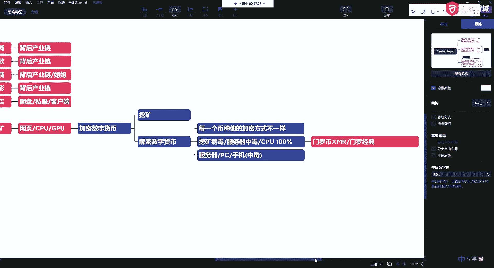

---

## 总结

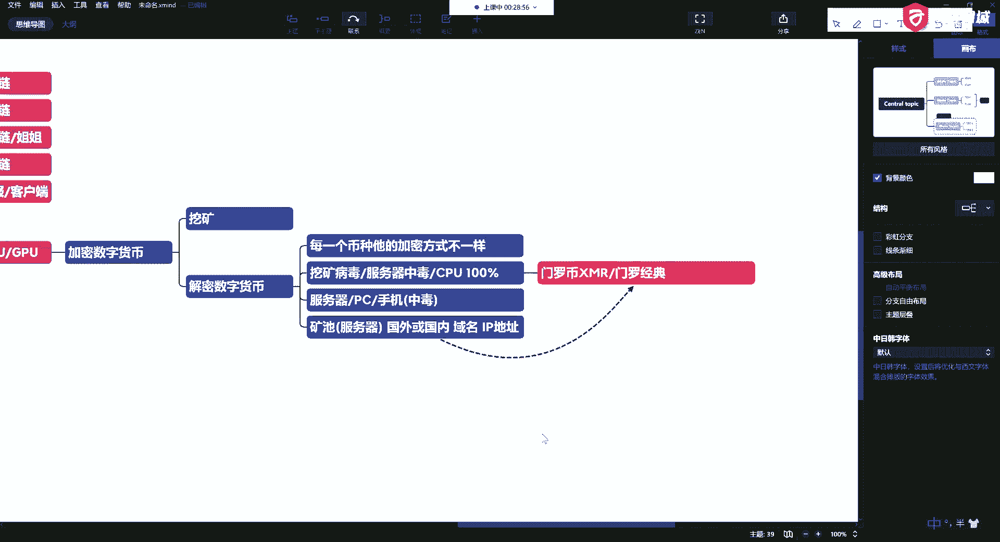

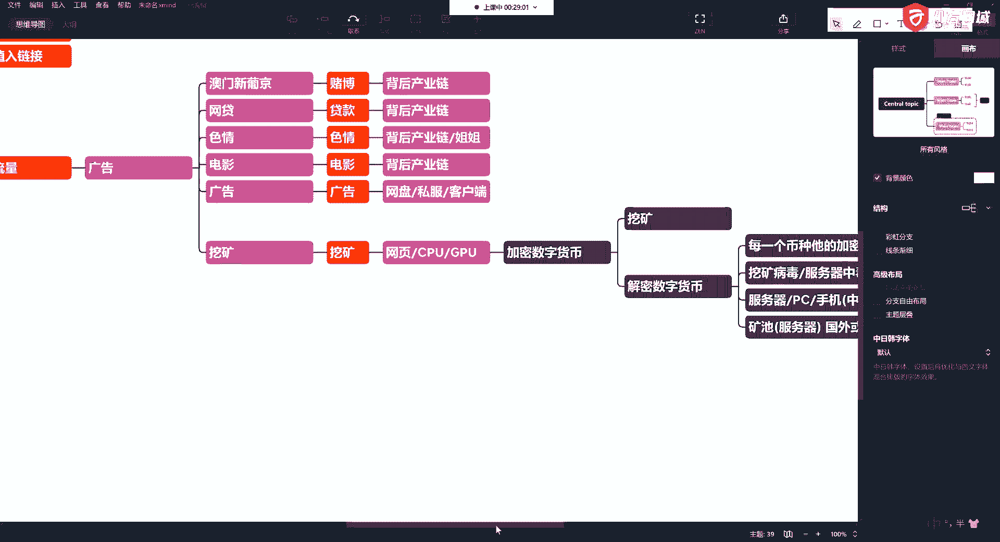

本节课中我们一起学习了“网页黑链”这种网络攻击方式。我们了解到，黑链通过技术手段隐藏在看似正常的网页中，其目的包括引流非法广告、推广恶意内容以及秘密进行网页挖矿。作为用户，应保持警惕，避免访问不安全的网站；作为运维或开发者，则需要定期检查网站代码，并部署有效的安全防护策略，如防火墙，以防范此类威胁。