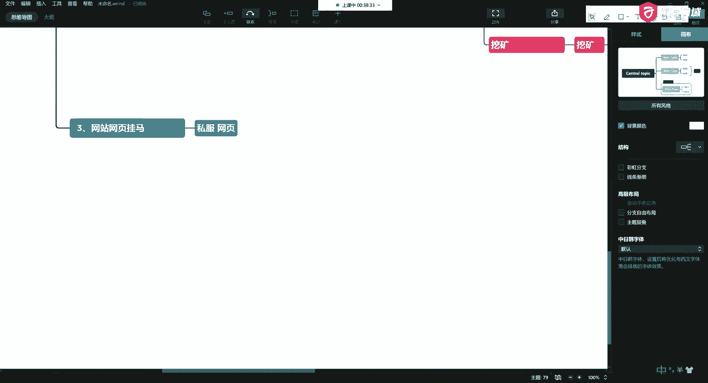
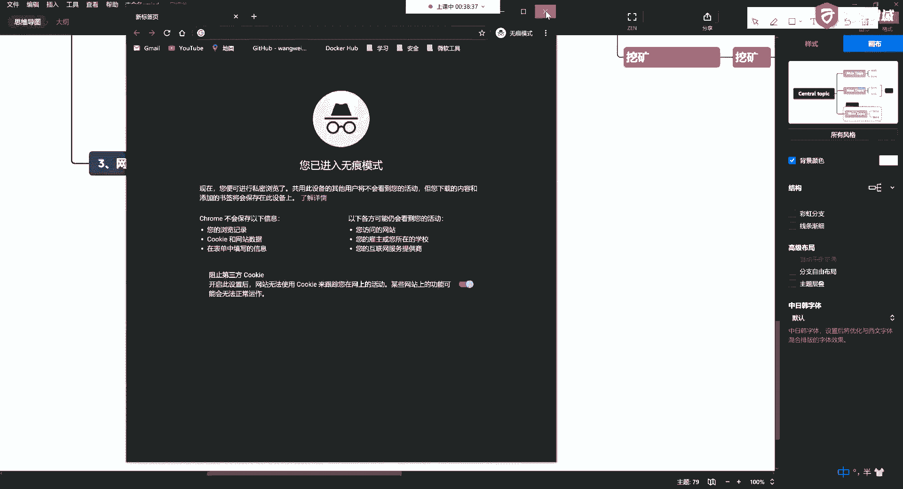
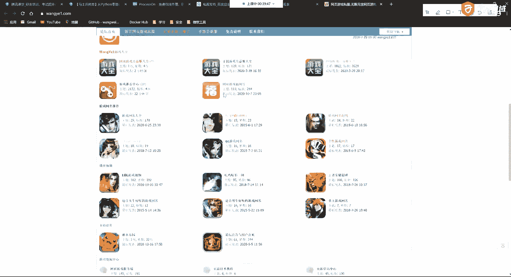

# 网络安全基础 P13：5.2 - 常见网站攻击方式概述 🛡️

在本节课中，我们将要学习几种常见的网站攻击方式。了解这些攻击手段，有助于我们更好地理解网络安全威胁，并为后续学习防御措施打下基础。

## 概述：网站根目录出现大量植入网页

上一节我们介绍了网页中出现黑链的情况。本节中，我们来看看另一种常见的攻击方式：网站的根目录被植入大量无关网页。

这种攻击通常发生在网站开发完成后缺乏维护、无人运维的情况下。攻击者利用网站存在的上传或下载漏洞，在服务器根目录中放置大量与网站本身内容无关的网页。

## 攻击原理与危害

这些植入的网页会带来严重的安全问题。以下是几种常见的危害：

*   **上传/下载漏洞利用**：攻击者可能利用漏洞上传恶意文件。
*   **目录内容暴增**：病毒或恶意脚本可能会进行递归操作，遍历并污染网站的每一层目录结构，导致目录内容异常增多。
*   **非本站内容**：植入的内容通常不是网站本身的，而是攻击者为了特定目的（如引流、挂马）放置的。

## 具体攻击手法示例：压缩炸弹 💣

在应对文件上传漏洞时，攻击者可能会使用一种称为“压缩炸弹”的手段。

**压缩炸弹** 的原理是利用递归压缩，生成一个体积很小但解压后极其庞大的文件。例如，一个仅有 **4KB** 的ZIP文件，解压后可能膨胀到 **4PB**，瞬间占满服务器磁盘空间，导致服务瘫痪。





其核心概念可以用一个简单的递归思想来描述，虽然实际代码更复杂：
```python
# 概念性示例：递归生成大量文件（非实际炸弹代码）
def create_bomb(depth, current_path):
    if depth == 0:
        return
    # 在当前路径创建大量文件或子目录
    for i in range(1000):
        file_path = f"{current_path}/file_{i}.txt"
        with open(file_path, 'w') as f:
            f.write('A' * 1000) # 写入大量数据
        # 递归进入子目录继续创建
        create_bomb(depth-1, f"{current_path}/dir_{i}")
```
攻击者可能将此类文件伪装成正常资料（如“公司资料移交.zip”）通过邮件或网站上传功能发送，一旦受害者解压，其存储设备就会被塞满。




## 过渡到其他攻击场景

除了污染根目录，攻击者获得网站权限后，手段会更加直接。接下来，我们将看看第三种攻击方式。

## 第三种攻击：直接挂载恶意代码（挂马）🦠

攻击者在获取网站控制权后，可能会直接在网页中植入恶意代码，这通常被称为“挂马”。

以下类型的网站容易成为目标：
*   **私服游戏网站**：下载的登录器或登录页面可能被植入监控程序、键盘记录器或盗号木马。
*   **高流量网站**：如虚拟货币交易所、下载站、影视站等，攻击者可窃取大量用户信息。
*   **捆绑恶意软件的安装包**：如一些非官方的系统镜像（ISO文件）或软件安装包。

植入的恶意代码可以实现多种目的：
*   **窃取信息**：盗取用户输入的账号、密码、邮箱等敏感信息。
*   **加密货币挖矿**：在用户浏览器或服务器后台运行挖矿脚本，消耗计算资源。
*   **远程控制**：利用系统漏洞获取系统权限，将设备变为“肉鸡”（被控制的傀儡机）。
*   **其他恶意行为**：如发起SQL注入攻击、打开用户摄像头或麦克风等。

## 第四种攻击：服务器感染病毒导致性能异常 🐛

另一种明显的攻击迹象是服务器运行异常缓慢。这通常是因为感染了病毒或恶意程序，例如蠕虫病毒。

以下是感染途径和现象：
*   **感染途径**：下载并运行了来自非官方渠道的、被篡改过的软件或运维工具。
*   **主要现象**：
    *   **资源耗尽**：CPU或内存占用率异常高，可能由挖矿程序、`fork`炸弹或深层递归程序导致。
    *   **可疑进程**：系统中出现大量未知的可疑进程。
    *   **顽固的持久化**：恶意程序会通过`crontab`等定时任务实现持久化，即使进程被杀死，也会从远程服务器重新下载并激活。

## 过渡到网络层面的攻击

以上攻击多发生在应用层。实际上，网络传输过程中的威胁同样不容忽视。下面我们来看第五种攻击。

## 第五种攻击：DNS劫持 🌐

要访问一个网站，通常需要通过DNS服务器将域名解析为IP地址。**DNS劫持** 攻击就是篡改这一解析过程。

**攻击原理**：类似于错误指路，当用户尝试访问某个网站时，攻击者通过控制DNS解析，将用户的请求引导到非预期的恶意IP地址上。

**危害**：
*   用户无法访问目标网站。
*   被引导至钓鱼网站或广告页面，造成流量被劫持和个人信息泄露。
*   服务器本身可能并无异常，但外部访问却指向了别处。

## 第六种攻击：服务器及网站密码被篡改 🔑

攻击者直接篡改服务器或网站管理后台的密码，是一种非常直接的攻击方式。

常见的突破途径包括：
*   **暴力破解**：针对SSH（默认端口22）、远程桌面（如Windows的3389端口）等服务进行持续的密码尝试。
*   **利用系统漏洞**：例如利用“永恒之蓝”等高危漏洞获取系统权限。
*   **利用配置弱点**：如Windows古老的“粘滞键”漏洞。

攻击者篡改密码的目的可能是：
*   **炫技或破坏**：多为技术初学者，旨在显示能力。
*   **勒索**：修改密码后勒索赎金，并会清除操作日志以隐藏踪迹。

## 第七种攻击：数据库被植入内容 🗃️

数据是网站的核心，数据库自然也成为重点攻击目标。

攻击者侵入数据库的途径与入侵服务器类似：
*   **弱密码或配置不当**：例如为数据库`root`账户设置远程访问且使用弱密码。
*   **利用漏洞**：通过数据库本身或应用层（如SQL注入）的漏洞获取访问权限。

侵入后，攻击者可能：
*   **篡改或插入数据**：在数据库中植入非法内容。
*   **勒索锁定**：对数据库或表进行加密锁定，要求支付比特币等赎金后才解密，否则数据将丢失。政府、学校、企业数据库常是此类攻击的目标。

## 第八种攻击：DDoS攻击 🌪️

**分布式拒绝服务攻击** 是另一种非常常见的网络攻击。

**攻击原理**：攻击者控制大量的“肉鸡”（被入侵的设备），在同一时间向目标服务器发起海量请求，耗尽目标的网络带宽、连接数或计算资源，从而导致合法用户无法访问服务。

**常见攻击目标与动机**：
*   **游戏公司**：针对登录服务器、下载服务器进行攻击。
*   **恶性竞争**：竞争对手之间互相攻击。
*   **勒索牟利**：攻击者主动攻击网站，然后向受害者兜售“防护服务”。

DDoS攻击防御成本高、难度大，往往给受害者造成严重的经济和声誉损失。

## 第九种攻击：非法跳转（流量劫持） ↩️

最后一种常见攻击是网站被非法添加跳转代码。

**实现方式**：
*   在网页中插入恶意 **JavaScript** 代码。
*   在服务器配置（如Nginx, Apache的配置文件）中设置非法的 **301/302重定向**。

**目的**：用户访问网站时，会被自动跳转到指定的广告页面、钓鱼网站或其他页面，以此窃取流量或进行广告欺诈。

---

## 总结

本节课中，我们一起学习了九种常见的网站攻击方式：
1.  **根目录植入网页**：利用漏洞上传大量无关页面。
2.  **压缩炸弹**：通过极小的压缩文件耗尽磁盘空间。
3.  **直接挂马**：在网页中植入恶意脚本，窃密、挖矿或控制设备。
4.  **病毒感染**：导致服务器性能急剧下降。
5.  **DNS劫持**：篡改域名解析，将用户引向恶意网站。
6.  **密码篡改**：通过暴力破解或漏洞夺取控制权。
7.  **数据库入侵**：篡改、锁定数据以进行勒索。
8.  **DDoS攻击**：利用海量流量压垮目标服务。
9.  **非法跳转**：劫持网站流量至其他页面。


理解这些攻击手法是构建安全防线的第一步。在后续课程中，我们将深入探讨如何防范和应对这些威胁。