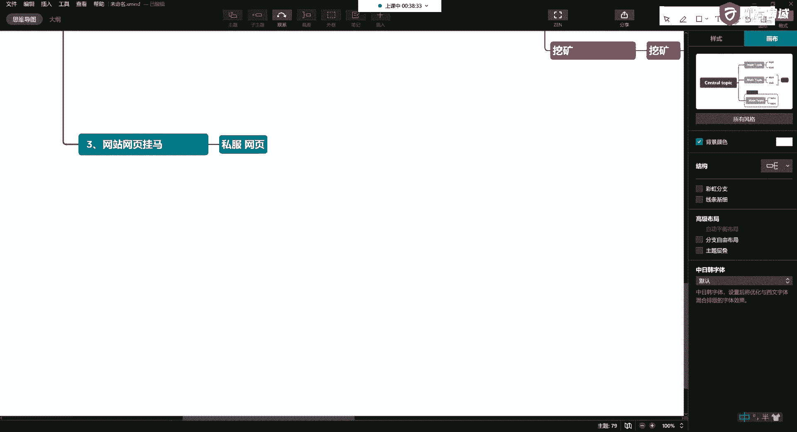
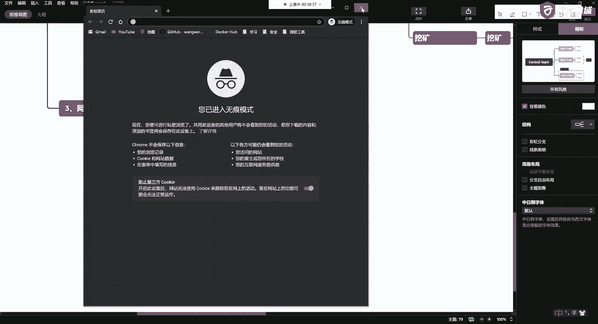
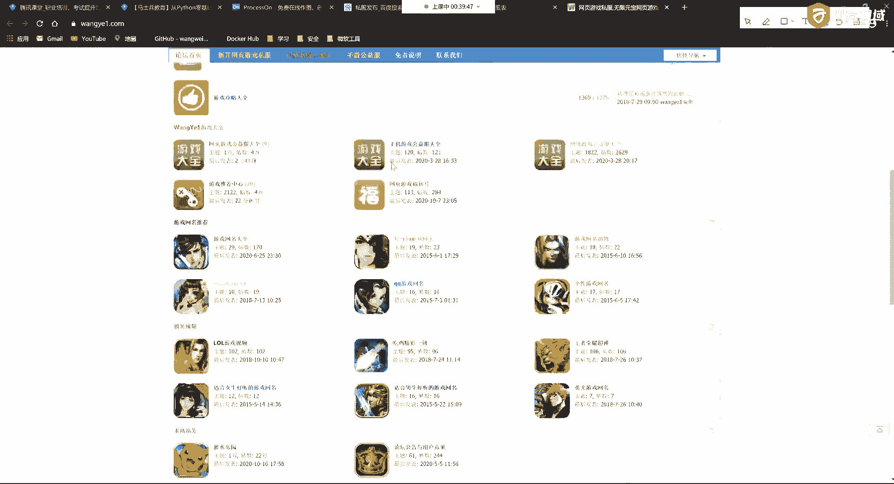
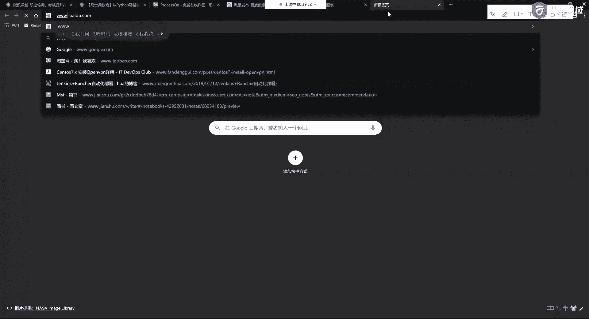
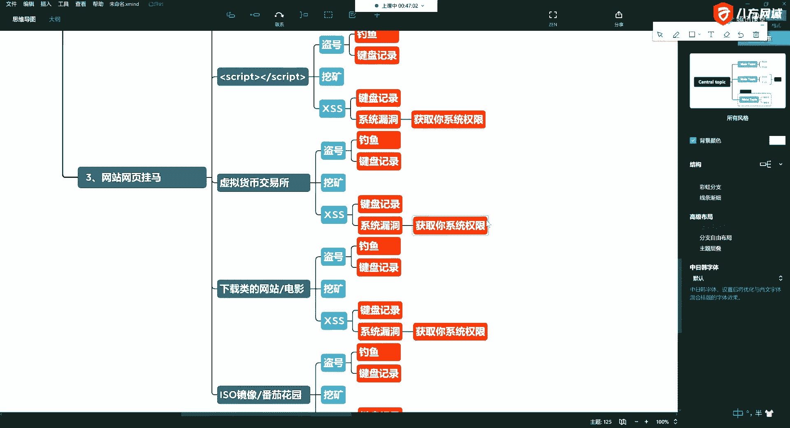

# P14：5.3-网络安全基础-常见网站攻击方式概述-网站网页挂马 - 一个小小小白帽 - BV1Sy4y1D7qv

很棘手好，这是第二种常见的这种攻击方式啊，第三种那就直接了啊，更直接了，第三种第三种呢，比如说我通过各种方式啊，我获得了你的这个网站的这个权限以后，就直接给你挂马，这种人最操蛋的啊，哎直接灌木马了。

那这时候这是哪些网站容易出现这种情况呢，好就像我刚才说的啊，比如说私服诶，我打私服怎么了啊，这是啊私服的网页。

呃我给你搜一个啊，搜一个，就这样的啊，类似于这样的，这样的话呢大家呢比如说你点进去啊，你点进去下载这个私服的登录器，这个登录器啊一点开啊就会，就会被人家监控了啊，这个是很危险的，那么还有的一些私服呢。

他是做了什么呢，私服的登录页面啊，登录页面看看哪个这也没有啊。

对吧唉像这样了啊，像这样的，你看我这个flash被屏蔽了对吧，像这样的，比如说在线去输入一些你的什么账号啊，什么这些东西，这是这样的网站，就在这些网站里头就容易去挂吧，所以说大家在玩私服的时候。

这些网站都比较可怕啊，这我也简单说一说啊，这个不是为了给他们推广啊，啊就是告诉大家有这么样的一个东西，这个很危险，好丝无霸业啊，那么这里头呢通常呢会获取一些什么东西呢，就是你的用户信息。

啊那有的人用户信息我我不知道啊，哎你不知道，有时候就是潜移默化的，那么我们在玩一些游戏的时候，它会让你注册，啊能收集到你个人信息，比如说你的姓名，输入你的邮箱，啊比如说这样的话，你就知道你的邮箱。

好然后还让你输入一个密码，啊那么有的说到这就够了啊，还会有一些东西呢收到你的敏感信息呢，就是生日，啊那我能说那五这个网站或者这个私服，他们的服务就这么好这么好吗，他就对我们这么友好，不是啊。

这些个东西实际上就足够威胁你啊，这些事儿了，比如说我通过你的生日啊，我可以在有你的用户，你的姓名我可以猜啊，猜你的这个根据你的邮箱账号啊，和你的游戏密码，对吧，唉我可以破解你的邮箱，才可以这么干。

啊那比如说破解完了你的邮箱呢，你的邮箱里头有很多的内容对吧，通过你的邮件，比如说可以看你家里住哪儿，啊有说这这咋看呀，比如说你邮件里头有一些你的购物信息啊，你的信用卡账单，对吧唉等等等等啊等等等等。

所以这些东西都是非常危险的，啊那么刚才第一个说了，像这种私服的网页，我们已经说了，哎私服的网页，那么还有那么网站，它挖矿了，他是通过啥来给你挖的呢，它实际上就是很简单，对吧唉他通过ds一些脚本在这里头。

那这里头我要想放这里头，你要想弄的东西就多了啊，还是刚才老一套啊，比如说有盗号的，啊，盗号了呢，那有钓鱼的，啊有键盘记录的啊，就是让你输入对吧，唉你输入完了以后发到指定的邮箱，在后台。

或者呢你在他网站上，比如说充值是吧，哎等等等等啊，这就是盗号的，好，那么还可以做什么呢，挖矿的，啊甚至还可以干什么呢，唉看ss的啊，然后利用你的系统漏洞，直接可以，获取你系统权限的，啊等等等等。

这些都可以，好吧，那还有好多呢啊还有好多呢，比如说做circle ru的啊等等等等，所以这呢我就简单的说一些啊，简单的说一些，那么这里头呢啊通常是什么呢，比如说还有什么呢，比如说是你一些交易所。

啊虚拟货币的一些交易所，好吧，还有一些是什么呢，还有一些是你的一些这个这个这个，这个这个这个这个，下载类的，唉下载类的网站啊，有人还有电影类的网站，就是一些工具啊，还有一些什么呢，还有一些呢就是。

怎么做，比如说我网上放一个iso镜像，啊比如大家听说过的这个番茄花园，什么雨林木风啊等这些系统的这些iso镜像啊，说我不是放在网页里啊，我把它打包成一个镜像，让你下载下载，你安装完了以后，这里就有啊。

也可以，所以这是第三种常见啊，那么这时候呢刚才说了，可以骗你的账号啊等等等等，这些东西都非常危险啊，比如说还可以什么呢，打开你的摄像头啊，打开你的音频对吧，唉浏览你你你你你你你的信息等等等等啊。

