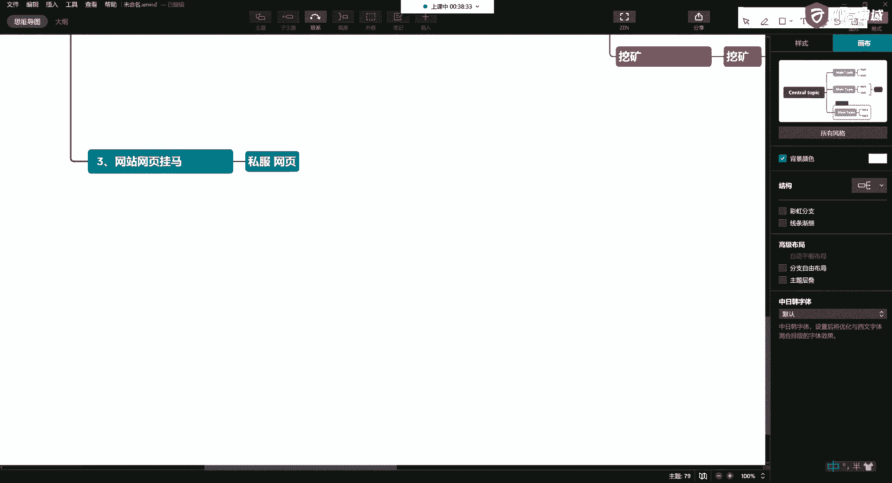
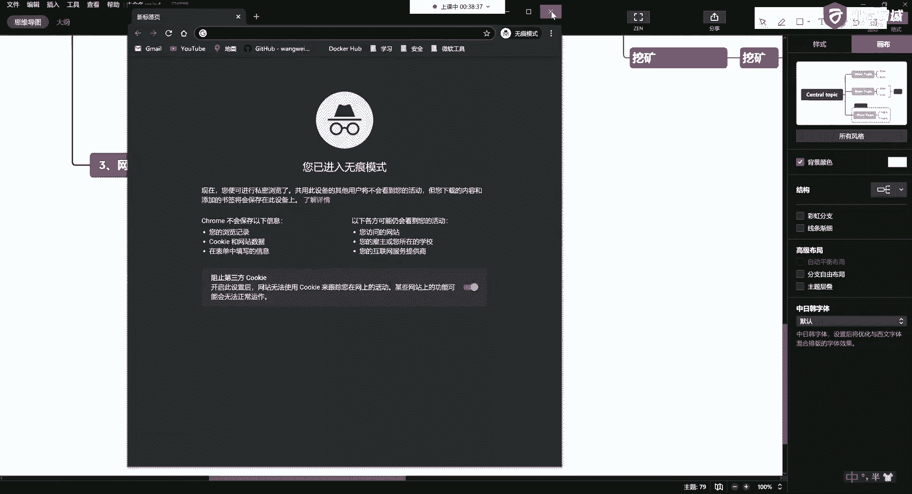
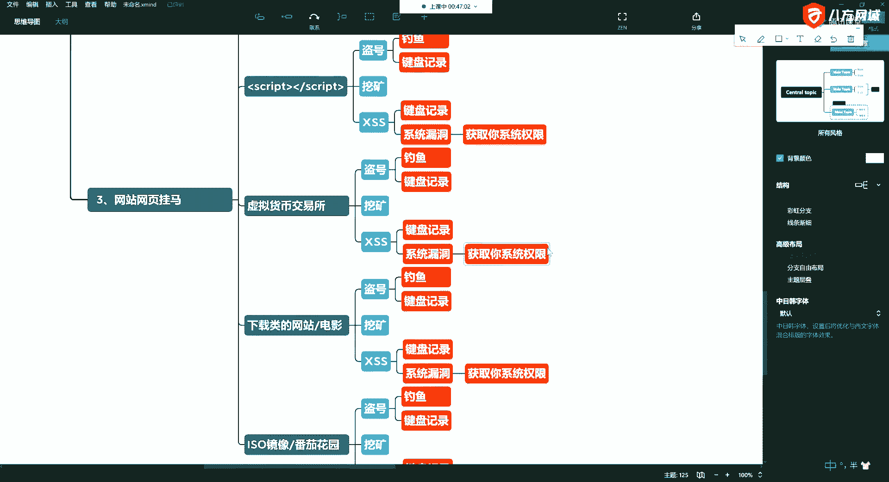

# 课程P14：5.3-网络安全基础-常见网站攻击方式概述-网站网页挂马 🕵️

在本节课中，我们将学习一种直接且危害性强的网站攻击方式——网页挂马。我们将了解哪些类型的网站容易成为目标，以及攻击者通过挂马可能窃取哪些信息。

上一节我们介绍了其他攻击方式，本节中我们来看看更为直接的“网页挂马”。

## 什么是网页挂马？

攻击者在通过各种手段获得网站的管理权限后，会直接在网站页面中植入恶意代码或程序（即“木马”）。当用户访问这些被篡改的网页时，就可能中招。

## 哪些网站容易遭遇网页挂马？

以下是几种高风险网站类型：

*   **私服游戏网站**：许多网络游戏私服的官方网站或登录页面是挂马的重灾区。
*   **虚拟货币交易所**：一些安全性不足的交易所网站可能被植入恶意脚本。
*   **下载站与资源站**：提供软件、电影、系统镜像（如“番茄花园”、“雨林木风”等非官方系统）下载的网站风险较高。
*   **工具类或电影类网站**：这类网站也可能被利用来传播木马。

## 网页挂马能做什么？

攻击者植入的木马程序可以执行多种恶意操作，窃取大量敏感信息。以下是其主要危害：

*   **盗取账号密码**：通过钓鱼页面或键盘记录器，窃取用户在网站输入的账号、密码、邮箱等信息。
*   **收集个人信息**：诱导用户注册，收集姓名、生日等，结合其他信息可能威胁到个人安全。
*   **控制设备与挖矿**：利用系统漏洞获取系统权限，甚至控制摄像头、麦克风，或在用户不知情时利用其设备进行加密货币“挖矿”。
*   **进一步渗透**：通过窃取的邮箱信息，获取购物记录、账单等，进行更深入的攻击或诈骗。

本节课中我们一起学习了“网页挂马”这种攻击方式。它通过直接篡改网站内容来危害访问者，常见于私服、下载站等安全性较弱的网站，能够盗取账号、个人信息，甚至控制用户设备。了解这些风险有助于我们在浏览网页时保持警惕。