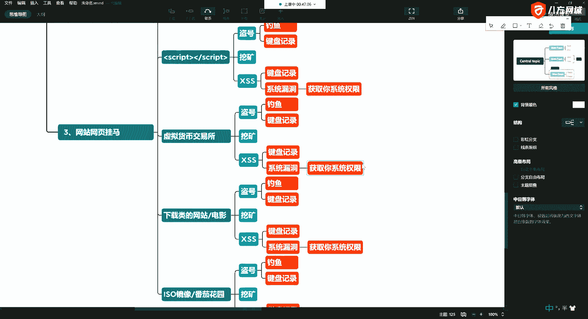
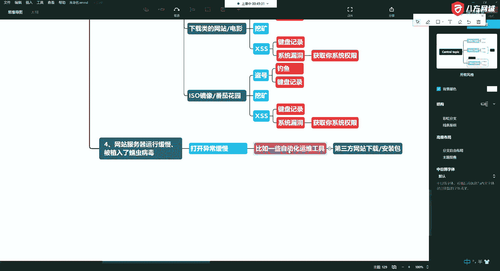
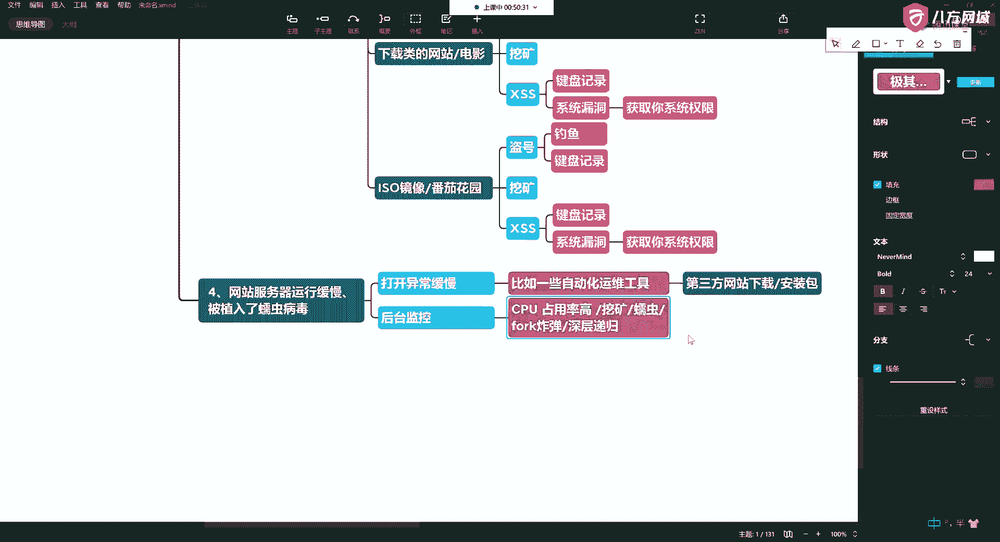
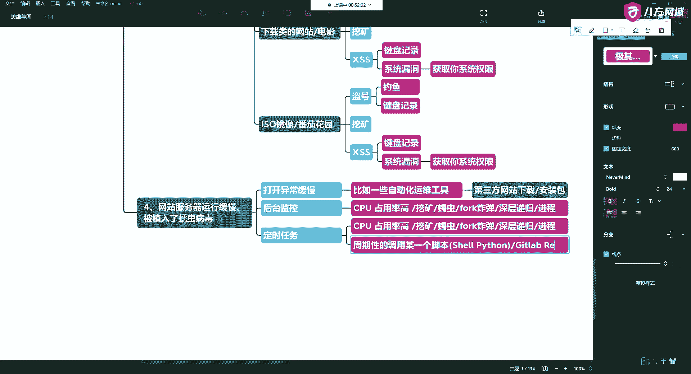
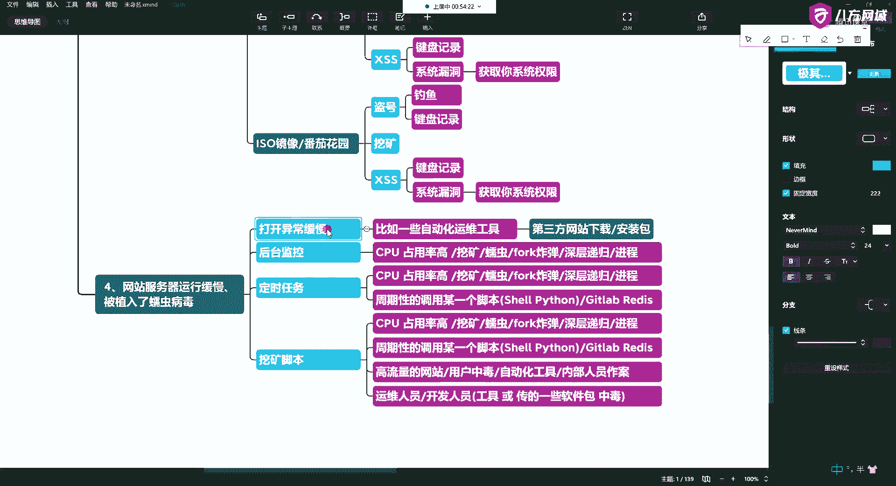
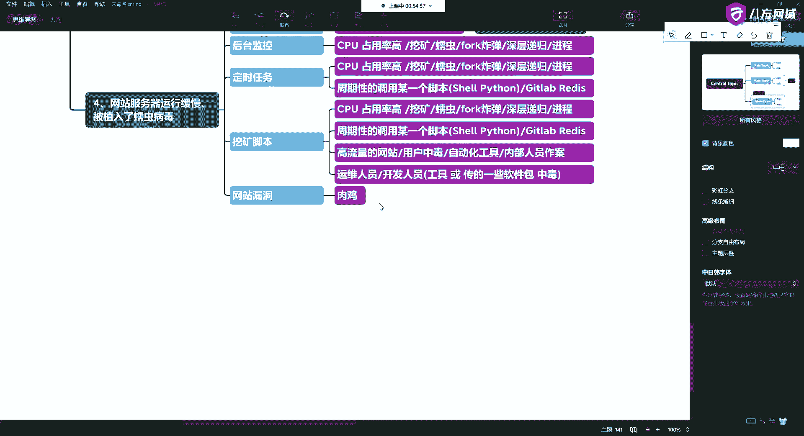
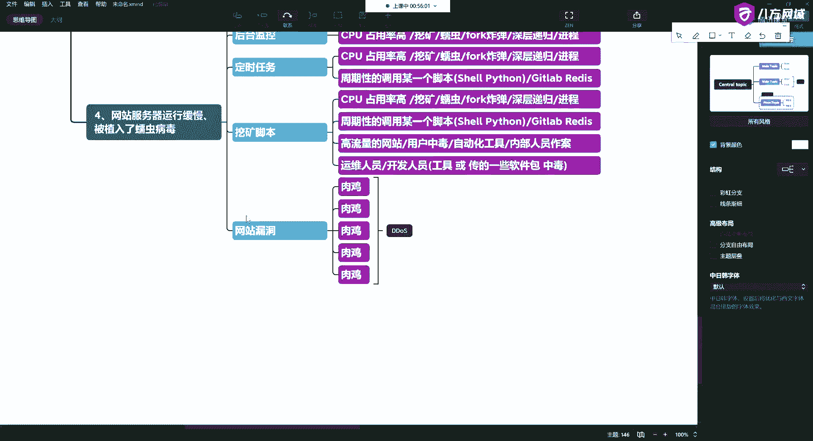

# P15：5.4-网络安全基础-常见网站攻击方式概述-网站服务器运行缓慢、网络安全基础-被植入了蠕虫病毒 - 一个小小小白帽 - BV1Sy4y1D7qv

你的信息等等等等啊，手机也可以。

好这第三种啊，第四种啊，第四种呢是什么呢，第四种呢就是中病毒了，就是发现你的网站，服务器运行缓慢，啊那么这时候呢也有的呢，就是常见的就是被植入了啊，我们叫什么呢，蠕虫病毒，其实就是计算机程序啊。

不同病毒恶意代码，那么它一般的有什么特点呢，这样的特点呢就是打开异常缓慢啊，钱在转转转转转转的，啊那这时候它容易怎么怎么容易中啊，就是比如说你下载了一些东西啊，下载一些软件，不是从官方下载的。

比如说一些运维工具，什么运用工具啊，自动化运用工具，好你下了一些工具，不是从官网下的啊，从一些第三方网站，诶那这里头比如说你的一些安装包啊，可能会被动手脚，那这时候直接你就运行上去了啊。

所以呢这些人呢他们做这些事呢，都是叫什么社会工程学啊，他不是跟傻狍子一样对吧，你说他要告诉你说我这个有病毒，我这有病毒，那你还下吗，对不对，哎所以说他伪装的就是正常的一个需求啊，你就从网上去下载对吧。

哎你下载完了以后，哎你就中了啊，所以一般打开缓慢里头，有可能你当然这个只是打个比方啊，打个比方说你是通过这些东西。

那么如果我们去看的话啊，那我们后台监控，后台监控的话呢，这时候就比较有意思了啊，你后台监控的话呢，你会监控你的硬件，比如你的cpu，啊cpu占用率比较高，说为啥你想要慢了呢，就是因为cpu占用率高了。

比如说这里头刚才说了，有挖矿的是吧，可以有蠕虫的，是这种病毒的啊，还可以是什么呢，有fork炸弹的啊，有深层递归的，唉都可以啊，造成你的内存和你的cpu这些硬件资源被耗尽。

那么还有什么呢，唉就是你的进度啊，他会生产生生这个生成很多的这种可疑进程，啊还有什么呢啊还有呢就是通过你定时任务啊，说他知道看你要搞他对吧。

哎你把它搞掉了以后呢，有时候呢你就把这个技能杀掉了，是没有用的对吧，那么它会周期性的，什么叫定时任务啊，就是我们在linux系统下就跟你闹钟一样，比如说定明天早上八点起来，那它会周期性地进行检查。

那怎么检查呢，就检查他自己是否活着好，哎某一个脚本，那么这说到脚本了，那这就可以是shell写，可以是python写的诶，他中心定一个脚本，如果发现你这个进程被杀掉以后。

他可以偷偷的从远程服务器再把它下下来，所以这个典型的攻击呢，还有一种呢，就是比如说大家使一些开源的c a，c d这些工具，比如说get lab啊，这里呢可以通过redis直接进来。

用过阿里云的好多人都被搞过啊，你们这里的可能也有同学会被搞啊，有的人我现在还没有，那只是没到时候哈，去年唉不是去年今年3月份，今年3月呢有一个学生啊，他们公司200多台服务器都被搞啊。

200多台服务器都中了挖矿病毒，你想想这是何其壮观啊啊这是何其壮观啊，200台业务全停啊，你就这200台，你重新做一遍系统，你想想你得多长时间是吧啊，好这里都有定时任务啊。

那么这里头还有一些呢就是挖矿脚本。

挖矿无处不在啊，哎那么还是。

好你挖我挖大家挖啊，那么一些高流量的网站，你这些用户中毒唉，中毒以后，那么你们挖这个矿，大家都聚到一个钱包里啊，人家一天也能挣不少钱，那么还有一种呢就是刚才说了自动化运维工具。

啊还有一种最典型的就是内部人员。

啊那么内部人员作案这块我说一下好吧，哎那么要么就是你的运维人员，要么就是你的开发人员，比如说他们用的工具，或者他们传的包，本身里头就是带读的啊，这时候部署到你的服务器上。

通过c a c d部署上去也可以啊，你依然也可以，那么还有一个呢就是做什么用的呢啊。

通过你的漏洞，唉比如说通过你的xss呀，通过你的sql入驻啊，懂拿到你这个站，通过web shell等拿到你这个站，拿到你这个站以后，然后你这台服务器就被控制了，这个东西就叫做肉机诶，黑客就入侵你了。

那你这台电脑它被挂满了。

然后就手机啊。

可能有一台有两台，它可能会复制传播。

啊就变成了有很多台手机，那这时候就可以为将来的ddos做准备，啊有成百上千台啊，平时不用用的时候发送一条指令啊，ok全滴他滴某一台服务器，这时候啊就相当于十个人围殴一个人，对不对。

哎最终造成那么你在数据接收推流，在这个过程中超过了它硬件的网卡，硬件的吞吐率，它的负荷，那这时候服务器就会拒绝响应啊，比如这个网站你可以两小时都打不开啊，这种东西就是流量工具的一种常见的一种方式。

好这块也不能多说是吧，唉电视上也不让播太多。

