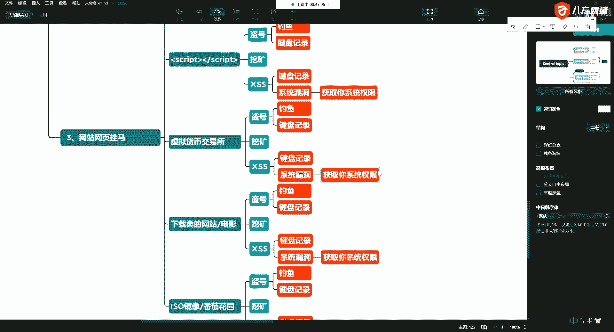

# 课程P15：5.4-网络安全基础-常见网站攻击方式概述-蠕虫病毒与服务器异常 🔐

在本节课中，我们将学习一种常见的网站服务器安全问题：服务器运行缓慢。我们将重点探讨导致此现象的一种原因——服务器被植入了蠕虫病毒，并分析其感染途径、表现特征以及背后的攻击原理。

---

上一节我们介绍了服务器运行缓慢的几种可能性，本节中我们来看看由恶意程序，特别是蠕虫病毒导致的情况。

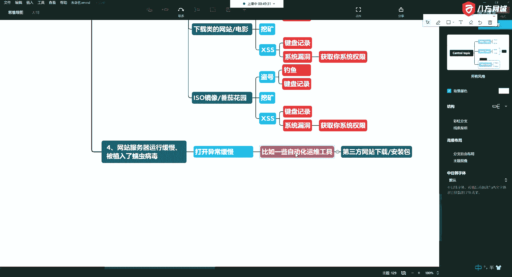

当发现网站服务器运行异常缓慢时，一种常见的原因是服务器被植入了蠕虫病毒。蠕虫病毒本质上是一段恶意的计算机程序代码。

这种病毒通常会导致网站打开异常缓慢，页面加载时进度指示器（如加载动画）会持续旋转。服务器容易感染此类病毒的场景包括：用户从非官方渠道下载并运行了被篡改的软件或工具。例如，一些运维工具或自动化脚本如果不是从官网下载，其安装包可能被攻击者动了手脚，一旦运行就会导致中毒。

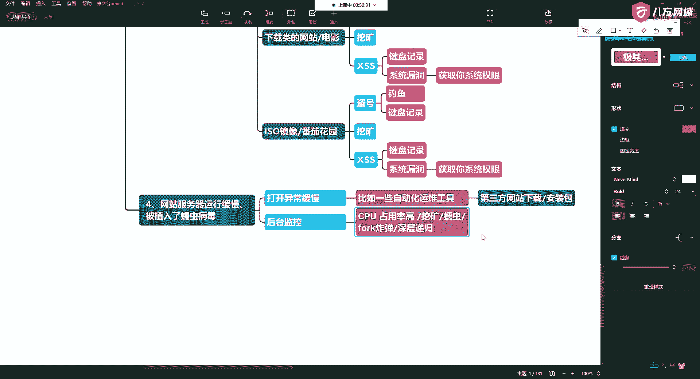

攻击者实施这些行为时，往往运用了社会工程学原理。他们不会明示软件包含病毒，而是将其伪装成满足正常需求的工具，诱导用户下载，从而达到入侵目的。服务器运行缓慢就是感染后的一个典型表现。

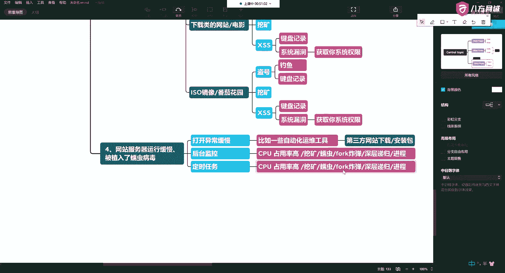

---

那么，如何从技术层面判断服务器是否中毒了呢？我们可以通过后台监控来观察。

在后台监控硬件资源时，会发现CPU占用率异常高。服务器变慢的根本原因就是CPU等硬件资源被大量消耗。除了蠕虫病毒，消耗资源的还可能包括挖矿程序、fork炸弹或深层递归函数等。

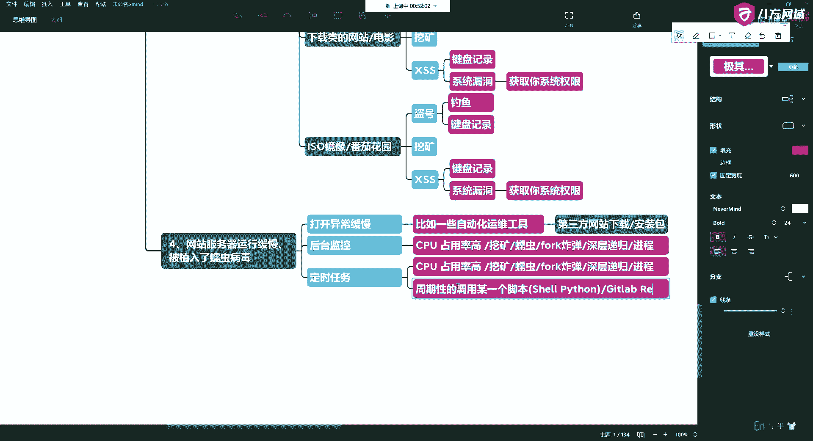

以下是可能观察到的异常现象：

*   **可疑进程**：系统会生成大量可疑的后台进程。
*   **异常定时任务**：攻击者会设置定时任务（如在Linux系统中的Cron Job）。这类似于一个闹钟，会周期性地检查病毒进程是否存活。如果进程被杀掉，定时任务中的脚本（可能是Shell或Python编写）会从远程服务器再次下载并启动病毒程序，使其死灰复燃。
*   **通过漏洞入侵**：攻击者也可能利用Web应用漏洞（如XSS跨站脚本攻击或SQL注入）获取服务器权限，上传Webshell后完全控制服务器。这台被控制的服务器就成为了“肉鸡”。

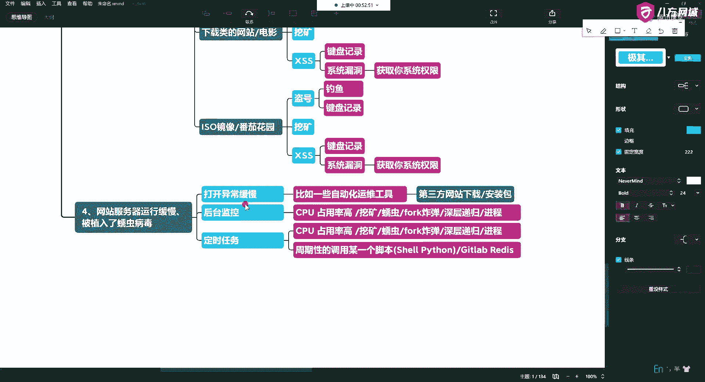

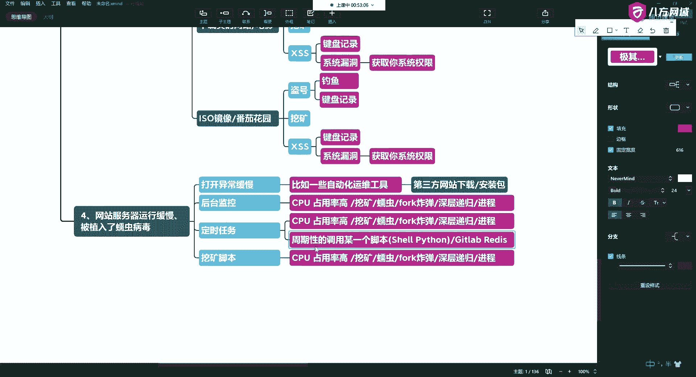

一个典型的攻击案例是，攻击者通过暴露的Redis服务或GitLab等CI/CD工具漏洞入侵服务器。

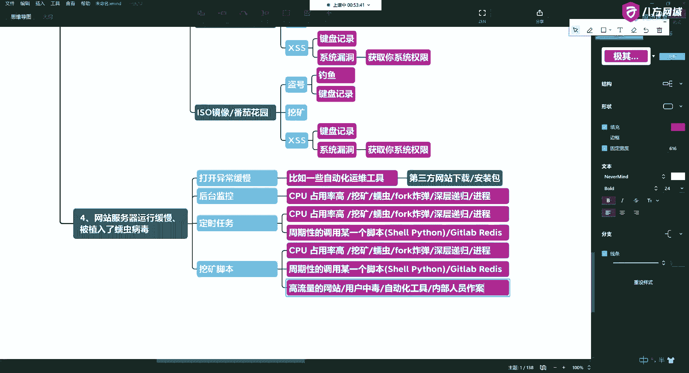

---

感染病毒后，危害会进一步扩散。一台服务器被攻陷成为“肉鸡”后，病毒可能会自我复制并传播到网络中的其他服务器。

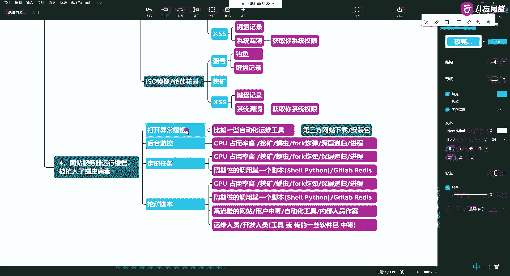

当攻击者控制了成百上千台这样的“肉鸡”后，就可以组建僵尸网络，为发动大规模DDoS攻击做准备。在需要时，攻击者一声令下，所有“肉鸡”同时向目标服务器发送海量请求，这就像十个人围殴一个人。目标服务器的网络带宽和硬件资源会被瞬间耗尽，导致拒绝服务，网站可能长达数小时都无法打开。这就是流量攻击的一种常见方式。

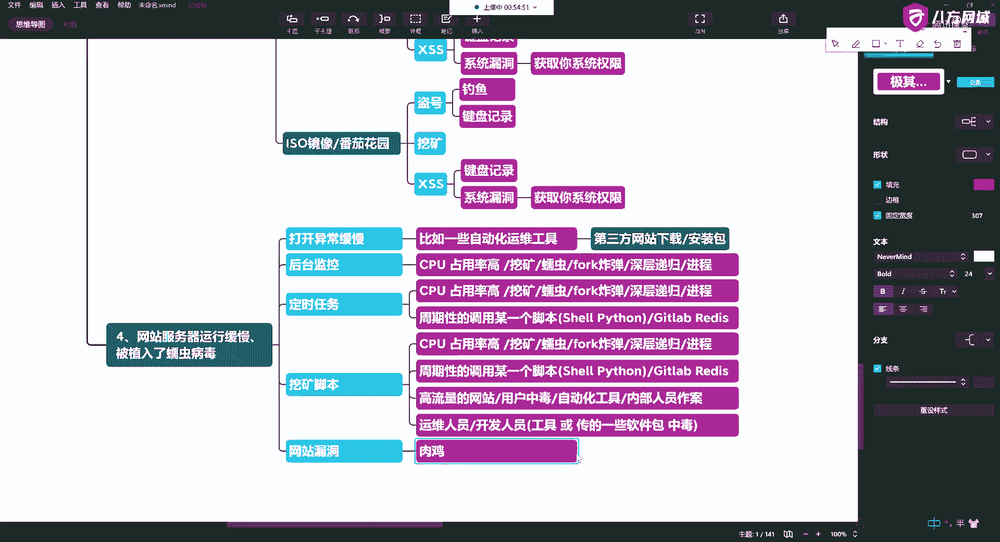

需要警惕的是，内部人员也可能成为风险源。无论是运维还是开发人员，如果其使用的工具或上传的软件包本身带毒，在通过CI/CD流程部署到服务器后，同样会导致服务器被感染。

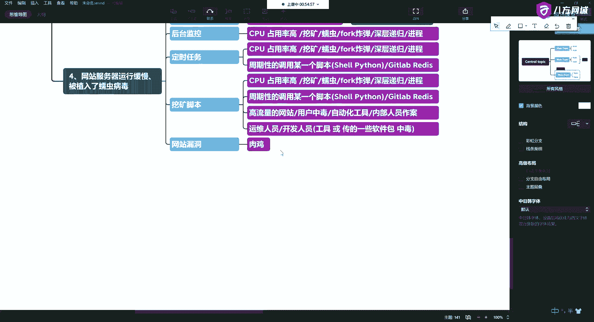

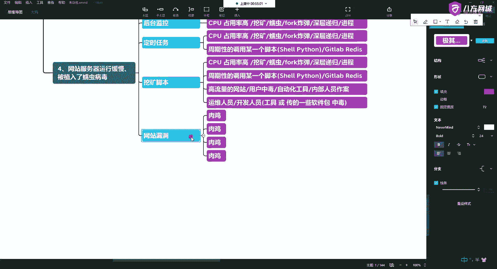

现实中，此类攻击屡见不鲜。例如，曾有案例显示，某公司超过200台服务器同时感染挖矿病毒，导致业务全部瘫痪，恢复系统的工作量巨大。对于高流量的网站，如果访问用户中毒，其计算资源也可能被汇聚起来用于挖矿，为攻击者牟利。

---

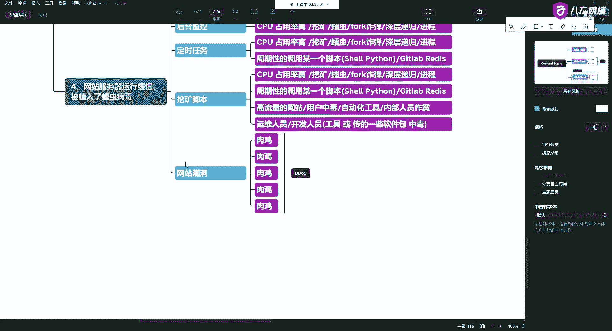

本节课中我们一起学习了导致服务器运行缓慢的蠕虫病毒攻击。我们了解了其感染方式（如下载不洁软件）、在系统中的表现（如CPU占用率高、存在可疑进程和定时任务），以及其可能造成的更大危害（如形成僵尸网络发动DDoS攻击）。理解这些基础知识，是构建网站安全防护意识的第一步。