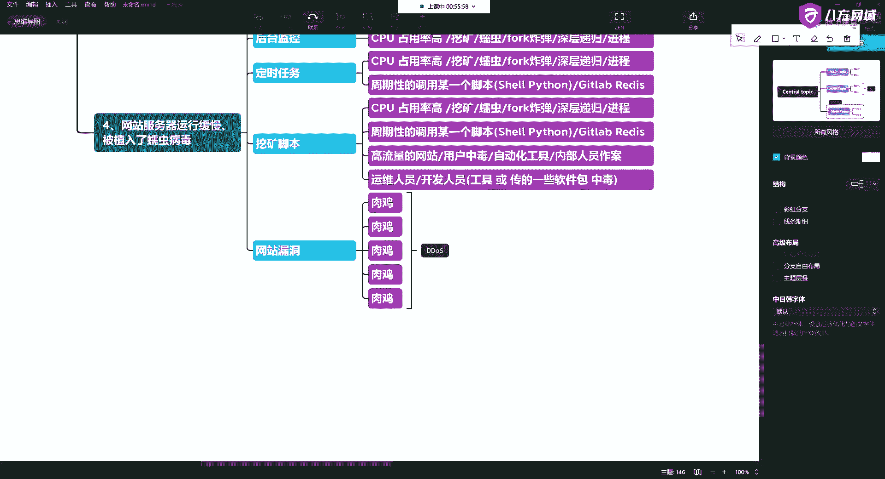
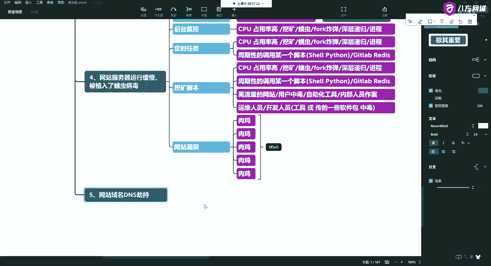
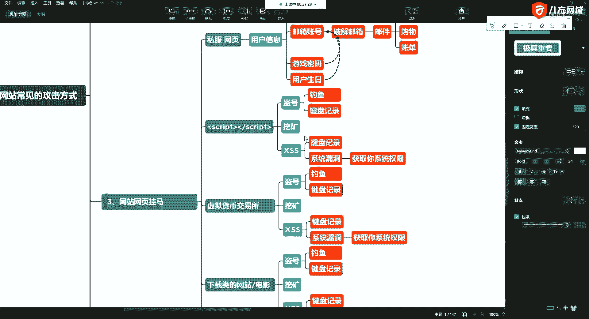
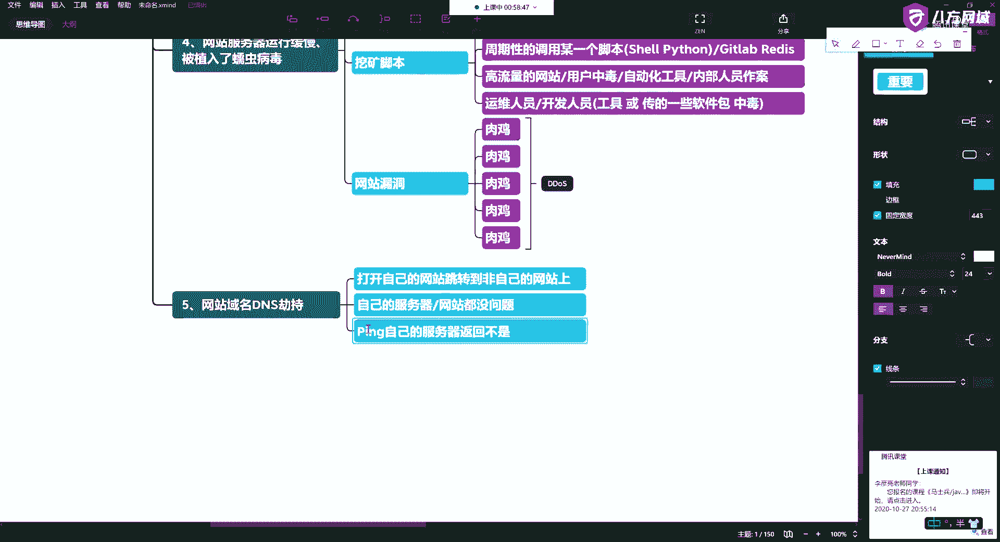
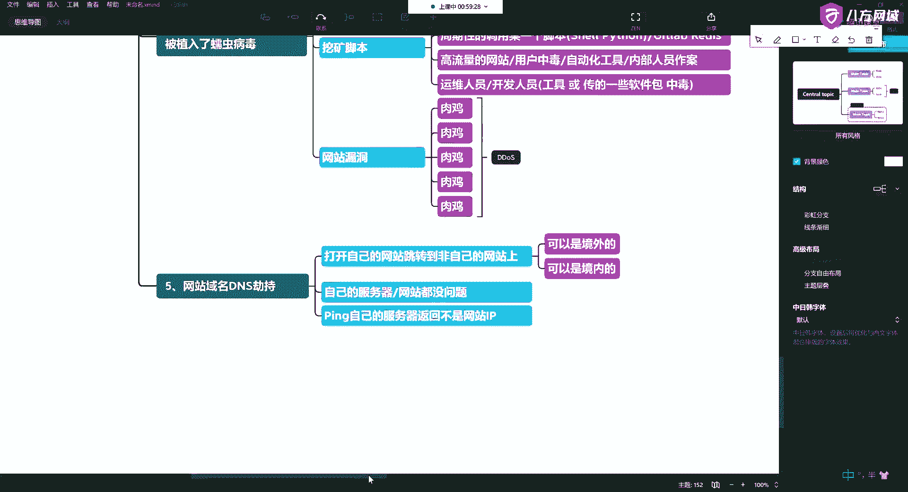

# 课程 P16：5.5 - 网络安全基础 - 常见网站攻击方式概述 - 网站域名DNS劫持 🔐

在本节课中，我们将要学习一种常见的网络攻击方式：DNS劫持。我们将了解它的基本概念、工作原理以及可能造成的危害。

上一节我们介绍了网络安全中常见的攻击类型，本节中我们来看看其中一种具体的方式：DNS劫持。

## DNS劫持是什么？

我们要访问一个网站，可以通过它的IP地址进行访问，也可以通过域名进行访问。网站的域名是通过DNS服务器，把域名和要解析的IP地址一一对应起来。

网站域名的DNS可以被劫持。例如，原本是这个网页，但攻击者不让你解析到正确的IP地址，而是解析到别的网页上，从而达到引流的目的。

## DNS劫持的危害

以下是DNS劫持可能带来的一些危害：

*   打开你要的网页，会跳转到非目标网站。
*   你自己的服务器和网站本身可能没有毛病，上面也没有病毒。
*   当你尝试访问自己的网站时，返回的IP地址不是你的网站。
*   你访问的网站，可能被劫持到境外网站。

## 总结

本节课中我们一起学习了DNS劫持。它是一种通过篡改域名解析结果，将用户引导至非预期网站的攻击方式。其核心在于破坏了 `域名 -> DNS解析 -> IP地址` 这一正常流程。理解这种攻击方式有助于我们更好地认识网络访问过程中的潜在风险。