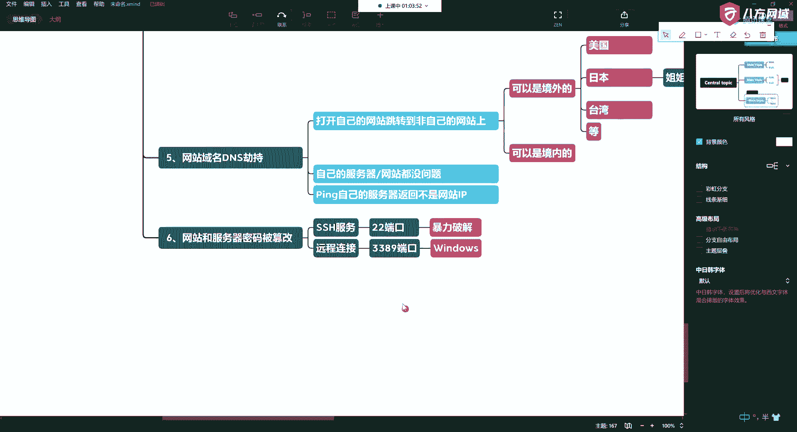

# P17：5.6-网络安全基础-常见网站攻击方式概述-网站和服务器密码被篡改 - 一个小小小白帽 - BV1Sy4y1D7qv

劫持了第六种，第六种，第六种呢就是网站，和服务器啊密码，篡改。

那么这种呢通常呢就是啊，我们在使用服务器的过程中，比如说我们有ssh啊，好第一种就是s s h符，二端口，啊常见的就是二端口，当然你可以转换成别的端口啊，可以藏是吧。

哎那么这个时候呢是典型的ssh暴力破解，啊这样的问题有很多，这是最常见的一种方式，就包括你用阿里云啊，你的s是被爆破的话太多了啊，还有呢是一些远程连接的，啊那这个种常见呢像3389。

啊3389这种远程连接的，啊对吧，那么这个最典型的呢就是比如说你windows是吧，哎windows windows server呢它会有一个啊叫粘连键啊。

就是你连续按住shift按五次就可以进行破解啊，以前老的版本对吧，这很多的时候呢就是被曝出来的啊，还有很多是不知道的，那么通过漏洞。

唉通过漏洞啊，永恒之蓝，或其他的啊，不止用，当然漏洞不止永恒之蓝啊，因为我们现在还没有学，所以这块我也没法讲太多啊，只是告诉大家有这种方式对吧。

那么永恒之蓝呢，他对windows和linux都有，好吧，那你看看他篡改了你的密码，这个就和这种东西呢就就就就就就就很了，啊对吧啊，那两种人，就是一旦改了你密码了。

这就明明让你知道他在搞你了啊，这样的一般都是属于小白，就是刚开始你看我们群里也有，经常有孩子问对吧，你说你讲完了这个东西，他整天问老师，我能不能黑别人电脑，老师能不能黑别人电脑啊，这种人呢就很简单。

他们都是为了炫技啊，没别的，就是在选题啊，就是要搞你，对吧，唉这种人，那你真的啊，早晚被抓，那真正的高手是怎么办，他改了你的，他不说，啊甚至改了一些核心的，不知道还有一种东西。

啊一种是这种人被抓了，也有一种呢是炫技的啊，炫技的，他这种东西呢是为了勒索，看这个啊，那么在这个过程中，他会把你的一些日志啊，比如一些操作记录都会隐藏掉，然后挂一些木板，会写字了啊，但那有用。

好这是第六种啊。