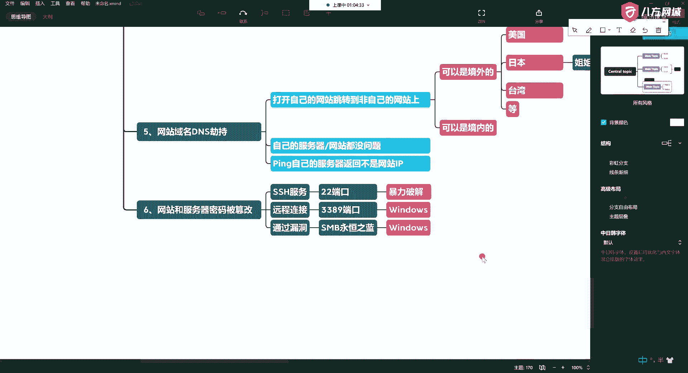
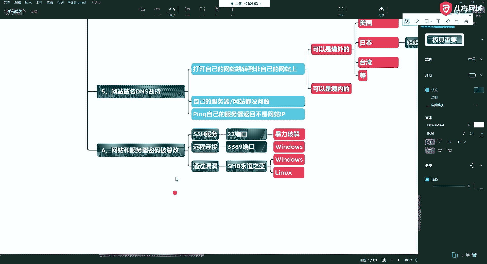
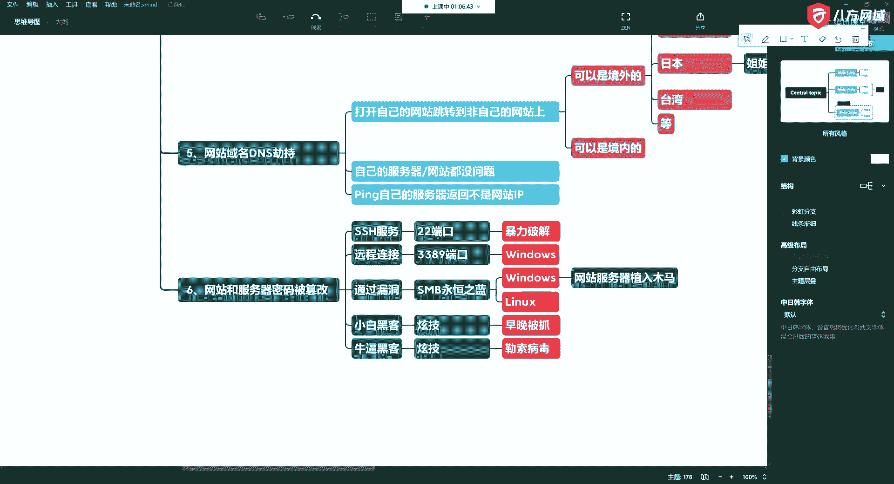

# 课程 P17：5.6 - 网络安全基础 - 常见网站攻击方式概述 - 网站和服务器密码被篡改 🔐


在本节课中，我们将学习第六种常见的网站攻击方式：网站和服务器密码被篡改。我们将探讨这种攻击的常见手段、背后的动机以及攻击者的不同类型。


---

## 攻击方式概述

上一节我们介绍了其他攻击方式，本节中我们来看看第六种：密码被篡改。这种攻击通常发生在使用服务器的过程中。

## 常见攻击手段

以下是导致密码被篡改的几种典型方式：

**1. SSH端口暴力破解**
攻击者通过尝试大量用户名和密码组合来暴力破解SSH服务。默认的SSH端口是22，但管理员有时会更改端口以增加隐蔽性。然而，这并不能完全阻止定向的暴力破解攻击。代码示例如下（模拟攻击思路）：
```bash
# 这是一个概念性示例，切勿用于非法用途
hydra -l username -P password_list.txt ssh://target_ip:22
```


**2. 远程桌面协议攻击**
对于Windows服务器，常见的攻击目标是**3389**端口（远程桌面协议）。攻击者可能利用系统漏洞或配置弱点进行入侵。

**3. 系统漏洞利用**
攻击者利用操作系统或应用软件的已知漏洞获取权限并篡改密码。一个著名的例子是“永恒之蓝”漏洞，它影响了Windows和Linux系统。通过此类漏洞，攻击者可以绕过认证直接控制系统。



**4. 物理或本地漏洞**
例如，在旧版本的Windows系统中，存在“粘连键”漏洞。连续按**Shift键五次**可以触发辅助功能，攻击者可能借此绕过登录界面获取系统权限。

## 攻击者动机分析



了解攻击手段后，我们来看看攻击者篡改密码的常见动机：

**1. 炫技与挑衅**
此类攻击者通常是初学者，他们篡改密码是为了炫耀技术或故意挑衅，并会留下明显的痕迹表明自己的存在。

**2. 勒索与牟利**
另一类攻击者以经济利益为目的。他们在篡改密码后，可能会加密文件、清除日志记录、挂上勒索信息，以此向受害者索要赎金。


**3. 持续潜伏**
真正有经验的攻击者往往追求长期控制。他们悄无声息地篡改密码或创建后门，并不留下任何明显痕迹，以便持续访问服务器、窃取数据或将其作为跳板。

---

## 总结



本节课中，我们一起学习了网站和服务器密码被篡改这种攻击方式。我们了解到，攻击者主要通过**暴力破解**、**利用漏洞**等方式实现密码篡改，而其动机则可分为**炫技**、**勒索**和**潜伏**三类。认识这些手段和动机，是做好基础安全防护的第一步。