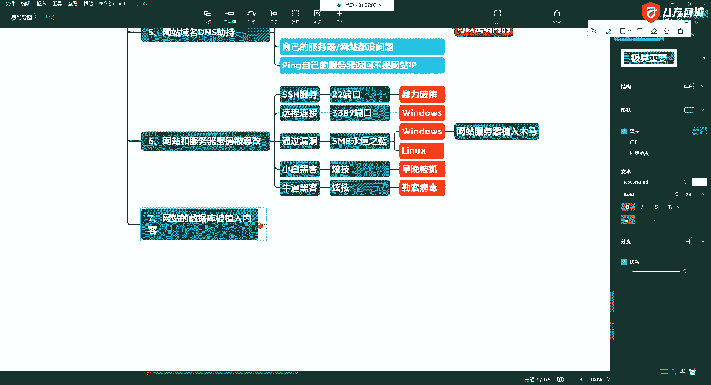
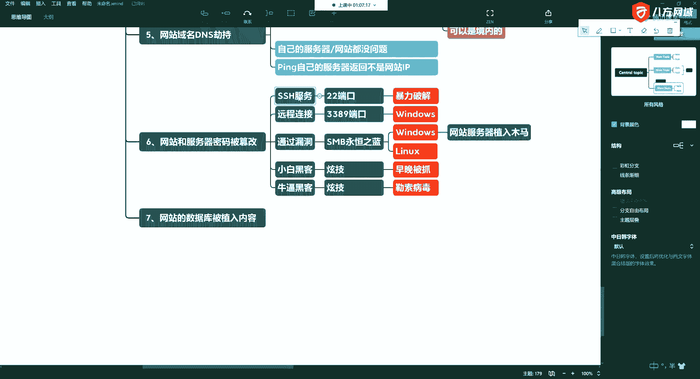
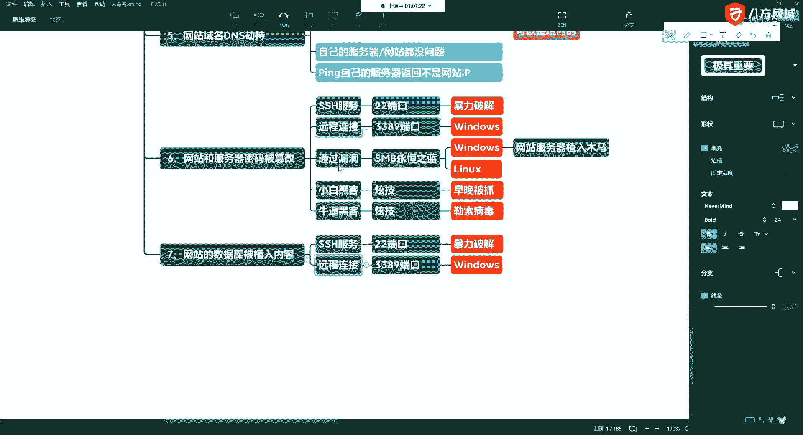
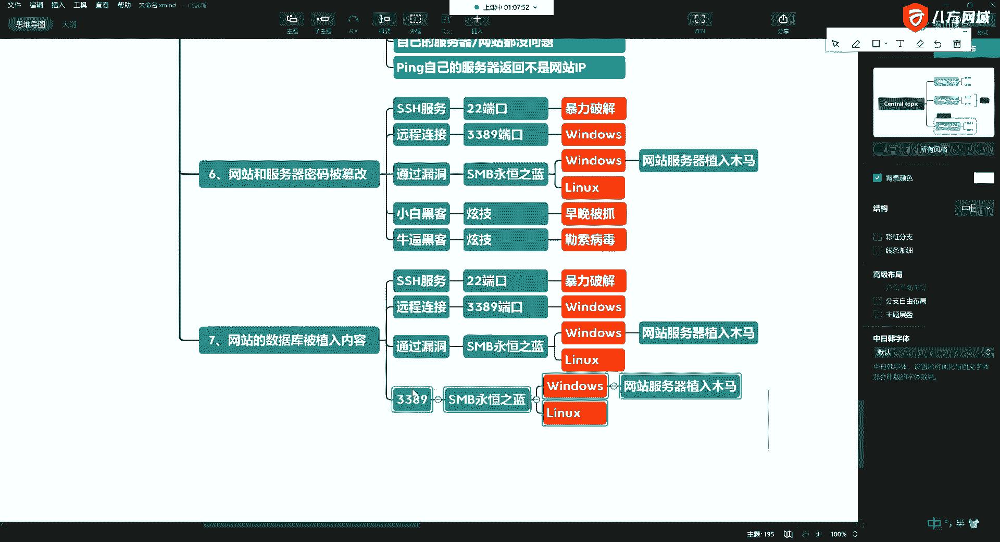
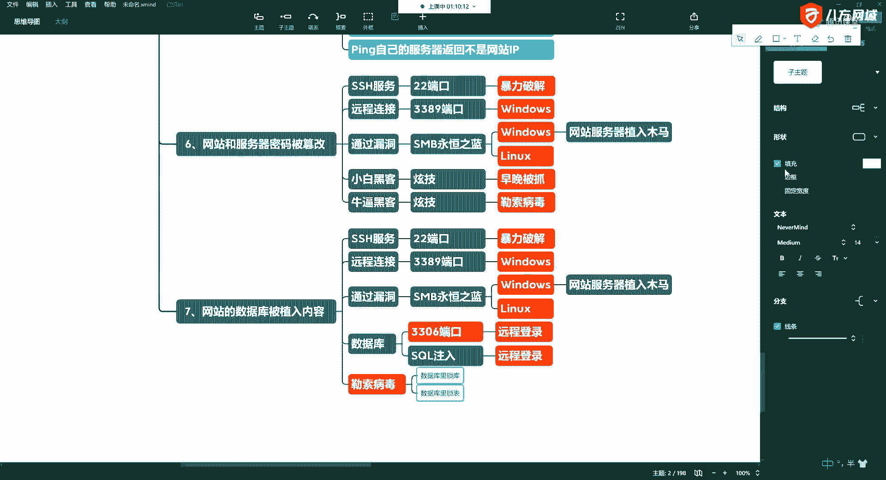
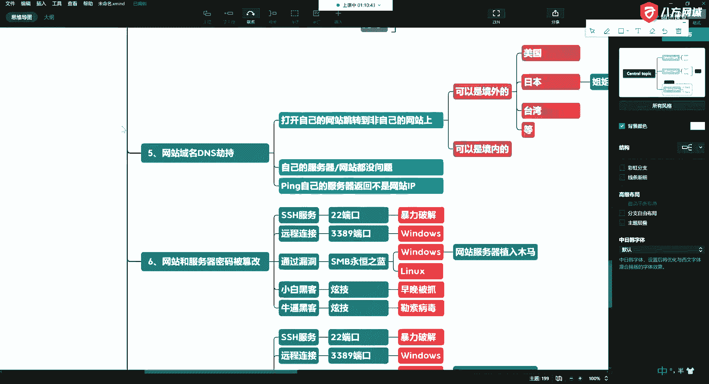

# 课程P18：5.7 - 网络安全基础 - 常见网站攻击方式概述 - 网站的数据库被植入内容 🛡️💾

在本节课中，我们将要学习一种常见的网站攻击方式：网站的数据库被植入内容。我们将探讨攻击者如何利用数据库的弱点，以及这种攻击可能带来的严重后果。

---

上一节我们介绍了针对网站本身的多种攻击方式，本节中我们来看看攻击者如何直接针对网站的核心——数据库下手。

第七种攻击方式是网站的数据库被植入内容。这种攻击不直接破坏网站程序，而是针对存储网站数据的数据库。作为用户，你的数据必须存储在数据库里。攻击者通过入侵数据库，就能篡改或破坏其中的数据。

实际上，前面提到的几种攻击方式（如SSH、端口漏洞）同样适用于数据库攻击。攻击者可以利用这些通用漏洞来接近数据库。

以下是几种常见的数据库入侵途径：

*   **利用通用服务漏洞**：例如，攻击者可能通过SSH或开放的3389端口，扫描并发现你的MySQL数据库服务。一旦找到，他们就可以尝试通过这些服务直接入侵数据库。
*   **数据库配置不当**：很多人的数据库安全配置是薄弱环节。在我们的课程中，会讲解常见数据库的安全设置。例如，为了方便远程管理，一些运维人员会在阿里云等云主机上开放数据库的远程访问端口（如3306）。如果此时权限设置不当，比如直接为`root`用户设置了允许任意IP（`%`）访问的权限，就会带来巨大风险。
*   **弱密码与密码复用**：如果数据库`root`用户的密码设置得过于简单，或者与系统其他重要账户的密码相同，攻击者就可能通过暴力破解等方式直接获取数据库控制权。
*   **SQL注入攻击**：这是另一种非常常见且危险的方式。攻击者通过在网站输入框中注入恶意SQL代码，可以绕过前端验证，直接对数据库进行查询、修改甚至删除操作。后续课程我们会详细讲解。

攻击者成功入侵数据库后，植入的内容会导致你看到的数据与原本存储的不一致。这不仅仅是数据被篡改那么简单。

近年来，针对数据库的勒索病毒特别猖獗，尤其是针对MySQL数据库。有一批攻击者专门盯着阿里云等云平台上的数据库。如果你的数据库存在安全漏洞，就很可能被攻击。

以下是数据库勒索病毒的典型行为：

*   **锁定数据库或数据表**：攻击者使用加密手段锁住你的整个数据库或关键数据表。
*   **索要赎金**：然后要求你支付赎金（通常是美元或比特币）来换取解密密钥。
*   **数据丢失风险**：如果你拒绝支付，攻击者不会为你解密，导致你的重要数据永久丢失。

因此，像银行、学校、政府这类存储大量敏感数据的部门，尤其容易成为此类攻击的目标。

---

本节课中我们一起学习了数据库被植入内容这种攻击方式。我们了解了攻击者可以通过服务漏洞、配置错误、弱密码和SQL注入等多种途径入侵数据库，并重点介绍了危害极大的数据库勒索病毒。保护数据库安全，需要从严格的访问控制、强密码策略、及时修补漏洞和防范SQL注入等多方面入手。