# 网络安全基础 P19：DDoS攻击详解 🛡️

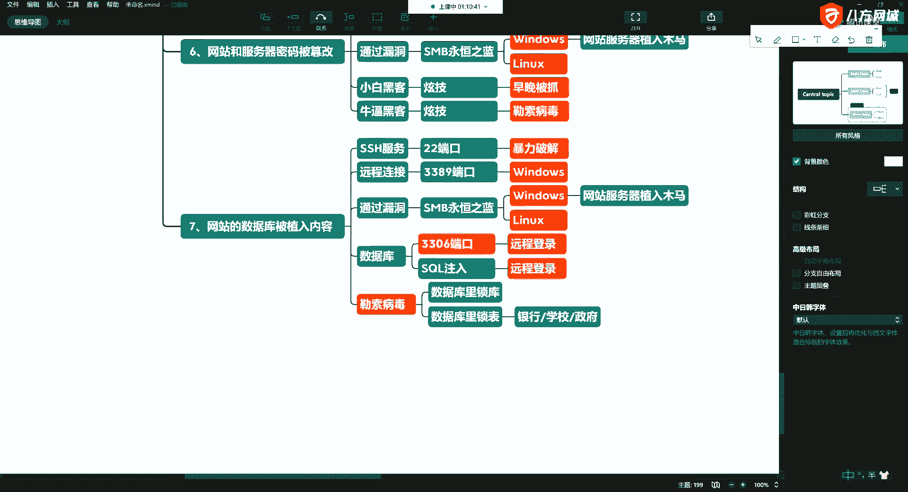

在本节课中，我们将要学习一种常见的网络攻击方式——DDoS攻击。我们将了解它的基本原理、常见目标以及其带来的严重影响。

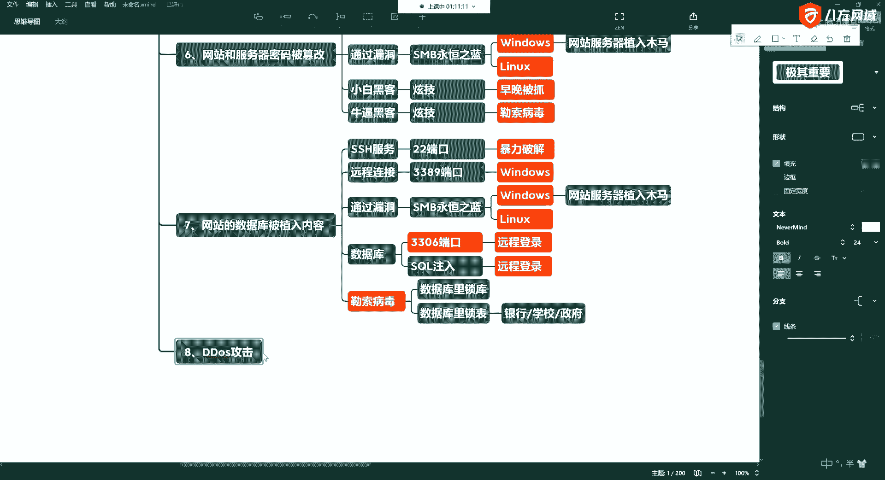

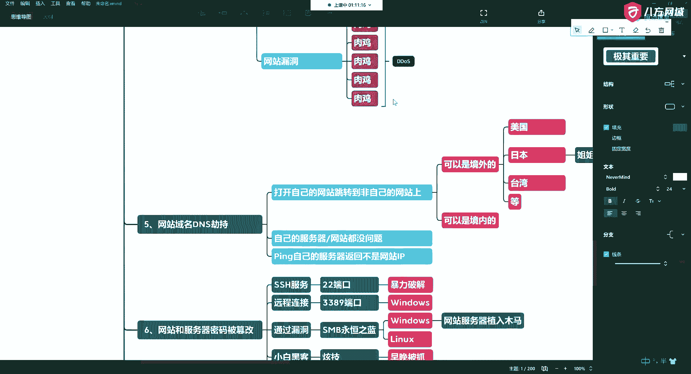

上一节我们介绍了多种网站攻击方式，本节中我们来看看第八种：DDoS攻击。

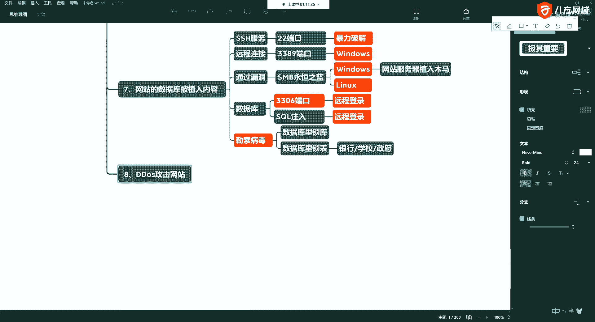

DDoS攻击是网站攻击中常见的一种。攻击者利用之前提到的“肉鸡”（即被控制的计算机）向目标服务器发送海量请求，导致服务器资源耗尽，无法处理正常用户的访问。

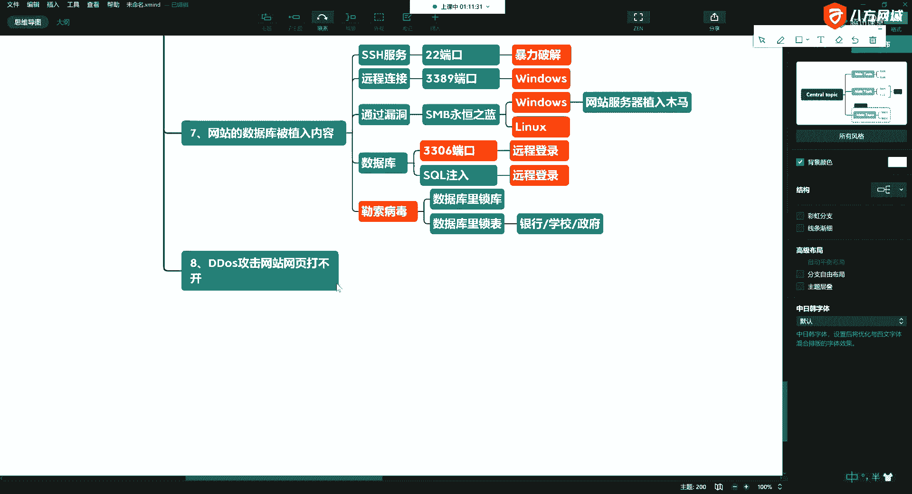

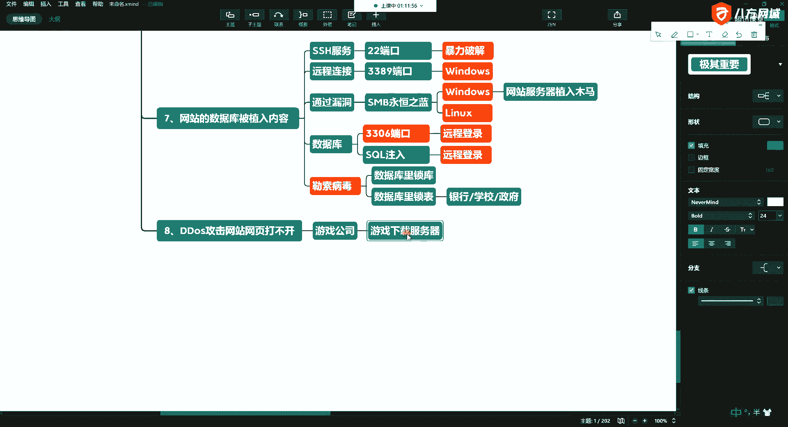

其核心原理可以用一个简单的公式描述：
**服务器资源（带宽、CPU、内存） ≤ 恶意请求流量 = 服务瘫痪**

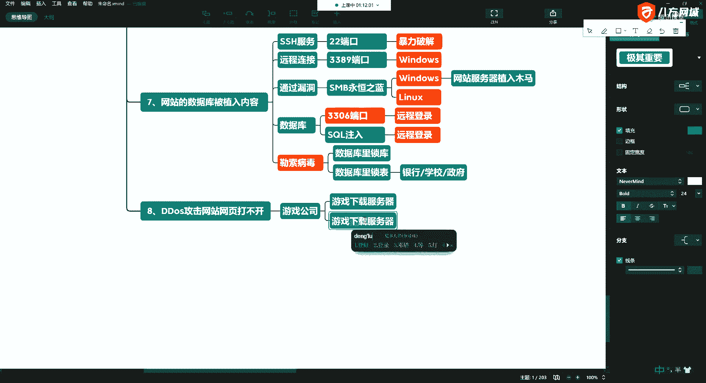

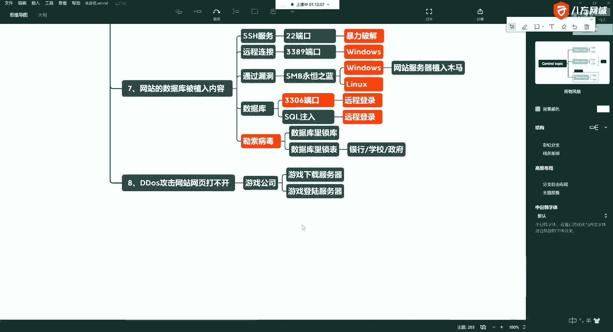

当网站遭遇DDoS攻击时，最直接的表现就是网页打不开。

以下是DDoS攻击常见的几类目标行业：

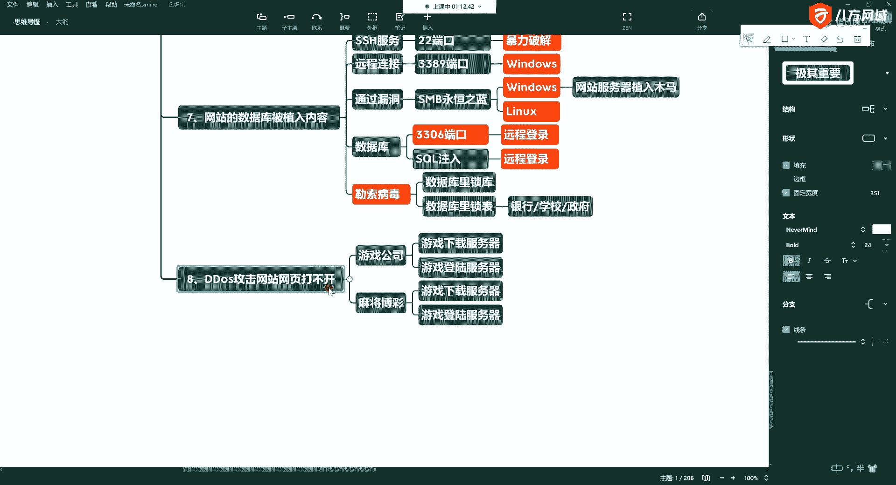

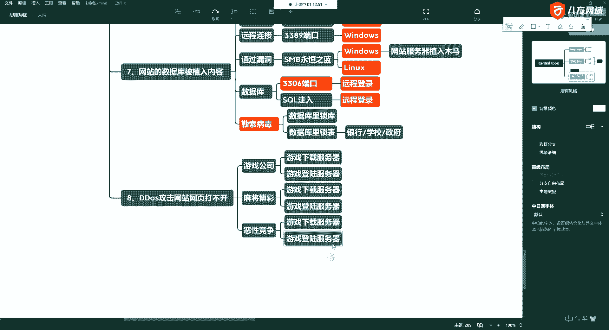

*   **游戏公司**：攻击目标通常是游戏的下载服务器或登录服务器。
*   **特殊娱乐行业**：例如在线麻将、博彩类网站，也容易成为攻击目标。
*   **恶性商业竞争**：竞争对手之间通过互相攻击，意图拖垮对方的在线服务。

这种攻击的影响范围很大。例如，一家游戏公司被攻击时，可能连累整个数据中心机房的网络速度都变得缓慢。

目前防御DDoS攻击存在一定困难。虽然可以购买专业的防护服务，但费用通常非常高昂，且防护效果并非总是理想。一旦遭受大规模DDoS攻击，企业往往会蒙受惨重损失。

甚至衍生出一种畸形的商业模式：有人专门攻击游戏服务器，迫使游戏公司支付高额费用购买其“防护技术”，按小时计费。

在实际运营中，如果缺乏可靠的技术支持或人脉关系，在遭遇攻击时可能求助无门，导致巨大的经济损失。

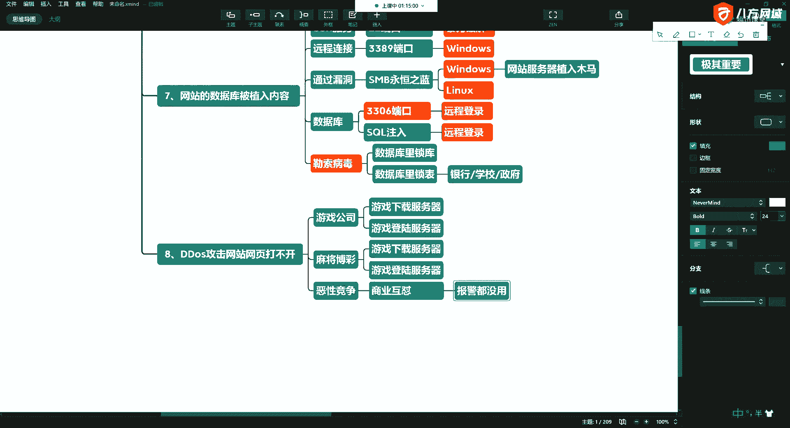

本节课中我们一起学习了DDoS攻击。我们了解到，它是一种通过海量虚假流量淹没目标服务器，使其无法提供正常服务的攻击手段，常见于游戏、娱乐等行业，且防御成本高、难度大，对企业危害严重。