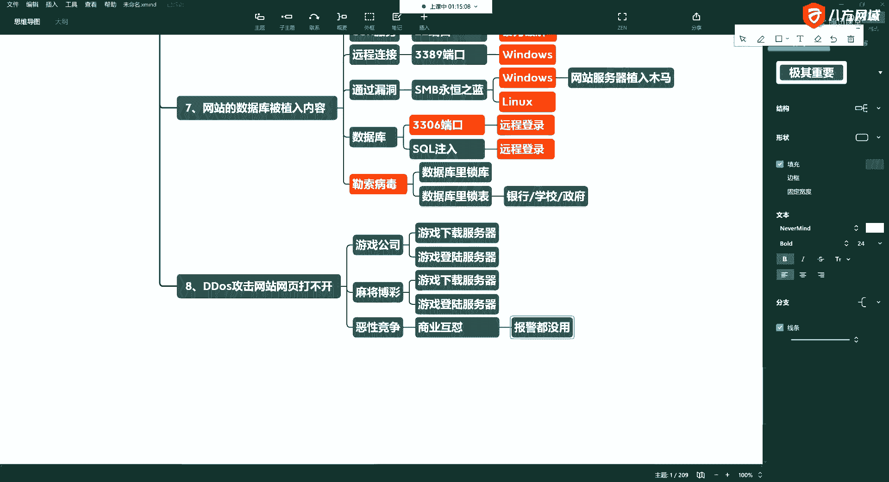
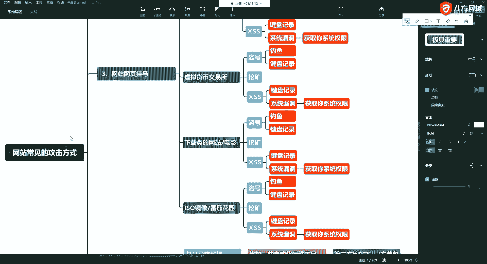
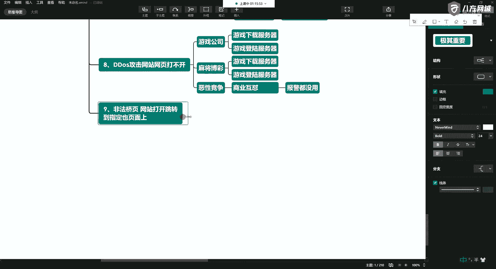
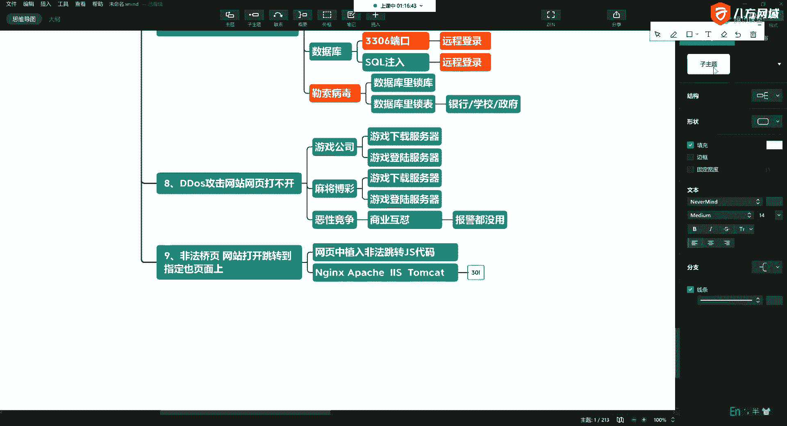
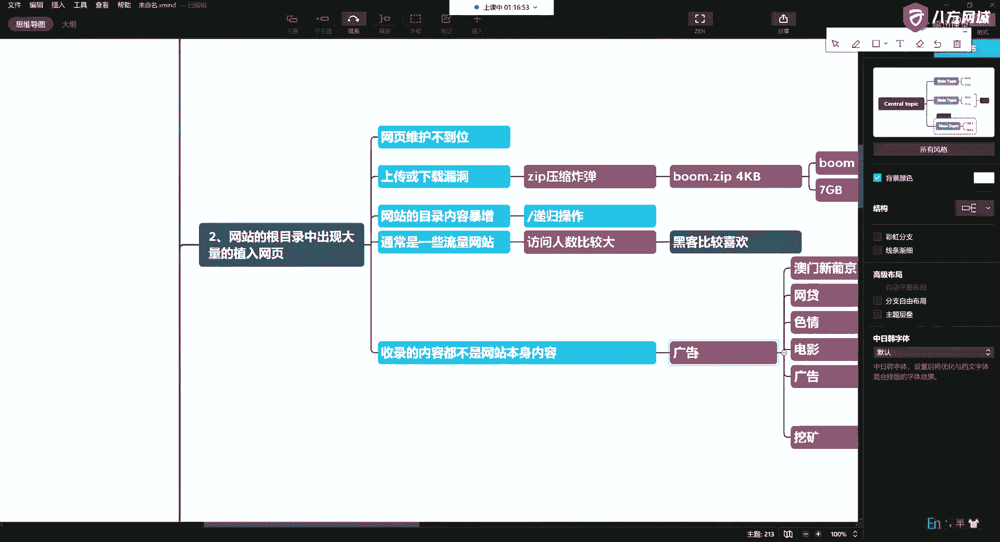
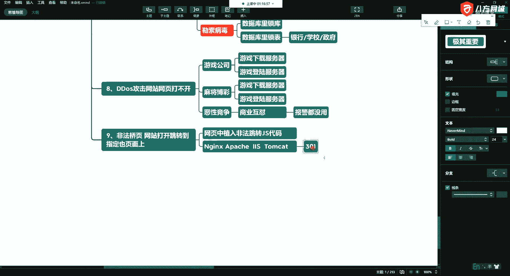
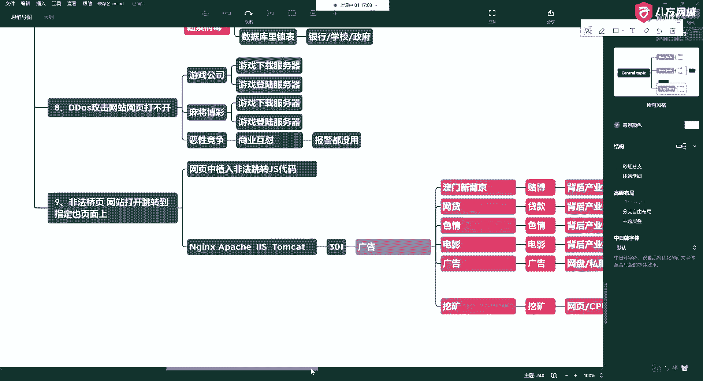

# 网络安全基础 P20：常见网站攻击方式概述 - 非法桥页 🚧



在本节课中，我们将要学习第九种常见的网站攻击方式：**非法桥页**。我们将了解它的基本概念、实现原理以及攻击者的最终目的。



上一节我们介绍了其他类型的攻击方式，本节中我们来看看这种通过页面跳转来实施攻击的手法。

非法桥页攻击，指的是网站被植入恶意代码，导致用户访问该网站时，页面会先正常打开，随后立即自动跳转到一个指定的、通常是恶意的或充满广告的页面上。



## 实现原理

这种攻击主要通过以下技术手段实现：

以下是几种常见的技术实现方式：



*   **客户端脚本**：利用 **JavaScript** 代码在用户浏览器端实现强制跳转。
    ```javascript
    // 示例：使用JS进行页面跳转
    window.location.href = "http://恶意网站地址";
    ```
*   **服务器端配置**：攻击者可能篡改网站服务器的配置文件（如 **Nginx**、**Apache**、**Tomcat** 的配置），设置 **301** 或 **302** 状态码的永久或临时重定向。
*   **HTML元标签**：在网页的HTML头部插入 `<meta>` 标签，设定一定时间后自动刷新并跳转。

## 攻击目的


无论采用何种技术，其最终目的通常是一致的。



攻击者的核心动机是为了获取不正当利益，具体表现为：



*   **劫持流量**：将原网站的访问流量引导至攻击者控制的页面。
*   **推广广告**：在跳转后的页面上展示大量广告，通过点击获取收益。
*   **传播恶意软件**：诱导用户下载病毒、木马等恶意程序。
*   **进行网络钓鱼**：跳转到仿冒的登录页面，窃取用户的账号密码等敏感信息。



本节课中我们一起学习了**非法桥页**攻击。我们了解到，这种攻击通过技术手段强制用户跳转到指定页面，其根本目的是为了劫持流量并从中牟利。作为网站管理者，应定期检查服务器配置与网站代码；作为普通用户，遇到突然跳转的网页需保持警惕，避免点击不明链接或下载文件。