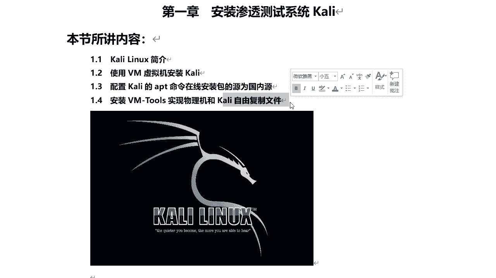
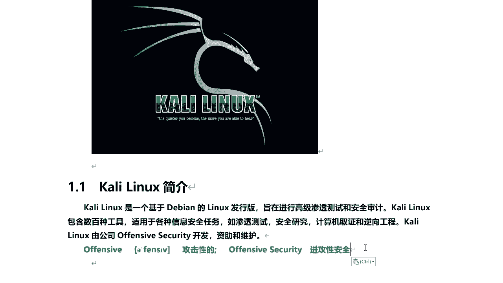
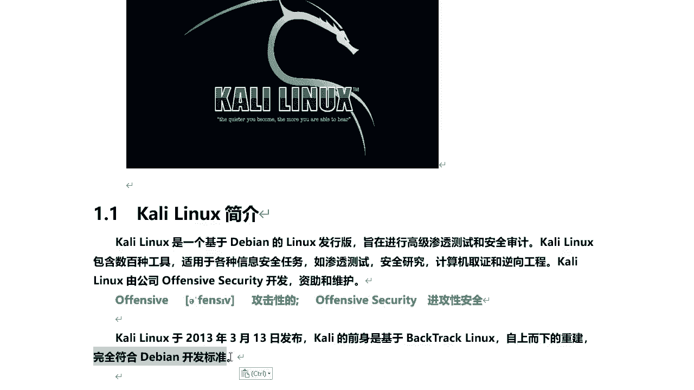
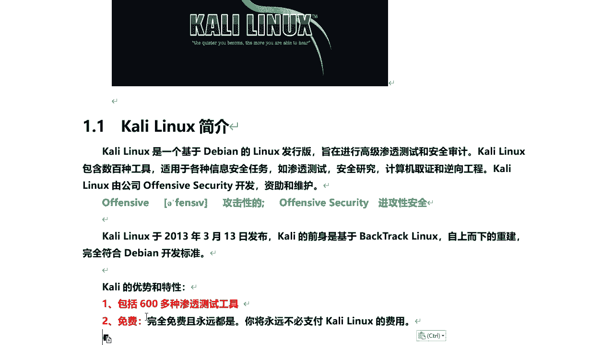
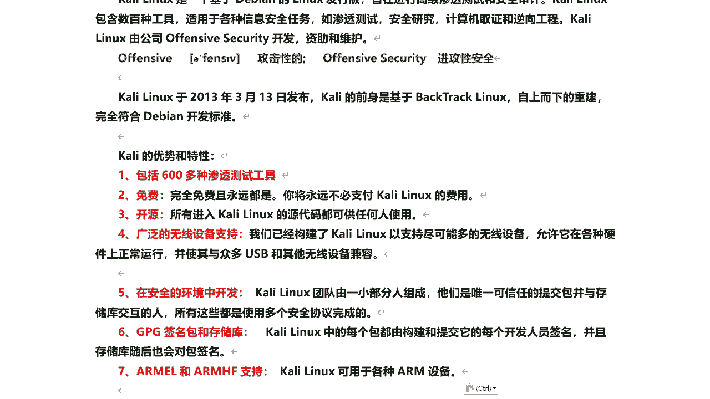

# P21：6.1-【Kali渗透系列】Kali Linux简介 - 一个小小小白帽 - BV1Sy4y1D7qv

大家好，我是讲师root，今天呢给大家分享一下的安装，渗透测试系统开启，首先呢我们来了解什么是kelly linux，接下来使用vm虚机安装kelly，然后配置kelly的apt命令。

在线安装包的源为国内源，最后呢我们安装一下win tools，实现物理机和kelly自由复制文件。

好的，那么下面呢我们先来看什么是kelly linux，那么kelly linux呢是一个基于debian的linux发行版啊，那么目的呢是在进行高级渗透测试和安，全审计啊。

telly linux呢包含了数百种工具嗯，比较适用于各种信息安全任务，比如说渗透测试啊，安全研究啊，计算机启动和逆向工程等啊，那么说白了，kelly linux它只是一个集成了很多渗透测试工具。

这么一个linux系统而已而已，它和核心呢是基于deb，那么这个kelly linution它是由公司offensive security，那么开发的蜘蛛和维护的啊。

offensive翻译过来是攻击性的，offensive security它是进攻性安全。

那么为什么有很多人都喜欢用kelly linux呢，对吧好吧，那么kelly linux它是在2013年3月13日发布的，那么它的前身是基于bt，也是backtrack linux自上而下进行重建的。

而且是完全符合改变开发标准的好的。

那么这个kd linux它到底有什么优势和特性啊，因为它在很多啊渗透测试系统中，排名是第一位的，也是最受欢迎的，首先呢我们来看它本身呢，包含了600多种渗透测试工具啊。

有数百种渗透出工具已经集成到这个系统里面，我们只需要把这个kelly安装完成之后，我直接可以使用了，还有一点非常重要的就是免费啊，那么针对咱们国人来讲，免费对吧。

都喜欢用免费的啊，再一个是破解版的对吧，那么ky呢，你永远不要不会为使用它呢去支付任何费用，而且是永久永远都是免费的啊，这个是非常好的对吧，还有一点它是开源的，对什么什么是开源的。

就是所有进入开的linux源代码呢，都可供任何人使用，那么你可以在它的基础上进行二次开发，当然了，你得需要有一定的功底，开发功底啊，你懂得linux底层的一些原理，否则的话你也不能进行开发，好吧。

那当然了，我们只要会用它就可以了，是不是啊，好那么还有呢它就是支持广泛的一个无线设备，对无线设备的支持，那么它已经构建了kelly lines，以支持尽可能多的无线设备。

那么允许他呢在各种硬件上正常运行，并使其余众多的usb和其他的无线设备兼容啊，它和无线设备很多都是兼容的，另外有一点呢就是它它它整个的开发过程中啊，是在一个安全的环境中进行开发的。

那么凯里linux的团队呢是由一小部分人组成啊，这小部分人组成，他们是唯一可信任的提交包，并于存储库交互的人，那所有这些都是使用多个安全协议完成的，那么整个开发环境是安全的对吧，他这么说。

但到底它安不安全，里面有没有后门，其实我们都不知道，但是呢我们一样还会去使用它，很多人也在使用它对吧，然后呢还有一点，那么它的gpg签名包和存储户什么意思呢。

就是kelly linux中的每个包都有构建和提交，他的每个开发人员签名啊，并且呢存储库随后也会对包进行签名，也就是每个软件包谁开发的对吧，它都会进行签名，那么如果这软件包出现问题了。

能够追溯到某个人对吧，因为他都签名了吗，好的，那么这是关于他的签名包和存储库啊，另外一点开始linux它可用于各种arm设备对吧，比如树莓派对吧，那么也可以在手机端安装我们的kid linux。

