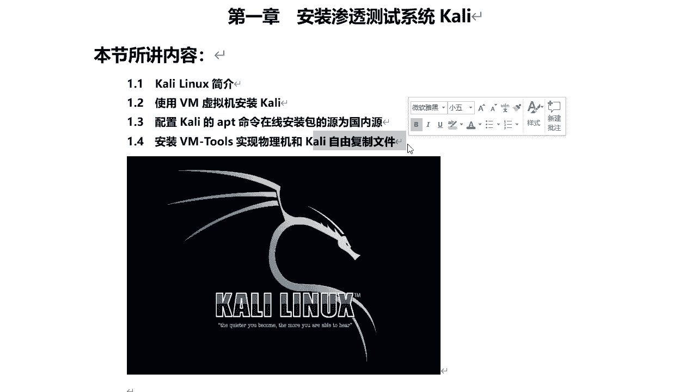

# P21：6.1-【Kali渗透系列】Kali Linux简介 🐧

在本节课中，我们将要学习Kali Linux的基础知识，包括其定义、历史、核心特性与优势，为后续的安装与配置打下基础。

## 什么是Kali Linux？🔍

上一节我们介绍了课程目标，本节中我们来看看Kali Linux究竟是什么。

Kali Linux是一个基于Debian的Linux发行版。它的主要目的是进行高级渗透测试和安全审计。Kali Linux包含了数百种工具，适用于各种信息安全任务，例如渗透测试、安全研究、计算机取证和逆向工程。简单来说，Kali Linux只是一个集成了很多渗透测试工具的Linux系统，其核心是基于Debian。

Kali Linux由Offensive Security公司开发、资助和维护。“Offensive”翻译过来是“攻击性的”，因此Offensive Security即“进攻性安全”。

## Kali Linux的历史 📜

了解了Kali Linux的定义后，我们来看看它的发展历程。

Kali Linux于2013年3月13日发布。它的前身是基于BackTrack Linux自上而下进行重建的，并且完全符合Debian开发标准。

## Kali Linux的优势与特性 ⚡

现在我们已经知道了Kali Linux是什么以及它的由来，本节中我们将重点分析它为何如此受欢迎，以及它具备哪些核心优势。

Kali Linux在许多渗透测试系统排名中位列第一，也是最受欢迎的。以下是其主要优势与特性：

*   **集成大量工具**：系统本身包含了600多种渗透测试工具。安装完成后即可直接使用。
*   **完全免费**：用户可以永久免费使用Kali Linux，无需支付任何费用。
*   **开源**：进入Kali Linux的所有源代码都可供任何人使用。用户可以在其基础上进行二次开发。
*   **广泛的无线设备支持**：Kali Linux旨在支持尽可能多的无线设备，允许其在各种硬件上正常运行，并与众多USB和其他无线设备兼容。
*   **安全的开发环境**：Kali Linux的开发由一小部分可信任的成员完成，他们负责提交软件包并与代码仓库交互，整个过程使用多种安全协议。
*   **GPG签名包和存储库**：Kali Linux中的每个软件包都由构建和提交它的开发人员签名，随后存储库也会对包进行签名。
*   **支持ARM设备**：Kali Linux可以用于各种ARM设备，例如树莓派，也可以在手机端安装。

---

本节课中我们一起学习了Kali Linux的基本概念。我们了解到它是一个专为渗透测试和安全审计设计的免费、开源Linux发行版，集成了海量工具，并因其安全性、兼容性和免费特性而广受欢迎。在下一节中，我们将开始学习如何在虚拟机中安装Kali Linux。