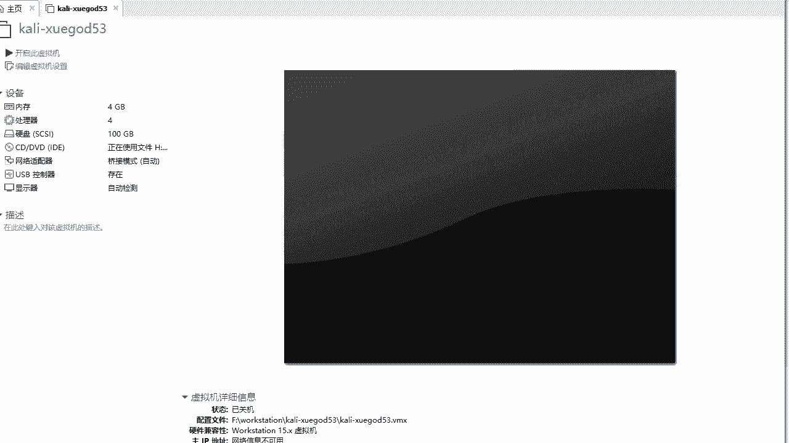

# P22：6.2-【Kali渗透系列】使用VM创建Kali虚拟机 - 一个小小小白帽 - BV1Sy4y1D7qv

下面呢我们来讲一下，如何使用vma训机来安装ky啊，那首先呢我们需要下载镜像啊，那么到官方去下载一下cat linux镜像，那么它的官方地址呢是3w点开了一点o yg。

那么我们下面呢来打开看一下了啊，来那么打开之后呢。

这个是他的官方啊，官方网址网站点击download。

然后download kelly linux，那么在这里呢我们看到，那么这是他所有的安装的一个安装包的，下载地址啊列表，那么这里的是最新版啊，2020。4啊，那么我们要想下载呢，可以直接点击这里啊。

直接下载它的镜像iso文件啊，那么这4。1g啊比较大，那么接下载它呢可能会相对于比较慢一些，种子这个比较小，下载完成之后呢，直接迅雷打开下载就可以了啊，但是今天呢我给大家讲了。

安装的版本不是最新版本是2019。1a啊，那么因为在咱们这个课程中呢，对使用的是2019。1a啊，那么啊这个镜像到哪里去下载呢，啊，其实我们在这个啊，old点开了一点o r g这个地址里面好吧。

可以下载到任意版本的，对以前所有版本的kelly镜像，然后点击kelly image哎，那么这里呢是从kelly一点零一直到最新版本都有，那么我们今天安装的是哪个版本呢，2019。1a。

那么点开它之后呢，我们看有这么多，到底下载哪一个呢，首先看这里啊，对如果你是64位系统，直接下载这个就可以了啊，2019。1a a amd，六四代表的是64位系统，那下面的i386 呢。

是针对的是32位系统啊，下载这两个就可以啊，如果六四位选择它，如果是32位选择它，直接点击下载就可以了好的，然后呢，我们接下来呢就给大家讲一下如何去安装啊，kelly啊，安装的版本是2019。1a啊。

好的，那么这个笔记呢给大家整理一下了，那首先呢我们需要来新建一个虚拟机啊，好吧，然后点击这里啊，创建新的虚拟机就可以了，唉然后呢典型和自定义呢，这里我们选择哪个都可以好吧，我们来选择典型默认下一步。

然后呢来指定我们的镜像文件，这里所说的镜像文件，就是我们下载下来的那个iso文件，我们来选择一下，稍等，好的，然后呢这里是我所有的镜像啊，很多啊，选择是2019。1a啊，这个点iso文件啊。

然后点击打开，选中完成之后呢，我们来点击下一步，好linux啊，因为kelly呢它是linux系统吗，啊然后我们点击这里的版本嘛，我们选择来选择一下的啊，啊它是基于debian的啊，羁绊。

然后选择八点x64 位啊，因为我这是64位的镜像，然后点击下一步，然后呢到这一步呢，我们需要给我们的虚拟呢起个名称啊的，那我安装的是kelly，所以说为kelly开头，然后呢我的主机名呢。

一会我给它起叫虚假的五三啊，这是命名的规则，那么大家呢在安装的时候，对虚拟机的命名也尽量规范一些，然后呢，选择我这个虚拟机文件要保存到哪里好吧，哎我保存到这里，然后呢在这里呢我再给他加一个文件夹好吧。

保存到这个文件夹下面啊，我的kly，然后点击下一步要注意啊，这个磁盘大小在磁盘空间的选择，那默认20g太小了，不够用，因为后期呢咱们在升级或者安装一些软件，bot自己空间肯定是不够用的。

我们计量呢一开始给它大一点啊，那比如说给100个g应该够用了啊，然后呢这里呢呢注意这100个g呢，它不是马上再次搬空间啊，就画出100个g啊，不是马上就占用这么大空间，而是它最大可以占用这么大空间啊。

它是动态分配的，然后接下来呢这两个选项，将虚拟磁盘存储为单个文件和拆分成多个文件，这两个选项呢我们选择哪一个都可以啊，它又有什么区别呢，如果假设选择为存储为单个文件的话，那么它会生成一个硬盘文件。

它始终就是一个啊，如果是拆分多个的话对，那么当随着你的嗯开启文件的增多啊，那么它占用空间越来越大，它会拆分成若干个啊多个磁盘文件，那哪个相对好管理一些呢，当然选择第一个是比较好管理一些的啊。

啊你选择第二个也可以点击下一步，到这一步之后呢，你准备好创建虚拟机啊，先别着急点完成啊，我们接下来呢来制定一下硬件，这里呢我来配置一下子，比如说内存啊，内存这块怎么去设置呢，那么尽量给高一些啊。

那比如说尽量在物理机的一半左右好吧，至少得2g内存啊，比如说你物理机的内存呢八个g啊，那你给两个g就可以了，不要太高，太高的话，你肯定会物理带不起来啊，那么如果你物理机的内存是16个g。

那你建议你呢给他给四个g啊，那么我这里呢对就给四个g，因为我物理机内存是16g的，然后处理器这块呢是吧，配置处理器的核心数在核心数，那么这里呢建议配置上和物理机，cpu核数是一样的啊。

那么我呢是四核心的cpu，所以说呢这里头我配置成四核就可以了啊，另外一点呢就是有的同学我不知道啊，我到以我的物理机呢是cpu是几核心的好吧，那么这里呢你可以随意选，如果超过你物理机的核心数呢。

它这里会有提示，好不好好的，然后呢这个虚拟化引擎呢，我们也可以给他设置上啊，然后呢这个镜像呢我们指定完了，然后网络适配器，网络设备器呢这块呢一个是桥接和net啊，这两个是可以联网的。

那么你选择哪个都可以嗯，这里要说明一点，如果你是校园网的话，哎我建议你选择net，因为校园网桥接呢你连不上，可能需要认证好吧，然后这里呢我选择调节模式，接下来的usb呢，这个如果你要不用的话。

可以删掉啊，声卡呢也可以移除啊，打印机呢也可以移除，因为用不上，后期呢，就比如说我想呢在kelly里面看一些电影啥的是吧，那我可以再添加硬件，比如说添加一个声卡都是可以的啊。

现在不需要我们直接将它删掉就可以了，然后点击关闭啊，然后完成。

好的，而这里呢在正式安装之前啊，我说一点啊，如果你使用桥接模式啊，调节模式。

那么在这个编辑里面，编辑里面虚拟网络编辑器，来我们来打开它啊。

需要指定一下的调节到哪个网卡。

然后更改设置。

好的我们来看啊，选择桥接模式，然后呢以桥接至哪里啊，这里你看我选择这个网卡，是我物理机上网使用的网卡啊，这个最好选一下，如果不选，那么在安装的时候进行网络配置的时候，可能会失败，那么也可能会连不上网。

好吧好，点击确定。

好的然后呢在我们正式开始安装之前啊。

有启动这个虚拟机之前，那么大家有的同学可能会遇到一些问题好吧，然后之前呢我做了一些操作啊，很多同学可能说诶我记不住啊，怎么办，别担心啊，那么老师呢笔记呢给大家整理的很详细啊，大家呢按照老师的笔记呢。

一步一步去操作就可以了啊，放到这里，接下来我们看啊，那么有的同学呢可能在安装的时候。

点击开启虚拟机，开启虚拟机，比如说这里的啊，这里开启啊。

点击开启的时候可能会遇到一些错误啊。

比如说这种，我看，呃已将虚拟机呢配置为64位，客户机操作系统，但是无法执行64位操作，就是此举主机支持英特尔v t x，但是呢它处于禁用状态，那么也就是说你的电脑的cpu啊是支持虚拟化的。

但是呢现在呢是处于禁用状态，那怎么办呢，需要来修改boys，也是重启你的物理机进入boys啊，那么这里要说一下了，不同类型的主板，那么进入boys的方式是不一样的，下面咱们以华硕的主板为例啊。

一般来讲开机呢或按f2 f 12或者是delete键啊，可以进入你的boys啊，那么大家呢可以试一下它啊，就是这几个键可以试一下，看哪个可以进入啊，那下面呢以华硕主板为例，开机进入bios之后。

点击这里高级模式啊，进入高级模式，然后呢进入之后呢，它会让你确定对是否进入高级模式。

然后点击确定，点击确定之后呢，我们来看这里啊，这里有一个英特尔虚拟技术啊，默认是关闭的，点击一下开启就可以了啊，那它的整个步骤呢是这样，华硕主板啊，the boys这么修改进入高级模式，进入高级菜单。

开启英特尔虚拟技术，这样的话那么按f 10，然后保存退出，重启之后，然后再开启你的虚拟机，就不会提示那个错误了，可以正常进入安装了，那么不同类型的主板，那么它呢进入boys的方式不一样。

它的boys里面界面也是不一样的，那么其他呢大家可以百度1下了啊，根据自己的主板型号百度1下，一般基本都可以找到如何进行修改啊，那么其他电脑像这种，那么这个比较古老的啊。

这点大家比较熟悉，这个boss一般好像是进开机的时候，点击按下delete键就可以了啊，然后进入设置，然后这里inter viral对吧，英特尔虚拟化技术在这里默认是disabled啊。

鼠标光标移到这个位置，按下回车，然后移动上下方向键选择enable回车就可以了，修改完成之后，然后按下了f 10保存退出，它会自动重启物理机，然后呢我们来再来进行安装，开启就可以了啊，就可以正常安装了。

那么解决了上面的问题，然后我们下面呢接下来就来开始安装泰迪啊。