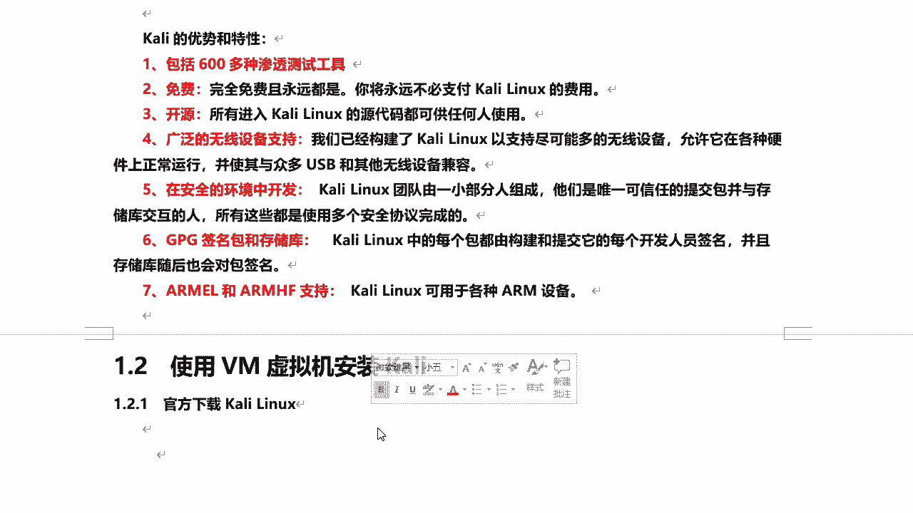
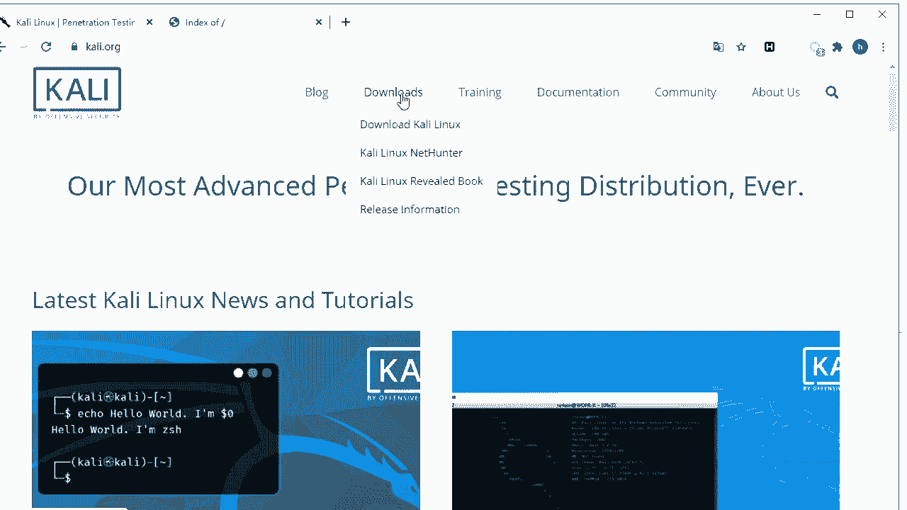
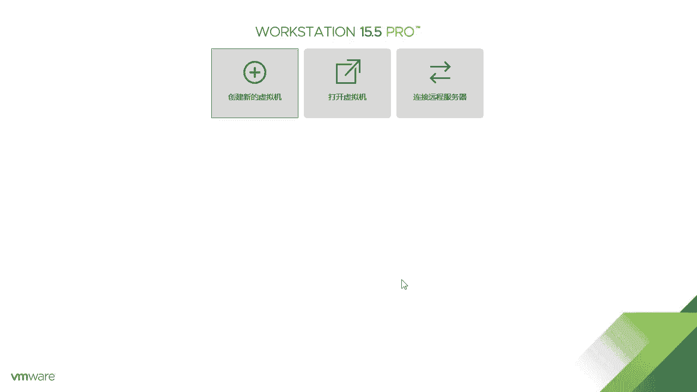
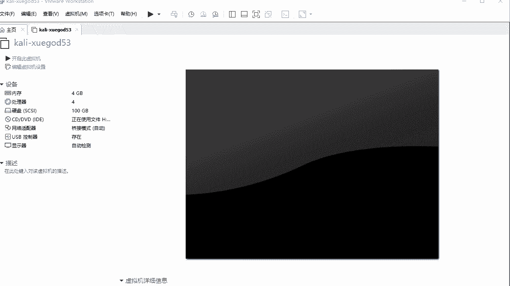
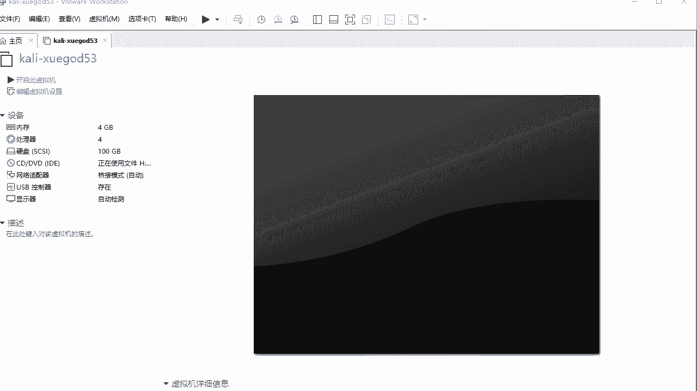
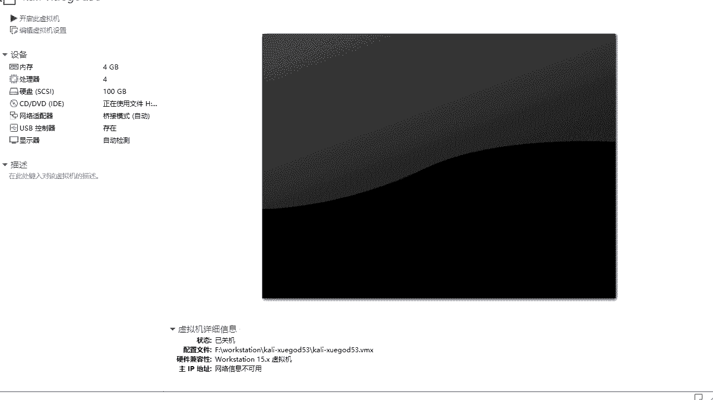
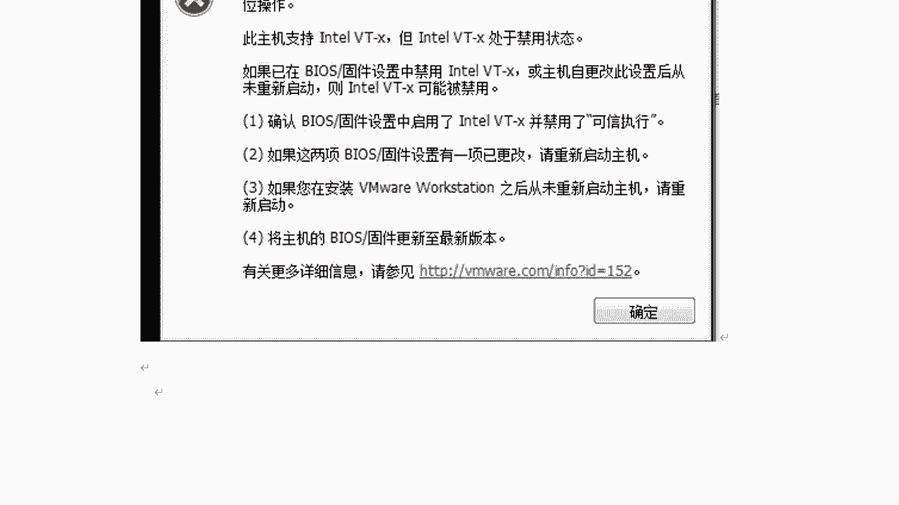

# 课程 P22：6.2 - 【Kali渗透系列】使用VMware创建Kali虚拟机 🖥️➡️🐧

在本节课中，我们将学习如何使用 VMware 虚拟机软件来安装 Kali Linux 操作系统。整个过程包括下载镜像、配置虚拟机硬件以及解决安装过程中可能遇到的常见问题。

---

## 下载 Kali Linux 镜像

首先，我们需要下载 Kali Linux 的安装镜像文件。

Kali Linux 的官方网站地址是 `www.kali.org`。

打开官方网站后，点击页面上的 “Download” 按钮。

在下载页面中，点击 “Download Kali Linux”。

页面会列出所有可用的安装包下载地址。最新版本（例如 2020.4）的 ISO 文件较大（约 4.1GB），下载可能较慢。也可以选择下载种子文件，使用迅雷等工具加速下载。

本课程使用的是 **2019.1a** 版本。要下载旧版本，可以访问 `old.kali.org` 这个地址。

在该页面点击 “Kali Images”，可以找到从 1.0 到最新版本的所有镜像。找到 2019.1a 版本。

对于 64 位系统，应下载 `kali-linux-2019.1a-amd64.iso` 文件。对于 32 位系统，则下载 `kali-linux-2019.1a-i386.iso` 文件。点击对应链接即可下载。

---

## 创建新的虚拟机

上一节我们准备好了系统镜像，本节我们来看看如何在 VMware 中创建新的虚拟机。

打开 VMware 软件，点击 “创建新的虚拟机”。

在安装类型选择界面，“典型”和“自定义”都可以，本教程选择“典型”配置，然后点击“下一步”。

在安装来源界面，选择“安装程序光盘映像文件”，并点击“浏览”按钮，找到并选中你下载的 `kali-linux-2019.1a-amd64.iso` 文件，然后点击“下一步”。

系统会自动检测到这是 Linux 系统。在版本选择中，因为 Kali 基于 Debian，所以请选择 “Debian 8.x 64位”，然后点击“下一步”。

在命名虚拟机界面，为虚拟机起一个名称，例如 “Kali”。同时可以设置主机名，例如 “kali-pentest”。还需要选择虚拟机文件的保存位置，建议创建一个专门的文件夹（如 `VM/Kali`）来管理，然后点击“下一步”。

在指定磁盘容量界面，默认的 20GB 对于后续使用可能不够。建议设置为 **100GB**。请注意，这 100GB 是最大可用空间，并非立即全部占用，而是动态分配。然后点击“下一步”。

在磁盘文件存储方式界面，有两个选项：
*   **将虚拟磁盘存储为单个文件**：管理方便，推荐选择。
*   **将虚拟磁盘拆分成多个文件**：在某些文件系统上可能有优势。

选择其中一个后，点击“下一步”。

在准备创建界面，先不要点击“完成”。我们需要点击“自定义硬件”来调整虚拟机配置。

---

## 配置虚拟机硬件

以下是需要调整的主要硬件配置项：

**内存**：建议分配物理机内存的一半左右，但至少保证 2GB。例如，物理机有 16GB 内存，可以分配 4GB 给虚拟机。
**代码示例（在VMware硬件设置中调整）**： 内存大小 = 4096 MB

**处理器**：建议处理器核心数与物理机 CPU 核心数相同。例如，物理机是 4 核 CPU，这里就配置为 4 核。
**代码示例（在VMware硬件设置中调整）**： 处理器数量 = 1， 每个处理器的核心数量 = 4

**网络适配器**：选择 “桥接模式” 或 “NAT 模式” 都可以让虚拟机联网。如果是在校园网等需要认证的环境下，建议选择 “NAT 模式”。

**其他设备**：USB 控制器、声卡、打印机等设备如果暂时用不到，可以选中后点击“移除”以简化配置。

配置完成后，点击“关闭”，然后回到上一界面点击“完成”。

---

## 网络配置（桥接模式注意事项）

如果你在上一节选择了桥接模式，为了确保网络连接正常，需要进行额外配置。

在 VMware 主界面，点击菜单栏的 “编辑”，选择 “虚拟网络编辑器”。

在弹出的窗口中，点击右下角的 “更改设置” 以获取管理员权限。

在列表中选择 “VMnet0”（桥接模式），然后在 “桥接到” 的下拉菜单中，选择你物理机正在使用的真实网卡。

正确选择后，点击“确定”保存设置。这一步能有效避免安装时网络配置失败或无法联网的问题。

---

## 解决常见安装错误：VT-x 禁用

在点击“开启此虚拟机”后，部分用户可能会遇到错误提示：“此主机支持 Intel VT-x，但 Intel VT-x 处于禁用状态”。

这意味着你电脑的 CPU 支持虚拟化技术，但在 BIOS/UEFI 中被禁用了。解决方法是在物理机的 BIOS/UEFI 设置中开启虚拟化支持。

不同类型的主板进入 BIOS/UEFI 的按键不同，通常是 `F2`、`F12`、`Delete` 或 `Esc` 键，请在开机时尝试。

**以华硕主板为例：**
1.  开机按 `Delete` 或 `F2` 进入 BIOS。
2.  按 `F7` 或点击“高级模式”进入高级设置。
3.  在“高级”菜单中找到 “Intel Virtualization Technology” 选项。
4.  将其状态从 “Disabled” 改为 “Enabled”。
5.  按 `F10` 保存并退出，电脑会自动重启。

**以传统AMI BIOS为例：**
1.  进入 BIOS 后，使用方向键切换到 “Advanced” 选项卡。
2.  找到 “Intel Virtualization Technology” 选项。

3.  按 `Enter` 键，将其值从 “Disabled” 改为 “Enabled”。
4.  按 `F10` 保存并退出。

修改完成后，重新启动物理机，再次打开 VMware 启动虚拟机，即可正常进入 Kali Linux 安装界面。

---

## 总结

本节课中，我们一起学习了使用 VMware 安装 Kali Linux 的完整流程：
1.  **下载镜像**：从 Kali 官网或旧版本存档站点获取所需版本的 ISO 文件。
2.  **创建虚拟机**：在 VMware 中新建虚拟机，并指定镜像文件。
3.  **配置硬件**：根据物理机资源合理分配内存、CPU核心数，并选择网络模式。
4.  **网络调优**：若使用桥接模式，需在虚拟网络编辑器中指定正确的物理网卡。
5.  **排除故障**：若启动报错，需进入物理机 BIOS/UEFI 开启 CPU 的虚拟化支持（VT-x）。

完成以上步骤后，虚拟机就能顺利启动并进入 Kali Linux 的安装程序了。下一节课，我们将继续讲解 Kali Linux 系统的具体安装与初始设置。