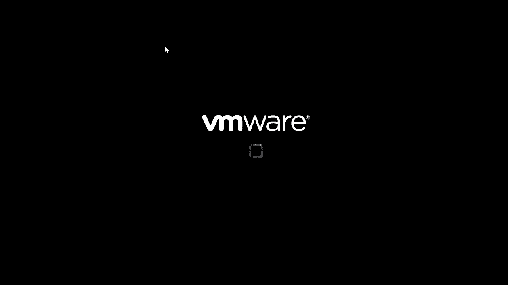
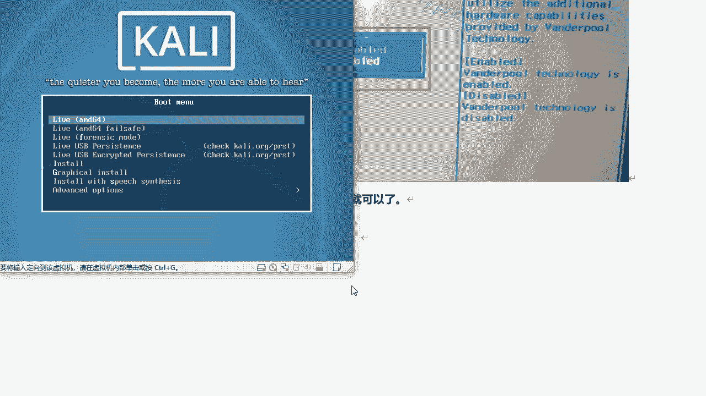
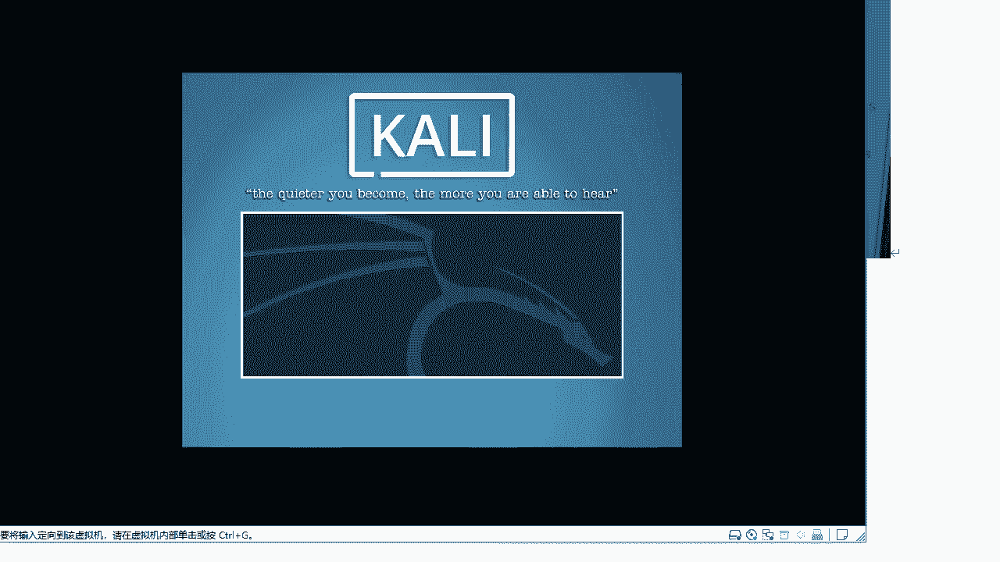
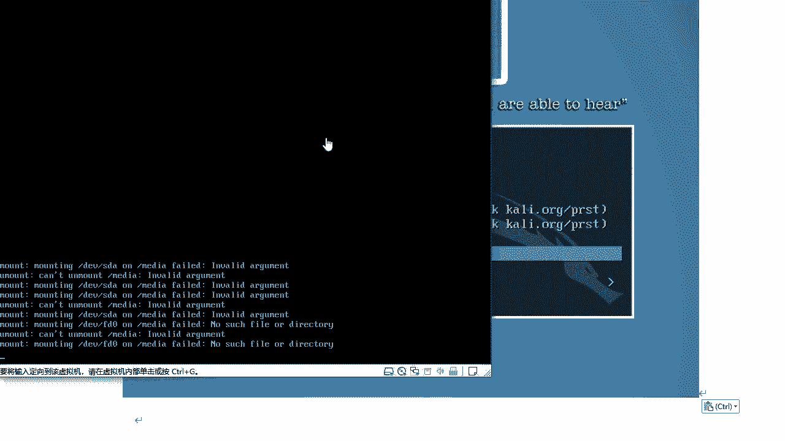
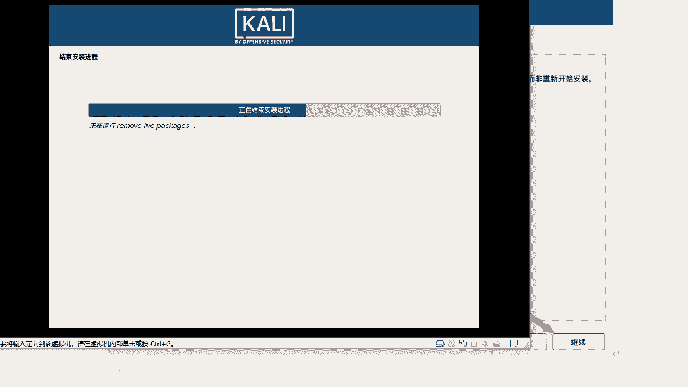

# 课程 P23：6.3 - 【Kali渗透系列】安装Kali虚拟机系统 🖥️


在本节课中，我们将学习如何在虚拟机中安装Kali Linux操作系统。我们将从启动虚拟机开始，逐步完成语言选择、网络配置、磁盘分区、用户设置等关键步骤，最终成功引导进入Kali系统桌面。

---



上一节我们介绍了如何准备Kali Linux的安装镜像。本节中，我们来看看如何启动虚拟机并开始安装过程。



我们点击开启此虚拟机。


等待虚拟机启动，启动过程中出现的提示窗口可以先关闭。






---

启动后，我们将进入安装引导界面。以下是选择安装模式的操作步骤。

在引导界面，我们需要移动鼠标并按下键盘的向下方向键，选择倒数第三项“Graphical install”（图形化安装）。


选择图形化安装模式。


---

选择好安装模式后，接下来需要进行一系列初始配置。以下是配置语言和地区的步骤。

首先选择系统语言。为了便于操作，我们选择“中文（简体）”，然后点击“继续”。

接着选择国家，默认选择“中国”即可，点击“继续”。

然后配置键盘布局，可以选择默认的“汉语”或“美式英语”，点击“继续”。

系统会开始加载额外的安装组件并配置网络。如果网络不通，此步骤可能会失败。


---

网络配置完成后，需要设置系统的主机名和用户密码。以下是具体操作。

为主机设置一个名称，例如“xueba-wusan”，然后点击“继续”。

域名设置保持默认，直接点击“继续”。

接下来设置root用户的密码。对于本地虚拟机，建议设置简单易记的密码，例如 `123456`。输入密码后点击“继续”。

---

设置好用户后，需要对虚拟机的磁盘进行分区。以下是磁盘分区的步骤。

进入磁盘分区环节。对于新手，建议使用默认的“使用整个磁盘”选项，点击“继续”。

选择要分区的磁盘，因为我们只有一块虚拟硬盘，所以直接选择默认项，点击“继续”。

分区方案选择“将所有文件放在同一个分区中（推荐新手使用）”，点击“继续”。

确认分区设定，选择“结束分区设定并将修改写入磁盘”，仔细核对后点击“继续”。

系统会询问“将改动写入磁盘吗？”，选择“是”，然后继续。

之后系统将开始安装过程，请耐心等待。安装速度取决于您电脑的物理内存和分配给虚拟机的资源。

---

在安装过程中，有一个关于软件源的配置选项需要注意。以下是相关说明。

当出现“配置软件包管理器”步骤时，系统会询问“是否使用网络镜像？”。如果选择“是”，安装程序会尝试连接Kali官方源在线下载组件。但由于网络原因，可能会导致安装失败。

因此，建议在此处选择“否”，然后点击“继续”。我们可以在系统安装完成后，再手动配置软件源。

---

安装过程的最后一步是安装系统引导程序。以下是相关操作。

安装程序会提示安装GRUB引导程序。GRUB是启动系统所必需的，选择“是”，将GRUB安装至主引导记录。

当询问安装设备时，选择我们唯一的硬盘（例如 `/dev/sda`），点击“继续”。

等待安装程序完成所有剩余工作。

---

所有步骤完成后，系统将进行重启。以下是首次登录系统的操作。

安装完成后，点击“继续”，系统将自动重启虚拟机。




重启后，将进入Kali Linux的登录界面。默认情况下，系统只有一个用户 `root`。

在登录提示处输入用户名：
```
root
```
按下回车键。


然后输入在安装过程中设置的root用户密码（例如 `123456`），按下回车键或点击登录。


成功登录后，即可进入Kali Linux的桌面环境。


---

本节课中我们一起学习了在虚拟机中完整安装Kali Linux系统的全过程。我们从启动虚拟机开始，依次完成了安装模式选择、语言地区配置、主机名与密码设置、磁盘分区、软件源选择以及GRUB引导程序安装等关键步骤，并最终成功登录系统。请确保记住您设置的root密码，这是管理系统的关键。安装完成后，您就拥有了一个用于网络安全学习和测试的Kali Linux环境。