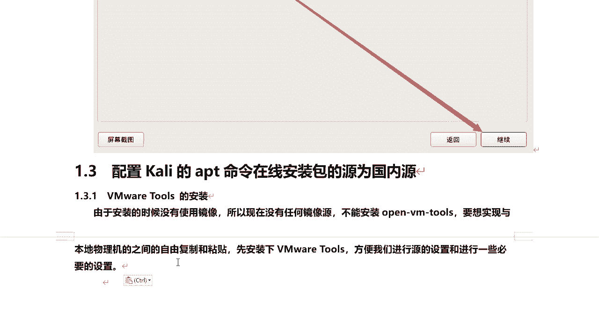
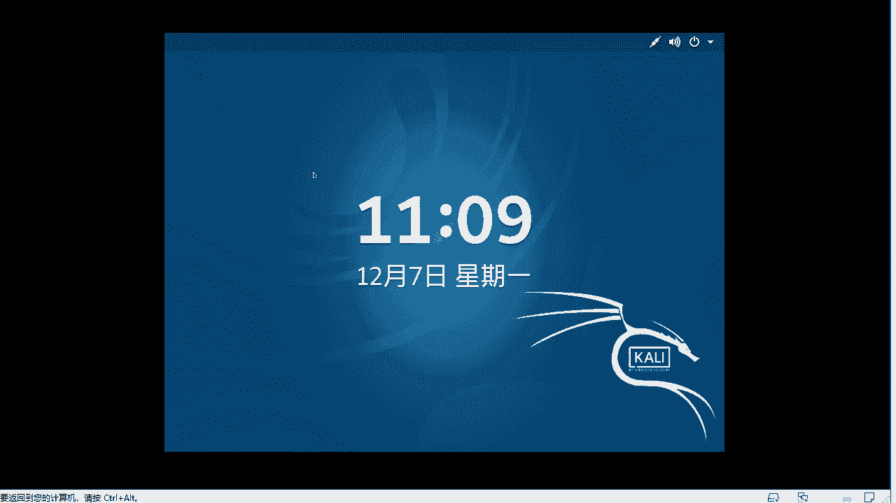
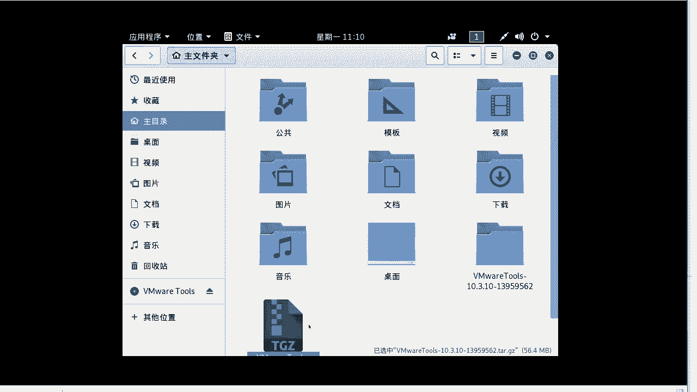
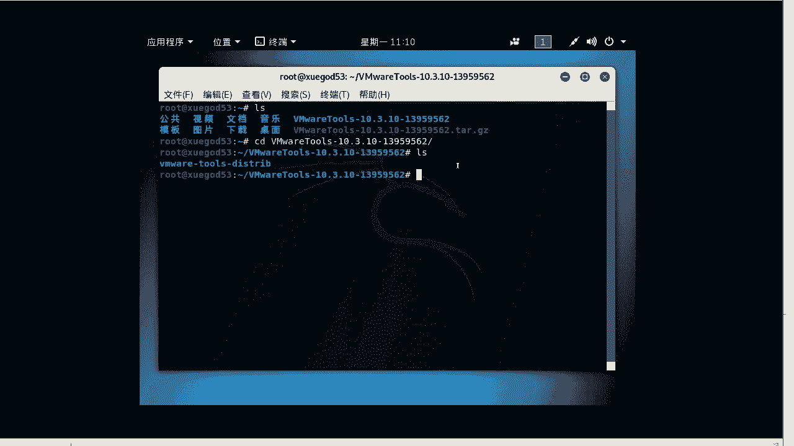
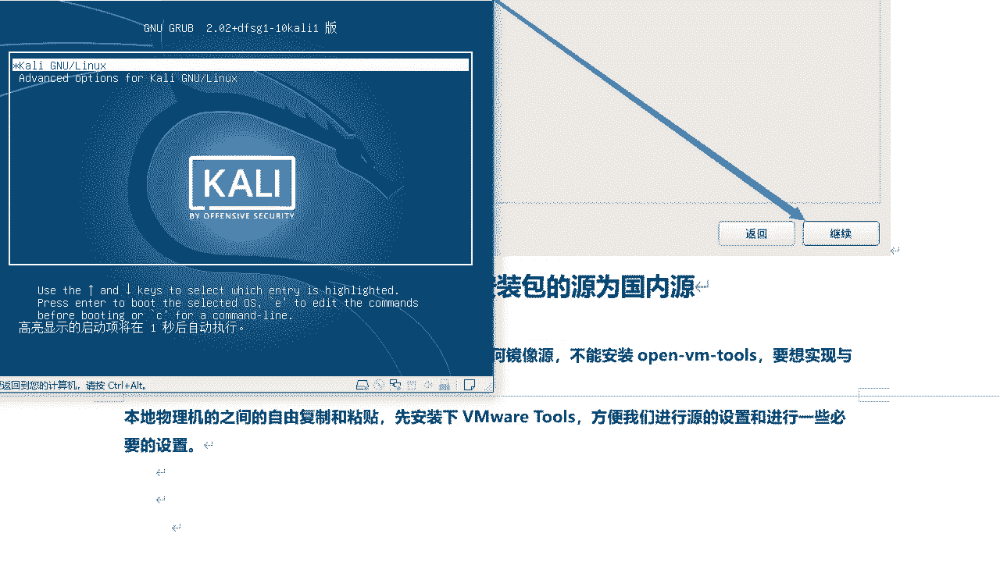
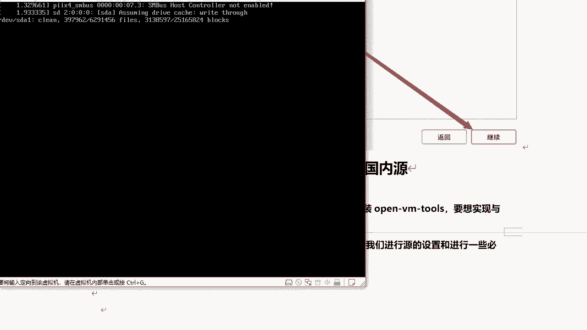

# P24：6.4-【Kali渗透系列】VMware Tools 的安装 - 一个小小小白帽 - BV1Sy4y1D7qv

现在呢我们来讲一下配置ki的apt命令，在线安装包的源为国内源，那么在配置员之前呢，我们来讲一下如何安装vma tools，那为什么安装v mtools呢，由于我们在安装的时候是否使用网络镜像选择。

是否，那默认呢它是没有任何圆的，我们现在呢不能进行任何软件的安装，那么为了呢方便呢我们配置啊元，所以说呢我们来先安装一下的w where are tools啊。

就是v mt自带的啊william tools工具啊。

好的我们来看一下的啊，这里呢我们来看单机了啊。

我们来点击一下的vm的虚拟机安装vm tools，然后此时它会将这个工具呢自动加载进来啊，加载进来，wware tools，在这里我们已经看到了是吧，然后呢我们点击这里，然后vtools。

然后这个压缩包，那么在这里呢我们要将它解压，那但是呢由于它现在是在光盘中啊，对光盘是只读不可写的，我们将它复制出来，复制到右键，复制到，然后把它复制到主目录里面，然后点击选择好，然后我们再点击主目录。

这个包已经过来了啊，然后呢接下来呢我们将它解压啊，点击右键，然后提取到此处，也是将解压到我们的root根目录下面。

然后我们将它关掉，打开终端，好我们来看一下，这个是我们解压的啊，这个工具包，然后切换到这个目录，然后再进入这个目录。

然后这里呢我们来看一下，这有绿色的啊，这个就是我们的vma tools安装包，然后我们来安装一下的，点cav tab键补齐，然后杠d杠d的作用呢，如果你不加的话，杠d的话，它会自动的啊，默认选择。

我们稍等，安装它的目的呢，首先呢看我们这个屏幕安装完非常小啊，安装完这个工具它会自适应啊，整个屏幕的尺寸看起来会舒服很多，现在已经变过来了，然后呢接下来呢我们来重启一下的reboot。

重启之后呢，对我们的屏幕尺寸呢对它会自适应，对你自动调整窗口之后，它会自适应这个大小，唉看你会舒服很多，我们来登录进来。

好的，那么到现在为止，我们的vtools就安装成功了。