# P25：6.5-【Kali渗透系列】配置Kali的apt命令在线安装包的源为国内源 - 一个小小小白帽 - BV1Sy4y1D7qv

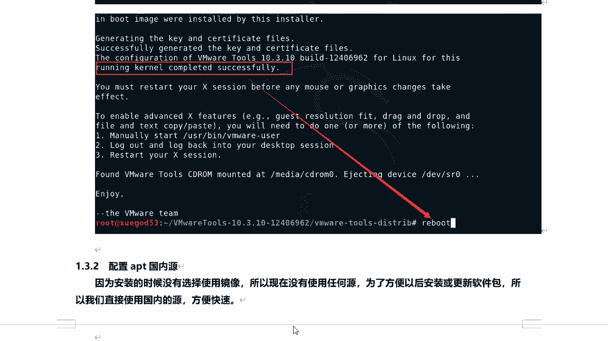

vmware tools安装完成之后呢，接下来呢我们来配置一下app的国内源，因为呢安装的时候没有选择使用镜像，所以现在没有任何缘啊，那么也就是说你不能安装任何软件啊，因为在安装软件的功能。

它是通过源下载并安装的，那么为了方便以后安装和获得更新软件包呢，所以呢我们直接使用国内源，方便快速啊，国内的圆呢我们都能访问，而且速度相对比较快一些，那一般来讲我们都使用哪一个圆呢。

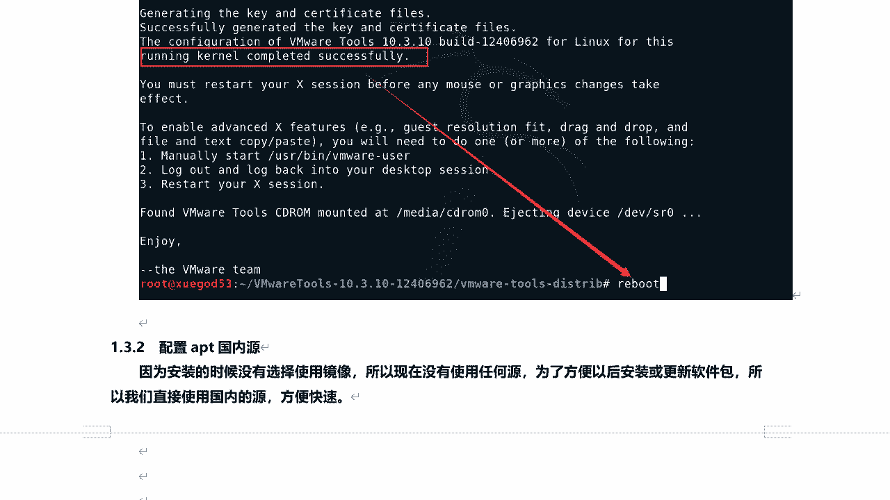

综合大啊的开立源呢相对于比较稳定一些啊，这个圆啊对，然后呢我们如何去设置呢，首先来点击啊来打开carry。

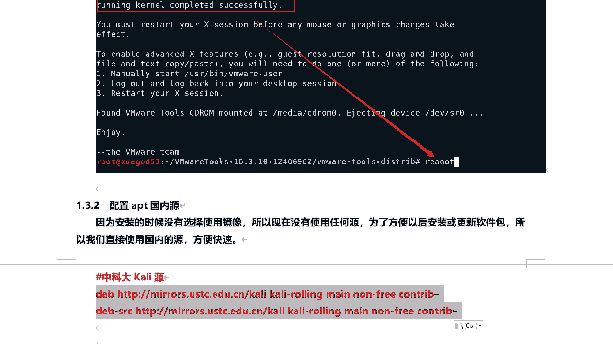

点击终端，然后呢这里头我们来配置一下了，然后编辑一下的我们的源文件，etc目录下面的a b t，要么sauce list，这里呢现在是没有任何圆的好吧，然后呢我们来编辑一下的啊，编辑一下。

将刚刚我们的圆呢复制进来，在这里啊，按一下滚轮键复制进来，复制完成之后呢，对在最后一行插入就可以了啊，按下e s c啊，然后关于这个圆呢，对我给大家说一下它啊。

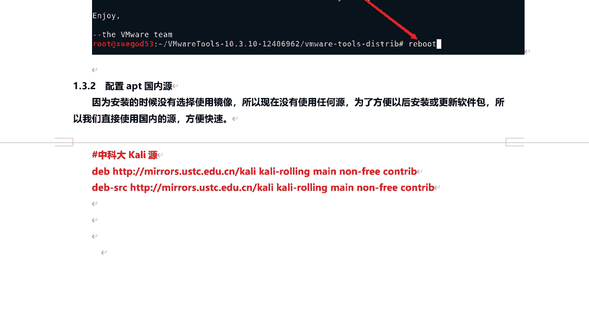

啊这里呢我们看后面有carly rolling main，non free contrip是吧，这是什么意思呢，好一会儿给大家说一下的啊，好的这里的配置如何配置。

上w v i m使用这个工具打开这个文件好吧，然后在最后一行，将这两个两行代码插入进去就可以了啊，这是中科大的开立源，那么在复制的时候呢，按下鼠标滚轮啊，就可以粘贴进去了，来在这里复制。

然后在开立里面打开这个文件之后，按下鼠标滚轮就可以粘贴到文档中，然后保存退出就可以了，那么这里头给大家扩展一下了啊，那么如何在物理机和ky之间复制和粘贴文件呢。

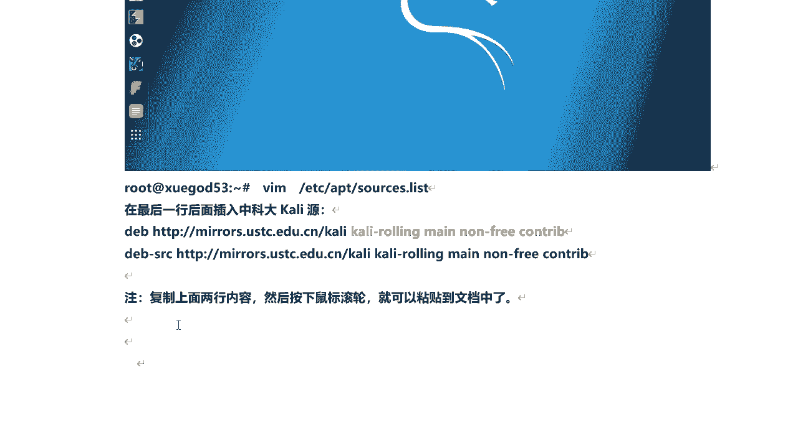

注意吧，好的，那么在laggy leagues里面，复制的快捷键是ctrl加insert，按住cos ctrl键，再加映射的就可以复制了，是在linux里面叫kelly里面粘贴呢。

按住shift加影视的可以粘贴，或者是按鼠标滚轮键也可以粘贴啊，那么这里呢我要给大家说一下的，但关于这个圆好吧，我们看这里头前面有个db和d e b s r c，分别代表着什么呢，d b代表软件的位置。

d e b杠s r c代表软件的源代码的位置啊，这就有他俩的区别，然后接下来我们怎么来验证对吧，我们这个圆是否配置成功了，我们可以使用apt对吧，命令来获取最新的软件包列表。

在这里用apt update，那么这个app的update，就相当于我们windows系统下面检查更新一一样，它去检查现在有多少软件包需要更新，但是呢它不是真正的去更新，这个大家能理解吧好吧。

那么这里我们发现它获取是从哪获取的，这就是刚刚我们设置的中科大这个圆啊，来获取的啊，然后呢我们下面来给大家扩展一下的，关于我们开了你们apt源啊。

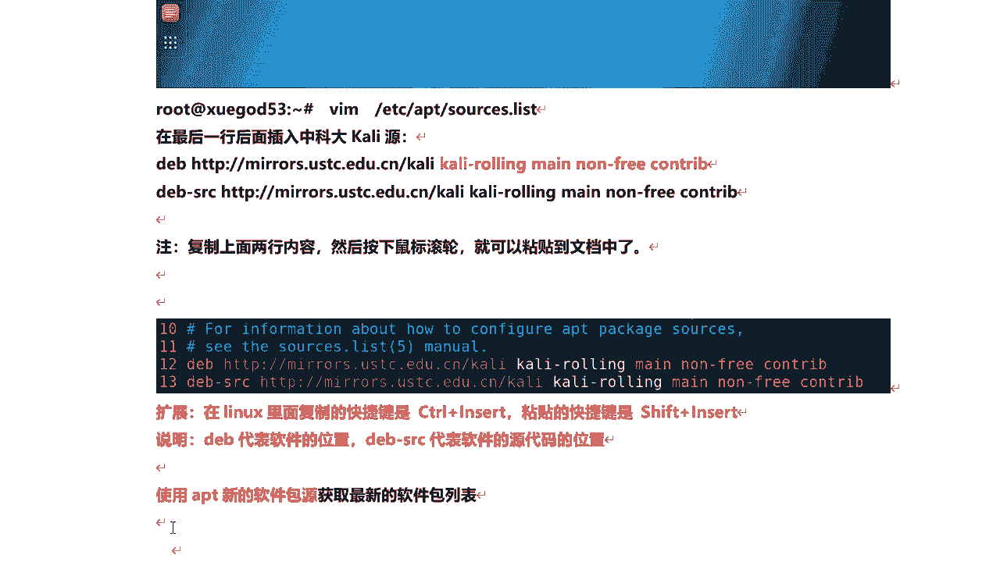

那么大家看这个圆里面有kelly rolling啊，kelly rolling是kelly的即时更新版，那么只要kelly官方啊有更新，那么这个更新包啊就会放入这个kelly rolling中。

然后供用户呢去下载使用，它为用户提供了一个稳定更新的版本，同时呢会带有最新的更新安装包，这个也是我们最常用的一个圆，kelly rolling及时更新版啊。

那么在kelly rolling中呢有三类软件包等三类呢，其实我们在这里呢已经看到了是吧。

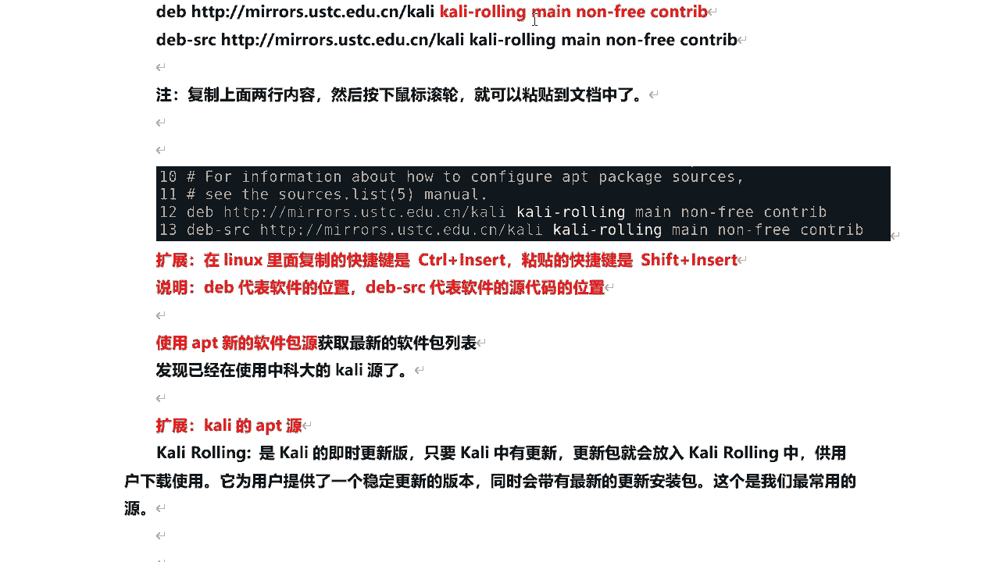

对这三类啊有man nfree和countrip啊，那么kelly a p t语言的软件包类型，那么这个慢对代表的是什么呢，它是在遵从debi自由软件自动方程df s g。

并不依赖于none free啊，那么它呢它有个标准就是软件包啊，它开发有个标准啊，遵循这个标准，然后countribe呢，它是遵从deban自由软件自动方程d f s g，但是它依赖于nf啊。

那nfree呢它是不遵从迪拜自由软件指导方针的，然后注意啊，那么这个d f s g啊，那么它是deban自由软件制造方针啊，那么这个方针中大体呢包括自由的，再次发行源代码，禁止歧视人士或者组织等规定啊。

他这个标准也是一个规定啊，都遵循这个，那么这个rolling啊英文翻译过来是滚动的意思啊，control呢是贡献软件贡献贡献的发行版，还有这个d i s t s区域的意思，那么我们来手动查看一下的啊。

那么它这个圆啊里面到底是什么样的，好吧，对ap圆我们可以直接访问这个啊这个地址，这个地址呢就是我们设定圆前面的部分啊，这部分啊来我们用浏览器来打开这里啊，好那么我打开之后啊，看它是一个目录好吧。

那么有d i s t s，我们说它是区域区域的意思啊，点开它，那么这里呢我们会看到kelly rolling及时更新版，然后点击进去之后，那么这里有country my nfree啊，三个目录啊。

三类软件包啊，ok这个目录我们来了解一下就可以了啊，了解一下的，好那么接下来我们来说一个问题啊，那么apt update apt upgrade和apt dist upgrade的区别。

那么我们在进行更新的时候啊，也就是执行a b d update的时候啊，检查更新的时候，我们来看它呢，或者是从圆啊，我们设定的圆里面去获取啊，这里还有一个in release，这都代表什么意思呢。

好我们来看一下那apt update哎，它的作用呢是从etc a p t source点类似的，就是我们设定的圆里面，定义的圆中获取的最新的软件包列表啊。

而运行的apt update它并没有真正去更新软件，就相当于windows下面的检查更新，获取的是软件的什么状态啊，也就是最新的软件包列表啊，那么我们在执行的时候也也看到这个是吧。

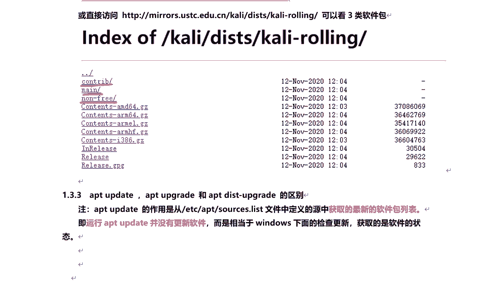

看这里对吧，中科大我们设定是综合大圆啊。

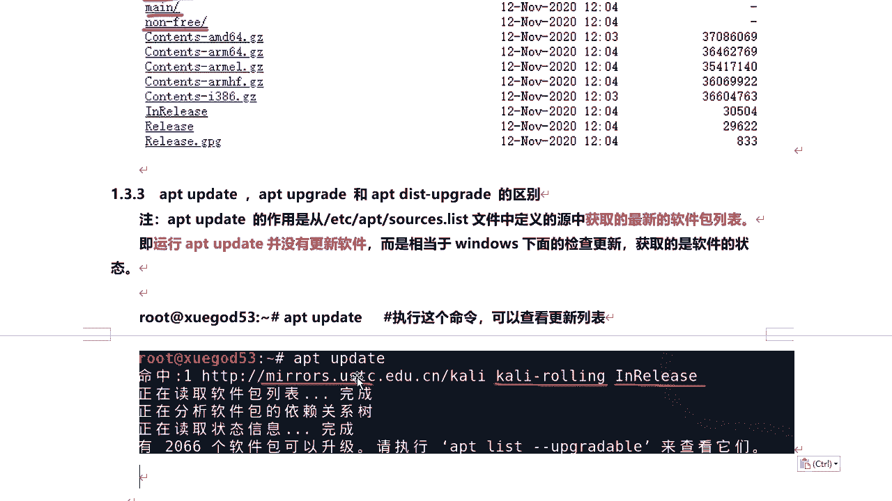

从kly rolling及时更新版里的获取，后面有一个release，那么这个音乐release是什么意思呢对吧，那么我们来看一下这个地址啊。

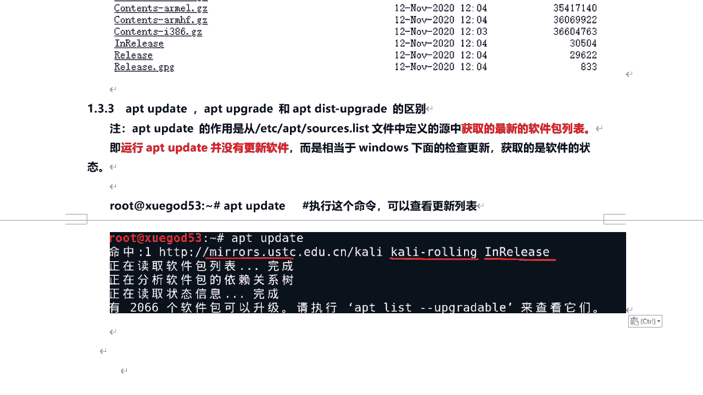

这里头这个in release啊，它会下载这个in release文件对吧，这个文件里面包含的是软件包列表啊，我们可以把它下载到本地点击一下的啊，然后呢我们来打开它看一下，稍等啊啊，好我们来打开。

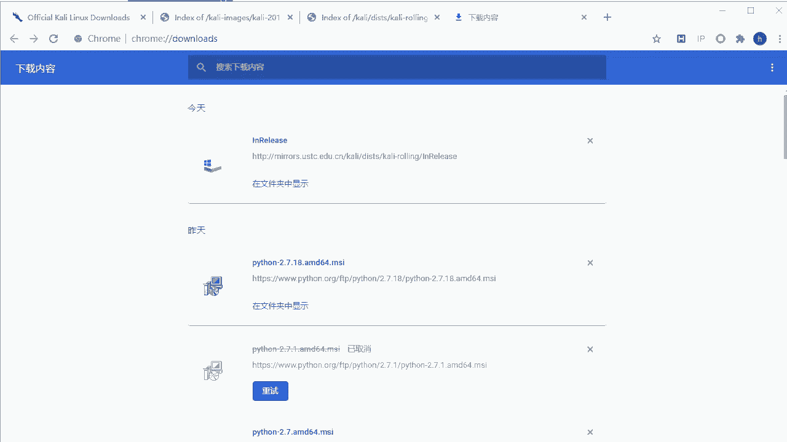

好那么大家看一下的啊，这个就是那个in release那个文件啊，那么在这里呢，我们看它相关主要man contribunn free是吧，对他只要官方啊有更新，那么它呢都会推送过来。

这里边都是需要更新的软件包列表哇，前面是就业都在这里，然后呢他通过apt update对，去检查有多少个软件包需要更新来检查，然后呢如果你真正的需要更新的时候，然后再执行另外一条命令。

对一会呢可以给大家讲啊，去真正的去下载这些软件包，然后呢进行安装。

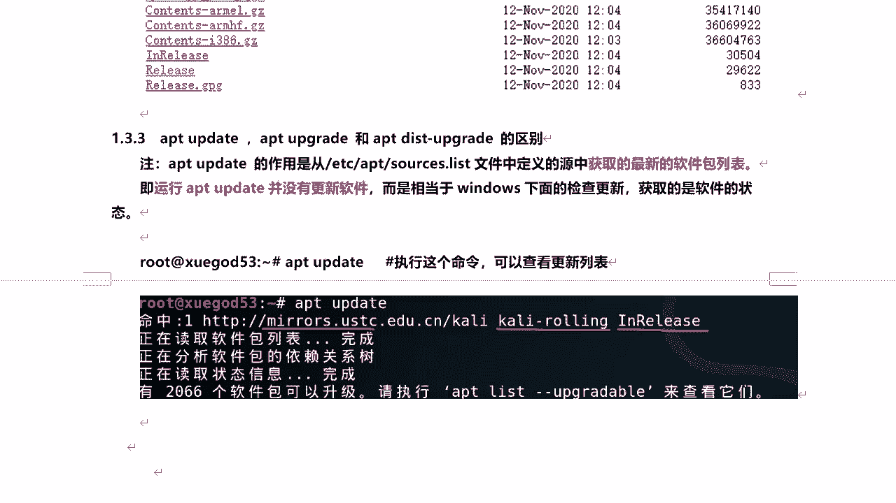