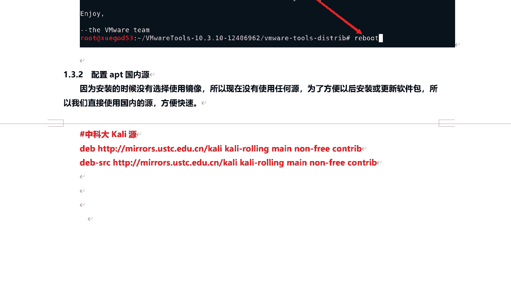
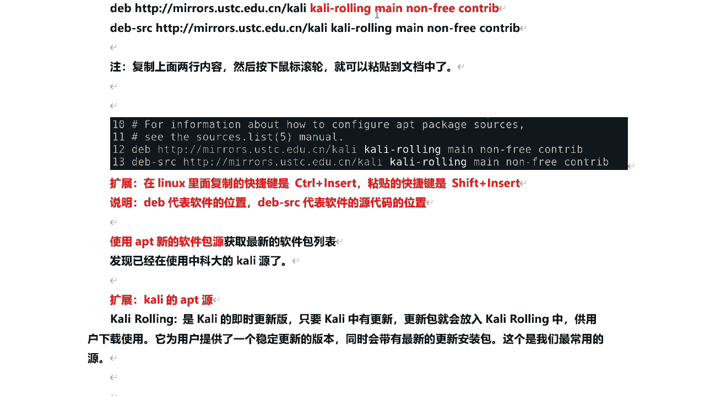

# 课程P25：6.5 - 【Kali渗透系列】配置Kali的APT国内源 🛠️


在本节课中，我们将学习如何为Kali Linux配置APT软件包管理器的国内镜像源。配置国内源可以显著提升软件下载和更新的速度，是后续安装各类工具的基础。

## 概述


安装Kali Linux时，若未选择使用镜像源，系统将无法通过APT命令安装任何软件。因为APT安装软件的功能依赖于从“源”服务器下载软件包。为了后续安装和更新软件包的便利与速度，我们将手动配置一个稳定且快速的国内镜像源。


---

## 配置APT国内源



上一节我们完成了VMware Tools的安装，本节中我们来看看如何配置APT的国内源。

首先，我们需要打开终端。点击Kali桌面上的终端图标。

在终端中，我们将编辑APT的源列表文件。该文件位于 `/etc/apt/sources.list`。使用以下命令打开它：


```bash
sudo vim /etc/apt/sources.list
```

打开后，你会发现该文件目前是空的，没有任何源地址。接下来，我们需要将国内源的地址添加进去。

一个常用且稳定的国内源是中科大的Kali源。以下是需要添加的两行内容：

```
deb https://mirrors.ustc.edu.cn/kali kali-rolling main non-free contrib
deb-src https://mirrors.ustc.edu.cn/kali kali-rolling main non-free contrib
```

在Vim编辑器中，按下 `i` 键进入插入模式，然后将上述两行内容粘贴到文件末尾。在Kali终端中，可以使用鼠标滚轮键进行粘贴。完成后，按下 `ESC` 键退出插入模式，输入 `:wq` 保存并退出文件。


**扩展知识：**
*   `deb` 代表软件包的位置。
*   `deb-src` 代表对应软件包的源代码位置。

---

## 验证源配置



源配置完成后，我们需要验证它是否生效。

在终端中执行以下命令，该命令会从我们新配置的源获取最新的软件包列表，但并不会真正安装或更新任何软件：

```bash
sudo apt update
```

如果命令执行成功，并显示从 `mirrors.ustc.edu.cn`（中科大镜像站）获取信息，则说明源配置成功。

---

## 理解Kali Rolling与软件包分类

在配置的源地址中，我们看到了 `kali-rolling`、`main`、`non-free`、`contrib` 等关键词。以下是它们的含义：

*   **kali-rolling**: 这是Kali的即时更新版本。只要Kali官方有更新，最新的软件包就会被放入这个版本中，为用户提供稳定且包含最新工具的环境。
*   **软件包分类**：Kali的APT源包含三类软件包。
    *   **main**: 遵循 Debian 自由软件指导方针 (DFSG)，且不依赖于 `non-free` 软件包。
    *   **contrib**: 遵循 DFSG，但依赖于 `non-free` 软件包。
    *   **non-free**: 不遵循 DFSG 的软件包。

你可以通过浏览器访问 `https://mirrors.ustc.edu.cn/kali/dists/` 来直观地查看这些目录结构。

---


## APT更新命令详解


在执行 `apt update` 后，你可能会想知道如何进行真正的更新。以下是几个关键命令的区别：


*   **`apt update`**: 从 `/etc/apt/sources.list` 中定义的源服务器获取最新的软件包列表。它只“检查”更新，而不进行任何安装。
*   **`apt upgrade`**: 根据 `apt update` 获取的列表，升级所有已安装的软件包到最新版本。**它不会安装新包或删除旧包。**
*   **`apt dist-upgrade`**: 功能更强大的升级命令。除了执行 `upgrade` 的功能外，它还会智能地处理依赖关系的变化，**可能会安装新包或删除旧包**，以完成系统升级。


**关于 `InRelease` 文件**：在执行 `apt update` 时，你会看到它下载了一个 `InRelease` 文件。这个文件包含了软件源的元数据（如软件包列表的哈希值），用于验证下载内容的完整性和真实性。

---

## 总结


本节课中我们一起学习了配置Kali Linux APT国内源的全过程。我们首先了解了配置源的必要性，然后逐步完成了编辑源列表文件、添加中科大镜像地址、验证配置以及更新软件包列表的操作。此外，我们还深入了解了 `kali-rolling` 版本的含义、软件包的三种分类（main, contrib, non-free），以及 `apt update`、`apt upgrade` 和 `apt dist-upgrade` 这几个关键命令的区别。掌握这些知识，将为你在Kali Linux上高效地安装和管理软件打下坚实基础。