# P26：6.6-【Kali渗透系列】解决Kali软件包安装存在的依赖问题 - 一个小小小白帽 - BV1Sy4y1D7qv

接下来呢给大家说一个问题啊，我们安装的kelly版本是2019。1a啊，那么下面呢我们来解决一下软件包，这个版本的软件包啊，安装存在的依赖问题，因为这个版本kly，在安装软件或升级系统的时候呢。

会出现这个错误啊，这个问题，那么比如说我们在升级系统啊，执行这个命令啊，a p t杠y for upgrade啊，那么这个是真正的去升级系统了啊，a p t update呢是检查更新，这是真正的升级。

但是呢不建议大家进行系统升级，那这样呢比较耗时，也容易出现问题呃，如果假如说大家想安装最新版本的kelly，那么可以到官方下载最新的镜像。

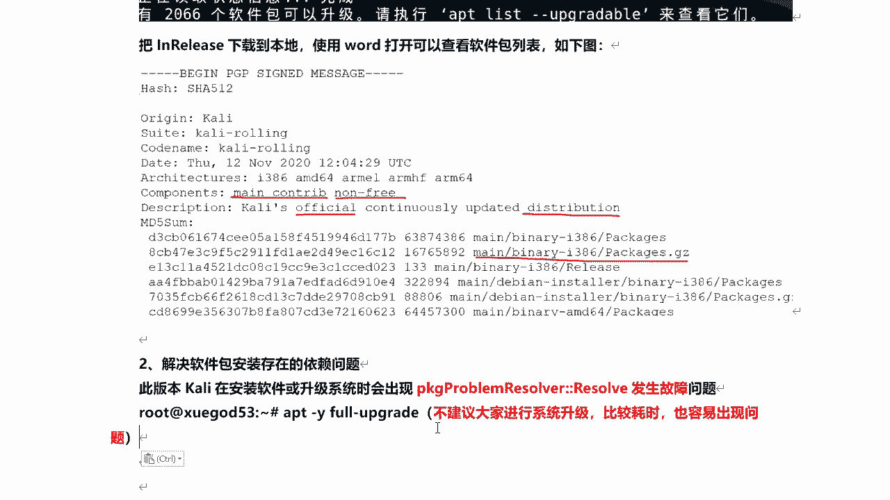

然后进行安装就可以了啊，这里呢我只是给大家演示这个问题啊。

然后当我们来进入k0 ，执行完upa apt update之后，我们再执行这个升级命令，那么这个版本，2019。1a或者2019系列的啊，都会出现这个问题啊，安装不了啊，或者是进行安装其他工具的时候啊。

软件的时候也会出现这个问题，那么这个问题怎么解决呢，对啊，为什么会产生这个问题呢，是吧，我们来看一下的啊，因为这个版本啊ky的官方源好吧，已经不支持了啊，旧版本的系统安装好以后呢。

通过apt命令安装软件会存在软件包依赖的问题，很多软件呢都会装不上的，那么如何去解决呢。

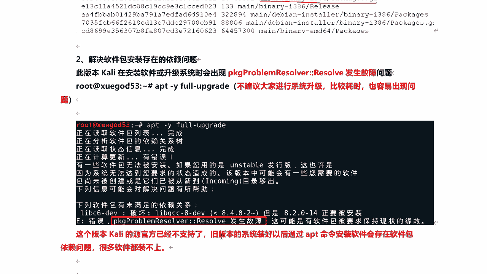

那么它的解决办法呢，也就是在安装软件或升级系统的过程中，如果出现这一类提示，提示破坏什么或者是依赖什么，就安装什么，所有的一起安装就可以了，然后等待安装完成，然后重启虚拟机啊。

然后呢这里呢我们来执行这条命令，好来再开立终端，我们来执行一下它a p d4 道杠杠y啊，这些呢就是提示依赖或破坏的，那比如说当我们执行这条命令，它又提示了啊，破坏什么或依赖什么。

我们只需要将它复制进来啊，就是将哪儿呢破坏这个是吧，那么我们就要将这部分啊，这部分。

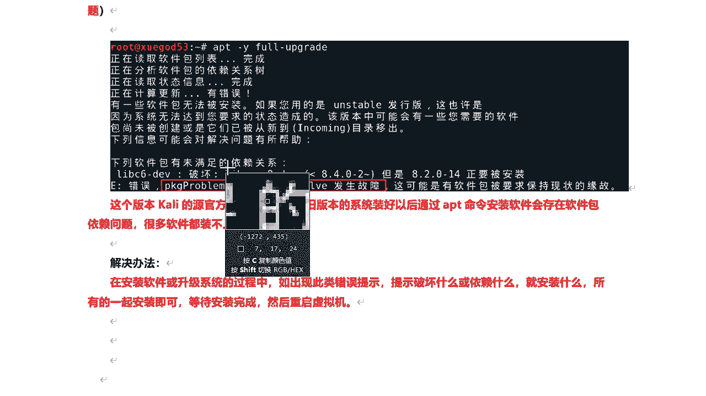

这个好吧，复制一下子啊，复制下来，然后呢在后面加个空格啊，粘贴进来，放到后面一起安装就可以了啊，直到我们这里都可以正常安装，没有任何错误提示，等待安装就可以了。

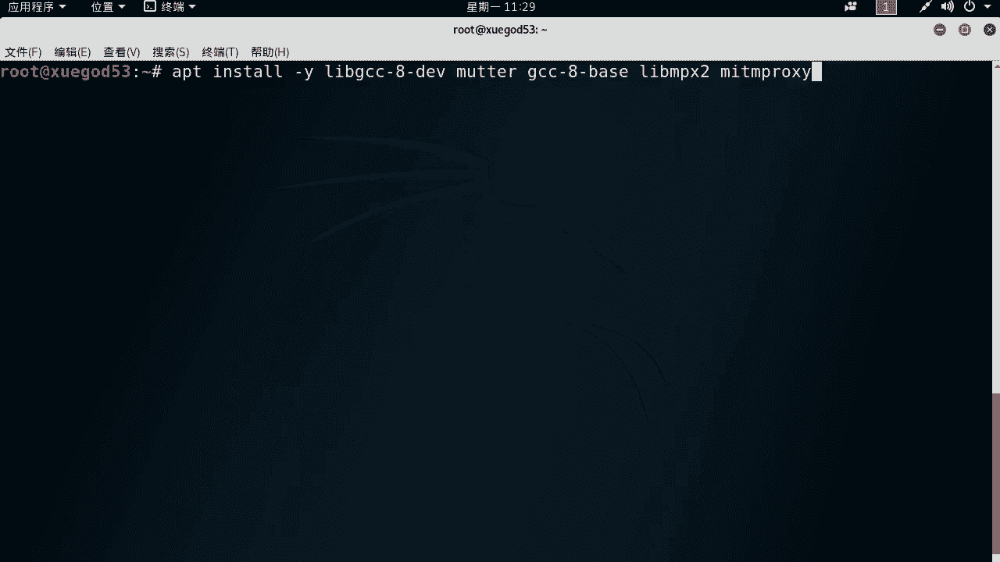

我们回车，好的，已经开始安装了啊，这里没有问题，呃这里如果啊你在执行这条命令啊，安装命令的时候，如果出现这个错误提示怎么办呢，对吧，那么你可以执行下这个命令。

a p t杠get update或者是apt update都可以啊，杠杠fix missing啊，那么正常来讲就是我们在安装软件的时候，都要先执行一下什么命令呢，a apt update。

然后再进行安装，那么它也就不会出现这个错误提示了，之所以出现这个错误提示，就是你在执行这个安装的时候之前啊，没有执行apt update，就是检查软件包更新列表啊，然后呢这条命令执行完成之后呢。

你再执行一下这个命令就可以正常安装了，好吧，那现在呢我们已经开始啊进行正常安装了，下载570兆，读取变更记录就是有哪些啊，需要变更的，更新的或者是移除的，我们等它安装成功就可以了啊。

但是呢在整个安装过程中呢，有些需要我们手动去操作啊，这一点大家要注意，好的，那么当出现这个提示之后呢，都是英文啊，不认识怎么办，回车，在整个安装过程中千万不要离开啊，因为刚才那种状况需要你手动去操作啊。

如果假如说你等着i等我去啊，休闲一会儿看会儿电影回来呢，他会安装完no啊，那么如果你回来之后，可能会在卡拉哪里需要你操作一下来，太当继续啊，所以说一直要看着它安装完成，对如果出现这些提示。

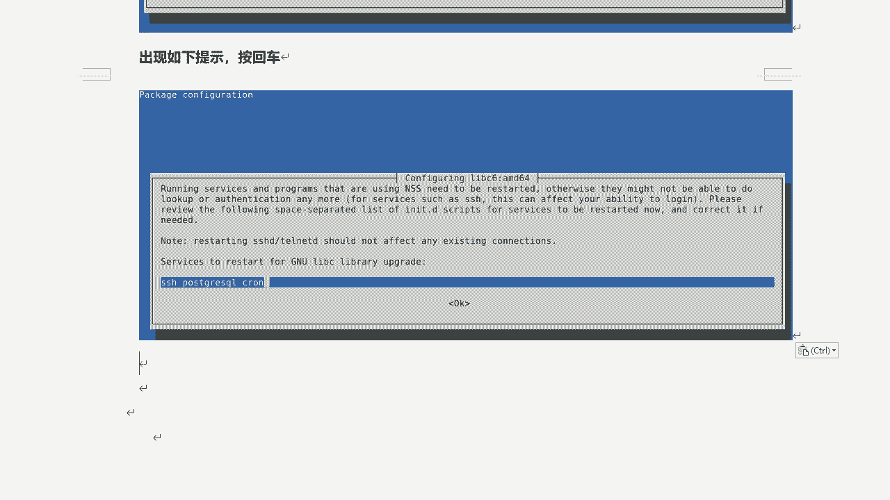

另外你要说明一点嗯，通过这种方式解决之后呢，它整个的核心呢还是2019。1a，但是它的桌面环境啊会升级到最新的版本，因为默认呢它的桌面火箭是吉om的，对升级完后之后也是gnome的。

好那么当出现这个提示之后呢，需要我们手动操作一下的啊，那您现在希望如何处理，以下有几个方案对吧，就软件报道提供者，同时提供了一个更新了的版本，那么第一个默认安装软件包，维护者所提供的版本。

当然我们选择第一个啊，按大y或大i这里问大y就可以了，然后回车。

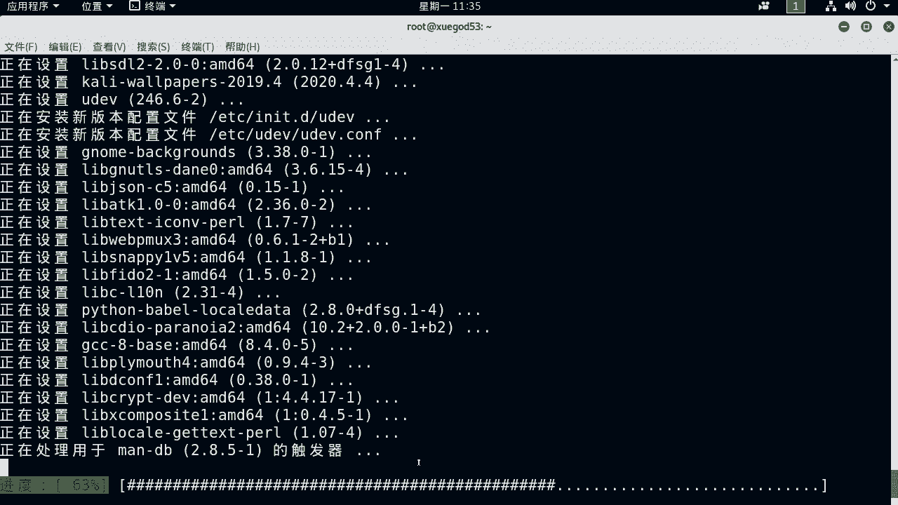

所以说这里提示你啊是按哪个键的是吧，直接输入大y。

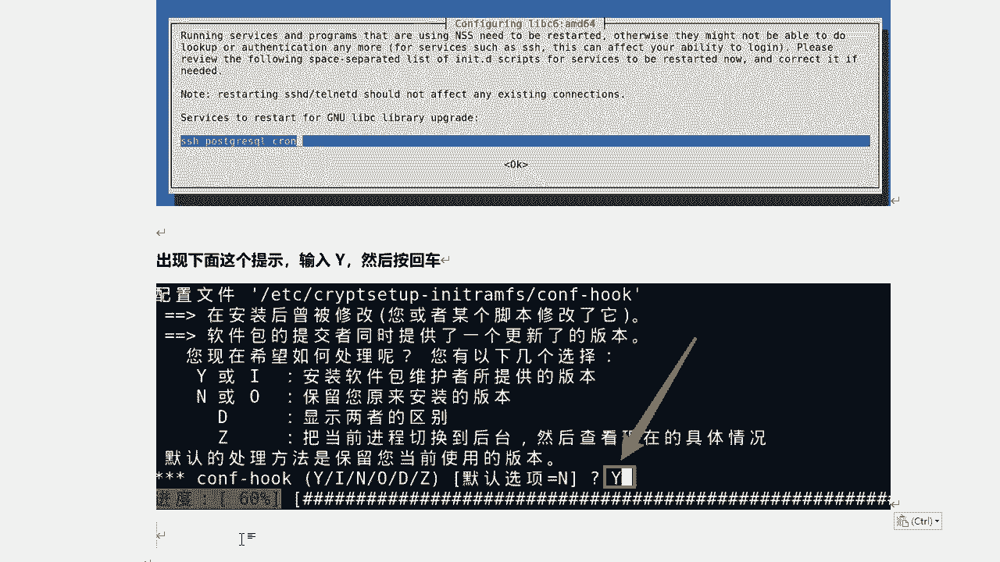

我们继续等待，马上快要成功了啊，好的，然后经过一个漫长的等待啊，安装成功了，然后呢，我们需要重启下的reboot一下的。

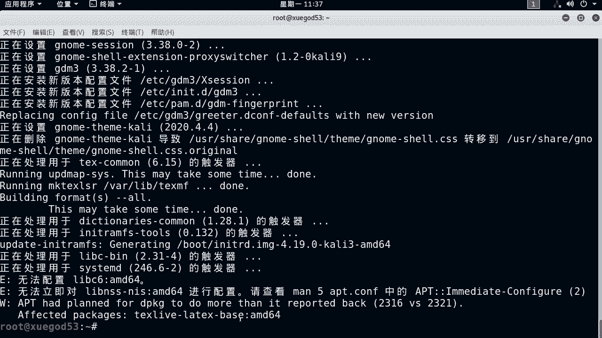

对然后呢reboot之后呢，重启之后，我们再进行安装软件或系统升级，就不会报错了啊。

啊整个这个看图标也变了啊，驱动界面。

好输入用户名，root密码。

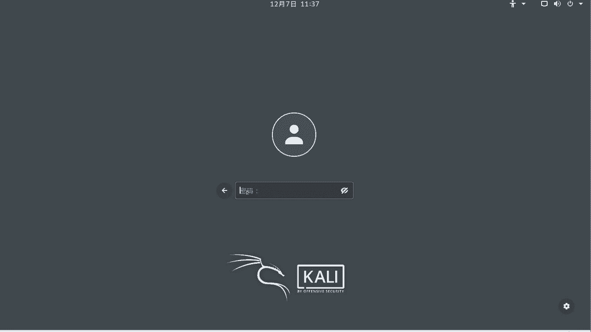

123456，好那么我们已经登录进来了啊，登录进去了之后，我们发现整个桌面啊非常干净啊，有很多东西都没有，是不是，在左侧的收藏栏和顶部的应用程序菜单，都没有了，我们点击活动看一下子是吧。

好的那接下来呢我们还有进一步处理一下的啊，因为呢你现在升级到最新的一个桌面环境，gnome啊，最新版的话它有很多东西默认是隐藏的是吧，所以说呢这里我们来打开终端啊，在这里呢输入tr啊，终端在哪里呢。

在这里单击鼠标左键打开终端啊，然后我们放大一下了，ctrl shift加加号，放大ctrl加减号，说小而这里呢我们来调出一个工具啊，打开扩展，这里呢我们来单击扩展，那默认有很多它都是默认禁用的啊。

关闭的好吧，比如i believe his menu，我们来把它打开啊，对然后呢接下来呢还有接下来啊death to talk，看这里头是吧，应用程序打开了吧啊，这个菜单还有左边的收藏栏也打开了。

也显示出来了，还有一个桌面图标，这个我们也开启啊，对对对，桌面啊，我们可以看放置应用程序啊，应用程序啊，然后呢接下来呢我们还有几个需要打开的啊，好吧，我们来看呃，这下面找一下的啊，在哪呢，好aaa e。

这个啊把它打开，啊，这个啊把这几个打开，还有一个其他的就可以不打了，user用户主题，这个打开也可以啊，唉看这上面是不一样了，有变化有变化的啊，然后关闭啊好吧。

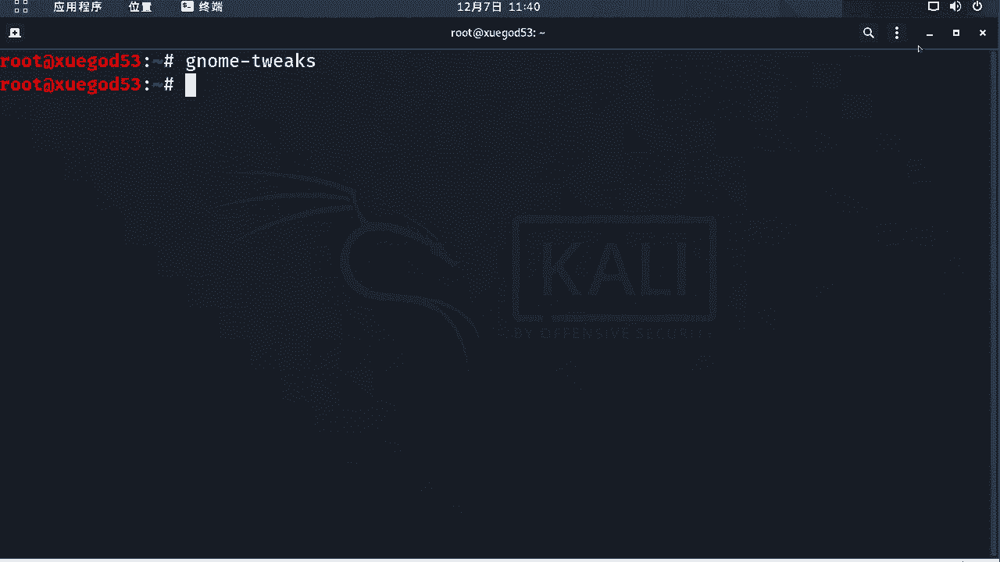

然后呢我们将中文对化，这里边好点击应用程序，我们所有的工具列表大家都看到。

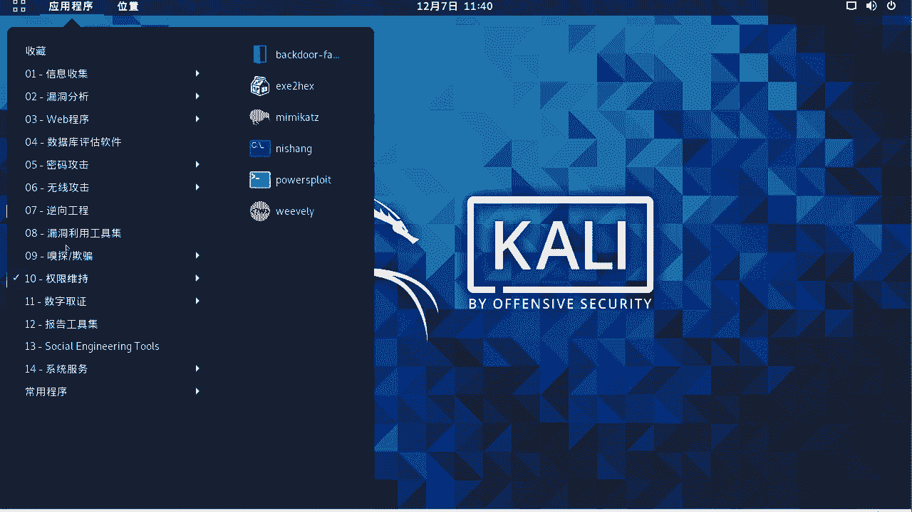

这方便很多呀，嗯然后此时我们单击鼠标右键，在桌面单击右键的时候对吧，有很多同学习惯单击右键，在桌面单击右键进入终端，但是右键不好使对吧，那怎么办呢，我们一样哎就中断来执行一条命令，我们来安装一下的好吧。

执行一下这条命令，执行完成之后呢，这是吉诺cl的扩展啊，关于桌面图标右键的啊。

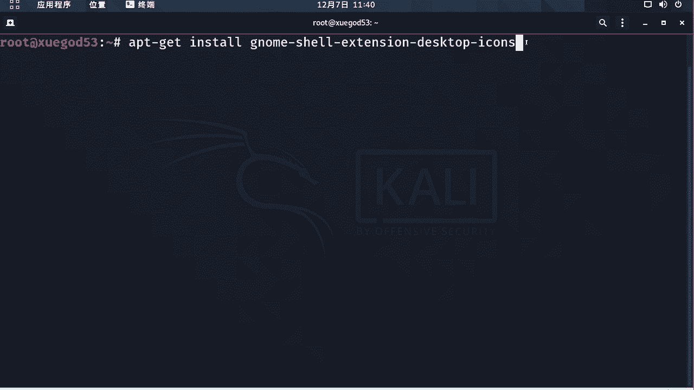

安装一下就可以了啊，按下y回车，好安装完成之后呢，我们来关闭，然后此时单击右键呢还是不好使，怎么办呢，我们需要重启一下，reboot。

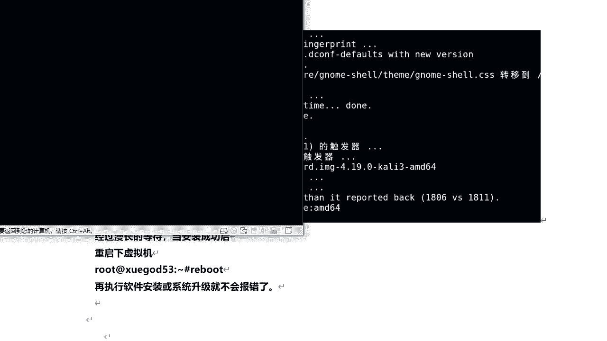

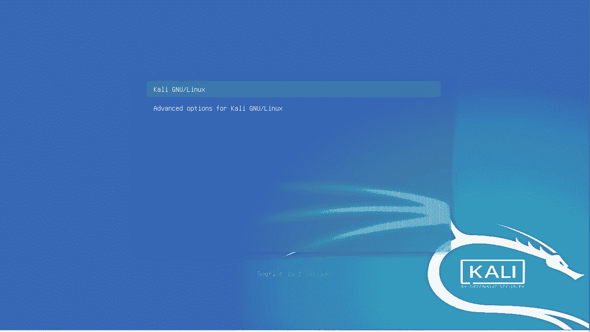

嗯咋不显示呢。

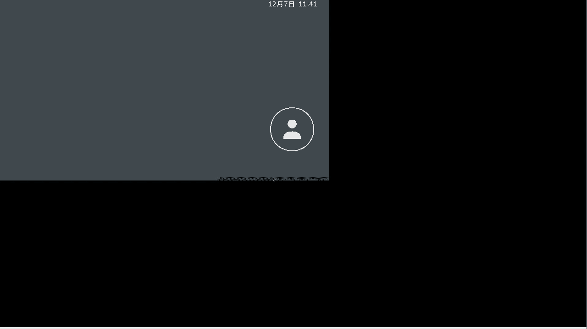

我直接输入blut 123456。

感产生成我将明月最小化再还原就好了啊，就好了，然后看桌面出现两个图标啊，这个放在这里有点变了，放在这里就可以了，此时我们带着单击鼠标右键对吧，这个tt就好使了啊，就好使了就可以了啊。

对然后呢下面呢我们来看一下啊，左侧是收藏栏，收藏栏是什么意思，就是我们可以把一些我们常用的一些工具，放在左侧啊，那么比如说我们单击这里，单击这里搜索啊，比如我们来找一下visuck啊。

wesg右键我想把它放在收藏栏里面，右键添加到收藏栏，单击就可以了，然后再点击一下这里，他就到送上来了啊，其他的一样啊，比如说我们想把它从松上篮移除怎么办呢，右键从收藏夹对吧。

也就是收藏栏移除就可以了啊，那到现在为止，我们这个依赖问题呢就已经解决了啊，好的，那么下面呢我们来看你看几个关于啊，系统升级的命令啊，那么a p t update我们知道它是检查文件更新是吧。

那么他检查有哪些那个软件包啊，已经更新了啊，这样的更新系统呢是吧，那么通过执行这个命令啊，a p t upgrade啊，那么这个是根据update命令获取的，最新的软件包列表去真正的更新软件，好吧。

对这是根据啊，根据，那么还有一条命令啊，叫apt dist upgrade，那么这个呢它也是根据update命令获取的，最新的软件包列表去真正的更新软件，对啊，那他俩这么看好像都是一样。

到底有什么区别啊，首先我们来看一下的啊，a p d和upgrade和destupgrade差别在哪里，upgrade等等，这个是系统将现有的啊软件包升级，那么如果有相依赖的问题。

那么这个此依赖呢需要安装其他新的软件包，或者可能会影响到其他的软件包的依赖性，怎么办呢，这个软件包就不会被升级啊，会保留下来啊，这个呢相对于安全一些，而this upgrade呢。

那么它可以聪明地解决依赖性的问题，如果有依赖性问题需要安装或移除新的软件包，那么它就会试着去安装或移除它，所以说呢通常来讲，我们this upgrade会被认为有点风险的升级啊。

哪个呢这个这个比较安全一些啊，那么具体啊我们通过一张图来看一下的，到底它俩区别啊，什么意思，比如说软件包a啊，它原先的依赖b和c和d啊，这三个软件包，但是呢在原里面呢可能已经升级了。

但是现在呢是a依赖bc这种情况下啊，对以前是依赖b cd的，现在呢原已经升级了，它依赖b c d了，那么dest upgrade会删除d去安装e，并把a软件包升级而执行apt upgrade。

他会认为依赖关系改变而拒绝升级a软件包啊，那么意味着什么，也就是说，当你通过a b d app会的升级系统的时候，可能会出现有的软件包升级的，有的没有升级，那么这样呢也会存在一定问题对吧。

那你说有的软件升级了，有的没升级了，会出现什么情况，有可能说有的工具用用的啊，会出问题，不好使啊，那么一般来讲对于个人或服务器上操作，一般情况会使用了吗，a p t upgrade这种稳定可靠啊。

就可以满足我们的需求了，但是呢还是不建议大家去使用命令去升级系统，因为你升级他肯定是升级到最新版本，那么倒不如你直接下载一个最新版本的镜像，去安装就可以了啊，还有一点非常重要。

就是升级之前一定要做个快照，一定一定要做个快照好吧，最后呢需要注意一点，就是每回更新前啊，需要运行update，然后才能运行upgrade和taupgrade啊，或啊这两个运行其中一个就可以了。

因为相当于update命令获取了软件包的信息，比如说他获取了大小啊，版本号啊，然后再来运行upgrade去下载包，然后去安装，如果你没有获取最新的软件包列表啊，那么你执行它是无效的，这点他要注意啊。

也就是p update和p upgrade，或者是a p t this upgrade，他们是配合着用的，我们来安装一下内核头，linux header和编译工具，gcc和make。

因为我们在安装kelly的时候，使用镜像选择是否对吧，那么就意味着那么肯定会少装一些东西，那比如说z cc编译需要用的哈，make编译需要用的工具，我们来执行一下这条命令。

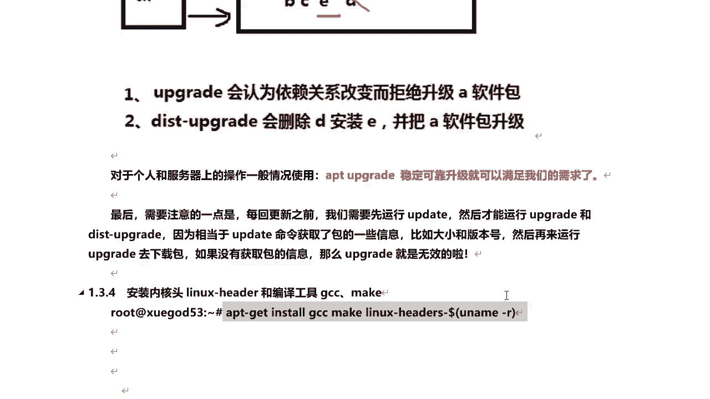

打开终端终端，我来找啊，直接这里的右键就可以了，桌面右键打开终端。

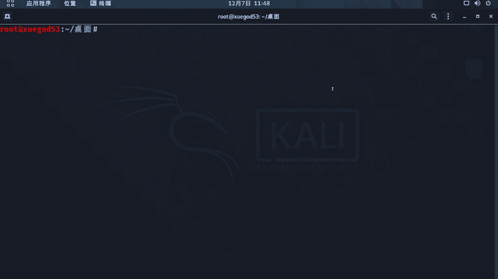

yes，嗯注意啊，那么这里linux header内额头的u name杠r。

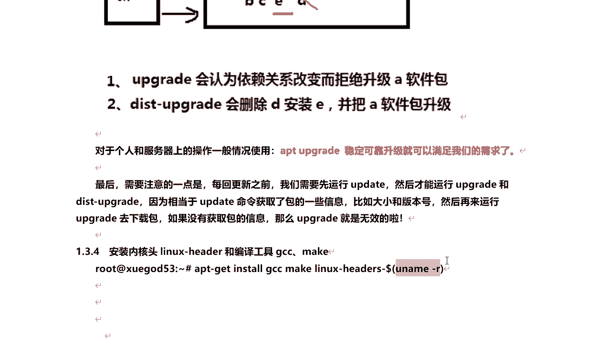

是当前开立的内核啊，使用的什么内核这个命令啊，来4。19，那么就是安装它吧。

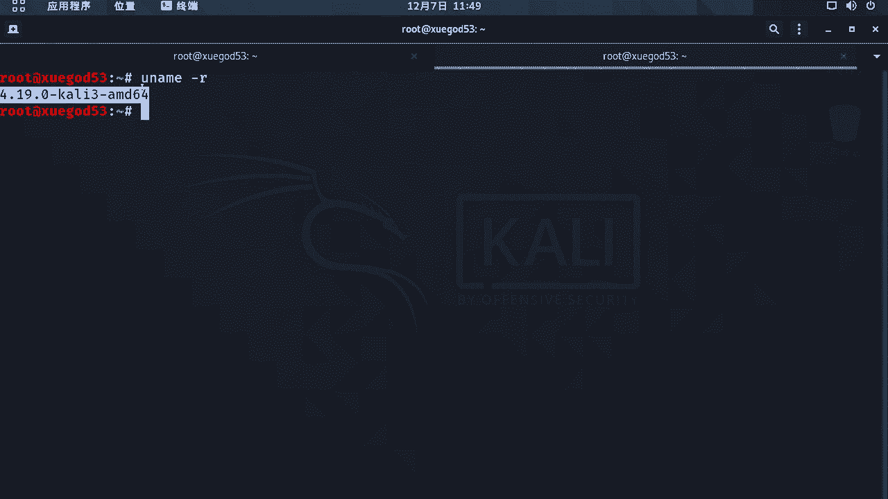

相关的啊相关的，继续安装，好的，安装完成之后重启。

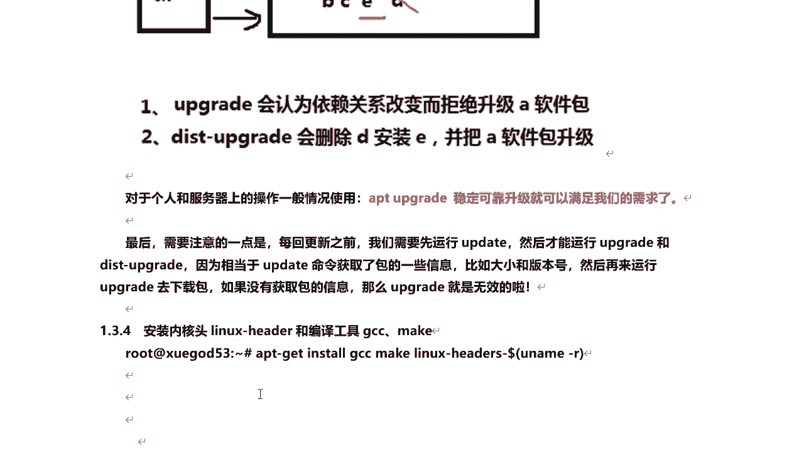