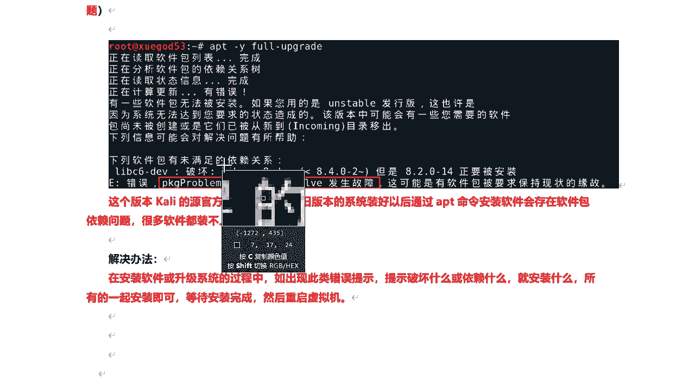
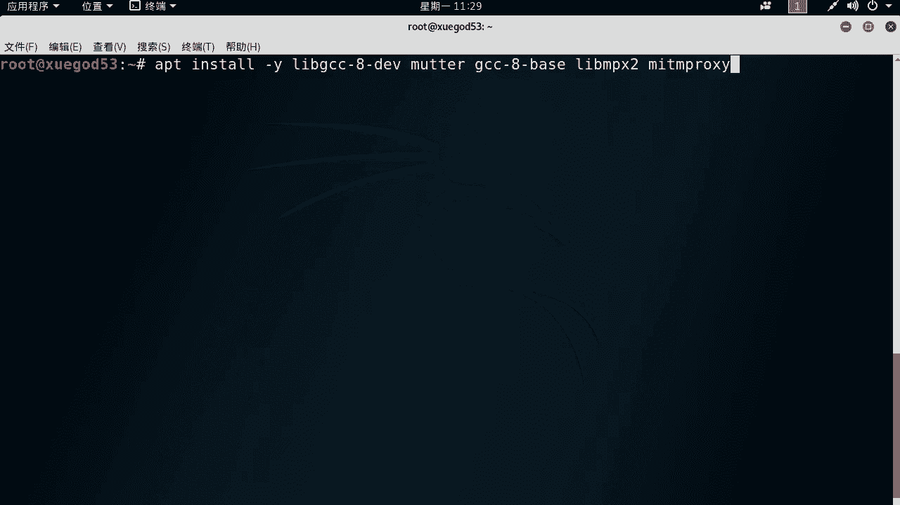
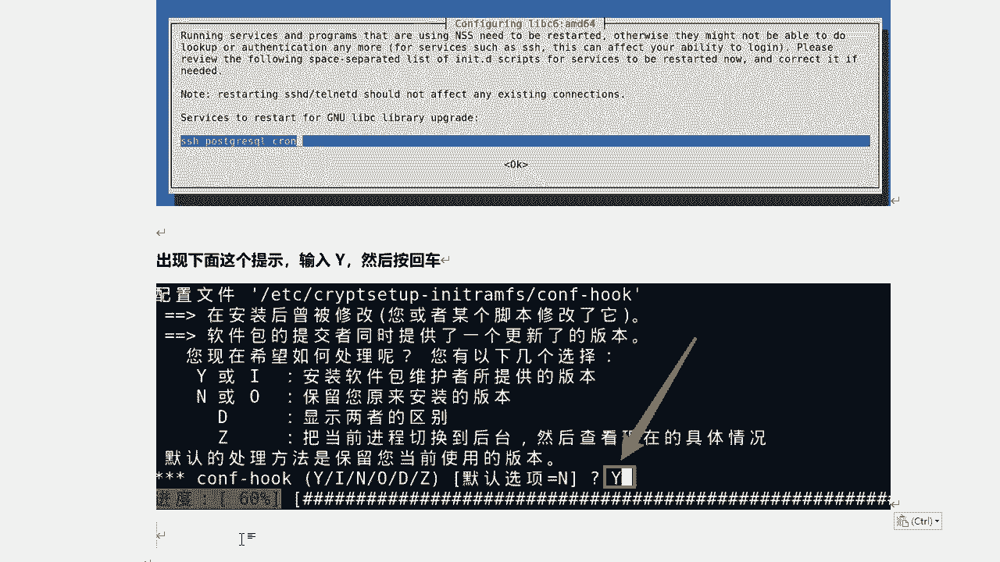
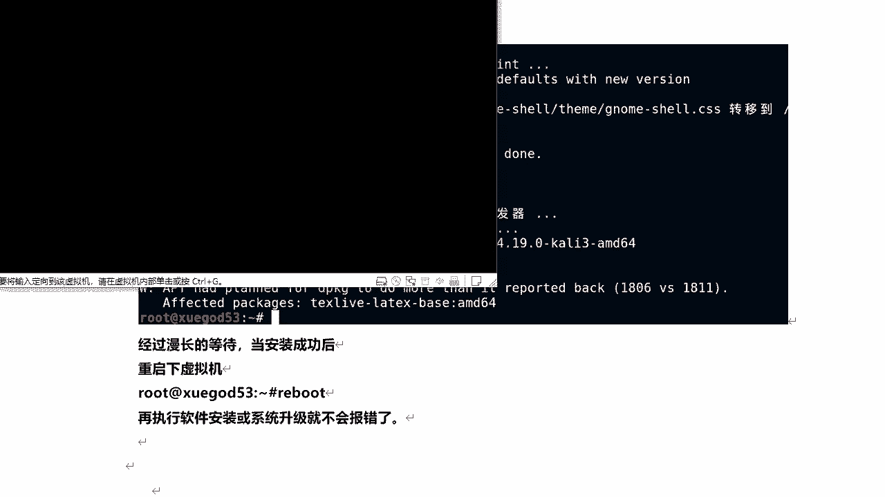
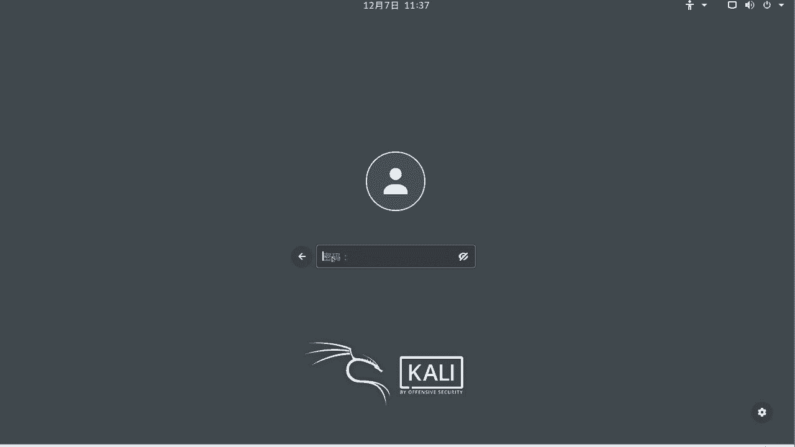
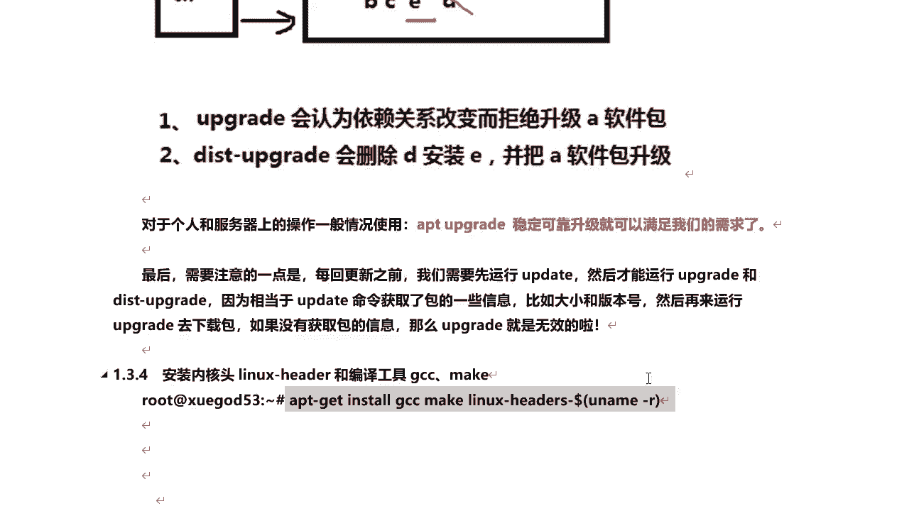
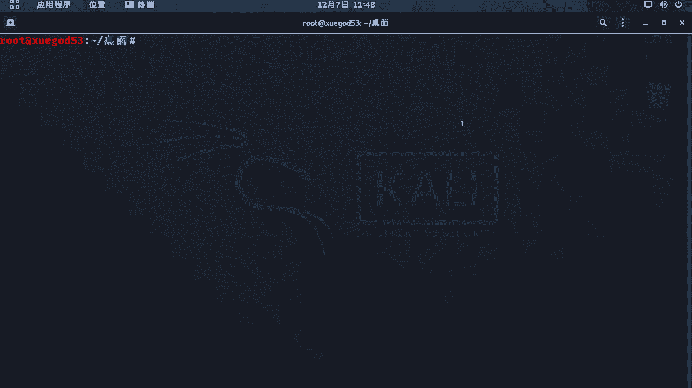
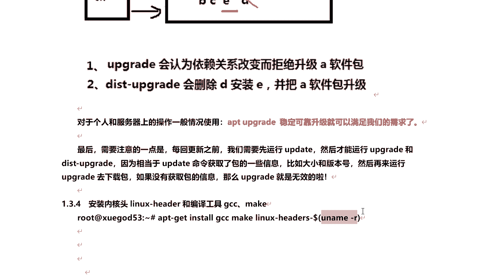

# P26：6.6-【Kali渗透系列】解决Kali软件包安装存在的依赖问题 🔧

在本节课中，我们将学习如何解决Kali Linux 2019.1a版本中软件包安装和系统升级时遇到的依赖问题。我们将通过一系列命令和配置调整，使旧版本系统能够正常安装软件。


---


## 问题概述与原因分析

上一节我们介绍了Kali Linux的基本安装。本节中我们来看看一个常见问题：在Kali 2019.1a版本中，使用`apt`命令安装软件或升级系统时，经常会遇到依赖关系错误，导致操作失败。


这个问题产生的原因是，Kali官方的软件源已不再支持旧版本系统。因此，系统安装后，通过`apt`安装软件会遇到软件包依赖问题，许多工具将无法成功安装。

## 核心解决方案



解决此问题的核心方法是：在安装或升级过程中，如果出现依赖或破坏性错误提示，就将所有提示需要安装的软件包名称复制下来，与原始安装命令一起执行。



以下是具体操作步骤：

1.  当执行命令（如 `apt -y full-upgrade`）出现错误时，终端会提示“破坏 xxx”或“依赖 xxx”。
2.  将这些提示中需要安装的软件包名称（例如 `xxx`）复制下来。
3.  在原始命令后添加一个空格，然后粘贴这些软件包名称，形成一个新的复合安装命令。
4.  执行这个新命令，直到不再出现错误提示，等待安装完成。

**示例命令格式：**
```bash
apt install [原始软件包名] [新提示的依赖包1] [新提示的依赖包2]
```

## 详细操作流程

### 步骤一：处理依赖错误并升级


首先，我们尝试升级系统，并按照上述方法解决遇到的依赖问题。

打开终端，执行以下命令开始升级：
```bash
apt -y full-upgrade
```
如果命令执行后提示依赖问题，请将提示中需要安装的软件包名称复制，附加到上述命令后重新执行。


**注意**：在整个安装过程中，请守在电脑前，因为可能会遇到需要手动确认的选项。




### 步骤二：处理安装过程中的交互提示



在升级过程中，可能会遇到类似“您希望如何处理配置文件？”的提示。通常，选择默认选项（即安装软件包维护者提供的版本）即可。




当出现此类提示时，直接按 **大写的 Y**，然后回车继续。

### 步骤三：重启系统

漫长的安装过程结束后，系统会提示升级成功。此时，我们需要重启系统以使所有更改生效。
```bash
reboot
```
重启后，再进行软件安装或系统升级，就不会再报依赖错误了。

## 升级后的桌面环境配置

升级完成后，桌面环境会更新为最新的GNOME版本，但一些常用组件可能被隐藏。我们需要进行一些配置来恢复它们。


以下是需要启用的GNOME扩展列表，用于恢复桌面功能：


1.  **应用程序菜单**：恢复顶部菜单栏的应用程序列表。
2.  **Dash to Dock**：恢复左侧的收藏栏（Dock）。
3.  **桌面图标**：允许在桌面显示图标。
4.  **User Themes**：允许使用自定义主题。


**配置方法**：
1.  打开终端，输入 `gnome-tweaks` 打开“优化”工具。
2.  切换到“扩展”选项卡。
3.  找到上述扩展名，并将其开关切换到“开启”状态。


### 恢复桌面右键菜单功能


默认情况下，升级后可能在桌面点击右键无法打开终端。我们需要安装一个扩展来恢复此功能。


在终端中执行以下命令进行安装：
```bash
apt install gnome-shell-extension-desktop-icons-ng
```
安装完成后，**再次重启系统**，即可在桌面使用右键菜单。

### 管理收藏栏

现在，左侧的收藏栏已经恢复。你可以将常用工具固定到此处：
*   **添加**：在应用程序列表中，找到工具，右键点击，选择“添加到收藏夹”。
*   **移除**：在收藏栏中，右键点击已固定的图标，选择“从收藏夹中移除”。

## 关于系统升级命令的补充说明

在解决依赖问题的过程中，我们用到了系统升级命令。这里详细解释几个相关命令的区别：

*   **`apt update`**：检查软件源中所有软件包的更新列表，并获取其版本信息。这是升级前的必要步骤。
*   **`apt upgrade`**：根据 `update` 获取的列表，升级当前已安装的软件包。如果遇到需要变更依赖关系（如安装新包或删除旧包）的情况，**它会跳过这些包**，以保持系统稳定性。
*   **`apt full-upgrade` / `apt dist-upgrade`**：同样根据 `update` 获取的列表升级软件包。但它会**智能处理依赖变更**，必要时安装新依赖或移除旧包。这个命令更彻底，但被认为风险稍高。

**核心区别公式化描述**：
> 当软件包A的依赖从 `[B, C, D]` 变为 `[B, C, E]` 时：
> *   `upgrade` 会**拒绝升级A**。
> *   `full-upgrade` 会**删除D，安装E，然后升级A**。

**重要提示**：
1.  升级前务必先执行 `apt update`。
2.  对于个人使用，`apt upgrade` 通常足够稳定可靠。
3.  最稳妥的方式是直接下载最新版Kali镜像安装，而非跨大版本升级。
4.  **在进行任何系统级更改前，务必为虚拟机创建快照**。

## 安装常用编译工具

在安装Kali时，如果选择了“最小化安装”，可能会缺少一些编译工具。为了保证后续某些工具的安装和使用，我们手动安装它们。

执行以下命令安装Linux内核头文件和编译工具：
```bash
apt install -y linux-headers-$(uname -r) gcc make
```
其中 `$(uname -r)` 会自动获取当前系统正在使用的内核版本，确保安装匹配的头文件。

安装完成后，建议再次重启系统。

---



## 课程总结





本节课中我们一起学习了如何解决Kali Linux 2019.1a版本的软件包依赖问题。我们通过组合安装命令解决了依赖错误，完成了系统升级，并配置了新的GNOME桌面环境，恢复了收藏栏、右键菜单等功能。最后，我们还了解了不同系统升级命令的区别，并安装了必要的编译工具。


关键要点回顾：
1.  解决依赖问题的核心是**将所有报错的依赖包与主包一起安装**。
2.  升级后需通过 **GNOME Tweaks工具** 启用必要扩展来配置桌面。
3.  区分 `apt upgrade`（稳定）和 `apt full-upgrade`（彻底）的使用场景。
4.  任何重大操作前，**创建虚拟机快照**是最佳实践。


现在，你的Kali系统已经解决了依赖问题，可以正常安装绝大多数安全工具了。