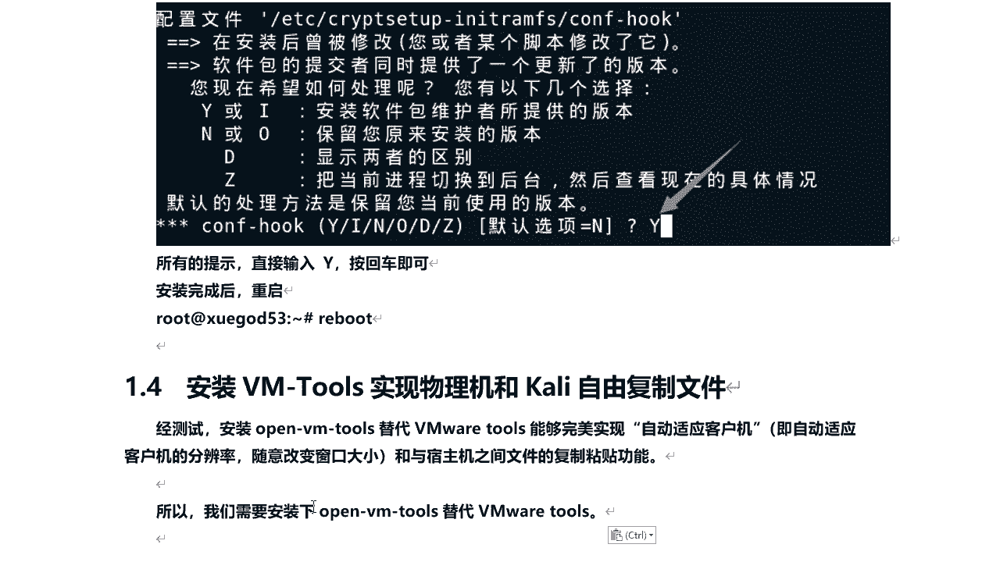
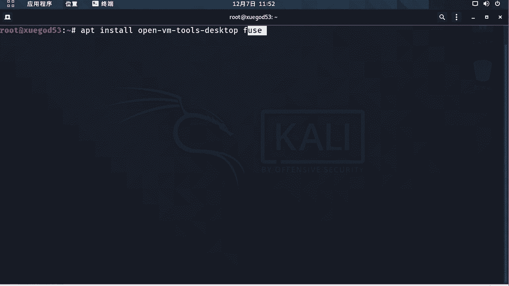
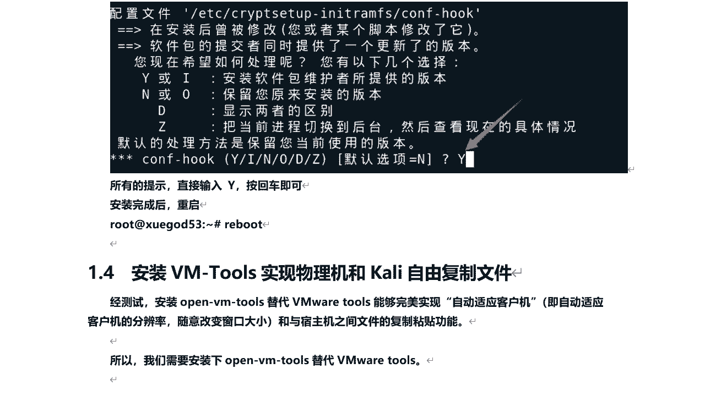
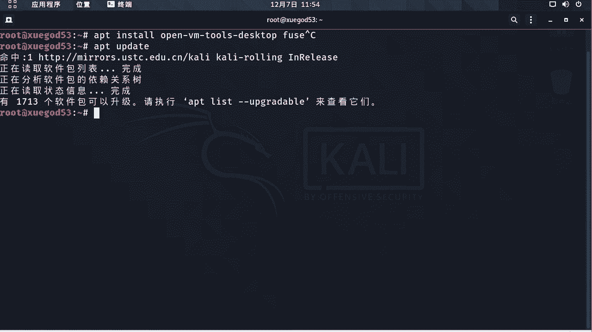
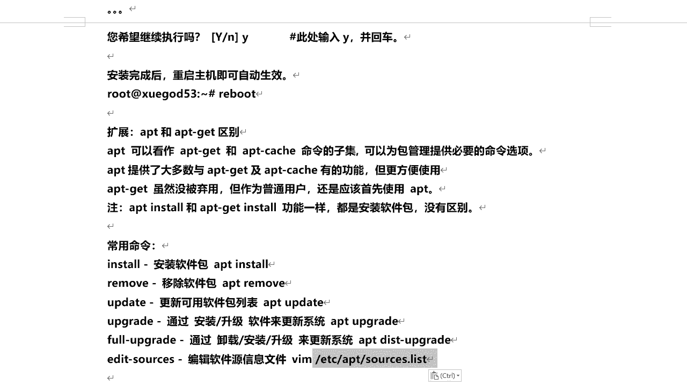
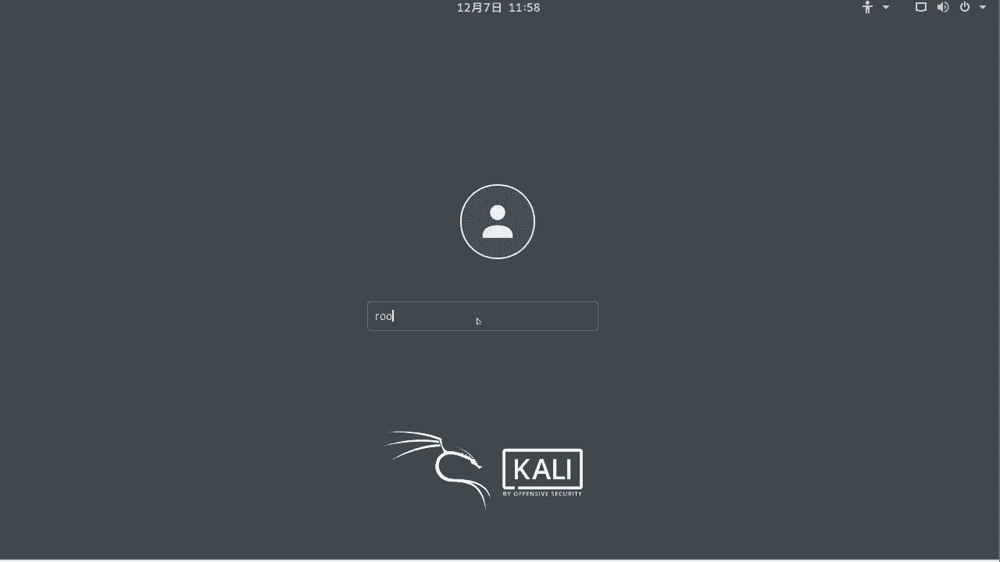
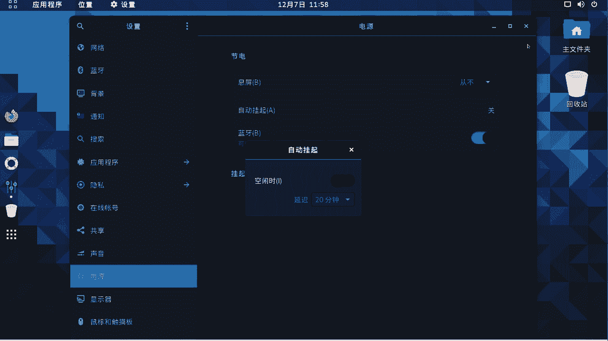
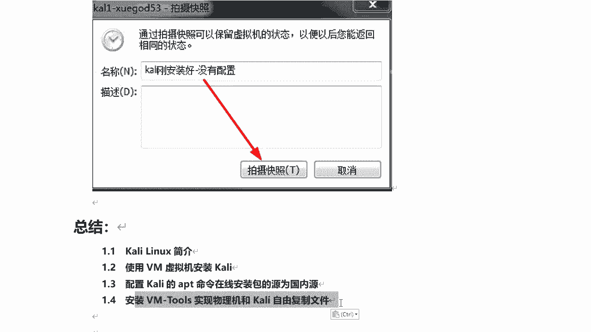

# P27：6.7-【Kali渗透系列】安装VM-Tools实现物理机和Kali自由复制文件 🛠️

在本节课中，我们将学习如何为Kali Linux虚拟机安装Open VM Tools，以实现物理机与虚拟机之间更稳定、更便捷的文件复制、粘贴、拖拽以及屏幕自适应功能。



上一节我们介绍了Kali Linux的基本配置，本节中我们来看看如何增强虚拟机与物理机之间的交互体验。



## 安装Open VM Tools 🚀



为了替代VMware自带的VMware Tools，我们将安装Open VM Tools。它能更完美地实现客户机屏幕分辨率自适应、窗口大小随意调整，以及在物理机和Kali之间进行文件复制、粘贴和拖拽操作，稳定性更佳。

以下是安装步骤：

1.  首先，在Kali Linux中打开终端。
2.  执行以下命令来更新软件包列表：
    ```bash
    sudo apt update
    ```
3.  接着，执行安装命令：
    ```bash
    sudo apt install open-vm-tools-desktop fuse
    ```

在安装过程中，系统会提示确认，输入 `y` 并按回车键继续。

## 命令解析与APT工具介绍 📖

上一节我们执行了安装命令，本节中我们来了解一下这些命令的含义以及Linux中的包管理工具。



`apt` 是一条用于Debian系Linux操作系统的命令，主要用于从互联网软件仓库中搜索、安装、升级和卸载软件。`.deb` 是此类系统的核心软件包格式。

*   `apt update`：此命令用于从配置的软件源同步包索引文件，相当于检查有哪些软件可以更新，但并不会实际安装更新。
*   `apt install`：此命令用于安装指定的软件包。它会从软件源下载`.deb`格式的包并自动完成安装。

我们安装的软件包包含两个主要部分：
*   `open-vm-tools-desktop`：实现屏幕分辨率自适应和基础集成功能。
*   `fuse` (Filesystem in Userspace)：用户空间文件系统，是实现物理机与Kali之间自由拖拽文件的关键组件。

关于 `apt` 与 `apt-get` 的区别：两者功能基本相同。`apt` 可以看作是 `apt-get` 和 `apt-cache` 命令的合集，提供了更简洁、用户友好的选项。对于普通用户，建议使用 `apt` 命令。

以下是常用的 `apt` 命令列表：
*   `apt install <package_name>`：安装软件包。
*   `apt remove <package_name>`：移除软件包。
*   `apt update`：更新可用软件包列表。
*   `apt upgrade`：通过安装/升级软件包来更新系统。
*   `apt full-upgrade`：通过卸载/安装/升级来更彻底地更新系统。
*   `apt edit-sources`：编辑软件源配置文件。



## 完成安装与系统重启 🔄


安装过程需要确认时，输入大写的 `Y` 并按回车键继续。等待所有软件包安装完成后，需要重启系统以使更改生效。




执行重启命令：
```bash
sudo reboot
```
系统重启后，使用您的用户名和密码重新登录。


## 其他实用设置与系统快照 📸

安装完成并重启后，我们还需要进行一些优化设置，并为当前稳定的系统状态创建一个备份（快照）。



首先，关闭系统自动锁屏功能：
1.  点击桌面右上角的系统菜单（电源/设置图标）。
2.  选择“设置”。
3.  进入“电源”选项。
4.  将“空白屏幕”或“自动锁屏”的时间设置为“从不”。

**创建系统快照**：快照相当于系统状态的备份。如果在后续操作中系统出现问题，可以快速恢复到创建快照时的状态。建议在关机状态下创建快照以节省磁盘空间。

1.  首先，关闭Kali Linux虚拟机。
2.  在VMware菜单中，选择“虚拟机” -> “快照” -> “拍摄快照...”。
3.  为快照命名，例如“Kali基础安装与配置完成”。
4.  点击“拍摄快照”即可完成。
5.  之后可以通过“虚拟机” -> “快照” -> “快照管理器”来查看或恢复到任意快照点。

## 总结 📝



本节课中我们一起学习了如何为Kali Linux虚拟机安装Open VM Tools，以实现与物理机之间流畅的文件交互和显示自适应。我们还解析了相关的Linux包管理命令，并完成了关闭自动锁屏、创建系统快照等实用设置。这些步骤为后续的渗透测试学习打下了一个稳定、便捷的基础环境。