# P28：6.8-【Kali渗透系列】Kali本地网络配置-配置sshd服务并使用xshell连接 - 一个小小小白帽 - BV1Sy4y1D7qv

哈喽大家好，我是讲师mk，那么欢迎大家来听老师的课程，今天老师要给大家讲的是搭建shadow socr是吧，那么在这里我们先讲一下kelly的基本配置，然后连接一下s i d服，那合适的话。

那么接下来我们使用使啊shadow socr，我们也可以看，好不好啊，这里我放了一个洋葱路由器，也就是tp的一个标识好，那么首先呢我们先讲一下基础的好，先讲一个基础的这个内容。

第一个我们来做一下这个事儿啊。

我们来看一下，先打开一下这个kelly啊，可能有同学说，老师我第一次安装操作系统的时候，我的kelly是什么，我是自动获取的一个ip地址，那既然你是自动获取的，那就会有问题好吧。

if configure是查看ip地址，拿到这里，这里你能看到了什么，1921681。53，这是m是我的，我的是什么，我的是啊静态的ip，所以我希望大家也都配个静态的ip。

因为后期我们要x 12经常连好吧，否则你可能连不上，请看好，请看好什么呢啊，这是查看，如果你想给他临时配个ip，就是e t h e t h0 是第一块网卡，e t h e就是两块网卡啊。

一般我们也不需要你加，你就1921681点什么5g啊，比如说1921681。5，三杠24回车就行了，这样的话就临时给他配了一个sd h对吧啊，这个杠24表示的子网掩码，子网掩码大家知道吗，255。

二五点就是这个东西好，这是临时配的啊，如果你要手动添加一个，也可以root add添加添加什么，我想添加default gateway，192168。1。1就是添加默认网关好，看完这些东西以后。

你还你现在应该已经能拼通网关了好吧，比如说我们新1921681。1，没有任何问题对吧，好没问题，以后呢，但是我可能拼不通百度啊，为什么，因为dns没配，它的dns是这样的。

v i m e t c下resolve清楚了吧，对我们快速的啊，诶resolve。configure n两项table可以补齐，我给大家讲一下啊，就是因为mk我已经搞了好多年。

就是linux架构式这一块了，所以这些基本命令对我来说烂熟于心，有一些同学可能没有一些linux基础，那怎么办呢，在学前期的时候，比如说我随口说了一句，我说按两下table可以补齐好吧。

把它开头的全都列出来，那这时候怎么办，告诉我好，那么vm我们快速的打开，那你在这里可以写上name server啊，dns配置linux就是这样，name server后面八个八search。

学尬的五三点c就是搜索本地域，一般情况下用不到，好不好，清楚了吧，回车回原车以后呢，拿到这个地方。

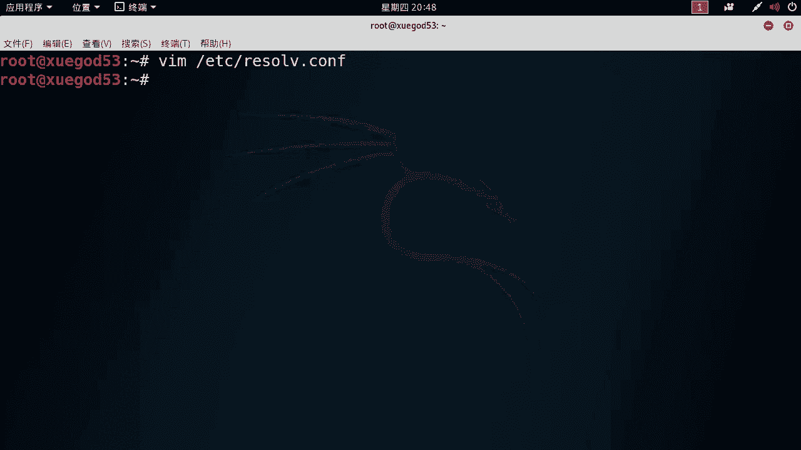

我给你整理到这上面，清楚了吧，如果你linux基础水平不太好，那怎么办呢，我边说一个，你就赶紧记一个，这是最快捷的方法，好有同学老师我linux好不好，然后大家有机会的话。

你跟着我把linux技术前面学一学也可以啊，这都没有问题好最重要的是来了，我要永久搞一个ip好吧，永久搞怎么搞。

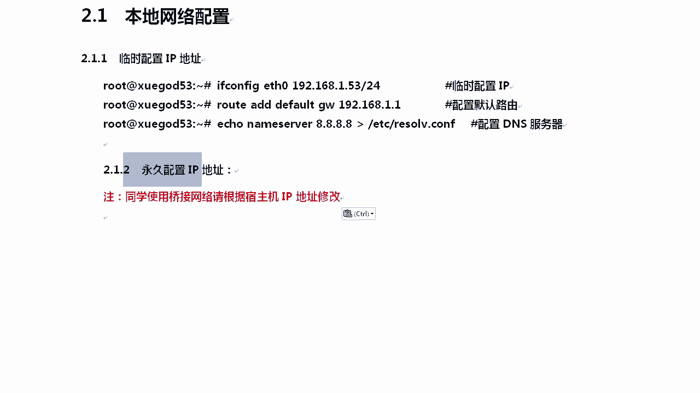

永久搞的话是这样的，v i e t c network interface好不好，他是这样的，就是如果你搞过森特s的同学了是吧，我跟你讲，因为哥们儿不是一个操作系统，所以它有时候跟sl s还真不一样。

网卡路径就不一样，好我们那个叫etc下cs啊，cs configure networks script啊，他的路径在这里，interface也好记嗯，我这里已经添加好了，好不好，原来是吧。

你们这个地方不是我这样的，你把原来那个改一下，最上面这一段不用动，auto l o也不用动，这是回环回环地址好吧，interface interface l o这个是默认的，你也不用动。

你需要动的是后面那几个，后面这个地方原来它是长什么样子呢。

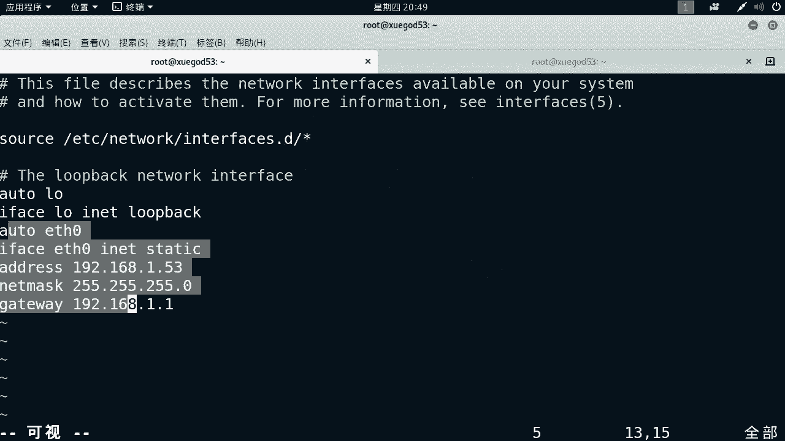

a m可以给大家写点好不好，对我们来写一下啊，原来这个地方，当然这个地方请根据你自己的方式去改我，我用的是1。53，我跟大家讲，你最好跟我用一样的，知道为什么吗，因为后面你就记不清ip好不好。

因为咱们搭深做渗透，这一块难免要用多个机器好，最起码是吧啊，我们需要用这几个机器啊，我我来给大家把kelly是一个xp是一个，然后win 10或者win 7是一个，还有三tos是一个好吧，还有一个什么。

还有个经常说的叫法鸡用，也就是说我们至少得五台机器好不好，所以你的ip跟我一样，这样是个好，否则我到时到时候我突然间来了个192，1681。65，你都不知道是哪台机器好吧，到那时候第七章的时候。

我会给你们起一个8g啊，你要跟我一样，你的ip要跟我们启程一样的啊，除非即便咱俩网段不一样，比如说老师我们家就是三网段的，那没问题，你叫3。53好吧，这样我一说哦，3。53就是开了这台机器好吧。

xp那个时候我给你提供系统好吧，咱们的ip要带尾数要一样，这样对，尤其对你们初学来说，学习还是很轻松的，原来原配置文件里写的是interface eh 0好不好，是dh c p，这叫自动获取。

我们把dh cp改成static，然后写上address一点五三，network must好，net mask字，网页码gateway，写上这些，写完这些东西以后，每一行我再给你注释上好吧。

所以即便你学习好，或者你的底子比较差，那你也不用担心，因为每一行都有注释好不好，ok拿到这个以后呢，我们来自on ma是吧，ip配好了，bs配好了，然后呢我们开始好不好。

face team restart network，这个叫network啊。

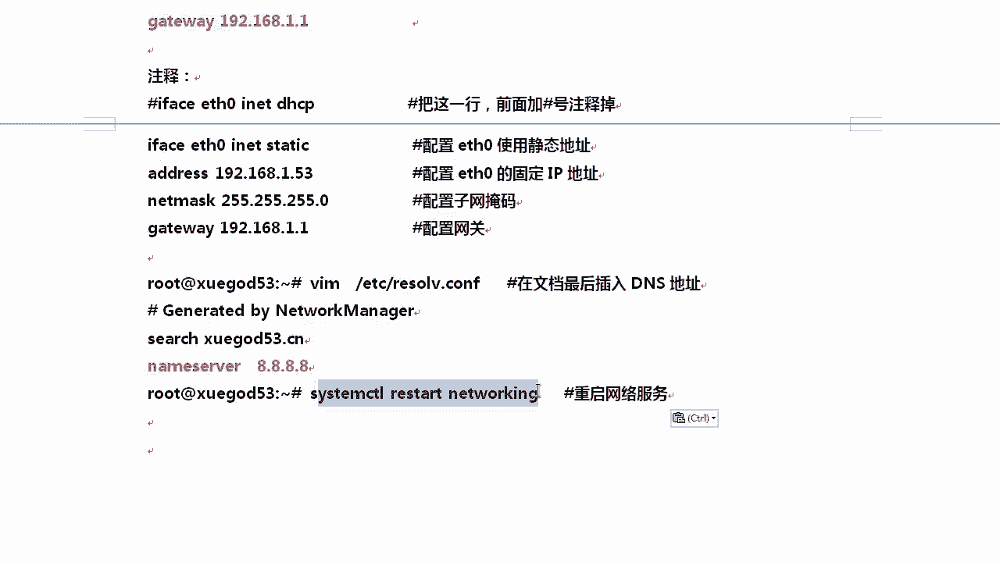

当然有两种，在kelly这下面启动服务有两种方式，一种叫etc下的network network，好不好，清楚啊，networking你可以后面跟个lt就可以吗，完全可以好吧，除了这种方式。

还有一种叫system restart net working on table一样可以补齐，补的时候还会补一个service，有它也行，补到这直接回车也行，这两个都是重启网络服务好不好。

对这两个两种方式都可以啊，新型的技术用这个好，老鸟一般用这个这个有个好处，就是你可以按table补齐好，其实有时候我会用这个啊，这个当然这个也可以补齐啊，当然这个seteam这个补齐总没有。

没有什么没有这个快it啊，真的啊，就这样吧。

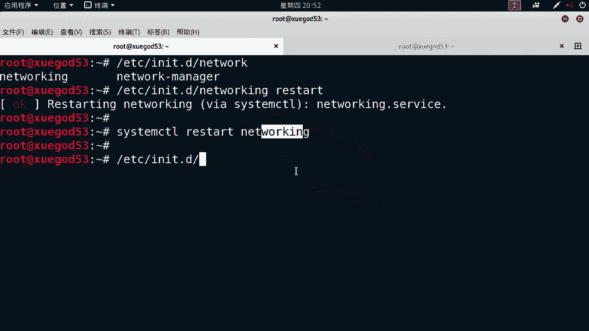

你看这下面有好多服务，有时候你真记不住他的那个服务的名字，比如说s h原来以前我sl s上是s s h d，这个叫这个好，拿到这个以后，我们的ip地址就算是固定下来了，好不好。

配置一下x shell里的好，那么快速的往下去做啊，来快速的，我们想要允许如的用户登录为好不好，那我们快速的去修改一下啊，v i e t c s s s s h d好。

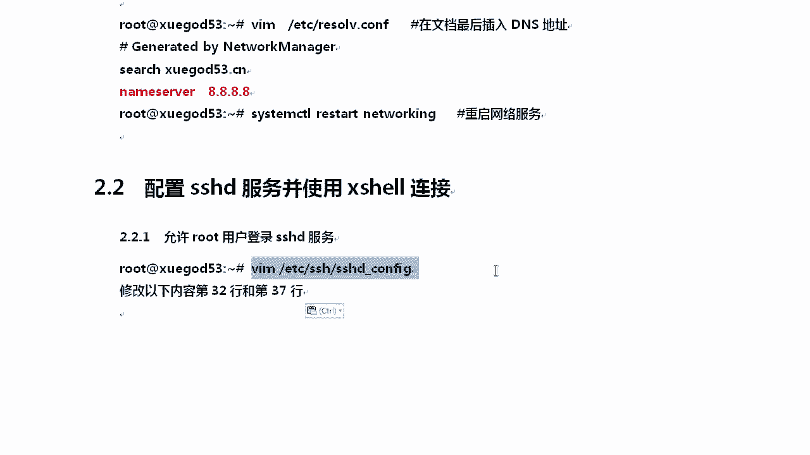

那么打开这个这是什么s h下的s h d，这是配置文件好吧，那配置文件这个地方我想显示出行号怎么办呢，可以这样set number，这样的话我会显示出来行号，我改的哪一行，然后呢你你就改哪一行。

这样的话你绝对不会做错，是这个道理吧，比如说mk我需要改的是第32行，理想上是吧，因为默认kelly是不允许远程连接的，好不好啊，那你需要把这个地方改成permit，root log in。

允许root登录吗，允许permit是ok是允许吗，root账号login是登录嘛，然后这个public是吧，public key公钥认证也给他开启，这我有时候我可以使用密钥的方式去登录。

现在你们都是使用账号密码的方式吗，所以我们也可以做一下这个，拿完这个以后启动服务好不好，restart启动一下啊，这样的话就可以了好不好，然后他的意思是告诉你，你也可以setm restart，这个好。

两种方式都行好吧，他建议你怎么样用这种方式去起好吧，因为在新型的这种操作系统上。

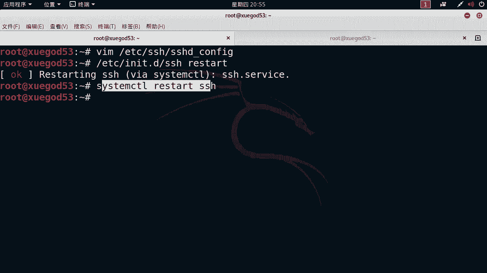

我们都是用的是sist好不好，这一点还是保持一致的，唉我想开机启动怎么办，有同学说老师我配完这个东西，一重启修改的每一个内容好吧，修改了32行和37行，我这样去改，你照着我的文档去做，你要还敢给我做错。

就说明你不够细心，懂我意思吧好吧，老师都给你写成这个文档，这个水平就我跟大家讲啊，前十天你遇到问题了好吧，或者你做的时候没做出来，就一个原因好吧，其实你谁都不用问，就是因为你粗心了好不好。

你照着这个是吧，一步步来绝对不会错好。

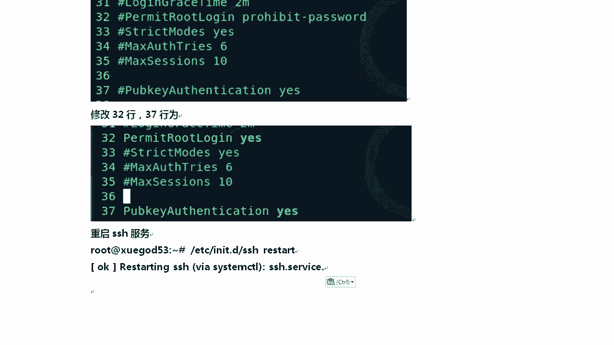

然后呢你想开机启动，因为我正常我这样reboot一重启就没戏了，想要candy启动，有update什么update r c一点d好吧，后面s写上服务服务后面跟上enable。

这样的话就允许我这个东西开机启动了，清楚了吧，哎对女同学说，老师我这样是不是可以sixteen enn啊，是吧，是不是这样ssh啊，不是这样可以吗。

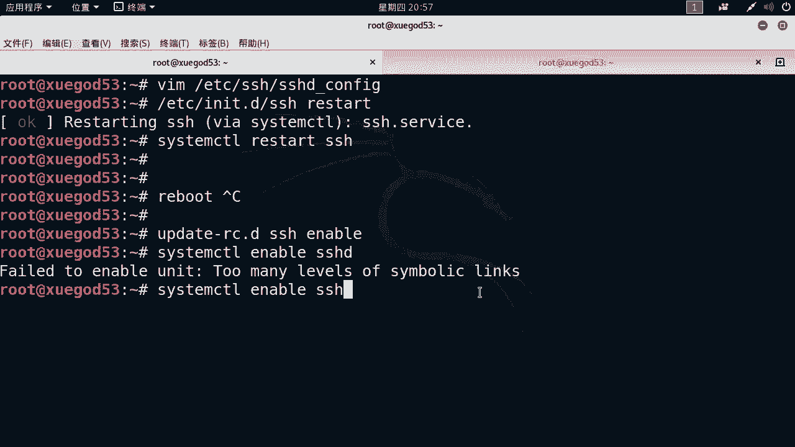

这个地方，也可以好不好啊，但是我更建议大家用这个清楚了吧，你看这个地方人家要求你什么执行一下，这个他这个还不一样啊，跟我们那个宋的s那块不一样，所以你就妥妥的是吧，他会给你一些提示啊，你就妥妥的用这个。

好这个大家知道了吧，凡是有时候他会给你一个提示，表示什么表示的不是标准的写法，你看我用这种写法就没有任何弹出的消息，好不好，好，我们这个地方ok了，我们来快速的插销连一些一下好不好，对x 12点。

那么接下来我们来看x shell安装一下好，那么x shell这个我已经发给大家了是吧，那么在这里有一个x manager，其实linux下的连接连接工具有很多，什么s s h p o t是吧。

c r t32 位，64位好多，为什么用x 12，因为xxl相对来说还是安全的好不好，到现在为止没有一个安全工具怎么样，对没有一个安全工具说我们就是安全的好不好，puty我替你搜一下pty后门。

因为我们本来搞的就是渗透嘛，你连接工具都是有后门的，那还是那还说什么安全不安全，中文版p t后门事件的分析，2012年好吧，除了p o t，其他的c r t有没有crt也有，好不好，清楚了吧。

这个版本的c r t好fpx是f对不对，有后门吗等等，除了这个呢，原来我们一直以为x manager是那个后门的好吧，后来到x manager 5，他娘的也爆出来一个后门，看一下好吧，x many。

五啊，后门时间它是有的啊，x manager好不好，叉烧的多个产品被直接植入了后门，而且是2017年的时候，x 12二六就没了是吧，也许只是没有爆出来好吧，x mu啊，大家也是用了好多年都觉得没有问题。

后来到x 12二五啊，报了一个后门对吧，我给你发的这个算是没有带后门的好吧，然后那你呢可以怎么样呢，可以去用好不好，你也可以选择x 16，为什么我选择x manager或者x 12呢。

就x manager里面安装完了怎么用呢，双击就行好，双击完了，下一步下一步安装，安装的过程中，需要你去输入序列号的时候，你就把它输入一下序列号，因为我这个东西至少是从官方下的好吧。

然后输入的序列序列号相对来说安全一点好吧，而这种crt式的呢是破解版的，你能理解我的意思吗，你知道这个破解这一步骤有没有问题吗，你不知道对吧，对不对，好不好，然后呢p t呢有个问题。

p o t就是太小了，太简单了，就是搞一些复杂的一些东西，比如说我想把图，把linux的highly的图形界面调到windows上，调不出来好不好，对它的功能有点太难好吧，你你连个路由器交换机。

用它还是cp一样，所以我用这个好吧，你从官方下载一下，然后找个找个那个码往上一放，好歹还算是可以一起好吧，双击一下就行，双击完了以后，我们会有一个这样的一个界面。

x manager在你的桌面上或者菜单里有好吧，这里面有很多的工具，比如说我们最常用的就是差事好，还可以啊，x f tp去上传，我们用到哪个，我们讲哪个好不好。

x start能能把kelly的什么图形界面调到windows上。

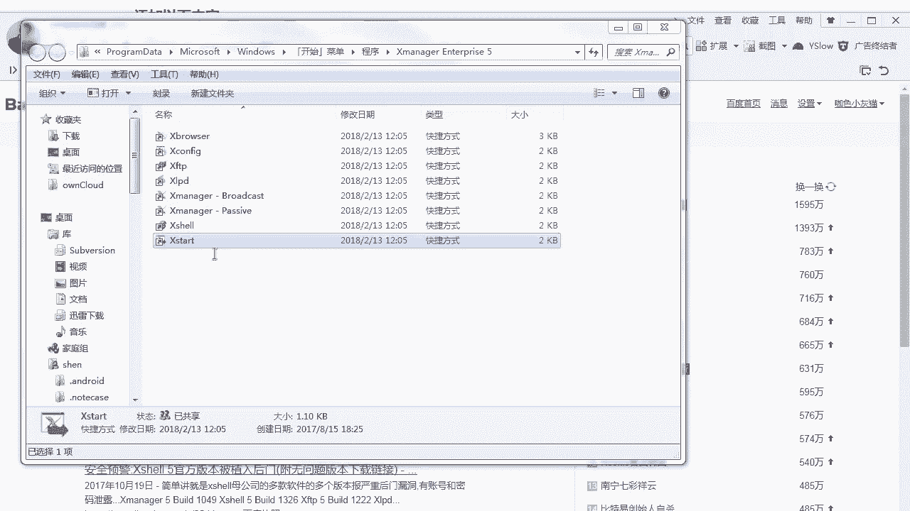

那么在这里我们更多的用的是x shr，我们来快速的连一下，好不想要连接的时候点这个新建，新建的话会画写上，比如说我的ip是1921681。63，1。53，我就写上我写个v2 版啊，因为我已经连过了。

然后呢拿到它主机写上去，主机名称你可以随便写i p b写对22端口，然后用户的身份我们写什么呢，写root密码，123456好不好，123456，拿到这个以后，你们一般还做其他的东西吗。

我一般会做一下这个外观字体，调个大小，这个我就不用，这个就不给大家截图了啊，你调一下自己的大小好不好，从外观上调一下大小，我一般会选择16号字体，这样稍微大一点，这就可以点确定了。

另外呢文件的传输这个地方，好不好呃，文件传输这个地方我建议大家选一下，选一下下载和加载路径，这样方便我们上传文件和下载文件，比如说你选一个路径出来好不好，我一般下载路径选择的是悄悄挪过来。

万一让你看到不该看的尴尬是吧，好点一下确定我一般喜欢用的是e盘下的soft，这边也选e盘下的salt，好不好，然后你点确定就行o好，我们点一下吧，点完以后，我这个因为我这个太多了啊，好不好，对太多了。

然后呢在这里，另外我给大家提供的那个华语时代公网ip的，还是比较好使的，清楚了吧，ok稍等啊啊，我的密码是123456，我特意起了个1234562个密码，这是一个华为的运，welcome to华为。

我想看什么，看我这个东西啊，经过一天晚上，会不会被人恶意的去注入一些东西，知道吧，有没有被注入呢，你看你tmp上的一些东西就行了，所以你有个云主机还是挺好的，好，还回来我们这边啊。

你如果你关了这个窗口以后，你点这好吧，点完这个以后呢，可以去里面去选，我的机器是1。53，选它点连接。

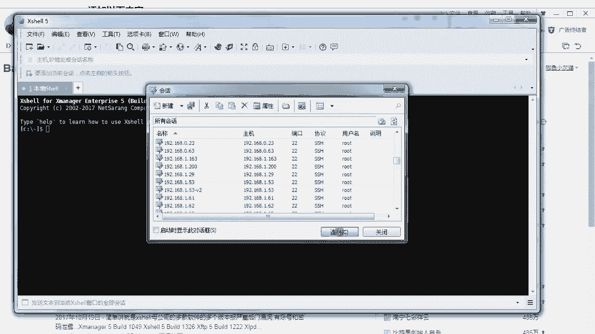

这样也可以连上去，连上去我们就可以愉快的进行操作。

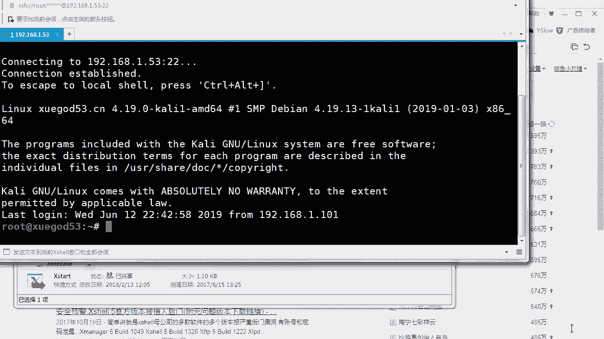

这叫配ip和xxl的连接好不好，后期你想上传一些文件上去，那怎么办呢，yin sl r z s z应该木啊，不能用样啊，默认他就带着rz这个命令好吧，rz一回车它能弹出来一个窗口。

好比如说我想搞一个上传上传一下啊，上传一个，那你就可以选中它，点上传很方便，就传到了linux上，你想把它下载下来，用s z i c好不好啊，你应该用app好不好。

应该用这个清楚a p p install l r z s z啊。

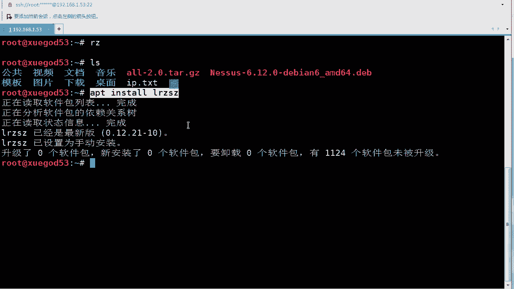

说习惯样吗，好那说了这么多，我们来快速的回顾一下，整理一下啊，你想x shell连接上它怎么办呢。

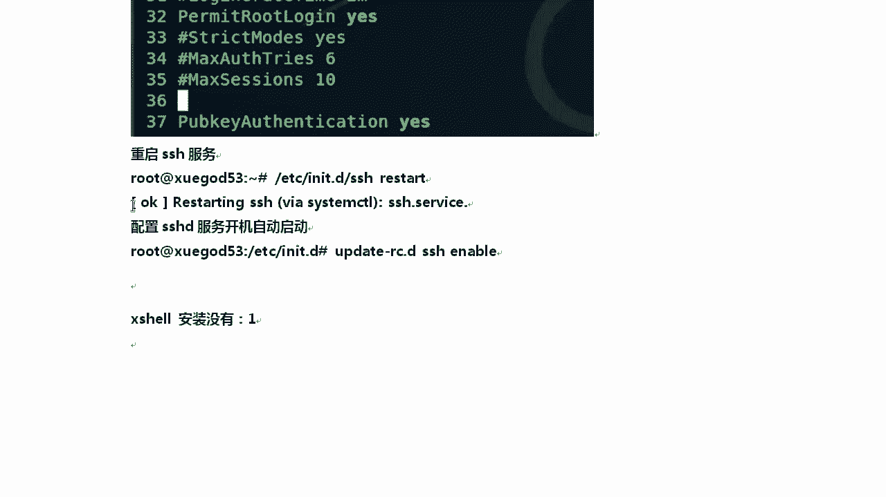

if快速看一下ip，然后回到我们这个地方。

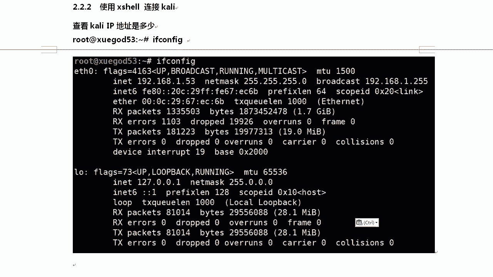

书上我们对应的ip地址清楚了吧。

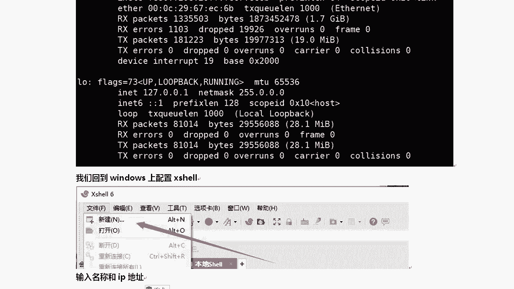

如果有同学什么，就是你你的那个兼容性不好的话，你还可以调一下这个，这里中单有个vt模式，你可以设置成普通模式，这个如果你的就是输入键盘，输入的时候有问题好不好，你可以这样去做这事，明白老师的意思了吧。

但一般情况下没有，除非你的那个键盘稍微有点特殊，接下来输入你的root账号，记住让他记住用户名，这样下一次就不用老输密码，也记住密码行不行，对第一次弹出的时候会让你选择什么好，会让你选择接收接收这个哈。

希值你就点接收并保存就行，接收此主机的密钥吗，点接收好点了，确定以后我们就可以连接到我们的机器，后期因为有时候在开了一项执行这个命令，还有点不太舒服好不好。

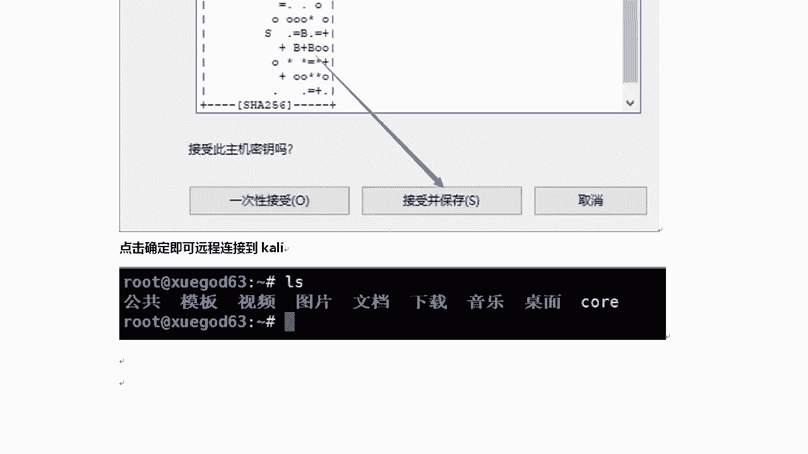