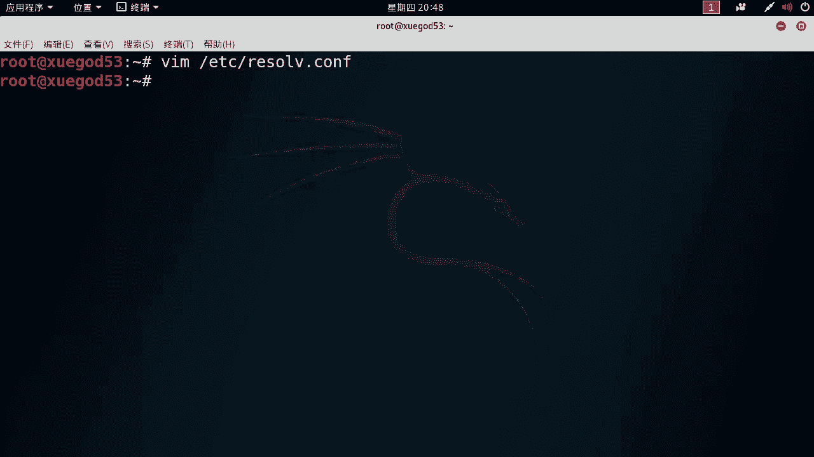
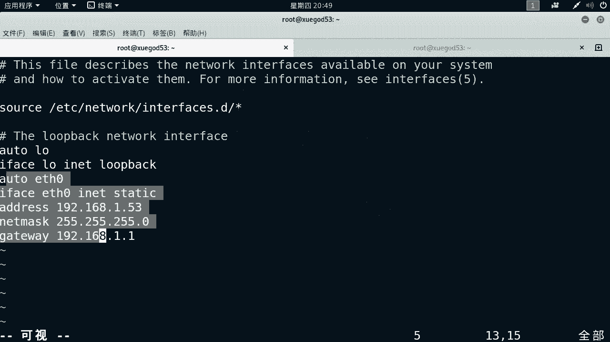
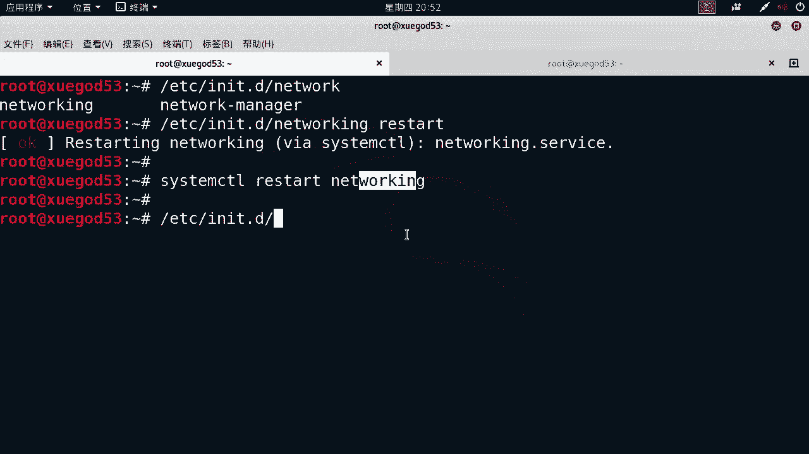
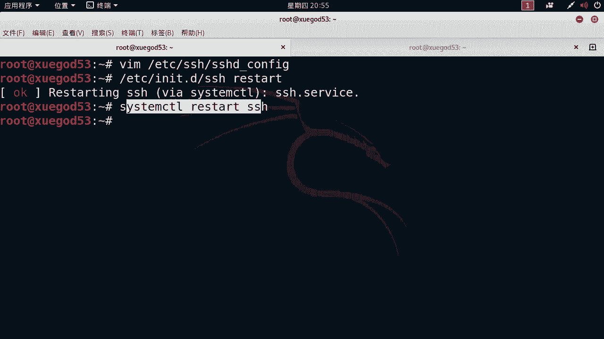
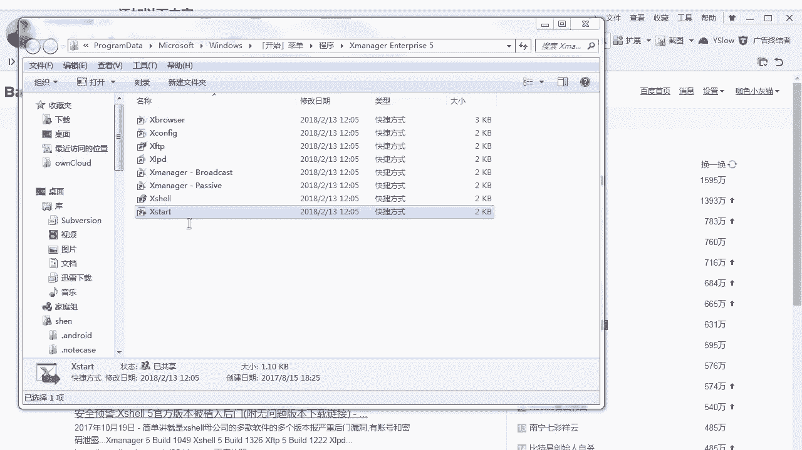
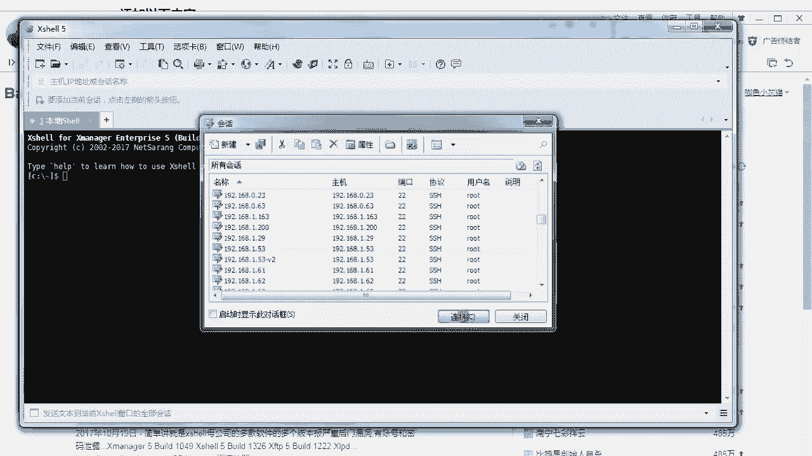
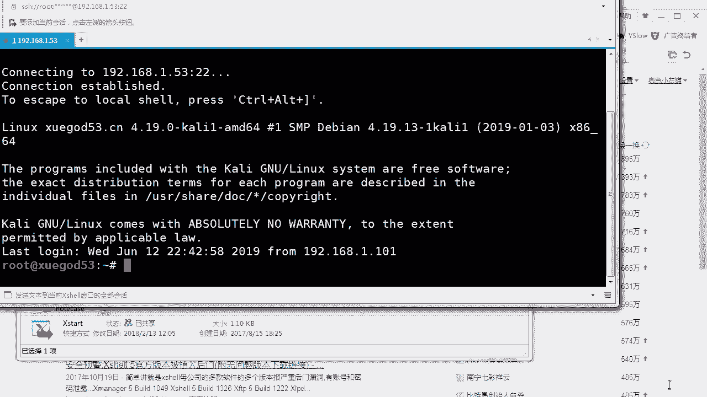
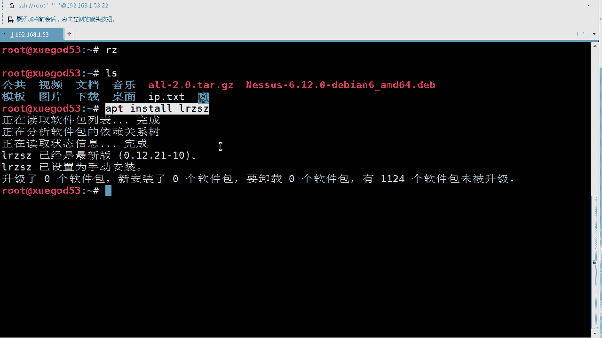
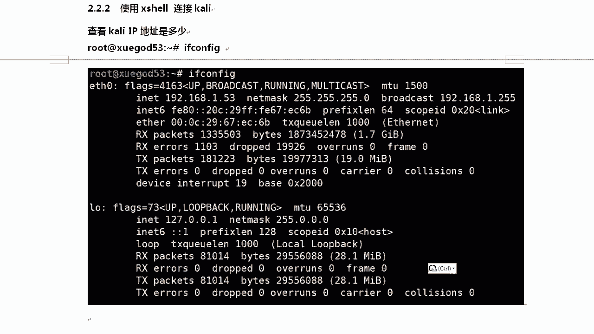

# Kali渗透系列 P28：Kali本地网络配置与SSHD服务连接 🛠️


在本节课中，我们将学习如何为Kali Linux配置静态IP地址，并设置SSHD服务以允许通过Xshell等工具进行远程连接。这是搭建稳定渗透测试环境的基础步骤。

---

## 一、 查看与临时配置IP地址



上一节我们介绍了课程目标，本节中我们来看看如何查看和临时修改Kali的IP地址。


使用 `ifconfig` 命令可以查看当前网络接口的IP地址信息。如果你的Kali是自动获取IP（DHCP），其地址可能会变化，这不利于远程连接。



以下是临时配置IP地址的命令：
```bash
ifconfig eth0 192.168.1.53 netmask 255.255.255.0
```
此命令将第一块网卡 `eth0` 的IP临时设置为 `192.168.1.53`，子网掩码为 `255.255.255.0`（`/24`）。

配置后，可以测试网络连通性：
```bash
ping 192.168.1.1
```
如果能`ping`通网关，说明网络层配置基本正确。

---


## 二、 配置DNS解析

网络连通后，我们可能还无法解析域名（例如`ping`不通百度），这是因为DNS服务器未配置。



以下是配置DNS的步骤：
1.  编辑DNS配置文件：
    ```bash
    vim /etc/resolv.conf
    ```
2.  在文件中添加以下内容：
    ```
    nameserver 8.8.8.8
    search localdomain
    ```
    其中，`nameserver` 指定了DNS服务器地址。


---

## 三、 永久配置静态IP地址



临时配置的IP在重启后会失效。为了长期稳定使用，我们需要永久配置静态IP。


以下是永久配置静态IP的步骤：
1.  编辑网络接口配置文件：
    ```bash
    vim /etc/network/interfaces
    ```
2.  找到对应网卡（如 `eth0`）的配置部分，将其从 `dhcp` 修改为 `static`，并添加详细的网络参数。示例如下：
    ```
    auto eth0
    iface eth0 inet static
        address 192.168.1.53   # IP地址
        netmask 255.255.255.0  # 子网掩码
        gateway 192.168.1.1    # 默认网关
    ```
3.  保存文件后，重启网络服务使配置生效：
    ```bash
    /etc/init.d/networking restart
    ```
    或者使用Systemd方式：
    ```bash
    systemctl restart networking
    ```


---

## 四、 配置SSHD服务允许Root登录

配置好网络后，我们需要开启SSH服务，以便进行远程管理。默认情况下，Kali可能禁止root用户远程登录。

以下是配置SSHD服务的步骤：
1.  编辑SSH服务配置文件：
    ```bash
    vim /etc/ssh/sshd_config
    ```
2.  在文件中找到并修改以下两行参数：
    ```
    PermitRootLogin yes          # 允许root登录
    PubkeyAuthentication yes    # 启用公钥认证
    ```
3.  保存修改后，重启SSH服务：
    ```bash
    systemctl restart ssh
    ```
4.  为了确保开机自动启动SSH服务，可以执行：
    ```bash
    update-rc.d ssh enable
    ```

---



## 五、 使用Xshell连接Kali

服务配置完成后，我们就可以在Windows上使用Xshell客户端进行连接了。

以下是使用Xshell连接的步骤：
1.  打开Xshell，点击“新建”会话。
2.  在连接设置中，填入Kali的IP地址（如 `192.168.1.53`）和SSH端口（默认为 `22`）。
3.  在用户身份验证中，选择“Password”方式，用户名填写 `root`，并输入Kali系统中root用户的密码。
4.  建议在“属性”中调整终端字体大小（如16号），并在“文件传输”设置中指定默认的本地下载/上传路径，方便后续文件管理。
5.  点击“连接”，首次连接时会提示接受主机密钥，点击“接受并保存”即可。
6.  连接成功后，即可在Xshell的终端窗口中操作Kali Linux。





如果需要通过Xshell上传文件到Kali，可以在Kali终端使用 `rz` 命令；下载文件则使用 `sz <文件名>` 命令。




---




## 总结


本节课中我们一起学习了Kali Linux网络与远程连接的核心配置。
我们首先学会了查看和配置IP地址（包括临时与永久配置），然后设置了DNS服务器以确保域名解析。
接着，我们修改了SSHD服务的配置，允许root用户进行远程登录。
最后，我们使用Xshell客户端成功连接到配置好的Kali系统，并简介了文件传输的方法。
这些步骤为后续搭建稳定的渗透测试环境奠定了坚实基础。