# P29：6.9-【Kali渗透系列】云服务器使用方法 - 一个小小小白帽 - BV1Sy4y1D7qv

好我们来快速的买一台啊，v p s服务器，为什么要一直说这个呢，因为后期你会发现，安全或者渗透相关的一些工具，而且这个东西我建议大家自己用自己的好吧，共享的话和那哥们儿是吧，犯了点错，对不对。

你说你找谁说了一句，对不对，你也不知道是什么情况好，所以我建议大家自己用自己的啊，因为他那个名字拼起来就是什么半的万公host，就是拼音像半碗工一样，ok隶属于美国知名体系啊。

就i t7 点net下面好吧，具有超低的延迟好吧，一直受中国人的好评，就是其实很多人买的第一台就是他啊，当然有同学说我我喜欢买阿里的，买个香港的好，我买腾讯香港的可以吗，可以啊，这个完全没有问题啊。

为什么不让大家买国内的呢，因为国内的你毕竟是在国内的是吧，那个监管起来是吧，还是比较轻松一些的是吧，那八个工毕竟是在国外是吧，有一些政策可能不受影响，而且那个条件也会更好一些，好不好。

所以我建议大家买买过国外的，因为国外的话最简单的，国外人家带宽是一个g的，你从国内买了一个g的带宽，你试试，老贵了好不好，就速度不受限吗，限的是流量给你手机啊，没有人限你4g手机的流量是吧啊。

速度对国外一般都是限的，是流量不限，贷款一个亿的贷款买国内太贵了好吧，最后说一下啊，接下来这些内容呢只用于教学出了问题好吧，跟讲师无关行吧好，我们知道了这个以后呢，我们来快速的去买一个，买的时候。

他有很多地址可能已经被封了，那你可以打开这个地址，尝试自己去买一个行吧，对你可以打开这个地址是吧，打开这个链接去买一个，然后买的时候呢呃也没那么难打开就行，这是它的一个官方网址，好不好，对。

在这里有个register是注册啊，你肯定得先注册一下好吧，所以我跟大家讲。

我说你英语不好呢，也别慌，我给你写到这register登记好吧，我读了你就自己在心里也默默读一下好吧，因为我遇到好多同学啊，我同学说老师我们应该点那个，他读的那个好不好，大家应该能理解。

你自己在心里你也听着我的课呢，你自己读出来一个，我读的是register。

你读的是什么，啊你要能说出来好吧，因为你是mk，我教出来的，对你要能说一口标准的流利的英语哈。

然后呢注册的时候该写账号，写账号，该写名字，写名字好不好啊，force name mk拉内容深，这个这都没有，只是显示的昵称而已，重要的是email，email写对好吧，然后写上你的账号和密码。

第一次密码，第二次configuri密码，这是确认后期这些音单词大家是要经常看的啊，好不好，然后呢在这里address这个地方嗯，我写的是北京南京海淀，这个名字可以都随便写啊，佛罗里达随便选了一个省啊。

一个州，然后z什么zip code是邮政编码，我写123456country，选择的是u s美国电话号码，1~9随便写清楚了吧，啊也就是说这个地方不用写那么真实是吧，在国内你想买个云主机。

首先你得先实名认证一下吧，是不是这个道理，实名认证那一下你就有点心惊胆战是吧，对就怕自己干了坏事被抓了是吧，国外这个地方不行好吧，我这边你点这个地方一样可以啊，啊它会检测一下你的浏览器是吧。

check brother，然后呢ok因为我已经注册过了啊，所以我这里直接就能看我的这个买的，这个运输机啊啊其中有一个经active，你们呢你们的界面是这样的，好不好，当然我我把这个中文的界面。

也给你们翻译了一下好吧，网站是英文的，那么有同学你可以使用chrome浏览器，这样可以在线翻译速度也很好，效果也很好，好不好对，谈完这个界面以后，我们想要买云主机，我建议大家买这个就行了，成不成对。

比如说我我想买个云主机是吧，我们来快速的看一下啊。

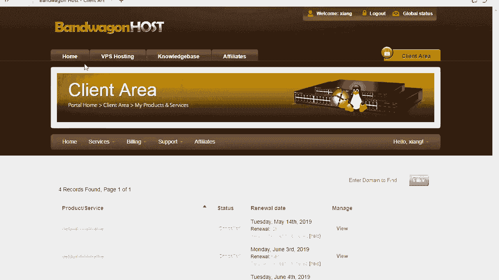

对首页首页home里面是吧，有一个20个g k v m，v p s kb m是一种虚拟化的技术，就相当于vmwr这个技术一样，挺好的啊，比以前单纯卖空间的那种好多了好吧，然后你点order 49美元。

k49 美元里面，这里面是吧，都可以定，我建议大家买这个就够了，这里有个带宽advice，一pb是什么意思是吧，内存10241个g带宽，翻译成翻译出来就是带宽是吧，1t什么意思，如果你对好吧。

cpu是两核的，还好国内一般都是一行，然后network网络是遗迹对吧，然后虚拟化类型是这个，ok然后下面你就不用管了啊，30天好吧，在这个地方就是我们来看一下啊，你也别想退了是吧。

买了以后你想说我申请一下退款了，30天可以退款，新账户，如果你被封杀，你可以尝试一下能不能退，好吧，这个带宽1t啊，并不是说是真正的一季好吧，其实人家说的是，就是一个月大概可以用1t的流量。

是这个意思啊，下面这个网络才是真正的这个ok清楚了吗好吧，然后话说是30天可以新账号可以退款，好不好，实际上是退不了的是吧，在这个地方我们点order点完以后呢，结算周期是吧，d点默认就行。

你可以选洛杉矶，也可以选其他的，我就默认了啊，拿到这个以后呢，再往下我们去结个账好吧，点加入购物车，这个就能结账，好不好，结账的时候呢有个好处叫促销代码，mk比较细心，我给你整了这段优惠码。

你可以输入这个优惠码尝试优惠，优惠好不好，拿到这个以后呢，对你就正常支付就行，支付的过程中，它会显示一下你刚才填的一些资料好吧，那么支付的方式有支付宝方式支付和微信支付，建议大家用支付宝好不好。

当然你也可以用微信行不行，两种方式都行，order提交一下是吧，显示了一下我买的这个基本配置，看得懂吗，cpu 2 x就是两盒好吧，1g的内存，你看这里写的是transfer e t m o。

mo是什么意思，对这个地方你你是那个，月对啊，按月的，然后呢点添加到购物车，好拿到这个以后输入这个东西，这个叫check out，check out，翻译出来是结账啊，可能有些同学对这个东西不太熟。

没关系好吧，那是要check out，是结账，web是wechat，点同意提交，看到这个界面了吧好吧，选择哪呢，支付按钮找不到是吧，pay now，现在支付，好你稍等等啊。

然后你帮我扫一下这个微信支付就可以了啊，我建议大家使用支付宝支付啊，啊我是使用支付宝支付，300多，一天都合不上一块钱是吧，对还是还是比较不错啊，拿到这个以后呢，我们怎么办。

你可以去看一下你买的服务器在哪，好吧，拿到这个地方，我们来快速的看一下，后退了啊。

后退的在哪个地方呢，这里有个welcome to相似啊，mk的另一个号是吧，对我叫相思，然后呢在这里有service my服。

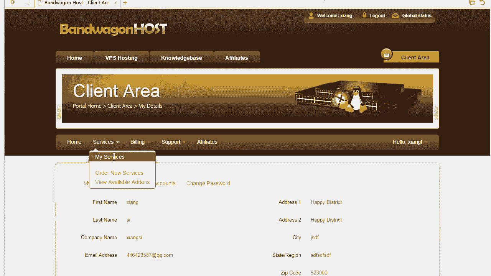

好不好，这里有我需要买的机器，我都没买啊，这个有一台是active，这是我的ip地址，你想管理它，点这个好不好，kvm control控制按钮，啊你们一般喜欢给自己起个什么样的代号，拿到这个界面了啊。

老师我这个界面怎么使啊，很简单，start开机关机重启，强制关机，如果你实在关不了，你就就相当于拔电了，好不好啊，然后呢im是吧，我当前一个g才用了九四十九哇，好省啊是吧，swap是交换分区，没有用啊。

磁盘采用了1。5g也很少，然后呢这个地方叫做band vs e t才用的0。01，说明什么，今天都几号了，7月13号是吧啊，我这个是刚清了零是吧，我本来还想表扬一下自己呢，来我们看一下啊。

点一下控制面板，我给你们截的图都是中文版的，就怕你看不懂英文，各位细心啊，能感觉到我的关心吗，能的话敲一讲课，我一般都用英文的，特意怕你怎么样看不懂，我给你搞个中文的好不好。

能感受到我这个对你的关心了吗，好能感受到就行了，那么再往下这个地方是我们去登录，登录的过程中嗯，四个按钮是吧，这个地方我都给大家写的很清楚，分别是开机关机好不好，另外我的端口号s s h port。

就像我们刚才插上要远程连接的时候，我们连的时候直接就是22段了。

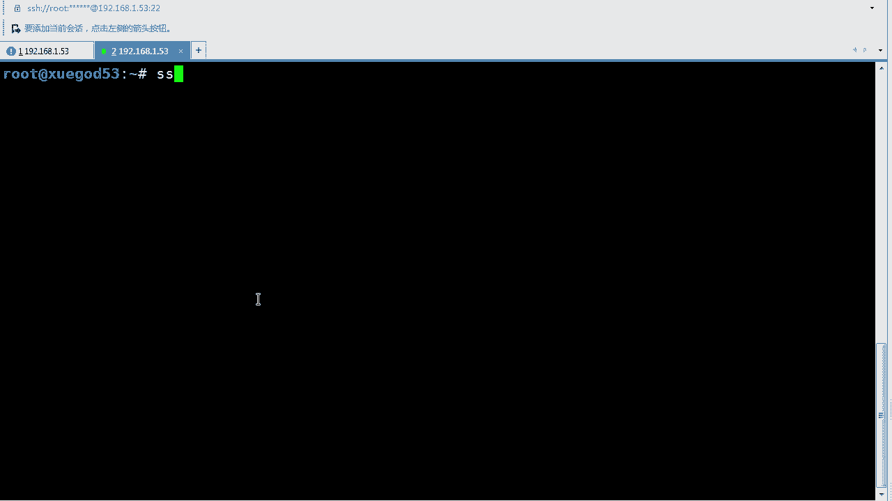

没改好吧，你要连这个，那你要改一下端口好不好，比如说我这里我单口是28841，那就写这个这里写对应的ip好。

拿到这个好吧，办了这个地方，我当时截了一张图，他是一个月一个月，记得6月13号，那个时候我只用了19个g，这说明什么，我都快一个月了啊，那个时候，大家都说这说明了什么，对啊。

我一个月1t的流量上都快到月底量上，那时候才用了19个g，说明什么，说明我没有看电影是吧，是不是有道理，是这个道理吗，我就看看新闻而已，那么在这里快速的去做一下这个事儿好不好，在这个地方我们来怎么样呢。

用这个地方啊，面板这里面有root shell bash，这个地方可以点击这里直接进入bash的提示符，再一个是我想安装系统，我可以insce装一个新的系统，修改密码也可以好吧。

这是常用的每一个面板的中文含义，我也给你起到这上面好不好，对在这个地方我们来看一下好不好，你你每个面板的中文含义，老师都给你写完了，就是常见的就是这几个好，我先带你把常见的快速过一下。

比如说我们想执行一些share语句的话。

好root shell它是可以的，比如说我想看我的ip是什么，if configure，我可以直接回车，这是我的ip地址，好，你想执行一些命令都可以在这里面去执行啊。

这里还有root shell，advance，高级的嗯。

加一长串往上执行，没有必要，其实这个初级的就可以满足你的需求了。

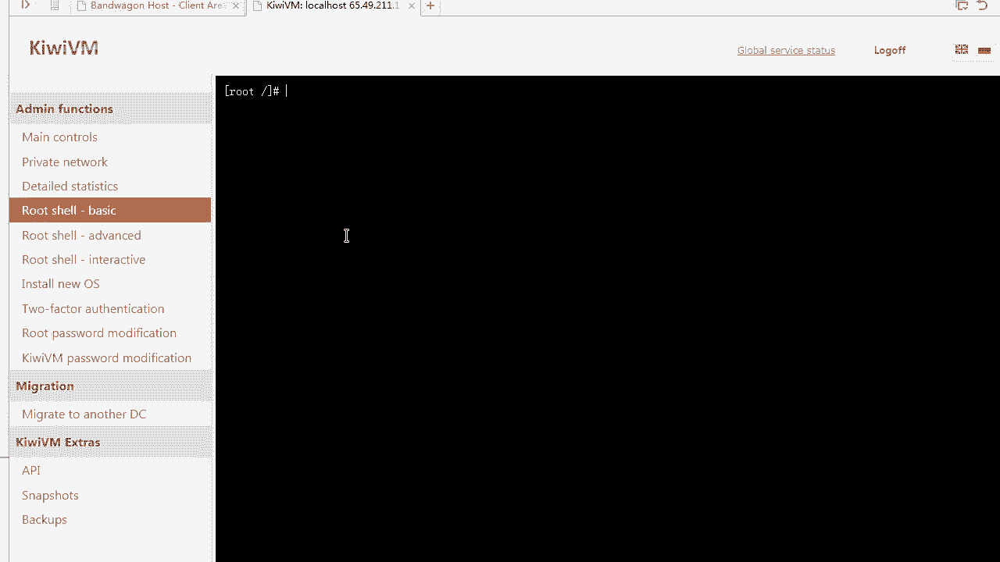

好不好，然后呢，新装一个新的系统，这个是大家经常要用的，比如说我要装一个新的系统好吧，这里有个to factor认证，authentication，什么叫做双重认证，ipv 6，也不需要你们管好吧。

详细的统计信息就看一下，看一下一些基本信息这一块的内容文件，有时候需要上传和管理啊，上传一些文件，我们来看一下这个版面变了是吧，没有feel那一块了是吧啊，没关系啊。

大体上都是包含着这里有个叫做双重身份认证，什么叫做双重身份认证，我们来快速的看一下双城认证，双层认证是这样体验一下，双城登录一下京东好不好，京东的时候有个账号，还有扫码，扫码就是双重认证，好吧，你想啊。

每天不输入账号密码进行登录，那么可以在这里选择双重认证，然后呢点continue，然后呢安装一个谷歌的app上去啊，可以安卓版，可以windows 8，好清楚了吧，那个也不希望大家知道那个原理。

其实就是两种登录方式，你可以在手机上也可以操作，扫一扫，这就是典型的双重身份证，就是双城，以前我们都是账号密码好吧，后来才出现了二维码，对那么在这里啊，install安装的时候是吧。

那么在这里你也可以看到我想装一个系统，那么可以这样装吗，可以好不好啊，install选择它去安装就可以了，我们安装一个吧，我不想安装系统，为什么呢，安装系统我那喊安装系统之前，你如果你想觉得有一些危险。

那你可以在这里有个快照好吧，snap shot，这里有个拍照，我就安装好了，s这里还有16天就过期了，30天过期，所以我现在装系统也没问题，装完系统我还可以恢复快照，还是可以的，快照不收钱啊。

好那我们来装一下啊，为了给大家讲课，我们还原一下快照，选择渗透s吧，这个兼容性会好一些，x866 64也可以选择b b2 选，这个这个是一个最普通的一个系统，好不好，我同意。

这将丢失我v p s上所有的数据reload，所以我说你自己有这个东西啊，会好一些，unnable不能，为什么呢，因为这个东西还在运行中，你不能重新加载一个运行中的，那么我们打开这个地方。

快速的关一下机，stop好，stop成功成功了以后，再一次去装系统，我们选择神s64 点reload好不好，好他在reload的过程中正在安装，不会那么慢好吧，这是我的ip，不是这是我的账号密码。

一会我要靠它连上去的好不好，然后我的端口号是28841好吧，当然你从这儿也能看到，清楚了吧，我们稍微等等他啊，他还站在启动中好，我们在这里这个bbr是什么b br。

一会我会在后面的课程里会说这个b b r，这些东西清楚了吧啊可以让你的通信是吧，对加快点速度好，让你的访问是吧，毕竟我们经过了那么长的时间，ok然后呢当你忘了你的密码是什么的时候。

你在这也能看得到detail详细的一个统计信息，好吧，please try again in，其实稍微等一会儿啊，我们就稍微等等他啊，他还正在安装中好，那么有了这个密码以后，我们就可以对它进行去做。

我们自己想做的这个事，好不好对，就可以做我们自己想做的事啊，这个地方你在做自己事儿之前是吧，你最好给自己创建个快照，就我跟大家说的，点击snap shots，然后点创建一个新的拍照。

就像你的vr vr一样好，我们要快速的做个快照啊，拍照必须得做清楚了吧，好我看看我这边有个状态啊，安装完了没嗯，这边已经安装好了，我的端口号在这里显示的也很清楚，有时候你忘了密码怎么办，看看状态啊。

这里有我网络相关的这个消息是吧，啊这也能看到我这个地方相关的这个基本消息，那如果你忘了密码怎么办，这里有个root密码password，你可以尝试从这里生成一个新的密码，好不好，清楚了吧。

对这个叫生成新的密码，如果忘了密码，可以生成这个新的密码，如果忘记root密码，可以好点，这个生成一个新的密码，你知道一下就行哈，你点一下它就它就能随机出来一个密码啊，当然如果你好不好对。

他就能帮你生成一个新的密码啊，然后快照这个地方一定要创建，因为接下来我就要进行操作了，拍照的话可以在这里download，我也可以创建一个新的拍照好吧，输入一下就行，这个快照都不难，都是点一点的事啊。

安装好ssr，这是大家经常搞的，点创建就行了啊，我就不创建了，因为有现成的好，那么到此我们什么vp就算是成功了，接下来接下来我们就可以使用shadow sock去连一下。

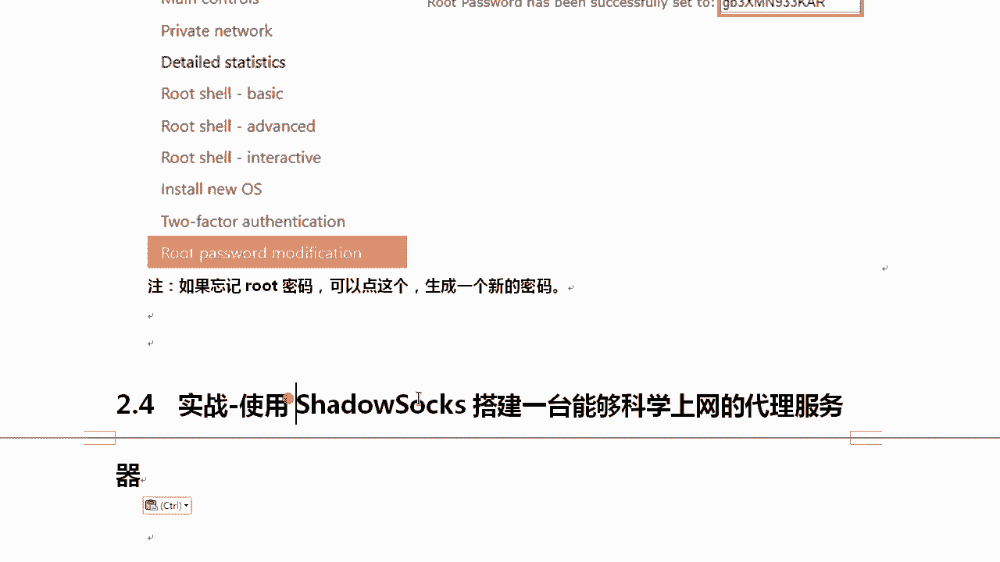

连的时候我们怎么办呢，x cl你可以自己尝试连接一下，好不好，行不行，对x 12，你也可以自己尝试去把那个x 12，快速给它连接一下，好的，那你想快速连一下，可以把端口号写上去，然后密码写上去就行了。

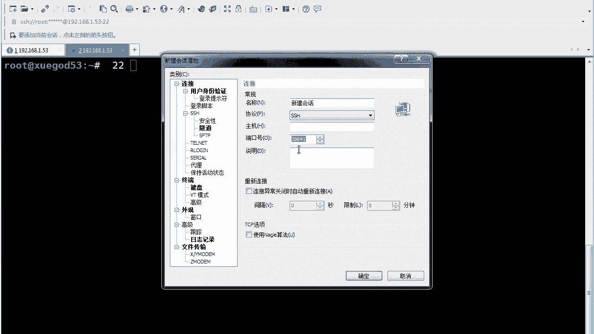

连一下，在这里啊快速的看一下，看一下我的ip地址是这个。

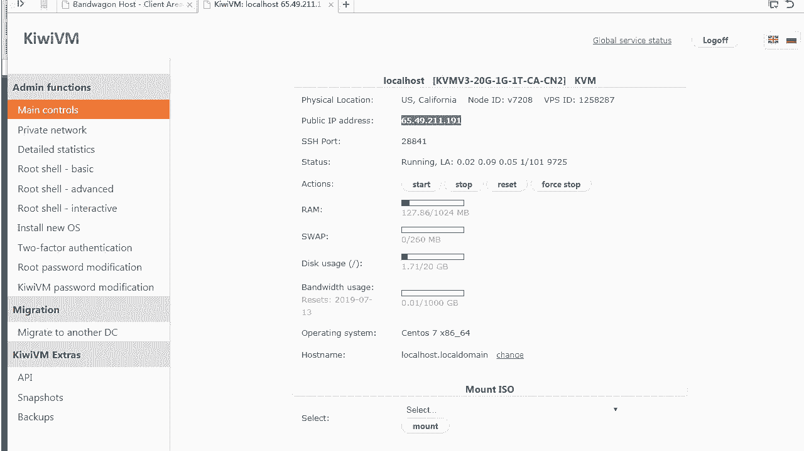

我不想再创建新的了啊，你你从这里面去输入ip就行好吧，端口号也输上去，然后我呢直接从这儿修改一个也可以，稍等啊，就拿这个来说好吧，我们点链接就行了，肯定连不上，连不上的时候怎么办呢。

我因为我这个已经之前写好的点属性。

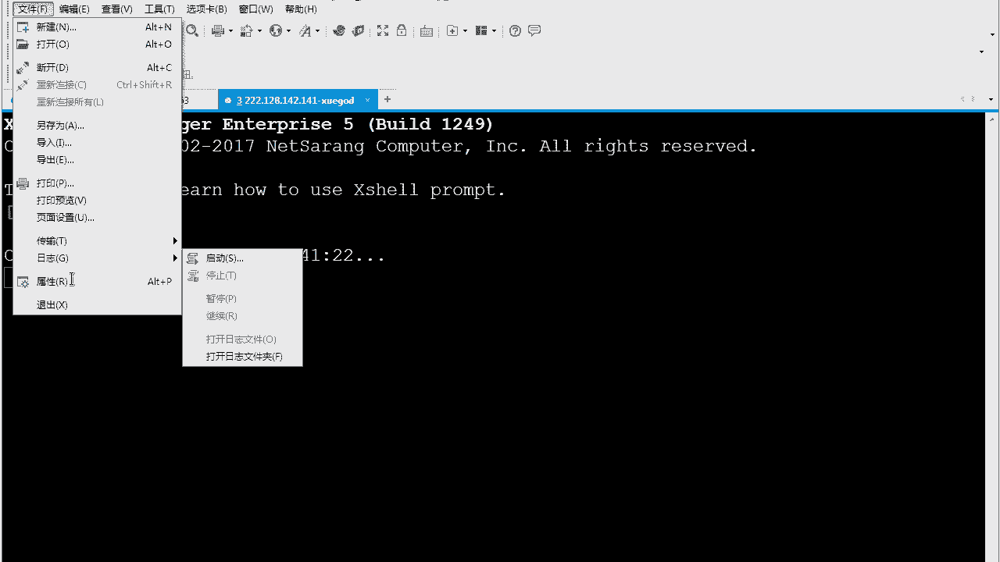

可以去改一改密码，ip地址是。

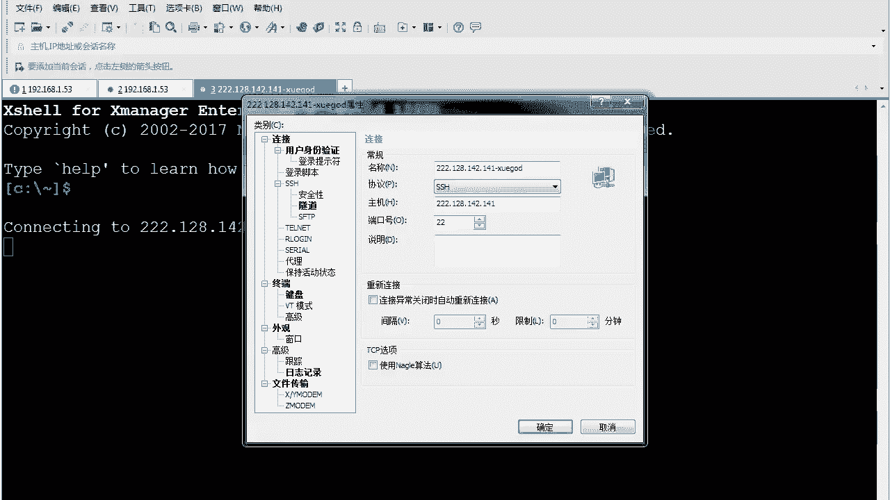

啊不是这个是吧，重新连一下啊。

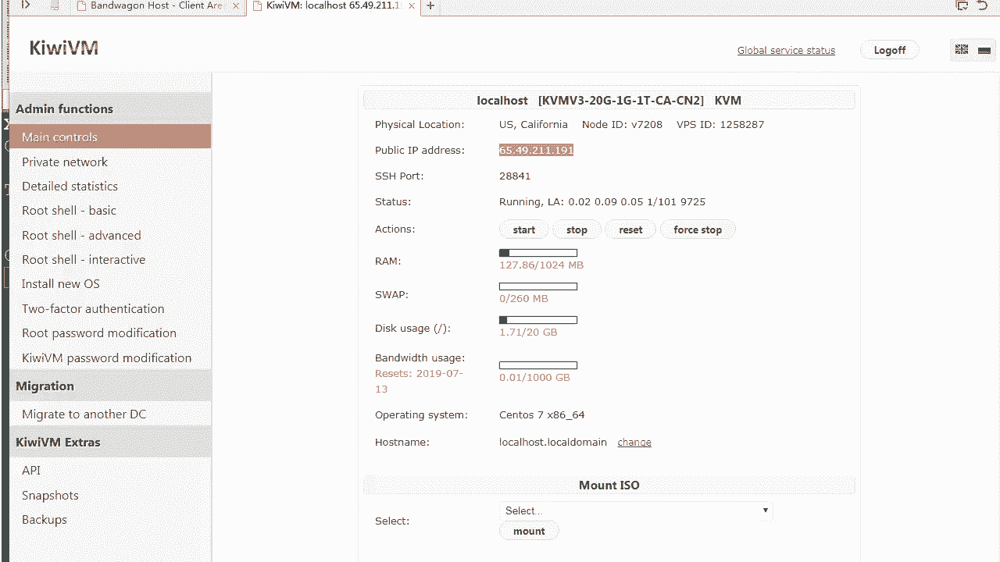

跟刚才那个是步骤是一样的啊，各位同学写上去好吧，你的端口号也写上去。

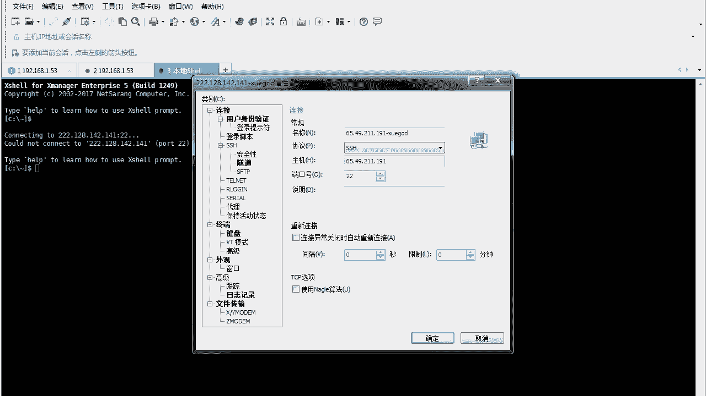

我的端口号是288412分钟结束战斗啊。

时间有点长了是吧，再输入你的用户名和密码就行了。

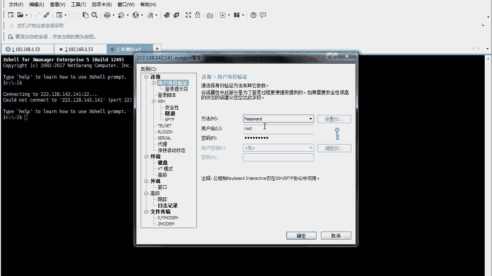

ok这样的话就没有问题啊，就可以直接连安全好。

