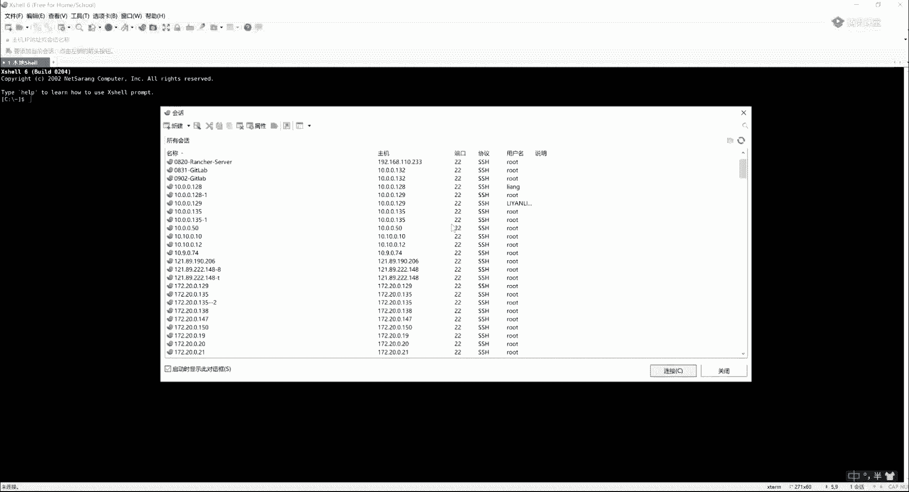
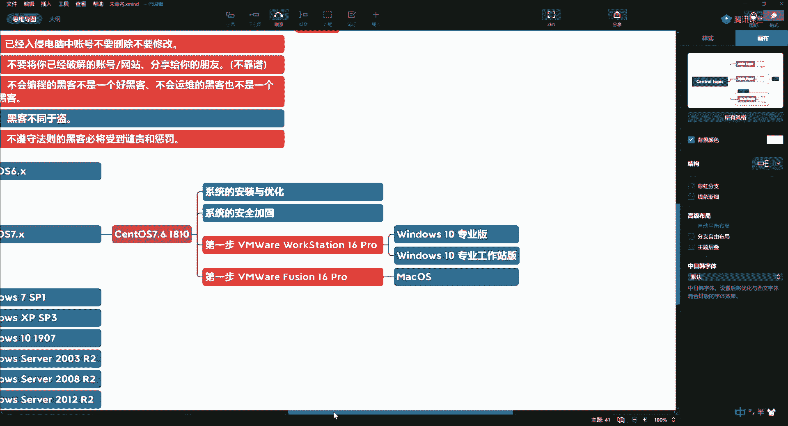

# P3：1.2-网络安全基础-白帽守则（中） - 一个小小小白帽 - BV1Sy4y1D7qv

所以呢我们这个就逼格就一下子上来了啊，挖一下到房顶了，是不是哎，第15条第15条了，不遵守啊，不遵守法则的黑客必将受到，谴责和乘法，啊最后一条很重要啊，请大家一定要去遵守啊，一定要去遵守。

做一个遵纪守法的好公民啊，我们都是奉公守法的好公民好，这个是你师爷当时当年传给我的啊，这个法则嗯，当然了，他有几条呢是我在这里头，我我们后来又加的啊，后来又加的，所以呢现在这个版本啊，这个希望大家谨记。

那么说说第15条说你如果不听话啊，就是我没有遵守这些准则，你遵守我这个15个准则，保证你能安安稳稳的啊，保证你能安稳的不听话，那些同学不听话怎么办呢，师爷当年就没听话，那我们给大家找一篇。

他当年做了一下啥事，2012年的文章，2001年呢当年爆发了非常知名的，就是在我们安全圈里非常知名的重要的事件，就是中美黑客大战啊，中美黑客大战呢就是起源于什么呢，因为他是这个军事安全的事儿。

那么由这件事就引发了中美双方啊，黑客团体的互相攻击，当时呢这个美国黑客呢很猖狂啊，那么攻陷了，就是后来我们统计呢大概攻陷了我们国内啊，就包括台湾地区，啊你可以说两天24小时之内。

大概攻破了中国大概900多个网站啊，当然这还是不完全统计，那么中国当时呢去呃，攻击美国的这个网站大概有多少呢，啊大概统计了一下啊，大概嗯可能统计也不准啊，大概有90多个啊，大概有90多个。

那有同学说这这东西，这能证明我们中国的这个，这个黑客的水平不行吗，其实中国呢这个嗯受受这个传统的这种教育啊，就是比如这个这个老子道家思想的思想是吧，黄河文化啊，儒家思想就是，所以就是啊。

你看那电影里头那武功高手跟人打架的时候，总是留一招啊，就是不弄死你对吧，然后被人家反杀了，都是这样，所以呢好多在中国的这个黑客呢，当时其实拿到了美国的战啊，然后只改了一些他的首页，并没有让他拒绝服务。

就是没有走ddos dos这一层面，所以美国的手里还是比较狠辣的啊，我当年学习的时候呢，这个我的师傅呢叫王宪兵啊，是我们中国第二代黑客是非常有名的啊，当时呢这个组织参与了中美大战啊。

然后呢你们的师叔啊就跟我平辈儿的啊，叫周林亮啊，那么也是非常厉害的一个老黑客啊，那么这个东西呢你们可以自己去看一看啊，你们可以去看一看，我呢这个不是为了吹捧他啊，主要是告诉他就是被自己的弟弟。

自己的弟弟是吧，我师傅呢就是就是自己的弟弟，一天到晚的吹牛逼啊，瞎说啊，结果呢这个示范了啊，然后呢这个当时我们因为中美大战我们都参与，然后呢唉呀师傅呢判了4年啊，师叔呢判了3年嗯，很多事儿吧。

这里有很多事啊，我们也不便于说，所以这就告诉大家，这事不是闹着玩的啊，这事不是闹着玩的，当然参与这件事的还有很多人啊，还有很多人，只是呢这个师父和师叔呢比较仗义啊，这些事都扛了，所以说呢。

这是在什么时候判断，大概是10年了啊，这个师傅出来以后呢，这个就就找我们嘛对吧，找到我们有一次喝酒的时候就问我，他说说这个小亮你现在在干啥，我说呃反正还在这个圈里头啊，然后呢他就问我。

他说你有没有兴趣啊，就是说咱们再做做这个安全的学科啊，因为他觉得这个我们中国第三代和第四代，黑客呢，它是属于断打的这种这种情况，然后所以呢我们就开始了，把这个安全这个学科呢又开始拾掇起来啊。

然后给大家去说，所以这个又判刑的又发钱啊，所以这个大家一定要注意啊，引以为戒好吧，一定要听话，好好了，这个是我们这一讲啊，关于什么是黑客和黑客的守则啊，以及呢让师爷呢现身说法了一下啊，大家要以他们为戒。

千万不要得瑟啊，嘚瑟呢不好。

这个是我们今天说的这个内容。

第二个内容呢就是我们要带着大家搭建啊，我们的攻防环境，好我们的环境搭建呢，这里头呢我给大家说一下哈，我今天晚上呢给大家发一个百度网盘，这里头会给大家发一些，我们常见的系统的镜像啊。

系统的镜像用于呢我们在本地进行攻防演练，进行渗透的使用，那么我们一开始呢需要的环境呢，现在呢就给大家说一下啊，我们为了给大家讲linux，所以说呢我们需要一台simple os的环境好。

那么我们需要一个六点多的版本，我们还需要一个七点多的版本，啊，那么这个是我们现在服务器比较流行的，两个版本，那么对于linux的发行版本呢，这里头就比较多了啊，不光是这两个，还有u班图啊。

得变呀等等等等，还有fedi啊啊等，所以呢我们在这里头以sl os 7为主啊，因为现在出到了八，我们以sl s7 为主，然后呢我们也会介绍一些slawre好，也会介绍u班图，也会介绍得变等。

那fedori都会给大家介绍一下，让大家呢对这个东西呢有所认知啊，然后在这个基础上好，在这个基础上你有时间再去做升华，那么今天呢这一讲呢，我主教给大家带着大家呢来搭建一下simple vs啊。

七这样的一个环境，你看看我是怎么搭的啊，那么防止呢，大家在后边使用的过程中出现各种问题，所以你到时候跟着我来一下啊，那么新的os呢在我们选择这个版本的时候，也不是瞎选择的，我们选择ctos 7。

61810这个版，1810这个吧，那么现在渗透os出道了多少呢，他出道了co os 7。9啊，最高版是7。9，我们使用7。61810啊，那为什么使用这个版本，后边我还会再给你说啊，嗯这么做是为了后边。

比如说你在听我给你讲docker什么的啊，云计算等这些东西还会有关联，所以说选择3671810，那么在这里头呢我们会涉及到什么呢，我们需要进行安装，安装与优化，那如果你对linux系统运维啊。

你没有任何基础的同学，没关系啊，你选安全的课程，你抄着了啊，我们在这个课程中会给你讲啊，操作系统，那么一个操作系统，我们会从比如说它的基础命令，用户管理，文件管理，文件压缩文件查找文件传输啊。

文件权限和属性等这些去给大家去讲解，然后给大家讲用户管理，用户组，用户权限，然后有网络管理啊，还有他的哎系统中的这种进程管理，所以说我们整个把我们的服务器里头的啊，这个这个操作系统里头的这些服务。

这些组成都会细细的给大家去讲啊，所以没有基础呢，你也跟着听没关系，对你绝对是有帮助的啊，那么然后呢我们再做一下什么呢，我们再做一下安全加固，啊安全加固，好我们这个课程呢从下周开始吧。

啊从下周开始呢就是一周两次啊，然后呢这个比如我再给大家去主讲，然后同时的话呢有一些课程呢，比如说呃他是录播课啊，你也可以看，但都是我讲都是我这个这个去给大家录的，所以这个东西呢也没关系。

你有时间你就来看是没有时间的，你看回放也都是一样的啊，然后举例子我都在好，这是第一个啊，需要一个centos环境，第二个呢就是告诉大家我们需要一个windows环境啊。

windows这里头需要的可能会比较多啊，那么我们首先需要一个win 7的环境，s p一吧，win 7 sp 1，好，然后需要什么呢，需要windows server，好需要2008r2 。

那么有的人说为什么还需要到windows，这我给大家交代一下，就是你现在去我们的政府，你去我们的国企啊，你去里边你会发现他们用的还都是啊，大部分还有是windows对吧，所以说对于服务器来讲啊。

这个操作系统啊，不光是大家看到的这些，它还会有一些windows server，那么windows server里头同样也会遇到很多的安全问题啊，比如说我们web集群对吧。

唉你开发的时候你可能就会个ngx，但是我们这里的比如说阿帕奇，ngx，tom cat以及a s等啊，都得讲都有漏洞，所以呢在这个过程中就比较多了，所以呢还有啊windows server。

2003r2 ，还有什么呢，windows就得装一堆，2008，2012，2016，2019，好这个是windows server，windows xp sp 3，windows 111907以上的。

那光windows的这一堆系统就得装这么多，啊，好吧，这是windows一窝子啊，那然后的话呢我们还需要一些靶场环境啊，这些靶场环境呢今天呢你也装不到啊，今天也装不到，那么windows这一块啊。

我觉得这一块应该不用我带着去装了哈，大家呢windows你肯定会装对吧，一直下一步下一步下一步就搞定了，那么你唯一不好搞定的呢，你可能是这些镜像，你搞不定，对不对。

好我们先带着大家装一下这个渗透os 7。6，然后呢给大家看看怎么去封装模板机啊，将来你怎么去克隆这一块儿比较重要，那么我们这里头使用什么呢，使用虚拟机给它进行安装啊，这里的我们用的是vm wor。

vm workstation，好我这里的版本呢，我用的是vm workstation，16专业的，好这个我就不告诉大家怎么下了，自行百度啊，或者回头我给你放在网盘里啊，所以第一步是安装vm。

这是我们在windows啊，windows里的，那么我们的小伙伴有没有在mac环境下，我在mac下的，你帮我扣个二，ok ok ok好收到好，那么mac下的话呢啊你装vm有一个freezing啊。

装它他和这个workstation是一样的，中它就可以了，我们这些所有的镜像，在mac下都可以一样的去使用，因为今天我就给大家直播，所以我也不能切我们的操作系统啊，我回家呢拿我的mac给大家再录一个。

mac下怎么装啊，这个软件是什么啊，dmd格式的对吧，哎我回去再给大家录一个啊，然后呢你们可以参考mac下来啊，不用换电脑啊，所以说我学个这个，我再换个电脑，那对对对对对对对对对，就是这个东西啊。

两个圈圈啊，好，咱还交代一句是吧，windows讲，我用的是windows 10的操作系统啊，如果大家在使用的时候，你用windows 7 sp一以上的版本就行了，那么win 10呢大家注意啊。

开发人员一定要使用专业版，至少是专业版，或者呢你是属于专业工作站版，好就这两个版本就是你不要用家庭版啊，因为家庭版的会少很多的功能是吧。

好吧，你选一个你的版本啊，选一个自己的版本。

然后呢对于内存的要求呢，我们在这儿呢没有太大的要求。

没有太大的要求啊，就是你16g左右啊，基本上就够用了，八个g的话呢也基本上能用好吧，不用因为这个再去啊，过多的这种这种这种这种投入，然后的话呢需要需要需要大家具备的是什么呢，就是啊，我以为骂人呢是吧。

这个64个g啊，是64个g啊，我这个是64g ecc，你们光看见64g了没有，你还得看e cc啊，64g的ecc，好了啊，不扯犊子了，接着往下说，那么如果是mac系统下，刚才说了啊，哎freeze啊。

他也是到10 16啊，你丢安专业版就行了，啊，好那么安装完了以后呢，我们要在这里头去干嘛呢，我们现在呢开始装一个虚拟机啊。

装一个虚拟机，装虚拟机呢就是你装完了以后，在这个主页这选择创建虚拟机，好选择典型，提供我们下载呗，提供啊，我回去把这模板机给你们导出来，你们直接导入也行啊，好吧唉，然后呢下一步啊，下一步。

那么这里头可以勾选稍后安装操作一松，再选择下一步啊，选择linux啊，然后呢在这里的选择你要安装的版本，比如cl s76 64位，下一步，然后给它起一个名称啊，比如cs 7，那么记住这一定要叫做模板机。

就是以后呢我们不需要再次安装了，我们就直接拿这个东西去克隆，那我加一个sec，因为我这里的模板机虚拟机比较多，虚拟比较多，所以呢这个这个你看买电脑真的啊，你去买高配呗是吧，行走的服务器啊，移动作战。

那么你的磁盘大小呢给20个g左右就够了啊，20g左右就够了，好下一步，然后点完成，完成以后呢，就在这儿啊啊就在这儿会有这台的主机啊，那么一般的话呢我们给一盒1g就够了，一盒1g模板机，一盒1g。

如果遇到比较复杂的情况，给到双核4g啊就行了，比如说以后呢我们讲c i c d呀是吧，这里头比如说我们涉及到的这个这个这个呃，这个这个这个呃glab啊，就是刚才给同学调问题的这个好，是不是哎你调问题。

那你就得双核4g啊，所以这个具体问题具体分析，然后在这里头cd啊，d v d这里头你双击一下唉，然后呢使用iso镜像对吧，那iso镜像呢这里这玩意儿就多了，对不对，你看到我的硬盘了哈，对不对。

四个t的固态啊，两个t两个t做的raid 0啊，所以这个速度大概每秒五个g的传输速度啊，也是比较吊的啊，所以这个我挣点钱啊，都到这上面了，好。

好嘞，开机哈走，你，拉伸一下啊，那么在这里头要注意啊，它有一个选项对吧，选择第一个，那么为什么要带着大家去安装，我今天先让你认识到这个界面，一方面呢是以后，比如说你要遇到一些运维的问题。

你可以解决二一个啊，二一个这个镜像如果做成u盘或者光盘启动，将来可以走救援模式啊，甚至破密码都可以啊，到时候再给大家说好吧，那么比如说我先安装下一步，啊确实是确实是对，因为我这个机器啊。

他就支持零和一啊，支持零和一就做的零，没关系，这就用个12年，这就该淘汰了，到时候再买新的呗是吧，固态还好，机械的会出现这种问题，固态的还好嗯，固态的你就使个12年对吧，差不多。

这里的选择呢就是对于零有经验的同学啊，有经验的同学，你就选择英文版啊，这都是英文，那为什么要选择英文呢，这不是为了装逼，这一定要跟大家说啊，就是因为你将来在遇到一些问题的时候，那么你这个原汁原味。

它翻译出来这个东西它是最准确的，比如你装一中文版的，你发现这个问题，你网上百度你就百度不了啊，所以这一定要提倡大家呢这个是英文版的，而且呢在以后的课程中呢，我会给大家总结。

我们操作系统中主要用到的英文单词，如果英文稍微差点意思的同学啊，没关系，我上课会带着你给你做计算机英语啊，所以在这块呢，大家呃零基础的同学也不要害怕啊，不要害怕好，下一步，下一步呢这个怎么装啊。

这个怎么装，在这儿呢，选择最小化安装啊，如果呢你要是为了做虚拟化啊，在这儿勾选虚拟化，如果你需要这个server with jy，就是你要图形化的，就go server is g u y。

如果你需要g环境，就在桌面的g桌面的就选这个，如果你要k环境了，那你就选这，这有不同的啊，这个选项可以选，所以呢我们就选最小化安装啊，在右侧呢比如说把这个debug工具啊，这一些编译的库啊，开发工具啊。

安全工具啊对吧，一些系统管理员的工具对吧，这是一个智能卡啊，无所谓，智能卡位不勾，把这几个选项勾上啊，然后选择当，然后在下边啊，这有一个key jump对吧，它是什么呢。

当你这个系统启动失败内核转储的时候，把这个默认的这个勾去掉，比如说你将来在装什么k8 s什么的，这些东西也都得关啊，你直接在这就行了，然后呢这个镜像选择就自动啊，不用手动分配就自动就行了。

因为center os 7以后他对硬盘的管理是ok的啊，所以这块你不用管它，你直接让它自动配置镜像就行了啊，虚拟20 20个g嘛对吧，然后选择当啊，在这儿注意千万别点下一步啊，有很多同学问问题。

就是老师我的虚拟机为啥上不了网啊，就在这啊，这个network和house name把这个开关打开啊，它会自动获取到ip地址，这样的话呢他会把你的dns啊什么的，都和你系统进行同步啊，行同步。

然后呢host name呢就写local host就行了啊，然后选择down好，选择上，那么这儿还有一些时间和日期啊，你如果愿意选的话呢，这些东西呢你可以就在这配置啊，你如果不愿意配置的话呢。

我们在后边呢也可以通过n t p服务啊，我这里的主要要给大家讲n t p，所以这呢留了一个bug啊，你们要知道啊，你别说我没配，我留了一个bug，留着我后边用的好，ok然后点开始安装。

这里头呢我们需要给它设置一个root密码啊，为了方便起见呢，我们就在这里头给大家设置一个简单的啊，当然我们在真正生产环境中root这个密码啊，一定不要随便泄露，而且大概平均三天到五天你就得改一个密码啊。

这个是防止你被攻击对吧，或者说被人拿到root以后，拿到shell以后提权啊做的一件事，然后第二个呢就是你可以创建一个普通用户啊，这普通用户我们也创建好，那为什么这么说呢，这是因为呢我们到后边啊。

我们可以讲这个，比如说我带大家用python啊，或者用shell脚本，我们报密码，爆破密码的时候，我们也要用，所以这里光是root也不行啊，我们在这里呢也可以点创建一个好吧，普通用户啊。

所以呢这个系统呢我们就等他安装啊，安装好了以后啊，这个系统就ok了，那么装系统呢这是我们非常简单的一步啊，所以说呢将来呢你可以拿到服务器以后呢，你拿这个东西去装服务器，其实上也是这样的一个历程啊。

当然如果你是多台服务器的话，我们可以通过其他的工具做自动化安装对吧，哎所以这块呢我们简单的跟大家沟通一下啊，有这么一个东西，那么等你在装完了以后，我们要做哪些的去设置啊，就是你这个服务器装完了以后。

我们要做的第一件事，就是要设定成一个静态ip啊，所以这个东西呢，就是我们要在安装系统完了以后，要做做一个优化的一个操作啊，就是我们拿到所有的服务器，你会发现它的ip地址都是静态的。

所以静态ip地址这一步一定要配啊，否则的话呢可能会存在，比如说你这次启动和下次启动，你这个ip地址不一样啊，你会发现你的x shell连接不上，那么关于远程连接的这一块呢，回头我们也会给大家介绍一下啊。

也会给大家介绍一下，看看有哪些软件，大家最常用的啊，比较好用的一些软件啊，哭着，哎呀。

趁它安装的时候啊，我们，嗯回头吧回头吧。

回头我建一个网盘好吧，我把今天的这个内容啊，这些东西我发到网盘上，然后发到我们这个微信群里啊，发我们微信群里，就是这个啊发这个群里，如果不在这个群的，找我或班主任，让我们把你拉到群里头啊。

要不你找不着组织，正在安装的时候呢，我们介绍一下远程连接的工具啊，远程连接能工具。

第一个呢就是大家使用插shell，char shell，不管运维呀，开发呀。

大家使用比较友好的一个工具啊，这是第一个叉share，第二个呢，还有一个啊，还有一个就是我们用我用的这一款。

好功能也比较强大啊，功能比较强大，所以说呢用char shell啊，或者这款软件啊都可以，你可以去网上去搜啊，网上去搜，那么我也是在网上搜到啊，非常强大，比较好用这两款软件好吧。

那如果你用叉shell的话呢，还有一个x ftp啊，x ftp将来也要用的啊，也要用的。

装完没，好让他先装啊，等会儿，嗯歇会儿诶，这家伙刚说要歇会儿，他装完了啊，好出现到这个界面的话呢，就表示你安装完毕了啊。

然后选择reboot重启。

好然后呢这个呃大家报课啊，送大家的这个大礼包，我们现在这两天陆续都会上到这个课堂上，呃腾讯课堂呢今天应该上了三个课啊，应该在审核，然后呢稍后呢我们会有工作人员啊，然后去联系大家。

给大家加到我们这个课程中啊，那么云计算这个课啊，云计算这个课，那么这里头是我们一些部分的大纲对吧，这个到时候大家也可以去看，所以说呢，这里头会给大家讲了很多企业级的东西，就是肯定你之前是没听说过的啊。

没听过的，然后呢还有这个给大家的这个dba的课程啊，mysql dba的课程啊，这是我们首期上线的价格啊，稍后的话呢这个东西我们也会调价，所以说呢你下手越早越合适。

后边还会有一些这个python自动化的啊，python自动化还会有还会有啊，这个还没弄完啊，所以等我整理整理整理完陆续都会上线，到时候都给到大家好好装。

完了以后呢，那我们先登录一下啊，诶好你进入到系统了就ok了，然后你输入ipa空格a，你看一下这里头有一个e n s33 啊，它能够通过d n c p自动获取到我们的网卡，然后呢你先简单的拼一下百度。

啊能通表示呢，那你这个虚拟机啊，你就跟着我们装明白了，这是第一步，第二步呢就是我们拿到一台服务器以后，那你看要么它都叫local house对吧，那么我们通常要去做的时候是什么呢。

这里头实际上是要有主题规划的，如果你集群比较多的话，要有主题规划，如果比较少的话，那这里头我们给他改一下host name啊对吧，那这里头呢我们就告诉他什么呢，我们就起个名吧。

啊比如说就叫s e c好不好，好那这个名称就改了，就叫s e c。

所以呢这个第二步啊，我们通常呢是给它一个名称，唉指定模板机的名称，那么我们作为一个程序员也好，我们作为一个安全人员也好，啊，说我们在这里linux系统中需要用到多少个命令，需要用到多少个命令。

我们需要我给大家总结了啊，大概需要150个左右的命令，所以光命令我们要讲够150个啊，这150个，我们需要给大家分门别类的去讲啊，那这一块其实我们学的是什么呢，其实我们学的是shell。

那什么是shell啊，在这一讲我不多给你白话，我们后边有专门有讲shall，有同学开车，你去加油，你会发现那个叫翘牌是吧，壳牌是吧，这个壳其实说的就是这个东西，它实际上是一个什么呢，是一个命令解释器。

那么解释什么呢，就把我们这些用户，这些人，这些人员这些操作，比如我输入一个命令，翻译给谁听，翻译给内核听，所以shell又是我们人啊，也是用户和你系统内核之间的一个桥梁，那么这个命令解释器。

和我们用户进行交互，交互呢它有几种方式呢，有两种方式，第一种方式呢就叫交互式的，第二种呢就是非交互式，那我们看看什么叫交互，什么叫非交互啊，这就一开始一点点的去接触啊，这个系统交互是什么。

就是有来言有去语啊，就你跟我聊天啊，是不是有咱们有逗哏的，有捧哏的啊，说相声，所以这个东西就比如说你输入了一个ls命令，系统给你回血，这就叫人机交互啊，就跟我们聊天一样，有来言有去语，这就叫交互式啊。

输入命令还不行，你得回车对吧，唉系统给你回血，这叫交互式，所以通过这种方式，我们学习的东西就叫做shell命令，那这里呢我们有用的啊，说我们要学够的，这里头还不加上docker和k8 s啊。

就单纯的我们去学这个东西啊，就学shell需要多少个，需要150个命令，所以下一讲我就给你讲150个命令啊，对吧，那为什么讲唉，那你拿到人家服务器以后，那你就是一个大k终端黑框框。

然后你只能在这上面去操作，没有图形交互界面，像windows这样还能点点点没有，你想啥呢，是不是啊，个别的服务器有啊，第二种呢就是非交互式的啊，什么叫非交互式啊。

所谓的非交互式指的就是shell脚本啊对吧，井号碳和b下的82好说，echo一个hello world，好，这个玩意儿啊它就是个shell脚本了，这个脚本就涉及到了唉我们文件啊，它就是个文件呢。

点s h的文件就是shell脚本，这个东西能干的事儿就多了啊，这个东西其中有一部分就叫自动化啊，我们能够批量的通过shell脚本执行批量的任务，能够自动去执行，再加上定时任务，再加上我们涉及到权限。

用户其他服务等等等，所以shell它是一个高级语言啊，在这里的能干的事是非常多的啊，所以他是用这种非交互式啊，您弄一个脚本一回车，啥玩意也没有，滋滋滋开始执行啊，所以这个东西它要透着的，我们编程的功底。

包括我们shell里头讲三剑客啊，比如awk等啊，我们会给大家去讲所，哎呀，好喝口水跟大家接着说啊，就是两种方式，就是交互式和非交互式这块儿呢，给大家去介绍一下，然后我们再拿到这里头，如何去指定名称呢。

我们通过一些命令啊，co s7 ，通过host name ctrl，然后set hostname这种方式来设定你的主机名称，host就是主机的意思啊，就是你主机名称，这样不一般框呢啊我调一下啊。

没办法啊，这个程序员出身吗，对吧，这个强迫症啊，对不起，看不下去，就是包括这个之前我们写程序的时候，这个大括号上下也是必须得对齐的，vi m e t c下的house也可以吧，可以啊可以。

但是呢我们这种方式是渗透os 7特有的啊，七里特有的鼓励用这种方式，所以第二步呢我们要设定一个啊，我们的主机名称，好吧好，第三步，第三步呢我们要指定，静态的ip地址啊。

