# 课程P3：1.2 - 网络安全基础 - 白帽守则（中）与攻防环境搭建 🛡️💻

在本节课中，我们将学习网络安全中的白帽守则，并通过一个真实案例理解遵守规则的重要性。随后，我们将开始搭建用于渗透测试和攻防演练的基础环境，重点讲解如何安装和配置 CentOS 7 虚拟机。

## 白帽守则与警示案例 ⚖️

上一节我们介绍了黑客的基本概念和部分守则，本节中我们来看看守则的最后一条及其重要性。

第15条守则明确指出：不遵守法则的黑客必将受到谴责和惩罚。这条规则至关重要，必须严格遵守。每个人都应成为遵纪守法的好公民。

这些法则部分由前辈传承，部分由我们后续添加。希望大家能谨记当前版本。

如果不遵守这15条准则，就无法保证安稳。不听话的后果，可以通过一个真实案例来了解。

2012年的一篇文章记载了2001年安全圈内非常知名的“中美黑客大战”。该事件起源于军事安全问题，进而引发了中美双方黑客团体的互相攻击。

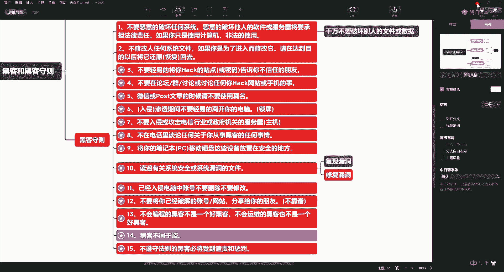

当时美国黑客攻陷了包括台湾地区在内的中国境内网站。据统计，在24小时内，约有900多个中国网站被攻破。而中国黑客攻击的美国网站数量，统计约为90多个。

这并不代表中国黑客技术水平不行。中国黑客受传统道家、儒家思想影响，在攻击时往往留有余地，例如只修改首页而未进行拒绝服务攻击。相比之下，美国黑客的手段更为狠辣。

我学习时的师傅王宪兵，是中国第二代知名黑客，曾参与中美大战。我的同辈师叔周林亮，也是一位非常厉害的老黑客。他们的事迹可供查阅。

我提及此事并非为了吹捧，而是为了警示。我的师傅和师叔因为当年参与事件，且行事高调，最终师傅被判刑4年，师叔被判刑3年。其中涉及许多不便详述的细节。

这告诉我们，网络安全不是儿戏。当然，参与此事的人很多，只是师傅和师叔比较仗义，承担了主要责任。判决距今已有十年。

师傅出狱后找到我，询问我是否还在这个圈子，并提议我们重新拾起安全学科的教学。他认为中国第三代和第四代黑客出现了断层。因此，我们决定重新整理安全学科知识并传授给大家。

既有判刑的先例，大家一定要引以为戒，务必遵守规则。

以上就是关于黑客及黑客守则的讲解，并通过前辈的案例进行了现身说法。大家要以他们为戒，切勿肆意妄为。

## 攻防环境搭建准备 🛠️

接下来，我们将开始搭建攻防演练环境。

我会在百度网盘中分享一些常见的系统镜像，用于本地进行攻防演练和渗透测试。我们首先需要准备以下环境。

为了讲解 Linux，我们需要 CentOS 的环境。我们需要一个6.x版本和一个7.x版本，这是目前服务器流行的两个主要版本。

Linux 发行版众多，还包括 Ubuntu、Debian、Fedora 等。本课程将以 CentOS 7 为主进行介绍，同时也会涉及 SUSE、Ubuntu、Debian、Fedora 等，让大家有所认知。在此基础上，大家有时间可以自行深入。

今天这一讲，我将主要带大家搭建 CentOS 7 环境。请跟着我的步骤操作，以防止后续使用中出现各种问题。

选择 CentOS 7.6 1810 这个版本。目前 CentOS 7 最高版本是 7.9，但我们选择 7.6。原因与后续讲解 Docker、云计算等内容相关联。

安装过程涉及安装与优化。如果你是 Linux 系统运维的零基础学员，没关系。我们的安全课程会涵盖操作系统知识，包括基础命令、用户管理、文件管理、网络管理、进程管理等，并进行安全加固讲解。

课程从下周开始，一周两次。部分课程为录播课，但都由我主讲，内容一致。有时间可以看直播，没时间看回放也可以。

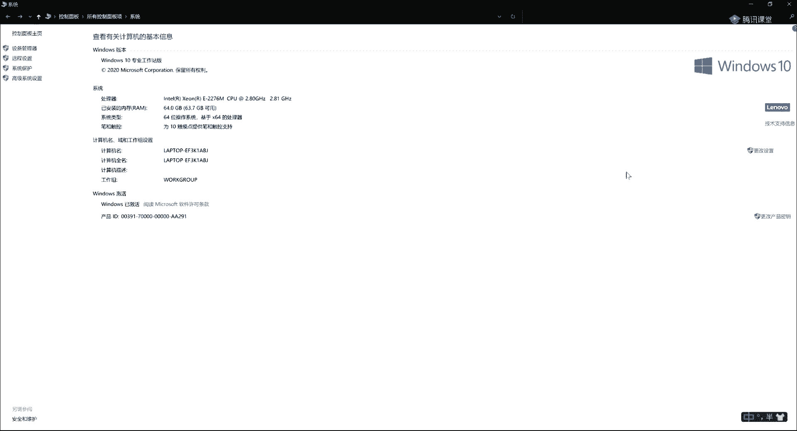

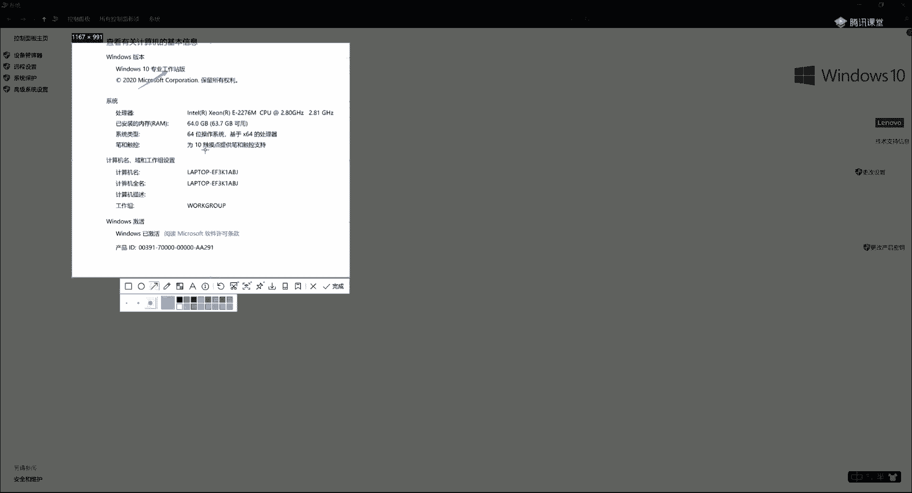

以下是所需环境列表：

*   **CentOS 环境**：需要一个 CentOS 7.6 1810 版本的系统。
*   **Windows 环境**：需要较多版本，因为政府、国企等机构仍大量使用 Windows 服务器。
    *   Windows 7 SP1
    *   Windows Server 2008 R2
    *   Windows Server 2003 R2
    *   Windows Server 2008, 2012, 2016, 2019
    *   Windows XP SP3
    *   Windows 11 1907 及以上版本
*   **靶场环境**：后续需要，本次暂不安装。

Windows 系统的安装相对简单，一直点击“下一步”即可。难点可能在于获取系统镜像。

现在，我们开始安装 CentOS 7.6，并演示如何封装模板机以便后续克隆。

我们使用虚拟机进行安装。这里使用的是 VMware Workstation 16 专业版。软件安装方法请自行搜索或使用网盘分享的安装包。

第一步是在 Windows 系统上安装 VMware Workstation。使用 Windows 10 专业版或专业工作站版，不要使用家庭版，因为家庭版会缺少很多功能。

对于 Mac 系统的用户，可以使用 VMware Fusion 专业版，操作原理相同。我后续会录制 Mac 系统下的安装教程。

内存方面，建议 16GB，8GB 也基本够用，无需过度投入。我本人使用的是 64GB ECC 内存。

安装完 VMware 后，我们开始创建虚拟机。

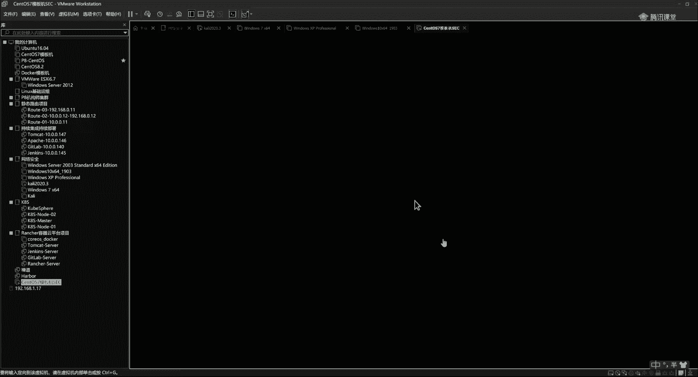

## CentOS 7.6 虚拟机安装步骤 📥

以下是安装 CentOS 7.6 虚拟机的具体步骤：

1.  在 VMware 主页选择“创建新的虚拟机”。
2.  选择“典型”配置，点击“下一步”。
3.  选择“稍后安装操作系统”，点击“下一步”。
4.  客户机操作系统选择“Linux”，版本选择“CentOS 7 64位”，点击“下一步”。
5.  为虚拟机命名，例如“CentOS7_Template”。建议命名为“模板机”，方便日后直接克隆。指定虚拟机存储位置。
6.  磁盘大小设置为 20GB 左右，选择“将虚拟磁盘拆分成多个文件”，点击“下一步”。
7.  点击“完成”创建虚拟机。
8.  编辑虚拟机设置。内存通常给 1GB，处理器给 1 核即可（模板机配置）。复杂场景可给双核 4GB。
9.  在“CD/DVD”设置中，选择“使用 ISO 镜像文件”，并指向下载好的 CentOS 7.6 ISO 文件。
10. 启动虚拟机。

启动后，选择第一个选项“Install CentOS 7”并回车。

在安装界面，语言建议选择“English”。这并非为了炫耀，而是因为遇到问题时，英文错误信息的搜索和解决更准确。课程中我会总结常用的计算机英语单词，零基础学员也无需担心。

点击“Continue”。

在“SOFTWARE SELECTION”中，选择“Minimal Install”（最小化安装）。如果需要图形界面，可选择带 GUI 的服务器版本。在右侧，勾选“Debugging Tools”、“Compatibility Libraries”、“Development Tools”、“Security Tools”和“System Administration Tools”。取消勾选“Kdump”。

在“INSTALLATION DESTINATION”中，选择自动配置分区即可。

在“NETWORK & HOST NAME”中，将网络连接开关打开，主机名暂时设为“localhost”。点击“Apply”。

时间和日期可以稍后通过 NTP 服务配置，这里暂时不设置。

点击“Begin Installation”。

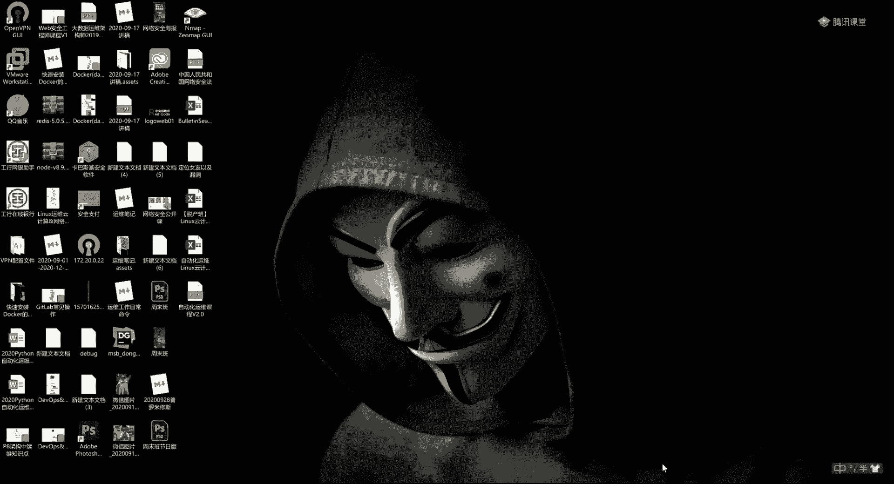

在安装过程中，设置 root 用户的密码。为了方便实验，可以设置简单密码，但在生产环境中必须使用强密码并定期更换。同时，可以创建一个普通用户。

等待安装完成。完成后，点击“Reboot”重启系统。

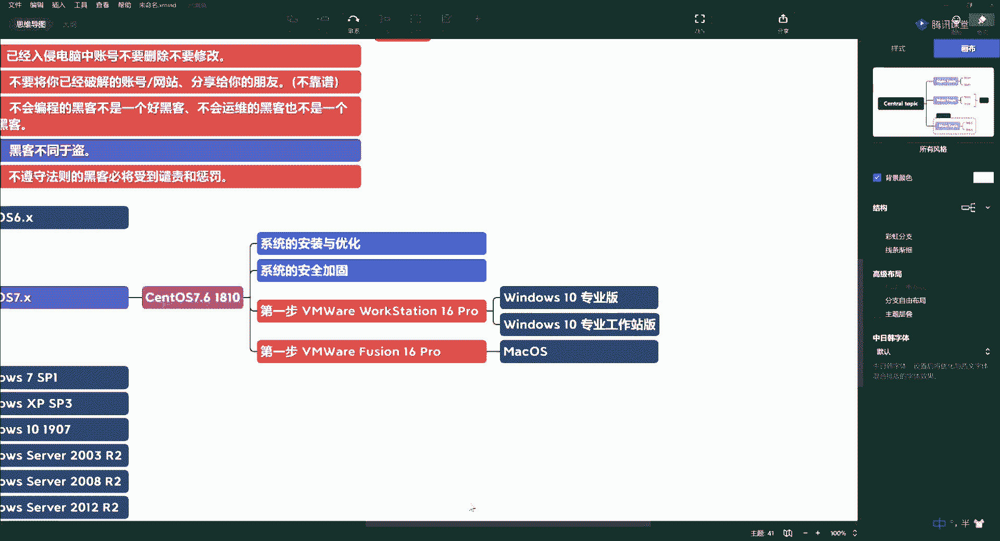

重启后，使用 root 用户和设置的密码登录系统。

## 安装后基础优化 ⚙️

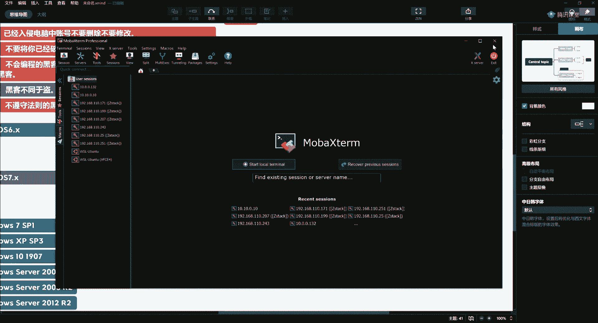

系统安装完成后，需要进行一些基础优化配置。

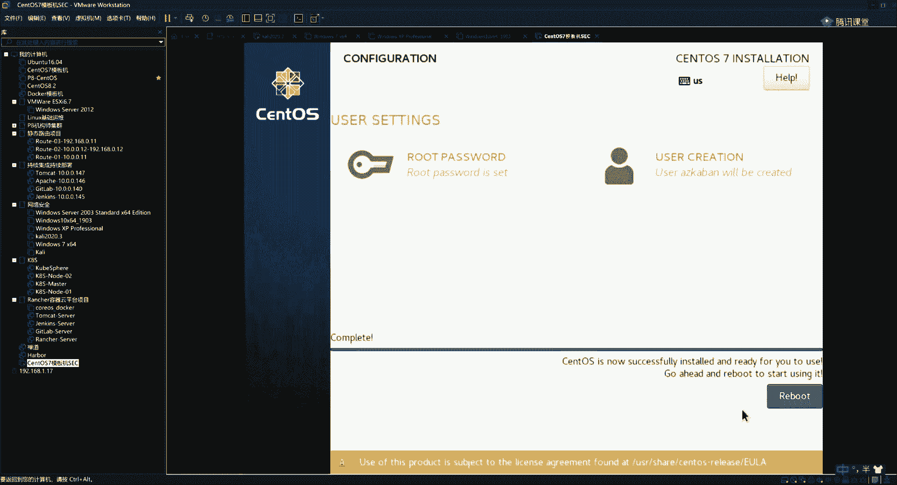

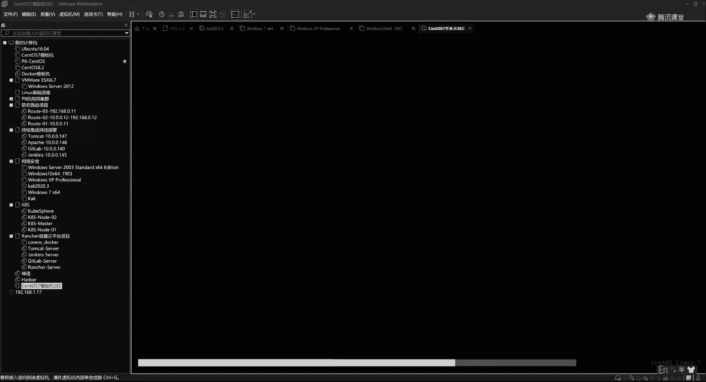

首先，测试网络连通性。输入命令 `ip a` 查看网络配置（如 ens33 网卡），并使用 `ping www.baidu.com` 测试外网是否通畅。

第二步，修改主机名。生产环境中需要有规范的主机名规划。这里我们修改主机名，例如改为 `sec`。

在 CentOS 7 中，可以使用命令 `hostnamectl set-hostname sec` 来修改。修改后需要重新登录或开启新终端生效。

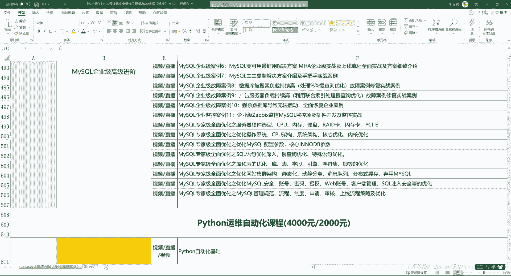

第三步，配置静态 IP 地址。这是服务器管理的关键步骤，可以避免 IP 地址变动导致远程连接失败。

配置方法通常是编辑网卡配置文件，例如 `/etc/sysconfig/network-scripts/ifcfg-ens33`，将 `BOOTPROTO` 改为 `static`，并设置 `IPADDR`、`NETMASK`、`GATEWAY`、`DNS1` 等参数。配置后重启网络服务。

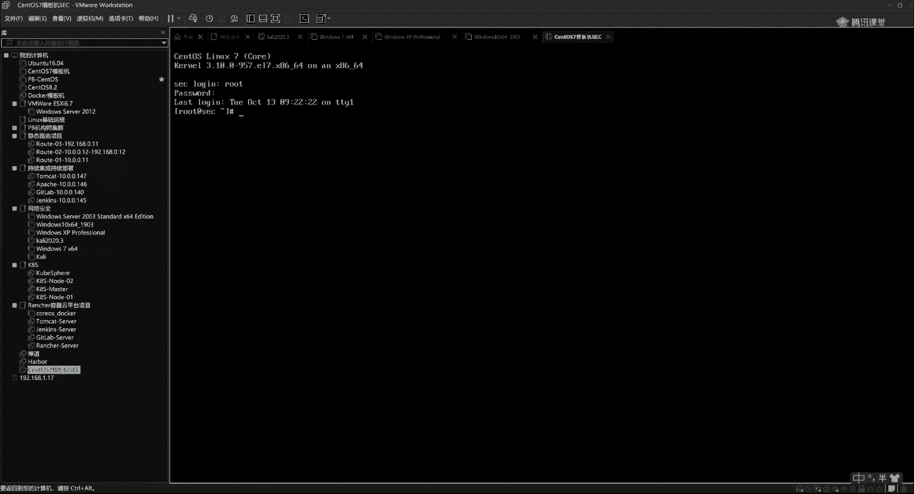

## 远程连接与 Shell 基础 🔌

在等待安装或后续操作时，可以了解远程连接工具。

以下是两款常用的远程连接工具：

*   **Xshell**：功能强大友好，广泛应用于运维和开发。
*   **MobaXterm**：我本人使用的工具，功能也非常全面。

此外，Xshell 通常配套使用 **Xftp** 进行文件传输。

登录 Linux 系统后，我们主要通过 Shell（命令解释器）与系统内核交互。Shell 是用户与系统内核之间的桥梁。

交互方式主要有两种：

1.  **交互式**：用户输入命令，系统立即返回结果，有来有往。例如输入 `ls` 命令后系统显示目录列表。我们主要通过这种方式学习 Shell 命令，本课程将涵盖约 150 个常用命令。
2.  **非交互式**：通过执行 Shell 脚本文件（通常以 `.sh` 结尾）来批量、自动地运行命令。例如，一个包含 `echo “Hello World”` 的脚本文件。这涉及到自动化、编程逻辑和定时任务等高级功能，是 Shell 的强大之处。

## 总结 📚

本节课中我们一起学习了白帽守则的最后一条及其背后的警示意义，并通过真实案例理解了遵守安全规则的重要性。随后，我们开始了攻防环境的搭建，详细演示了如何在 VMware 中安装 CentOS 7.6 虚拟机，并介绍了安装后的基础优化步骤、远程连接工具以及 Shell 的基本概念。下一节课，我们将深入 Linux 系统，开始学习那 150 个必备的 Shell 命令。