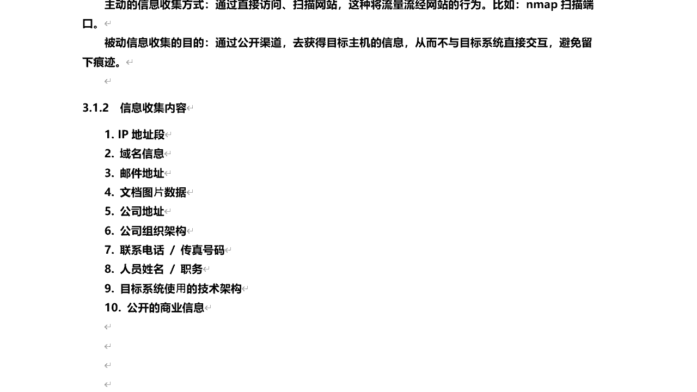

# 课程P30：7.1-【被动信息收集系列】被动信息收集概述 🕵️

在本节课中，我们将要学习网络安全中一项基础且重要的技能——被动信息收集。我们将了解其概念、原理、常用工具以及具体收集哪些信息。

## 什么是被动信息收集？🤔

上一节我们介绍了课程主题，本节中我们来看看被动信息收集的具体定义。

信息收集主要分为主动和被动两种方式。被动信息收集是指利用第三方服务对目标进行访问和了解，而不直接与目标系统交互。例如，使用谷歌、百度等搜索引擎，或Shodan等网络空间搜索引擎。一个网站上线后，通常会被各大搜索引擎收录，我们可以通过这些公开渠道收集到关于该站点的信息。

与被动收集相对的是主动信息收集。主动信息收集通过直接访问或扫描目标网站来获取信息，例如使用`nmap`扫描端口。这种行为会使流量直接流经目标网站，不可避免地在目标日志中留下记录。

被动信息收集的主要目的是通过公开渠道获取目标主体的信息。其优点在于不与目标直接交互，因此不会留下痕迹，相对更为安全。在实际操作中，主动和被动信息收集通常需要结合使用。

## 信息收集包含哪些内容？📋

了解了被动信息收集的定义后，我们来看看具体需要收集哪些信息。以下是信息收集通常涵盖的核心内容：

*   **IP地址段**：用于批量探测网络中存活的主机。
*   **域名信息**：包括域名解析记录（如`A`记录、`CNAME`记录）、真实IP地址、域名注册商、注册邮箱、注册与到期时间、备案信息等。
*   **邮件地址**：可用于后续的钓鱼攻击或社会工程学。
*   **文档与数据**：从目标网站或相关渠道泄露的文档、图片、数据中可能包含敏感信息。
*   **公司及人员信息**：包括公司地址、组织架构、联系电话、人员姓名与职务等，可用于社会工程学攻击。
*   **技术架构信息**：例如服务器操作系统（Linux/Windows）、Web服务器类型（Apache/Nginx）、中间件、开放的端口及对应服务等。
*   **公开商业信息**：公司在各类信息平台发布的宣传文章或资料，可能透露其技术栈或业务细节。

信息收集的原则是尽可能详细，不放过任何细节。

## 信息收集的目的是什么？🎯

收集到大量信息后，我们该如何利用它们呢？本节我们来探讨信息收集的核心目的。

信息收集主要服务于以下几个目标：

1.  **描述目标**：综合服务器系统、开放端口、运行服务等信息，全面刻画目标的网络轮廓。
2.  **发现目标**：通过收集的IP地址段，探测并发现网络中存活的主机或设备。
3.  **社会工程学攻击**：利用收集到的公司地址、组织架构、人员信息等，为针对内部人员的社工攻击提供素材，可能成为内网渗透的突破口。
4.  **寻找漏洞（物理/逻辑缺口）**：
    *   通过识别特定的系统版本（如`Linux kernel 5.4.0`）、软件版本（如`Apache 2.4.49`），关联已知的公开漏洞。
    *   通过主动扫描（结合主动收集）发现潜在的安全弱点。

本节课中我们一起学习了被动信息收集的基本概念、需要收集的具体内容以及这些信息的最终用途。掌握全面、细致的被动信息收集方法，是进行有效网络安全评估和渗透测试的第一步。在接下来的课程中，我们将深入探讨DNS解析原理、子域名收集等具体技术。