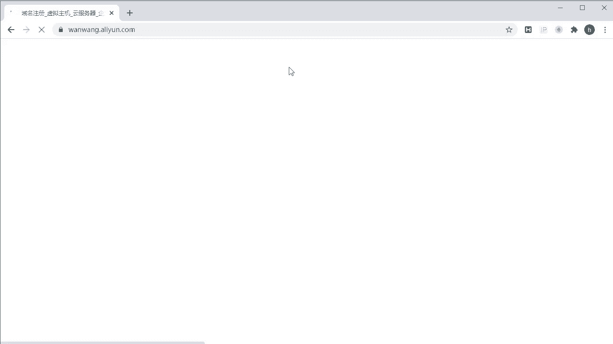
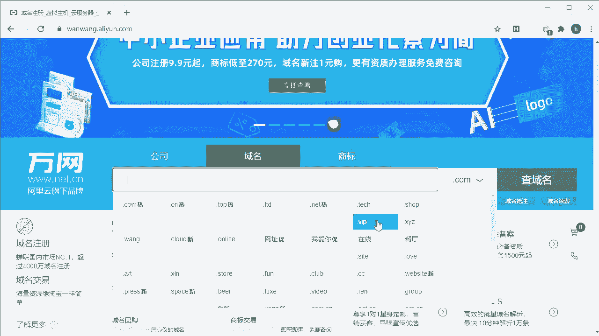
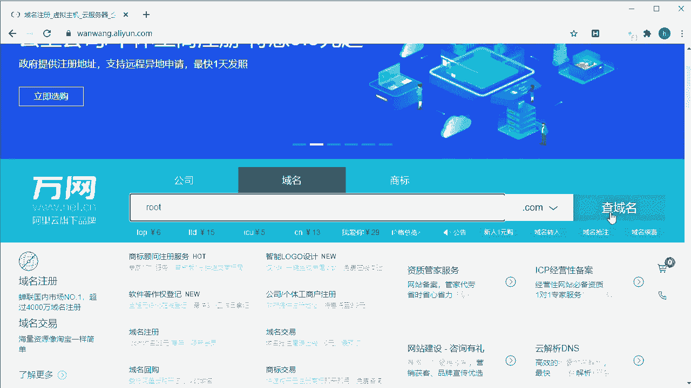
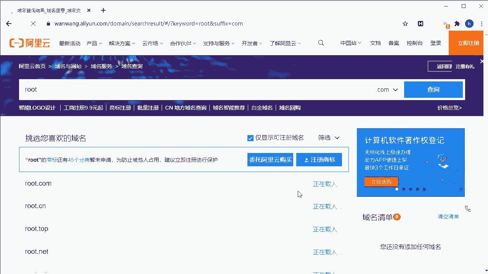
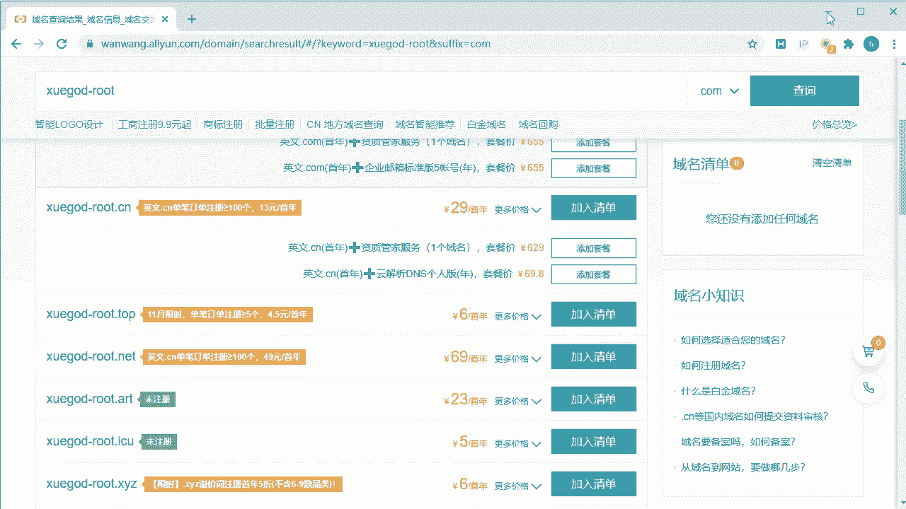
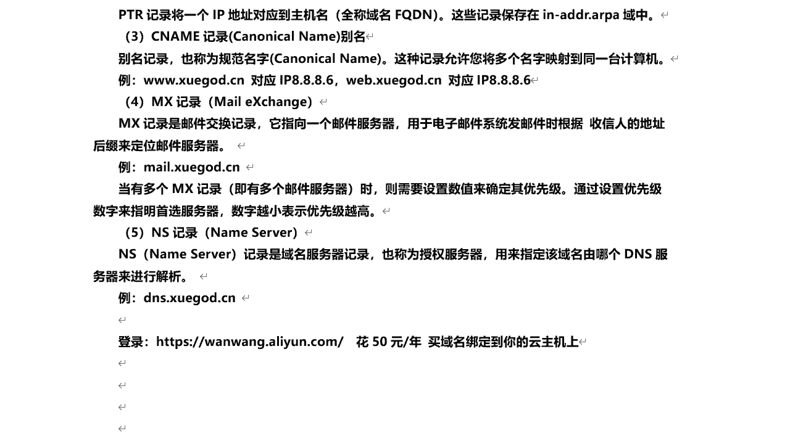
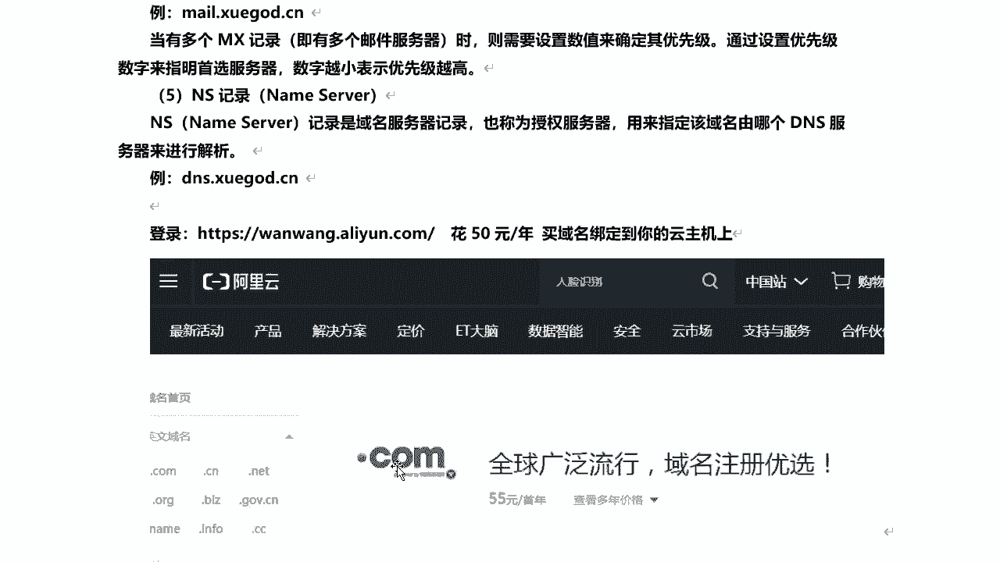
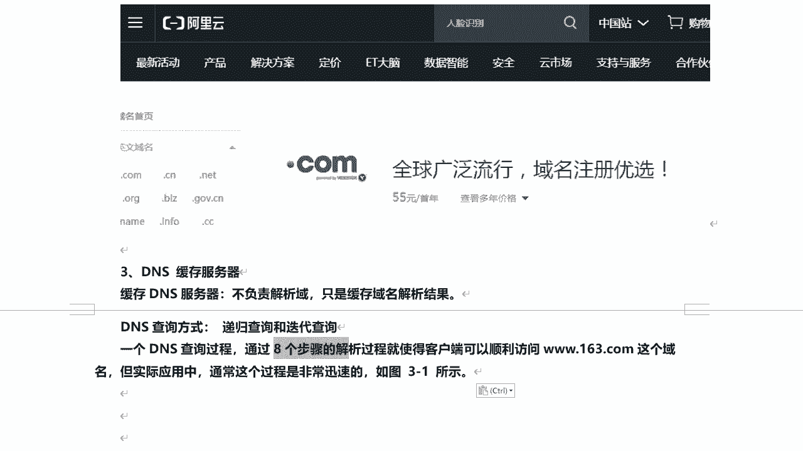
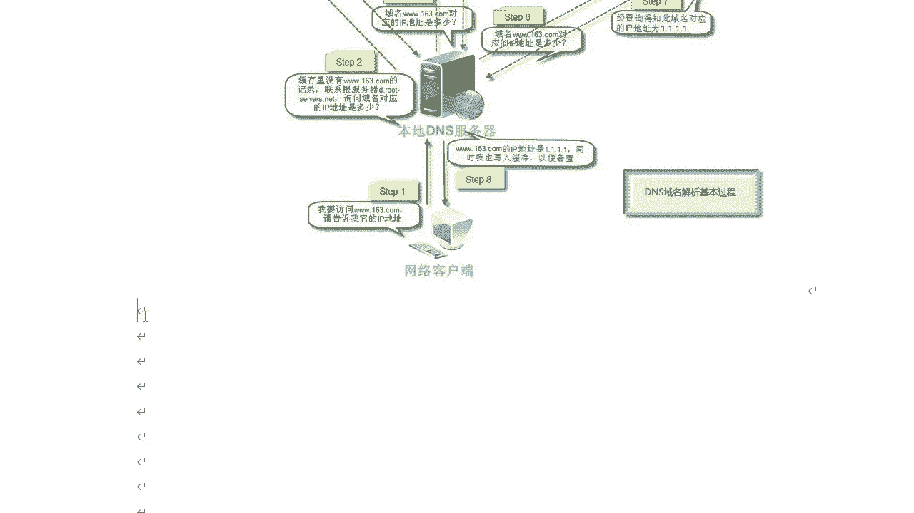

# 课程P31：7.2-【被动信息收集系列】DNS域名解析原理 🧭

在本节课中，我们将要学习DNS域名解析的基本原理。DNS是互联网的“电话簿”，负责将我们熟悉的域名（如 `www.example.com`）转换为计算机能够理解的IP地址（如 `192.0.2.1`）。理解这个过程是进行网络信息收集和安全分析的基础。

## DNS服务器简介

上一节我们介绍了课程概述，本节中我们来看看DNS系统的核心组件——DNS服务器。

DNS服务器是运行DNS服务器程序的计算机，它存储着DNS数据库信息。DNS服务器主要分为两种类型：根DNS服务器和顶级域名DNS服务器。

*   **根DNS服务器**：全球共有13个根服务器，它们存储了所有顶级域名服务器（如 `.com`、`.net`）的地址信息。
*   **顶级域名DNS服务器**：这类服务器存储了在其下注册的二级域名（如 `163.com`）所对应的主机地址信息。

当注册一个域名（例如 `xuega.cn`）并购买服务器后，需要将域名解析到该服务器的IP地址。这个解析记录就存储在DNS服务器中。当用户通过浏览器访问该域名时，DNS系统会找到这个记录，从而让用户能够访问到对应的网站。

## 域名解析记录类型

了解了DNS服务器的角色后，我们来看看它具体存储哪些信息。DNS数据库中的条目称为“记录”，不同类型的记录有不同的用途。

以下是几种常见的DNS记录类型：

1.  **A记录（Address Record）**：这是最核心的记录类型，用于**正向解析**。它将一个主机名（域名）关联到一个IPv4地址。例如，将 `xuega.cn` 解析到 `8.8.8.8`。其核心作用是建立 **`域名` -> `IP地址`** 的映射关系。
    *   **公式/代码表示**：`域名 IN A IP地址` （例如：`xuega.cn. IN A 8.8.8.8`）

2.  **PTR记录（Pointer Record）**：与A记录相反，用于**反向解析**。它将一个IP地址关联到一个主机名（域名），即 **`IP地址` -> `域名`** 的映射。这些记录保存在特殊的 `in-addr.arpa` 域中。

3.  **CNAME记录（Canonical Name Record）**：也称为**别名解析**。它允许将多个域名映射到同一台计算机（同一个A记录）。例如，可以将 `www.xuega.cn` 和 `web.xuega.cn` 都设置为指向 `xuega.cn` 这个主域名。
    *   **公式/代码表示**：`别名 IN CNAME 规范名` （例如：`www.xuega.cn. IN CNAME xuega.cn.`）

4.  **MX记录（Mail Exchange Record）**：指向邮件服务器，用于电子邮件系统发信时定位收件人地址后缀对应的服务器。例如，企业邮箱 `mail.xuega.cn` 就对应一个MX记录。当存在多个MX记录（即多个邮件服务器）时，会通过**优先级数值**来确定使用顺序，数字越小优先级越高。

5.  **NS记录（Name Server Record）**：指定由哪个DNS服务器来对该域名进行解析，也称为授权服务器。例如，`dns.xuega.cn` 就是一个域名服务器。通常由域名注册商（如阿里云、腾讯云）提供。

## 实践：注册与解析域名（可选）

理论需要结合实践来加深理解。为了让大家更直观地体验域名解析，这里提供一个可选的实践步骤：注册一个自己的域名。

大家可以在域名服务商（如阿里云 `wanwang.aliyun.com`）注册一个域名。域名价格从几元到几十元每年不等。注册成功后，你需要将其解析到你拥有的服务器IP地址上。

**请注意**：如果你使用中国大陆的服务器，域名必须进行备案才能访问。如果使用香港或海外的服务器，则通常无需备案。

这个过程可以帮助你亲手操作A记录、CNAME记录等设置，直观理解DNS解析是如何工作的。此实践为建议内容，不影响后续课程学习。

## DNS解析查询过程

当我们输入网址并按下回车时，背后发生了一系列复杂的查询。这个过程主要涉及两种查询方式：**递归查询**和**迭代查询**。

整个DNS解析通常经过以下步骤，虽然迅速，但逻辑清晰：

1.  **浏览器缓存**：浏览器首先检查自身缓存中是否有该域名对应的IP地址。
2.  **系统缓存（Hosts文件）**：如果浏览器缓存没有，则检查操作系统中的 `Hosts` 文件。你可以手动修改此文件来强制域名指向特定IP。
3.  **路由器缓存**：查询请求会发送到路由器，检查其DNS缓存。
4.  **ISP DNS缓存**：如果以上均无结果，请求会进入互联网服务提供商（如电信、联通）的DNS缓存服务器进行查找。
5.  **根域名服务器**：若ISP缓存也没有，查询将抵达全球13台根域名服务器之一。根服务器不直接解析域名，但会返回负责该顶级域（如 `.com`）的顶级域名服务器地址。
6.  **顶级域名服务器**：本地DNS服务器根据根服务器的指引，去查询对应的顶级域名服务器（如 `.com` 服务器）。顶级域名服务器会返回负责该二级域（如 `163.com`）的主域名服务器地址。
7.  **主域名服务器**：本地DNS服务器最后向目标域的主域名服务器发起查询。主域名服务器查询自己的记录，找到最终的 `域名 -> IP` 映射关系。
8.  **返回并缓存**：主域名服务器将IP地址返回给本地DNS服务器。本地DNS服务器首先**将这个结果缓存起来**，以备后续快速响应，然后将IP地址返回给用户的计算机。浏览器最终获得IP地址，开始与目标服务器建立连接。

**核心要点**：整个过程中，本地DNS服务器承担了“中介”角色，对用户来说是递归查询（只问一次，等最终答案），而对上级服务器是迭代查询（不断追问下一个该问谁）。缓存机制极大地提升了重复访问的效率。

---

本节课中我们一起学习了DNS域名解析的核心原理。我们了解了DNS服务器的分类、常见的解析记录类型（A、PTR、CNAME、MX、NS），并通过一个可选实践环节加深了理解。最后，我们详细剖析了从输入网址到获得IP地址的完整八步查询过程，理解了递归与迭代查询的区别以及缓存的重要性。掌握这些知识是进行后续网络探测和信息收集的坚实基础。