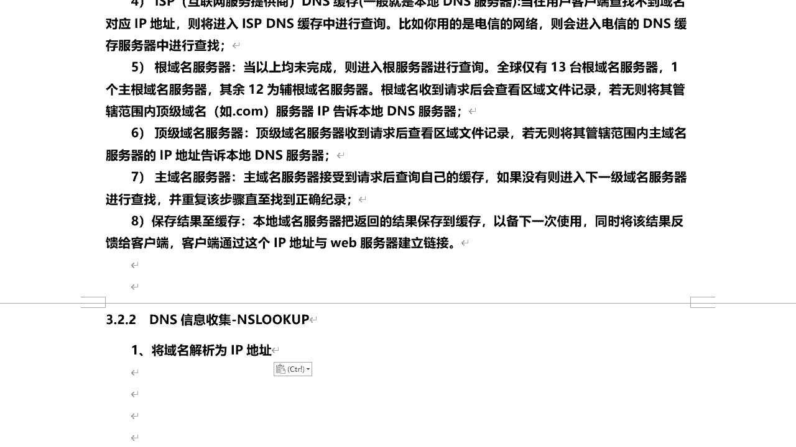
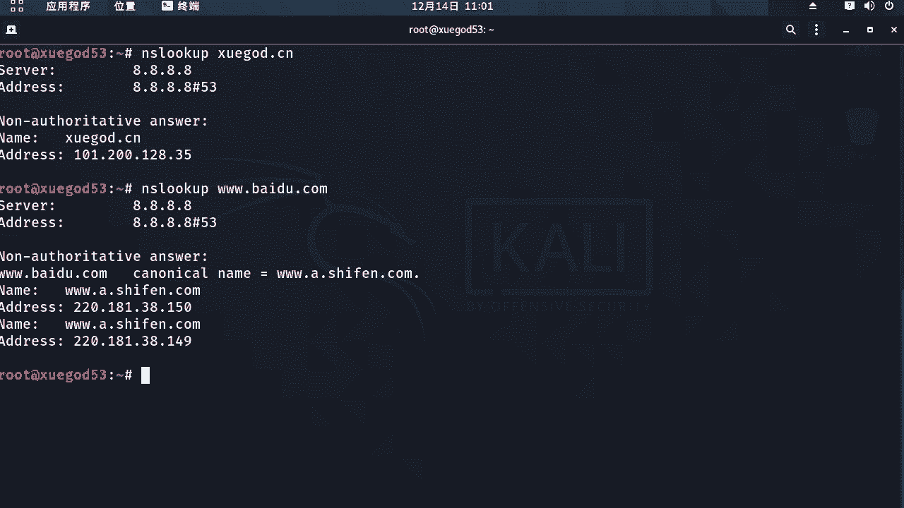
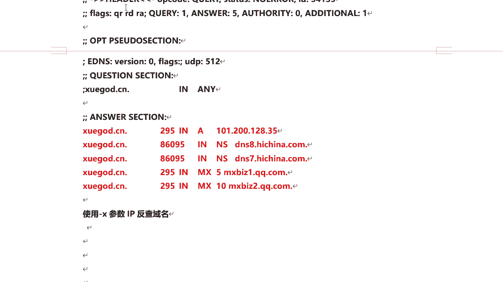
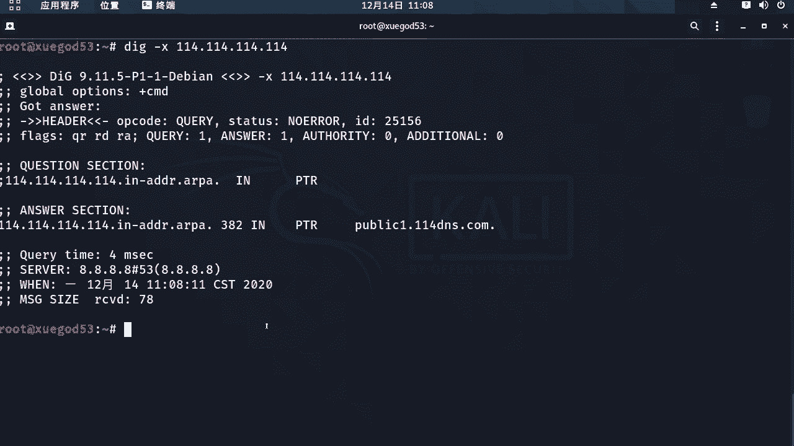

# 课程 P32：7.3 - 【被动信息收集系列】DNS信息收集 🕵️



## 概述
在本节课中，我们将要学习如何进行DNS信息收集。DNS（域名系统）是将域名转换为IP地址的关键服务。我们将介绍几种常用的命令行工具，帮助你查询域名的IP地址、反向解析IP地址对应的域名，以及获取DNS服务器的版本信息。这些技能是网络安全和信息收集的基础。


---


## 使用 `ping` 命令解析域名
将域名解析为IP地址的最简单方法是使用 `ping` 命令。`ping` 命令除了可以测试网络连通性，还能快速获取域名对应的IP地址。

以下是具体操作步骤：
1.  打开终端。
2.  输入命令 `ping 域名`，例如 `ping xuegod.cn`。
3.  命令执行后，会显示该域名对应的IP地址。

你也可以使用 `-c` 参数指定发送数据包的数量，例如 `ping -c 1 xuegod.cn`，这样会直接显示IP地址。



---

## 使用 `nslookup` 命令查询DNS
除了 `ping` 命令，`nslookup` 也是一个非常实用的DNS查询工具。它可以帮助我们更详细地查询域名信息。

以下是具体操作步骤：
1.  在终端输入 `nslookup 域名`，例如 `nslookup xuegod.cn`。
2.  默认情况下，它会使用公共DNS服务器（如 `8.8.8.8`）进行查询，并返回该域名的IP地址。
3.  你也可以查询其他网站，例如 `nslookup www.baidu.com`。查询结果可能会显示多个IP地址（这通常是因为网站使用了CDN或负载均衡），以及一些别名记录（CNAME）。


---

## 使用 `dig` 命令进行高级查询
`dig` 是一个功能更强大的DNS查询工具，可以提供更详细的信息。它的基本用法很简单，但支持许多有用的参数。


以下是 `dig` 命令的常见用法：

### 基本查询
直接查询域名的A记录（即IP地址）：
```bash
dig xuegod.cn
```

### 指定DNS服务器查询
你可以使用 `@` 符号指定使用哪个DNS服务器进行查询，例如使用 `114.114.114.114`：
```bash
dig xuegod.cn @114.114.114.114
```
使用公共DNS服务器或目标域名自己的DNS服务器（如 `ns1.hichina.com`）都可以。使用目标自己的DNS服务器查询速度通常会更快。

### 查询所有记录类型
使用 `any` 参数可以查询该域名的所有DNS记录类型，包括A记录、MX记录（邮件交换记录）、NS记录（域名服务器记录）等：
```bash
dig xuegod.cn any
```
如果查询结果显示MX记录，说明该域名配置了企业邮箱。

---



## 反向DNS解析（IP反查域名）
上一节我们介绍了如何通过域名查找IP。本节中，我们来看看反向操作：如何通过已知的IP地址查找其绑定的域名，这称为反向DNS解析。



`dig` 命令可以通过 `-x` 参数实现反向解析。例如，查询IP地址 `114.114.114.114` 对应的域名：
```bash
dig -x 114.114.114.114
```
查询结果中的PTR记录就显示了该IP地址对应的域名。你可以再次使用 `ping` 命令验证这个域名是否能解析回原来的IP地址。

---


## 查询DNS服务器版本信息
查询DNS服务器的版本信息有助于了解其使用的软件，进而可能发现相关的已知漏洞。

以下是查询DNS服务器版本信息的命令格式：
```bash
dig txt chaos version.bind @DNS服务器地址
```
其中，`txt` 代表查询文本类型的记录，`chaos` 是查询类别，`version.bind` 是查询版本信息的特定请求。


例如，查询一个指定的DNS服务器：
```bash
dig txt chaos version.bind @ns1.hichina.com
```
如果查询成功，会返回该DNS服务器软件的版本信息。但请注意，许多服务器出于安全考虑会禁止此类查询，或返回自定义信息（例如提示“你的IP已被记录”），这属于正常情况。

---


## 总结
本节课中，我们一起学习了DNS信息收集的几种核心方法。我们介绍了三个主要工具：`ping`、`nslookup` 和 `dig`。利用这些工具，你可以完成域名到IP的正向解析、IP到域名的反向解析，以及查询DNS服务器的详细信息。掌握这些基础命令，是进行更深入网络探测和安全评估的重要第一步。